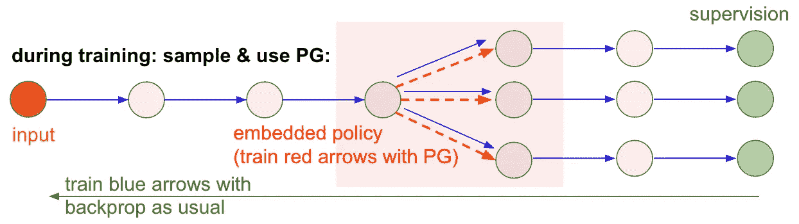
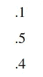
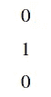
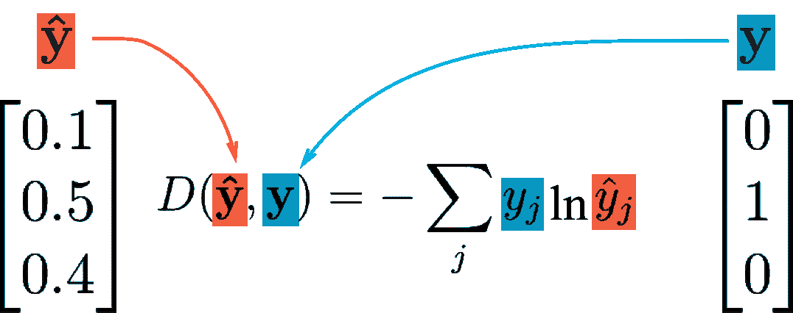
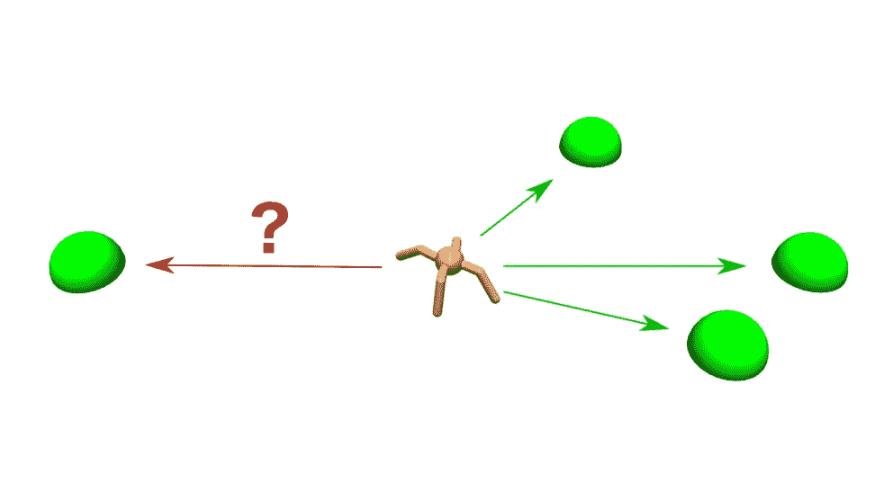
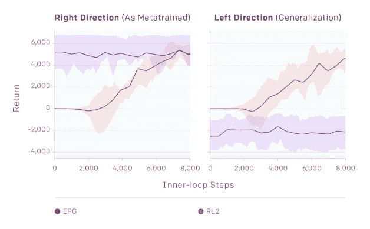

# 理解演变的政策梯度

> 原文：<https://towardsdatascience.com/understanding-evolved-policy-gradients-cbc2d6b974a1?source=collection_archive---------8----------------------->

Learning to hop backwards with EPG.

我在发射台工作。AI 。我们有两周一次的内部阅读小组，主要关注机器学习领域的最新研究论文。最近，我们研究了一种新的深度强化学习(RL)算法，称为[进化策略梯度](https://arxiv.org/pdf/1802.04821.pdf) (EPG)。

这东西很酷！

论文来源于 [OpenAI](https://openai.com/) 。他们作出了值得称赞的努力，使他们的工作为公众所了解；[他们的博客文章](https://blog.openai.com/)提供了比研究论文更“柔和”的阅读，OpenAI 也发布了与每篇论文相关的代码(这里是 [EPG 代码库](https://github.com/openai/EPG)和[博客文章](https://blog.openai.com/evolved-policy-gradients/))。

尽管他们尽了最大努力直观地解释这项工作，但我发现他们关于 EPG 的文章有点晦涩。我很想了解它，但我找不到任何关于它的有帮助的第三方解释。这就是为什么我决定钻研报纸，写下这篇文章:提供一个直观的解释，说明 EPG 正在发生什么。

# 政策梯度

要理解 EPG，首先必须理解政策梯度。我对 PG 的第一个“啊哈”时刻来自于阅读 Andrej Karpathy 的 [Pong from Pixels](http://karpathy.github.io/2016/05/31/rl/) 帖子。

如果你[理解反向传播](https://mattmazur.com/2015/03/17/a-step-by-step-backpropagation-example/)是一种在监督环境下训练神经网络的方法，PG 的基础是同一概念的简单扩展。

在 RL 问题中，策略是将输入状态映射到输出动作的任何函数。PG 的想法是训练神经网络使用反向传播来学习一个好的策略函数。实现这一点的一个聪明的方法是以受监督的方式使用选定的操作作为目标值。

A diagram stolen from Andrej Karpathy’s PG blog post. The green values represent the selected action, and loss is computed between the policy output and these values.

举例来说，假设我们的网络需要在三个动作中选择一个；它接受一些状态输入并产生一些 softmax 输出，如下所示:

Some example softmax output from a neural network choosing one of three actions.

我们可以简单地通过获取这个输出的 argmax 来选择一个动作。

A one-hot encoded representation of the selected action from the above output. (In practice, actions are usually sampled from the distribution provided by the softmax output.)

然后，我们可以使用简单的损失函数(如二进制交叉熵)来计算我们的神经网络相对于这个选定的动作向量的“损失”。

Computing binary cross-entropy loss for this example, taken from [this post](/deep-learning-concepts-part-1-ea0b14b234c8) by [Manish Chablani](https://towardsdatascience.com/@ManishChablani?source=post_header_lockup).

如果我们使用标准的 SGD，我们可以更新我们的神经网络，在给定相同输入状态的情况下，给出更接近于所选动作的输出。这就像说“表现得更像那样！”类似地，我们可以朝相反的方向迈出一步(类似于“梯度上升”，只是上坡而不是下坡)，这就像说“不要那样做！”

这就是 PG 背后的基本思想，而且出奇的简单。所有基于 PG 的 RL 算法背后的艰难工作是弄清楚如何使用 PG:什么时候我们希望鼓励我们的策略重复一个动作？我们什么时候要劝阻？由于奖励很少，这个问题并不简单。

# 设计损失函数

其他 PG 方法通常通过[使用预期回报函数并将预期回报与观察到的回报](http://www.jmlr.org/papers/volume3/szita02a/html/node3.html)进行比较而成功，观察到的回报使用一些折扣因子“分布”在许多时间步骤上。这本质上是一种处理稀疏回报问题的启发式方法。

这里的推理是，导致一些观察到的奖励的决策可以被认为是“好的”,因此是鼓励的。当由于行动而观察到的回报比预期的要好时，我们应该鼓励我们的政策朝着那个方向发展。折扣奖励概念是将这种推理应用于 RL 算法的一种方式。

控制策略参数步长变得非常重要。以一种有原则的方式做到这一点是[近似策略优化](https://blog.openai.com/openai-baselines-ppo/) (PPO)方法背后的新颖之处。这里，基于更新前后策略参数之间的 KL 偏差的惩罚被用于控制步长。

所有这些工作都可以被看作是**设计一个 PG 损失函数，这个函数依赖于观察到的回报**——一个优化政策的能力以最大化回报的合理要求。

# **为什么不学习一个损失函数？**

[RL 硬](https://www.alexirpan.com/2018/02/14/rl-hard.html)。PPO 在各种任务中表现相对较好。

这很好，但 EPG 的基本想法是:让我们使用机器学习来学习损失函数，而不是自己设计一个。也许这种方法可以给我们一个更通用的 RL 算法。

退一步，思考整个问题。我们需要哪些**信息**来学习一个好的政策？

首先，给定一个状态的“正确选择”不仅取决于当前状态，还取决于状态的最近历史。这也取决于我们**最近的决策历史**。我们能为 PG 设计一个考虑所有这些信息的损失函数吗？

对 EPG 来说，这就是他们正在试图做的。最终的损失函数可能如下所示:

EPG loss function architecture… quite a lot going on. The grey stuff is the loss function.

这里有很多事情要做，但主要的想法是，可以建立一个神经网络，它可以获取您想要的所有信息(包括您的策略网络输出和您选择的操作)，并输出一个值(图像顶部的绿色立方体)。)我们可以将该值称为损失，并训练我们的策略网络使其最小化。

这种特殊的架构使用跨越时间的卷积。这个时间维度让我们称这些层为“时间卷积”，但它们的工作方式就像我们所了解和喜爱的卷积层一样。

## 最难的部分

这是一个伟大的想法，但有一个问题:我们如何为我们的损失函数网络学习良好的权重？

做这件事没有直接的方法。我们不能在这里捏造政策梯度之类的东西。

这就是进化策略派上用场的地方。

# 进化策略

EPG 的“进化”部分来自于使用 es 来学习损失函数网络的良好参数。

[这种特殊的优化算法](https://medium.com/swlh/evolution-strategies-844e2694e632)在这里非常有用，因为它给了我们一种不用任何梯度概念就能更新权重的方法。ES 的基本思想是这样的:通过向每个参数添加随机噪声来更新权重。如果事情变得更好，坚持这些改变。如果事情变得更糟，那就是朝着错误的方向迈出了一步(也是有用的信息。)

因此，我们创造了一个新的问题(学习一些疯狂复杂但潜在有用的损失函数的参数)和一个潜在的解决方案(应用专家系统)。这篇论文的大部分都在描述这些人是如何着手做这件事的。

# 开始工作

ES 包含了大量的尝试和错误。为了在合理的时间内收敛，我们需要并行化学习过程。

我们可以通过同时进行许多试验来做到这一点。这些试验中的每一个都是由一个工人(所谓的论文)或一个线程执行的。

## 一系列任务

A visualization of one family of tasks. The family is “learn to move the ant to a target location.” A task in this family is “learn to move the ant to location [10, 5]”.

EPG 试图解决一系列**的任务**。这是通过从家庭中抽取个体任务来实现的。如上图所示，任务家族的一个例子是“引导蚂蚁到达指定的目标位置”这个家族的任务是“引导蚂蚁到坐标[10，5]。”

每个工人得到从问题任务族中抽取的任务。这意味着在我们的例子中，一个工蚁会花时间学习如何让蚂蚁到达目标位置[10，5]，而另一个工蚁会花时间让蚂蚁到达目标位置[5，10]。每个工人都将经历多次重复相同的任务，通过最小化新的损失函数来学习策略。

经过这么多时间步骤，我们可以看看每个工人通过这个过程积累的总回报。

## 尝试许多损失函数

每个工人也得到**一些我们目前正在研究的损失函数**的变体。我说的变体指的是“我们学习到的损失函数的最新、最好的版本——加上一些随机噪声。”

所以，每个工人都有任务和损失函数。我们可以在许多时间步之后挑选出总报酬最高的员工，并假设其损失函数的变体比其他一些更好，然后**朝着用于创建该变体的随机生成噪声**的方向迈出一步。

这种方法的一个问题是，一个工人可能比另一个工人有更容易的任务。例如，一个工人的任务可能是将蚂蚁引导到坐标[1，1]，而另一个工人必须一直到达[10，15](其中两者都从蚂蚁在[0，0]开始)。第一个工人的**样本任务更容易**，所以我们不能完全确信分配给它的策略是我们观察到的更高回报的原因。

为了解决这个问题，作者给许多工人分配了相同的损失函数变量；每个工人都有不同的任务；他们使用相同的损失函数变量来计算所有工人的平均报酬。

我们在每次试验结束时得到的结果是一组候选损失函数，以及关于它们在一系列任务中的相对表现的一些想法。我们可以使用该信息来更新损失函数参数。

## 奖励在哪里？

关于 EPG 的一个有趣的事情是，在一些实验中，该算法能够在不直接观察任何回报的情况下学习好的政策。关于什么构成“好”行为的所有信息都编码在损失函数中，损失函数不需要(但可以)包括观察到的奖励。

# 有希望的结果？

A pretrained EPG does well in “out-of-distribution” tasks at test-time; good test-time validation in RL problems is an important outstanding problem that EPG may solve.

《EPG》的作者对他们的结果持乐观态度，这种方法当然很有趣。中的工作包含了许多来自最近深度 RL 研究的有趣想法。

也许最重要的结果是 EPG 训练的损失函数在“非分布”任务中表现良好的能力。在我们之前看到的蚂蚁例子中，只使用位于蚂蚁初始位置右侧**的目标来训练 EPG 损失函数。同一个损失函数能够训练一个策略，在测试时间**引导蚂蚁到达蚂蚁初始位置**左侧的**目标。****

然而，该算法面临一些实际挑战，大多与需要繁重的计算资源(许多 CPU 核心)和相对较差的数据效率(需要许多许多尝试来学习一个好的损失函数)有关。)损失函数更新必须顺序执行，这就限制了该方法现有的并行处理量。

依我拙见，这篇论文之所以重要，不是因为它的直接结果，而是因为它介绍了一种应用 PG 方法的完全不同的方法。这只是如何着手学习损失函数的一个例子，但是可能有完全不同的方法来做同样的事情。也许学习 PG 损失函数的不同技术比这好得多。但是，据我所知，这是第一次尝试直接学习 PG 损失函数；避开损失函数设计问题可能为 PG 方法开辟一条有前途的新途径。