# 连续数字数据

> 原文：<https://towardsdatascience.com/understanding-feature-engineering-part-1-continuous-numeric-data-da4e47099a7b?source=collection_archive---------0----------------------->

## [了解特征工程](https://towardsdatascience.com/tagged/tds-feature-engineering)(第一部分)

## 处理连续数值数据的策略


Source: [https://pixabay.com](https://pixabay.com)

# 介绍

> **“有钱能使鬼推磨”**是你无论选择同意还是不同意都无法忽视的东西。在今天的数字革命时代，更贴切的说法应该是**“数据让世界运转”**。事实上，数据已经成为企业、公司和组织的一级资产，无论其规模大小。任何智能系统，无论有多复杂，都需要由数据驱动。在任何智能系统的核心，我们都有一个或多个基于机器学习、深度学习或统计方法的算法，这些算法消耗这些数据来收集知识，并在一段时间内提供智能见解。算法本身相当幼稚，无法在原始数据上开箱即用。因此，从原始数据中设计有意义的特征是最重要的，这些特征可以被这些算法理解和消费。

# 机器学习管道的温和更新

任何智能系统基本上都由一个端到端的管道组成，从接收原始数据开始，利用数据处理技术从这些数据中获取、处理和设计有意义的特征和属性。然后，我们通常利用统计模型或机器学习模型等技术对这些功能进行建模，然后根据手头要解决的问题，在必要时部署该模型以供将来使用。基于 [CRISP-DM](https://en.wikipedia.org/wiki/Cross-industry_standard_process_for_data_mining) 行业标准流程模型的典型标准机器学习流水线如下图所示。

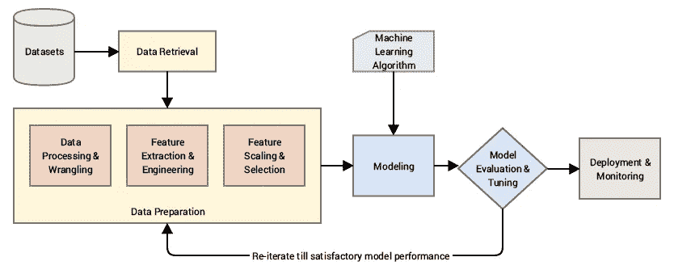

A standard machine learning pipeline (source: Practical Machine Learning with Python, Apress/Springer)

接受原始数据并直接在这些数据上构建模型是有勇无谋的，因为我们不会获得预期的结果或性能，而且算法也不够智能，无法从原始数据中自动提取有意义的特征(现在有一些自动化的特征提取技术，在某种程度上可以通过深度学习方法来实现，但稍后会有更多内容！).

如上图所示，我们的主要关注领域属于数据准备方面，在经过必要的争论和预处理后，我们使用各种方法从原始数据中提取有意义的属性或特征。

# 动机

特征工程是构建任何智能系统的基本部分。即使你有很多更新的方法，如深度学习和元启发式方法，它们有助于自动机器学习，但每个问题都是特定领域的，更好的功能(适合该问题)通常是系统性能的决定因素。特征工程是一门艺术，也是一门科学，这就是为什么数据科学家经常在建模前的数据准备阶段花费 70%的时间。让我们来看看数据科学领域几位知名人士对特性工程的一些引用。

> “想出新功能既困难又耗时，需要专业知识。‘应用机器学习’基本上是特征工程。”
> 
> ——吴恩达教授。

这基本上强化了我们之前提到的数据科学家花费近 80%的时间在工程特性上，这是一个困难且耗时的过程，需要领域知识和数学计算。

> “特征工程是将**原始数据**转换为**特征**的过程，这些特征能够更好地代表**潜在问题**到**预测模型**，从而提高**模型对**不可见数据**的准确性**
> 
> 杰森·布朗利博士

这给了我们一个关于特征工程的想法，即把数据转换成特征作为机器学习模型的输入的过程，这样*高质量的特征*有助于*提高*整体*模型性能*。特性也非常依赖于潜在的问题。因此，即使机器学习任务在不同的场景中可能是相同的，例如将电子邮件分类为垃圾邮件和非垃圾邮件，或者将手写数字分类，但在每个场景中提取的特征将彼此非常不同。

来自华盛顿大学的 Pedro Domingos 教授在他题为[](http://homes.cs.washington.edu/~pedrod/papers/cacm12.pdf)**的论文中告诉了我们以下内容。**

> **“最终，一些机器学习项目会成功，一些会失败。有什么区别？最重要的因素无疑是所使用的功能。”**
> 
> **佩德罗·多明戈斯教授**

**最后一句引语是著名的 Kaggler，Xavier Conort 说的，这句话应该会激发你对特征工程的兴趣。你们大多数人都已经知道，现实世界中棘手的机器学习问题经常会定期发布在 Kaggle 上，而 ka ggle 通常对所有人开放。**

> **“我们使用的算法对 Kagglers 来说非常标准。…我们将大部分精力花在了功能工程上。…我们还非常小心地放弃了可能会让我们面临过度适应模型的风险的功能。”**
> 
> **—泽维尔·康纳特**

# **了解功能**

**一个 ***特征*** 通常是在 ***原始数据*** 之上的特定表示，原始数据是一个单独的、可测量的属性，通常由数据集中的一列来描述。考虑一个普通的二维数据集，每个*观察*由一个*行*描述，每个*特征*由一个*列*描述，这将具有一个观察的特定值。**

**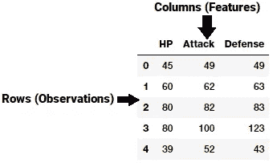**

**A generic dataset snapshot**

**因此，就像上图中的例子一样，每行通常表示一个特征向量，所有观测值的整个特征集形成一个二维特征矩阵，也称为特征集。这类似于表示二维数据的数据框或电子表格。通常，机器学习算法处理这些数字矩阵或张量，因此大多数特征工程技术处理将原始数据转换成这些算法容易理解的一些数字表示。**

**基于数据集，要素可以分为两种主要类型。固有的 ***原始特征*** 直接从数据集中获得，无需额外的数据处理或工程。 ***衍生特征*** 通常是从特征工程中获得的，我们从现有的数据属性中提取特征。一个简单的例子是从包含*“出生日期”*的雇员数据集中创建一个新特征*“年龄”*，只需从当前日期中减去他们的出生日期。**

**数据有多种类型和格式，包括结构化和非结构化数据。在本文中，我们将讨论处理结构化连续数字数据的各种特征工程策略。所有这些例子都是我最近的一本书 [*【用 Python 进行实用机器学习】*](https://github.com/dipanjanS/practical-machine-learning-with-python) 的一部分，你可以在 [**GitHub**](https://github.com/dipanjanS/practical-machine-learning-with-python/tree/master/notebooks/Ch04_Feature_Engineering_and_Selection) **上访问本文中使用的相关数据集和代码。我还要感谢加布里埃尔·莫雷拉，他给了我一些关于特征工程技术的很好的建议。****

# **数字数据的特征工程**

**数字数据通常以描述观察、记录或测量的标量值的形式表示数据。这里，数值数据是指 ***连续数据*** ，而不是通常表示为分类数据的离散数据。数字数据也可以表示为值的向量，其中向量中的每个值或实体可以表示一个特定的特征。对于连续数值数据，整数和浮点数是最常见和最广泛使用的数值数据类型。即使数字数据可以直接输入到机器学习模型中，在建立模型之前，您仍然需要设计与场景、问题和领域相关的特征。因此，对特征工程的需求仍然存在。让我们利用 python，看看对数字数据进行要素工程的一些策略。我们首先加载以下必要的依赖项(通常在 [Jupyter](http://jupyter.org/) 笔记本中)。**

```
**import pandas as pd
import matplotlib.pyplot as plt
import numpy as np
import scipy.stats as spstats%matplotlib inline**
```

## **原始度量**

**正如我们前面提到的，原始数字数据通常可以根据上下文和数据格式直接输入到机器学习模型中。原始测量通常直接使用数字变量作为特征来表示，无需任何形式的转换或工程。通常，这些特征可以指示值或计数。让我们加载我们的一个数据集， [***神奇宝贝数据集***](https://www.kaggle.com/abcsds/pokemon/data) 也可以在 [Kaggle](https://www.kaggle.com/abcsds/pokemon/data) 上找到。**

```
**poke_df = pd.read_csv('datasets/Pokemon.csv', encoding='utf-8') poke_df.head()**
```

**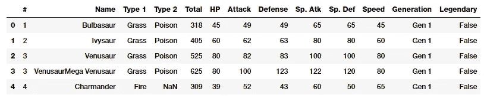**

**Snapshot of our Pokemon dataset**

**神奇宝贝是一个巨大的媒体专营权，围绕着虚拟人物称为神奇宝贝，代表口袋妖怪。简而言之，你可以把它们想象成拥有超能力的虚构动物！该数据集由这些字符组成，每个字符有不同的统计数据。**

## ****数值****

**如果仔细观察上图中的数据框快照，您会发现有几个属性表示可以直接使用的数字原始值。下面的代码片段重点描述了其中的一些特性。**

```
**poke_df[['HP', 'Attack', 'Defense']].head()**
```

**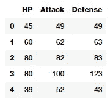**

**Features with (continuous) numeric data**

**因此，您可以直接将这些属性用作上述数据框中描述的要素。这些包括每个神奇宝贝的生命值，攻击和防御统计。事实上，我们也可以计算这些领域的一些基本统计措施。**

```
**poke_df[['HP', 'Attack', 'Defense']].describe()**
```

**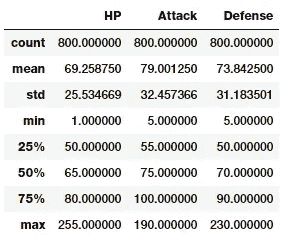**

**Basic descriptive statistics on numeric features**

**有了这个，你就可以很好地了解计数、平均值、标准差和四分位数等统计指标。**

## **计数**

**另一种形式的原始测量包括表示特定属性的频率、计数或出现的特征。让我们来看一个来自 [***百万首歌曲数据集***](https://labrosa.ee.columbia.edu/millionsong/) 的数据样本，它描述了不同用户听过的歌曲的数量或频率。**

```
**popsong_df = pd.read_csv('datasets/song_views.csv', 
                          encoding='utf-8')
popsong_df.head(10)**
```

**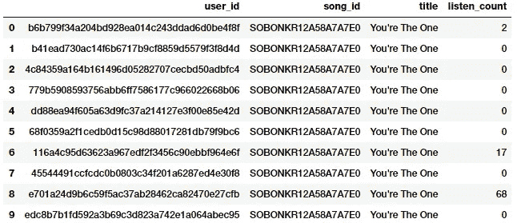**

**Song listen counts as a numeric feature**

**从上面的快照可以明显看出，`listen_count`字段可以直接用作基于频率\计数的数字特征。**

## **二值化**

**通常，原始频率或计数可能与基于正在解决的问题建立模型无关。例如，如果我正在为歌曲推荐构建一个推荐系统，我只想知道一个人是否对某首特定的歌曲感兴趣或听过。这不需要知道一首歌被听了多少次，因为我更关心他/她听过的各种歌曲。在这种情况下，与基于计数的特征相反，二进制特征是优选的。我们可以如下二进制化我们的`listen_count`字段。**

```
**watched = np.array(popsong_df['listen_count']) 
watched[watched >= 1] = 1
popsong_df['watched'] = watched**
```

**你也可以使用`scikit-learn's`模块中的`Binarizer`类代替`numpy`数组来执行同样的任务。**

```
**from sklearn.preprocessing import Binarizerbn = Binarizer(threshold=0.9)
pd_watched = bn.transform([popsong_df['listen_count']])[0]
popsong_df['pd_watched'] = pd_watched
popsong_df.head(11)**
```

**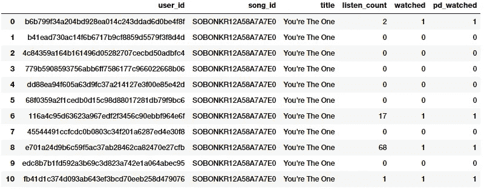**

**Binarizing song counts**

**从上面的快照中可以清楚地看到，这两种方法产生了相同的结果。因此，我们得到一个二进制化的特征，该特征指示该歌曲是否被每个用户收听过，该特征然后可以被进一步用于相关的模型中。**

## **舍入**

**通常，当处理像比例或百分比这样的连续数字属性时，我们可能不需要精度很高的原始值。因此，将这些高精度百分比四舍五入成数字整数通常是有意义的。然后，这些整数可以直接用作原始值，甚至用作分类(基于离散类)特征。让我们尝试将这个概念应用到一个虚拟数据集中，描述商店商品及其受欢迎程度。**

```
**items_popularity = pd.read_csv('datasets/item_popularity.csv',  
                               encoding='utf-8')items_popularity['popularity_scale_10'] = np.array(
                   np.round((items_popularity['pop_percent'] * 10)),  
                   dtype='int')
items_popularity['popularity_scale_100'] = np.array(
                  np.round((items_popularity['pop_percent'] * 100)),    
                  dtype='int')
items_popularity**
```

**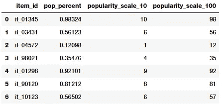**

**Rounding popularity to different scales**

**根据上面的输出，你可以猜到我们尝试了两种形式的舍入。这些特征以**1–10**和**1–100**两种尺度描述了物品的流行程度。根据场景和问题，您可以将这些值用作数字特征或分类特征。**

## **相互作用**

**监督机器学习模型通常试图将输出响应(离散类或连续值)建模为输入特征变量的函数。例如，一个简单的线性回归方程可以描述为**

**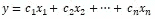**

**其中输入特征由变量描述**

**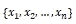**

**具有由表示的权重或系数**

**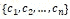**

**而目标分别是预测 y 的反应***.*****

**在这种情况下，这个简单的线性模型描述了输出和输入之间的关系，完全基于单独的输入特征。**

**然而，通常在一些真实的场景中，尝试捕获这些特征变量之间的交互作为输入特征集的一部分是有意义的。具有相互作用特征的上述线性回归公式的扩展的简单描述是**

**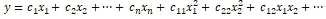**

**其中由表示的特征**

**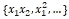**

**表示交互特征。现在让我们尝试在我们的神奇宝贝数据集上设计一些交互功能。**

```
**atk_def = poke_df[['Attack', 'Defense']]
atk_def.head()**
```

**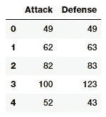**

**从输出数据帧中，我们可以看到我们有两个数值(连续)特征，`Attack`和`Defence`。我们现在将通过利用`scikit-learn`来构建二级特性。**

```
**from sklearn.preprocessing import PolynomialFeaturespf = PolynomialFeatures(degree=2, interaction_only=False,  
                        include_bias=False)
res = pf.fit_transform(atk_def)
res **Output
------**array([[    49.,     49.,   2401.,   2401.,   2401.],
       [    62.,     63.,   3844.,   3906.,   3969.],
       [    82.,     83.,   6724.,   6806.,   6889.],
       ..., 
       [   110.,     60.,  12100.,   6600.,   3600.],
       [   160.,     60.,  25600.,   9600.,   3600.],
       [   110.,    120.,  12100.,  13200.,  14400.]])**
```

**上面的特征矩阵描述了总共五个特征，包括新的交互特征。我们可以在上面的矩阵中看到每个特征的程度如下。**

```
**pd.DataFrame(pf.powers_, columns=['Attack_degree',  
                                  'Defense_degree'])**
```

****

**查看这个输出，我们现在知道每个特性实际上代表了这里描述的度数。有了这些知识，我们现在可以为每个特性指定一个名称，如下所示。这只是为了便于理解，您应该用更好、更容易访问和简单的名称来命名您的功能。**

```
**intr_features = pd.DataFrame(res, columns=['Attack', 'Defense',  
                                           'Attack^2', 
                                           'Attack x Defense',  
                                           'Defense^2'])
intr_features.head(5)**
```

**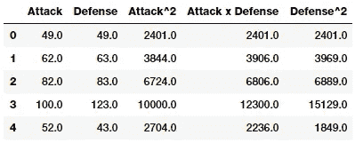**

**Numeric features with their interactions**

**因此，上述数据框代表了我们的原始特征及其交互特征。**

## **扔掉**

**使用原始连续数字要素的问题在于，这些要素中的值分布通常会有偏差。这意味着有些值会经常出现，而有些值会很少出现。除此之外，还有另一个问题是这些特征中的任何一个的值的变化范围。例如，特定音乐视频的浏览量可能异常之大( [*Despacito*](https://www.youtube.com/watch?v=kJQP7kiw5Fk) 我们正看着你呢！)有些可能真的很小。直接使用这些功能会导致许多问题，并对模型产生负面影响。因此，有策略来处理这一点，其中包括宁滨和转换。**

**宁滨，也称为量化，用于将连续的数字特征转换为离散的数字特征(类别)。这些离散值或数字可以被认为是类别或箱，原始的连续数值被装入或分组到这些类别或箱中。每个箱代表一个特定的强度等级，因此一个特定范围的连续数值落入其中。宁滨数据的具体策略包括固定宽度和自适应宁滨。让我们使用从 [**2016 FreeCodeCamp 开发者\编码者调查**](https://github.com/freeCodeCamp/2016-new-coder-survey) 中提取的数据集中的一个子集，该调查讨论了与编码者和软件开发者有关的各种属性。**

```
**fcc_survey_df = pd.read_csv('datasets/fcc_2016_coder_survey_subset.csv', 
encoding='utf-8')fcc_survey_df[['ID.x', 'EmploymentField', 'Age', 'Income']].head()**
```

**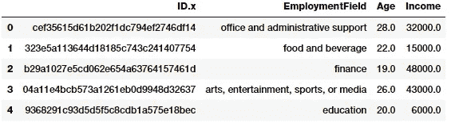**

**Sample attributes from the FCC coder survey dataset**

**`ID.x`变量基本上是每个参加调查的编码人员/开发人员的唯一标识符，其他字段是不言自明的。**

## **固定宽度宁滨**

**顾名思义，在固定宽度宁滨中，我们为每个条柱提供特定的固定宽度，通常由分析数据的用户预先定义。每个 bin 都有一个预先确定的值范围，应该根据一些领域知识、规则或约束条件将这些值分配给该 bin。基于舍入的宁滨是其中一种方法，您可以使用我们之前讨论过的舍入运算来对原始值进行装箱。**

**现在让我们考虑编码器调查数据集中的`Age`特征，并看看它的分布。**

```
**fig, ax = plt.subplots()
fcc_survey_df['Age'].hist(color='#A9C5D3', edgecolor='black',  
                          grid=False)
ax.set_title('Developer Age Histogram', fontsize=12)
ax.set_xlabel('Age', fontsize=12)
ax.set_ylabel('Frequency', fontsize=12)**
```

**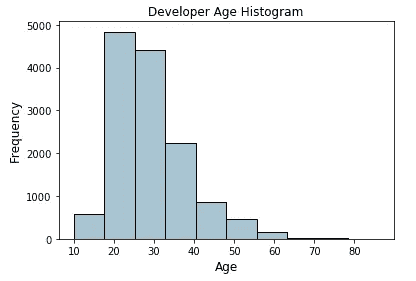**

**Histogram depicting developer age distribution**

**上面描述开发人员年龄的直方图如预期的那样稍微偏右(年龄较小的开发人员)。我们现在将根据以下方案将这些原始年龄值分配到特定的容器中**

```
**Age Range: Bin
---------------
 0 -  9  : 0
10 - 19  : 1
20 - 29  : 2
30 - 39  : 3
40 - 49  : 4
50 - 59  : 5
60 - 69  : 6
  ... and so on**
```

**使用我们在前面的*舍入*部分学到的知识，我们可以很容易地做到这一点，我们通过将底值除以 10 来舍入这些原始年龄值。**

```
**fcc_survey_df['Age_bin_round'] = np.array(np.floor(
                              np.array(fcc_survey_df['Age']) / 10.))fcc_survey_df[['ID.x', 'Age', 'Age_bin_round']].iloc[1071:1076]**
```

**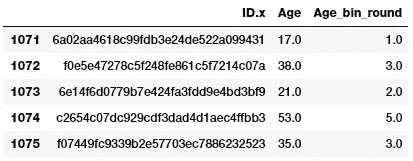**

**Binning by rounding**

**您可以看到，每个年龄的对应箱都是基于舍入进行分配的。但是如果我们需要更多的灵活性呢？如果我们想根据自己的规则\逻辑来决定和固定框的宽度，该怎么办？基于定制范围的宁滨将帮助我们实现这一目标。让我们使用下面的方案为宁滨开发者年龄定义一些定制的年龄范围。**

```
**Age Range : Bin
---------------
 0 -  15  : 1
16 -  30  : 2
31 -  45  : 3
46 -  60  : 4
61 -  75  : 5
75 - 100  : 6**
```

**基于这个定制的宁滨方案，我们现在将为每个开发者年龄值标记容器，并且我们将存储容器范围以及相应的标签。**

```
**bin_ranges = [0, 15, 30, 45, 60, 75, 100]
bin_names = [1, 2, 3, 4, 5, 6]fcc_survey_df['Age_bin_custom_range'] = pd.cut(
                                           np.array(
                                              fcc_survey_df['Age']), 
                                              bins=bin_ranges)
fcc_survey_df['Age_bin_custom_label'] = pd.cut(
                                           np.array(
                                              fcc_survey_df['Age']), 
                                              bins=bin_ranges,            
                                              labels=bin_names)
# view the binned features 
fcc_survey_df[['ID.x', 'Age', 'Age_bin_round', 
               'Age_bin_custom_range',   
               'Age_bin_custom_label']].iloc[10a71:1076]**
```

**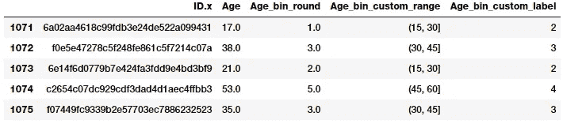**

**Custom binning scheme for developer ages**

## **自适应宁滨**

**使用固定宽度宁滨的缺点是，由于我们手动决定面元范围，我们可能最终得到不规则的面元，这些面元根据落入每个面元的数据点或值的数量而不一致。有些箱子可能人口稠密，有些可能人口稀少，甚至是空的！在这些让数据自己说话的场景中，自适应宁滨是一种更安全的策略！没错，我们使用数据分布本身来决定我们的 bin 范围。**

**基于分位数的宁滨是用于自适应宁滨的一个好策略。分位数是特定的值或分界点，有助于将特定数值字段的连续值分布划分为离散的连续箱或区间。因此， *q 分位数*有助于将一个数值属性划分为 *q* 个相等的分区。分位数的常见例子包括:被称为*中值*的 *2 分位数*，它将数据分布分成两个相等的二进制；被称为*四分位数*的 *4 分位数*，它将数据分成 4 个相等的二进制；以及被称为*十分位数*的 *10 分位数*，它创建了 10 个相等宽度的二进制。现在让我们看看 developer `Income`字段的数据分布。**

```
**fig, ax = plt.subplots()
fcc_survey_df['Income'].hist(bins=30, color='#A9C5D3', 
                             edgecolor='black', grid=False)
ax.set_title('Developer Income Histogram', fontsize=12)
ax.set_xlabel('Developer Income', fontsize=12)
ax.set_ylabel('Frequency', fontsize=12)**
```

**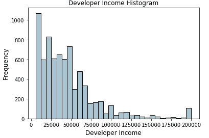**

**Histogram depicting developer income distribution**

**上面的分布描述了收入的一个右偏，较少的开发者赚更多的钱，反之亦然。让我们采用基于四分位数的自适应宁滨方案。我们可以如下容易地得到四分位数。**

```
**quantile_list = [0, .25, .5, .75, 1.]
quantiles = fcc_survey_df['Income'].quantile(quantile_list)
quantiles **Output
------** 0.00      6000.0
0.25     20000.0
0.50     37000.0
0.75     60000.0
1.00    200000.0
Name: Income, dtype: float64**
```

**现在让我们在原始分布直方图中可视化这些分位数！**

```
**fig, ax = plt.subplots()
fcc_survey_df['Income'].hist(bins=30, color='#A9C5D3', 
                             edgecolor='black', grid=False)for quantile in quantiles:
    qvl = plt.axvline(quantile, color='r')
ax.legend([qvl], ['Quantiles'], fontsize=10)ax.set_title('Developer Income Histogram with Quantiles', 
             fontsize=12)
ax.set_xlabel('Developer Income', fontsize=12)
ax.set_ylabel('Frequency', fontsize=12)**
```

**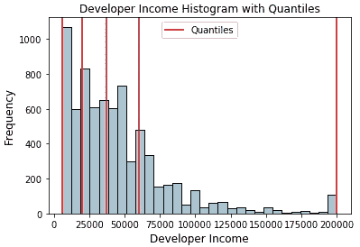**

**Histogram depicting developer income distribution with quartile values**

**上面分布中的红线描绘了四分位值和我们的潜在仓。现在，让我们利用这一知识来构建基于四分位数的宁滨方案。**

```
**quantile_labels = ['0-25Q', '25-50Q', '50-75Q', '75-100Q']
fcc_survey_df['Income_quantile_range'] = pd.qcut(
                                            fcc_survey_df['Income'], 
                                            q=quantile_list)
fcc_survey_df['Income_quantile_label'] = pd.qcut(
                                            fcc_survey_df['Income'], 
                                            q=quantile_list,       
                                            labels=quantile_labels)

fcc_survey_df[['ID.x', 'Age', 'Income', 'Income_quantile_range', 
               'Income_quantile_label']].iloc[4:9]**
```

**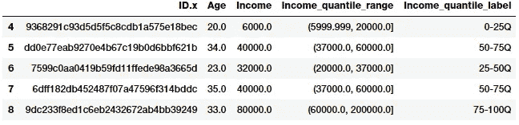**

**Quantile based bin ranges and labels for developer incomes**

**这应该让你对基于分位数的自适应宁滨的工作原理有一个很好的了解。这里需要记住的重要一点是，宁滨的结果会导致离散值分类特征，在将分类数据用于任何模型之前，您可能需要对分类数据进行额外的特征工程步骤。我们将在下一部分讨论分类数据的特征工程策略！**

## **统计变换**

**我们在前面简单地讨论了偏斜数据分布的不利影响。现在，让我们通过利用统计或数学变换来看看特征工程的不同策略。我们将研究对数变换以及 Box-Cox 变换。这两个转换函数都属于幂转换函数族，通常用于创建单调的数据转换。它们的主要意义在于，它们有助于稳定方差，紧密遵循正态分布，并使数据独立于基于其分布的均值**

## **对数变换**

**对数变换属于幂变换函数族。该函数在数学上可以表示为**

**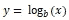**

**其读作 *x* 的*对数*到底数 *b* 等于*y。*这可以转化为**

**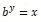**

**其指示基底 *b* 必须提升到什么功率才能得到 *x* 。自然对数用 *b=e* 其中 *e* = 2.71828 俗称欧拉数。也可以使用十进制中普遍使用的基数 *b* =10。**

**对数变换在应用于偏斜分布时非常有用，因为它们倾向于扩展较低幅度范围内的值，并倾向于压缩或减少较高幅度范围内的值。这往往会使偏态分布尽可能接近正态分布。让我们在我们之前使用的开发人员`Income`特性上使用 log transform。**

```
**fcc_survey_df['Income_log'] = np.log((1+ fcc_survey_df['Income']))
fcc_survey_df[['ID.x', 'Age', 'Income', 'Income_log']].iloc[4:9]**
```

**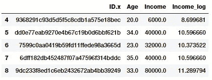**

**Log transform on developer income**

**`Income_log`字段描述了对数变换后的变换特征。现在让我们来看看这个变换域上的数据分布。**

```
**income_log_mean = np.round(np.mean(fcc_survey_df['Income_log']), 2)fig, ax = plt.subplots()
fcc_survey_df['Income_log'].hist(bins=30, color='#A9C5D3', 
                                 edgecolor='black', grid=False)
plt.axvline(income_log_mean, color='r')
ax.set_title('Developer Income Histogram after Log Transform', 
             fontsize=12)
ax.set_xlabel('Developer Income (log scale)', fontsize=12)
ax.set_ylabel('Frequency', fontsize=12)
ax.text(11.5, 450, r'$\mu$='+str(income_log_mean), fontsize=10)**
```

**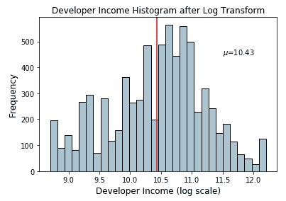**

**Histogram depicting developer income distribution after log transform**

**根据上面的图，我们可以清楚地看到，与原始数据的偏态分布相比，该分布更像正态分布或高斯分布。**

## **博克斯-考克斯变换**

**Box-Cox 变换是属于幂变换函数族的另一个流行函数。该函数有一个先决条件，即要转换的数值必须是正的(类似于 *log* transform 所期望的)。如果它们是负的，使用常量值进行移位会有所帮助。数学上，Box-Cox 变换函数可以表示如下。**

**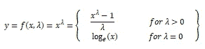**

**使得所得的变换输出 *y* 是输入 *x* 和变换参数λ的函数，使得当λ = 0 时，所得的变换是我们先前讨论的自然*对数*变换。λ的最佳值通常使用最大似然或对数似然估计来确定。现在让我们将 Box-Cox 变换应用于我们的开发者收入特性。首先，我们通过移除非空值从数据分布中获得最佳λ值，如下所示。**

```
**income = np.array(fcc_survey_df['Income'])
income_clean = income[~np.isnan(income)]
l, opt_lambda = spstats.boxcox(income_clean)
print('Optimal lambda value:', opt_lambda) **Output
------**
Optimal lambda value: 0.117991239456**
```

**现在我们已经获得了最佳λ值，让我们对λ的两个值使用 Box-Cox 变换，使得λ = 0 和λ = λ(最佳),并变换开发者`Income`特征。**

```
**fcc_survey_df['Income_boxcox_lambda_0'] = spstats.boxcox(
                                        (1+fcc_survey_df['Income']), 
                                          lmbda=0)
fcc_survey_df['Income_boxcox_lambda_opt'] = spstats.boxcox(
                                            fcc_survey_df['Income'], 
                                              lmbda=opt_lambda)

fcc_survey_df[['ID.x', 'Age', 'Income', 'Income_log', 
               'Income_boxcox_lambda_0',       
               'Income_boxcox_lambda_opt']].iloc[4:9]**
```

**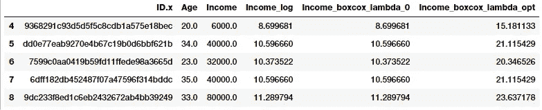**

**Developer income distribution after Box-Cox transform**

**上述数据框中描述了变换后的要素。正如我们所料，`Income_log`和`Income_boxcox_lamba_0`具有相同的值。让我们看看用最优λ变换后的变换后的`Income`特征的分布。**

```
**income_boxcox_mean = np.round(
                      np.mean(
                       fcc_survey_df['Income_boxcox_lambda_opt']),2)fig, ax = plt.subplots()
fcc_survey_df['Income_boxcox_lambda_opt'].hist(bins=30, 
                     color='#A9C5D3', edgecolor='black', grid=False)
plt.axvline(income_boxcox_mean, color='r')
ax.set_title('Developer Income Histogram after Box–Cox Transform', 
             fontsize=12)
ax.set_xlabel('Developer Income (Box–Cox transform)', fontsize=12)
ax.set_ylabel('Frequency', fontsize=12)
ax.text(24, 450, r'$\mu$='+str(income_boxcox_mean), fontsize=10)**
```

**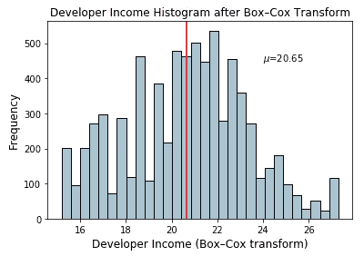**

**Histogram depicting developer income distribution after Box-Cox transform**

**该分布看起来更正常——类似于我们在*对数*变换后获得的分布。**

# **结论**

**特征工程是机器学习和数据科学的一个非常重要的方面，永远不应该被忽视。虽然我们有像深度学习这样的自动化功能工程方法，以及像 [AutoML](http://www.ml4aad.org/automl/) 这样的自动化机器学习框架(它仍然强调它需要好的功能才能很好地工作！).特征工程一直存在，甚至一些自动化方法通常需要基于数据类型、领域和要解决的问题的特定工程特征。**

**在本文中，我们研究了对连续数字数据进行特征工程的流行策略。在下一部分中，我们将研究处理离散、分类数据的流行策略，然后在以后的文章中讨论非结构化数据类型。敬请期待！**

**本文使用的所有代码和数据集都可以从我的 [**GitHub**](https://github.com/dipanjanS/practical-machine-learning-with-python/tree/master/notebooks/Ch04_Feature_Engineering_and_Selection) 访问**

**该代码也可作为 [**Jupyter 笔记本**](https://github.com/dipanjanS/practical-machine-learning-with-python/blob/master/notebooks/Ch04_Feature_Engineering_and_Selection/Feature%20Engineering%20on%20Numeric%20Data.ipynb)**