# 分类数据

> 原文：<https://towardsdatascience.com/understanding-feature-engineering-part-2-categorical-data-f54324193e63?source=collection_archive---------0----------------------->

## [了解特征工程](https://towardsdatascience.com/tagged/tds-feature-engineering)(第二部分)

## 处理离散分类数据的策略


Source: [https://pixabay.com](https://pixabay.com)

# 介绍

我们在本系列的前一篇文章[](/understanding-feature-engineering-part-1-continuous-numeric-data-da4e47099a7b)**中介绍了处理结构化连续数字数据的各种特征工程策略。在本文中，我们将关注另一种类型的结构化数据，这种数据本质上是离散的，通常被称为分类数据。处理数字数据通常比分类数据更容易，因为我们不必处理与任何分类类型的数据属性中的每个类别值相关的额外的复杂语义。我们将使用实践方法来讨论处理分类数据的几种编码方案，以及处理大规模特征爆炸的几种流行技术，通常称为 [*【维数灾难】*](https://en.wikipedia.org/wiki/Curse_of_dimensionality) 。**

# *动机*

*我相信到现在你一定意识到特征工程的动机和重要性，我们在本系列的 [***【第一部分】***](/understanding-feature-engineering-part-1-continuous-numeric-data-da4e47099a7b) 中做了同样详细的强调。如果有必要的话，一定要检查一下，快速复习一下。简而言之，机器学习算法不能直接处理分类数据，在开始对数据建模之前，您需要对这些数据进行一些工程和转换。*

# *理解分类数据*

*在深入特性工程策略之前，让我们先了解一下分类数据表示。通常，任何本质上是分类的数据属性都表示属于特定有限类别集的离散值。在由模型预测的属性或变量(通常称为响应变量)的上下文中，这些通常也称为类或标签。这些离散值本质上可以是文本或数字(甚至是像图像这样的非结构化数据！).分类数据有两大类，名义数据和序数数据。*

*在任何名义分类数据属性中，该属性的值之间没有排序的概念。考虑一个简单的天气类别示例，如下图所示。我们可以看到，在这个特定的场景中，我们有六个主要的类别或种类，没有任何顺序的概念或概念(*多风*并不总是发生在*晴朗*之前，也不小于或大于*晴朗*)。*

*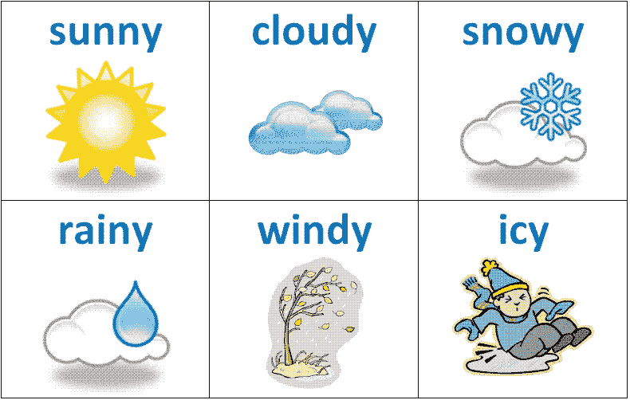*

*Weather as a categorical attribute*

*类似地，电影、音乐和视频游戏类型、国家名称、食物和烹饪类型是其他名义分类属性的例子。*

*有序分类属性在其值中具有某种意义或顺序概念。例如，请看下图中的衬衫尺寸。很明显，当考虑衬衫时，顺序或者在这种情况下的*‘size’*很重要( ***S*** 小于 ***M*** ，M 小于 ***L*** 等等)。*

*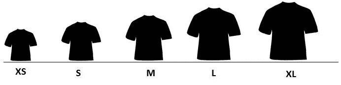*

*Shirt size as an ordinal categorical attribute*

*鞋号、教育水平和就业角色是有序分类属性的一些其他示例。对分类数据有了一个很好的概念，现在让我们看看一些特征工程策略。*

# *分类数据的特征工程*

*虽然在各种机器学习框架中已经取得了很多进步，以接受复杂的分类数据类型，如文本标签。典型地，特征工程中的任何标准工作流程都涉及将这些分类值的某种形式的 ***转换*** 为数字标签，然后对这些值应用某种 ***编码方案*** 。开始之前，我们把必要的必需品都装了起来。*

```
*import pandas as pd
import numpy as np*
```

## *转换名义属性*

*名义属性由离散的分类值组成，它们之间没有概念或顺序感。这里的想法是将这些属性转换成更具代表性的数字格式，以便下游代码和管道能够轻松理解。让我们来看一个关于视频游戏销售的新数据集。这个数据集也可以在[](https://www.kaggle.com/gregorut/videogamesales)**以及我的[**GitHub**](https://github.com/dipanjanS/practical-machine-learning-with-python/tree/master/notebooks/Ch04_Feature_Engineering_and_Selection)**资源库中找到。*****

```
*****vg_df = pd.read_csv('datasets/vgsales.csv', encoding='utf-8')
vg_df[['Name', 'Platform', 'Year', 'Genre', 'Publisher']].iloc[1:7]*****
```

*****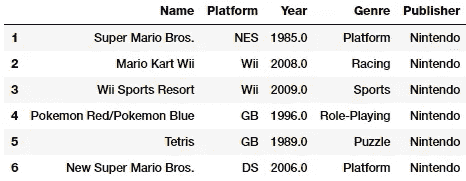*****

*****Dataset for video game sales*****

*****让我们关注上面数据框中描述的视频游戏`Genre`属性。很明显，这是一个名词性的范畴属性，就像`Publisher`和`Platform`一样。我们可以很容易地得到独特的视频游戏类型列表如下。*****

```
*****genres = np.unique(vg_df['Genre'])
genres**Output
------**
array(['Action', 'Adventure', 'Fighting', 'Misc', 'Platform',  
       'Puzzle', 'Racing', 'Role-Playing', 'Shooter', 'Simulation',  
       'Sports', 'Strategy'], dtype=object)*****
```

*****这告诉我们，我们有 12 种不同的视频游戏类型。我们现在可以生成一个标签编码方案，通过利用`scikit-learn`将每个类别映射到一个数值。*****

```
*****from sklearn.preprocessing import LabelEncodergle = LabelEncoder()
genre_labels = gle.fit_transform(vg_df['Genre'])
genre_mappings = {index: label for index, label in 
                  enumerate(gle.classes_)}
genre_mappings **Output
------** {0: 'Action', 1: 'Adventure', 2: 'Fighting', 3: 'Misc',
 4: 'Platform', 5: 'Puzzle', 6: 'Racing', 7: 'Role-Playing',
 8: 'Shooter', 9: 'Simulation', 10: 'Sports', 11: 'Strategy'}*****
```

*****因此，在`LabelEncoder`对象`gle`的帮助下，生成了一个映射方案，其中每个流派值被映射到一个数字。转换后的标签存储在`genre_labels`值中，我们可以将该值写回到我们的数据框中。*****

```
*****vg_df['GenreLabel'] = genre_labels
vg_df[['Name', 'Platform', 'Year', 'Genre', 'GenreLabel']].iloc[1:7]*****
```

*****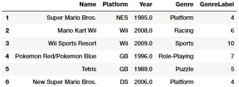*****

*****Video game genres with their encoded labels*****

*****如果您计划将这些标签用作预测的响应变量，则可以直接使用这些标签，尤其是在像`scikit-learn`这样的框架中，但是如前所述，在将它们用作特性之前，我们需要对它们进行额外的编码。*****

## *****转换序数属性*****

*****序数属性是在值之间有顺序感的分类属性。让我们考虑一下我们的 [***神奇宝贝数据集***](https://www.kaggle.com/abcsds/pokemon/data) ，我们在本系列的 [**第 1 部分**](/understanding-feature-engineering-part-1-continuous-numeric-data-da4e47099a7b) 中使用过。让我们更具体地关注一下`Generation`属性。*****

```
*****poke_df = pd.read_csv('datasets/Pokemon.csv', encoding='utf-8')
poke_df = poke_df.sample(random_state=1, 
                         frac=1).reset_index(drop=True)np.unique(poke_df['Generation'])**Output
------**
array(['Gen 1', 'Gen 2', 'Gen 3', 'Gen 4', 'Gen 5', 'Gen 6'], 
         dtype=object)*****
```

*****根据上面的输出，我们可以看到总共有 **6** 代，每个神奇宝贝通常都属于基于视频游戏的特定一代(当它们被发布时),电视连续剧也遵循类似的时间线。这个属性通常是顺序的(领域知识在这里是必要的)，因为大多数属于第 1 代的神奇宝贝在视频游戏和电视节目中比第 2 代更早出现，等等。粉丝们可以看看下图，记住每一代流行的一些神奇宝贝(粉丝们的看法可能会有所不同！).*****

*****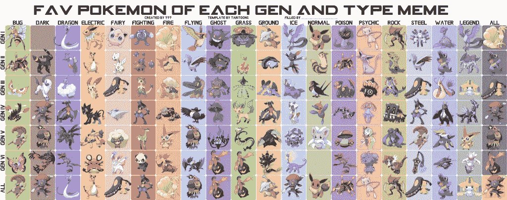*****

*****Popular Pokémon based on generation and type (source: [https://www.reddit.com/r/pokemon/comments/2s2upx/heres_my_favorite_pokemon_by_type_and_gen_chart](https://www.reddit.com/r/pokemon/comments/2s2upx/heres_my_favorite_pokemon_by_type_and_gen_chart))*****

*****因此他们有一种秩序感。一般来说，没有通用的模块或函数来根据订单自动将这些特征映射和转换成数字表示。因此，我们可以使用自定义编码\映射方案。*****

```
*****gen_ord_map = {'Gen 1': 1, 'Gen 2': 2, 'Gen 3': 3, 
               'Gen 4': 4, 'Gen 5': 5, 'Gen 6': 6}poke_df['GenerationLabel'] = poke_df['Generation'].map(gen_ord_map)
poke_df[['Name', 'Generation', 'GenerationLabel']].iloc[4:10]*****
```

*****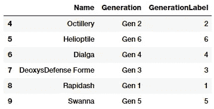*****

*****Pokémon generation encoding*****

*****从上面的代码中可以明显看出，`pandas`中的`map(…)`函数在转换这个顺序特性时很有帮助。*****

## *****编码分类属性*****

*****如果您还记得我们之前提到的内容，分类数据的特征工程通常包括我们在上一节中描述的转换过程和强制编码过程，在该过程中，我们应用特定的编码方案为特定分类属性中的每个类别\值创建虚拟变量或特征。*****

*****您可能想知道，我们在前面的部分中刚刚将类别转换为数字标签，现在我们究竟为什么需要它呢？原因很简单。考虑到视频游戏流派，如果我们直接将`GenreLabel`属性作为机器学习模型中的一个特征，它会认为它是一个连续的数字特征，认为值 **10** ( *体育*)大于 **6** ( *赛车*)，但这是没有意义的，因为*体育*流派肯定不会大于或小于*赛车*，这些是本质上不同的值或类别，不能直接进行比较。因此，我们需要一个额外的编码方案层，其中为每个属性的所有不同类别中的每个唯一值或类别创建虚拟特征。*****

## *****独热编码方案*****

*****考虑到我们具有带有 ***m*** 标签的任何分类属性的数字表示(转换后)，一键编码方案将属性编码或转换为 ***m*** 二进制特征，其只能包含值 1 或 0。因此，分类特征中的每个观察结果都被转换成大小为 ***m*** 的向量，其中只有一个值为 **1** (表示它是活动的)。让我们取一个描述两个感兴趣的属性的神奇宝贝数据集的子集。*****

```
*****poke_df[['Name', 'Generation', 'Legendary']].iloc[4:10]*****
```

*****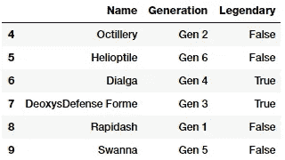*****

*****Subset of our Pokémon dataset*****

*****感兴趣的属性是神奇宝贝`Generation`和它们的`Legendary`状态。第一步是*将*这些属性转换成基于我们之前所学的数字表示。*****

```
*****from sklearn.preprocessing import OneHotEncoder, LabelEncoder# transform and map pokemon generations
gen_le = LabelEncoder()
gen_labels = gen_le.fit_transform(poke_df['Generation'])
poke_df['Gen_Label'] = gen_labels# transform and map pokemon legendary status
leg_le = LabelEncoder()
leg_labels = leg_le.fit_transform(poke_df['Legendary'])
poke_df['Lgnd_Label'] = leg_labelspoke_df_sub = poke_df[['Name', 'Generation', 'Gen_Label',  
                       'Legendary', 'Lgnd_Label']]
poke_df_sub.iloc[4:10]*****
```

*****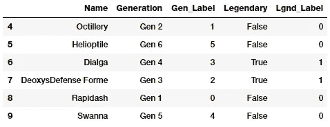*****

*****Attributes with transformed (numeric) labels*****

*****特征`Gen_Label`和`Lgnd_Label`现在描述了我们的分类特征的数字表示。现在让我们对这些特性应用一键编码方案。*****

```
*****# encode generation labels using one-hot encoding scheme
gen_ohe = OneHotEncoder()
gen_feature_arr = gen_ohe.fit_transform(
                              poke_df[['Gen_Label']]).toarray()
gen_feature_labels = list(gen_le.classes_)
gen_features = pd.DataFrame(gen_feature_arr, 
                            columns=gen_feature_labels)# encode legendary status labels using one-hot encoding scheme
leg_ohe = OneHotEncoder()
leg_feature_arr = leg_ohe.fit_transform(
                                poke_df[['Lgnd_Label']]).toarray()
leg_feature_labels = ['Legendary_'+str(cls_label) 
                           for cls_label in leg_le.classes_]
leg_features = pd.DataFrame(leg_feature_arr, 
                            columns=leg_feature_labels)*****
```

*****一般来说，你总是可以使用`fit_transform(…)`函数将两个特征编码在一起，方法是将两个特征的二维数组传递给它(查看[文档](http://scikit-learn.org/stable/modules/generated/sklearn.preprocessing.OneHotEncoder.html)！).但是我们分别对每个特性进行编码，以便于理解。除此之外，我们还可以创建单独的数据框，并对其进行相应的标注。现在让我们连接这些特征框架，看看最终的结果。*****

```
*****poke_df_ohe = pd.concat([poke_df_sub, gen_features, leg_features], axis=1)
columns = sum([['Name', 'Generation', 'Gen_Label'],   
               gen_feature_labels, ['Legendary', 'Lgnd_Label'], 
               leg_feature_labels], [])
poke_df_ohe[columns].iloc[4:10]*****
```

*****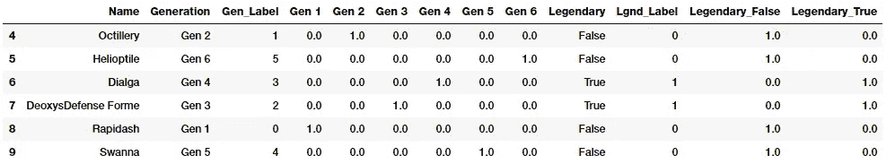*****

*****One-hot encoded features for Pokémon generation and legendary status*****

*****因此，您可以看到为`Generation`创建了 **6** 虚拟变量或二进制特征，为`Legendary`创建了 **2** 虚拟变量或二进制特征，因为它们分别是这些属性中不同类别的总数。类别的 ***活动*** 状态由这些虚拟变量之一的 **1** 值表示，从上述数据帧中可以明显看出。*****

*****假设您在训练数据上建立了这种编码方案，并建立了一些模型，现在您有一些新数据，这些数据必须在预测之前针对如下特征进行设计。*****

```
*****new_poke_df = pd.DataFrame([['PikaZoom', 'Gen 3', True], 
                           ['CharMyToast', 'Gen 4', False]],
                       columns=['Name', 'Generation', 'Legendary'])
new_poke_df*****
```

*****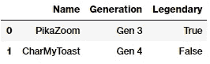*****

*****Sample new data*****

*****在这里，您可以通过对新数据调用先前构建的`LabeLEncoder` 和`OneHotEncoder` 对象的`transform(…)`函数来利用`scikit-learn’s`优秀的 API。记住我们的工作流程，首先我们做 ***转换*** 。*****

```
*****new_gen_labels = gen_le.transform(new_poke_df['Generation'])
new_poke_df['Gen_Label'] = new_gen_labelsnew_leg_labels = leg_le.transform(new_poke_df['Legendary'])
new_poke_df['Lgnd_Label'] = new_leg_labelsnew_poke_df[['Name', 'Generation', 'Gen_Label', 'Legendary', 
             'Lgnd_Label']]*****
```

*****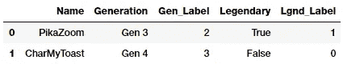*****

*****Categorical attributes after transformation*****

*****一旦我们有了数字标签，现在让我们应用编码方案！*****

```
*****new_gen_feature_arr = gen_ohe.transform(new_poke_df[['Gen_Label']]).toarray()
new_gen_features = pd.DataFrame(new_gen_feature_arr, 
                                columns=gen_feature_labels)new_leg_feature_arr = leg_ohe.transform(new_poke_df[['Lgnd_Label']]).toarray()
new_leg_features = pd.DataFrame(new_leg_feature_arr, 
                                columns=leg_feature_labels)new_poke_ohe = pd.concat([new_poke_df, new_gen_features, new_leg_features], axis=1)
columns = sum([['Name', 'Generation', 'Gen_Label'], 
               gen_feature_labels,
               ['Legendary', 'Lgnd_Label'], leg_feature_labels], [])new_poke_ohe[columns]*****
```

*****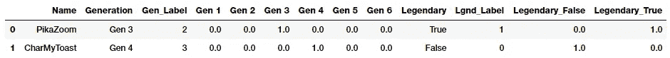*****

*****Categorical attributes after one-hot encoding*****

*****因此，您可以看到，通过利用`scikit-learn’s`强大的 API，可以很容易地在新数据上应用这个方案。*****

*****您还可以通过利用`pandas`中的`to_dummies(…)`函数轻松应用一键编码方案。*****

```
*****gen_onehot_features = pd.get_dummies(poke_df['Generation'])
pd.concat([poke_df[['Name', 'Generation']], gen_onehot_features], 
           axis=1).iloc[4:10]*****
```

*****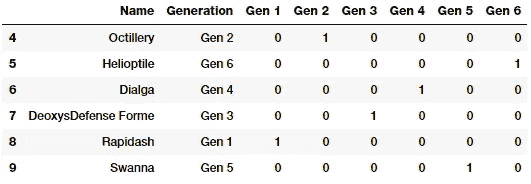*****

*****One-hot encoded features by leveraging pandas*****

*****上述数据框描述了应用于`Generation`属性的独热编码方案，其结果与之前的预期结果相同。*****

## *****虚拟编码方案*****

*****伪编码方案类似于独热编码方案，除了在伪编码方案的情况下，当应用于具有 **m** 个不同标签的分类特征时，我们得到 ***m - 1*** 个二进制特征。因此，分类变量的每个值都被转换成大小为 ***m - 1*** 的向量。额外的特征被完全忽略，因此如果类别值的范围从 ***{0，1，…，m-1 }******第 0 个*** 或***m-1 个*** 特征列被丢弃，相应的类别值通常由全零的矢量 ***(0)*** 表示。让我们通过删除第一级二进制编码特征(`Gen 1`)来尝试在神奇宝贝`Generation` 上应用虚拟编码方案。*****

```
*****gen_dummy_features = pd.get_dummies(poke_df['Generation'], 
                                    drop_first=True)
pd.concat([poke_df[['Name', 'Generation']], gen_dummy_features], 
          axis=1).iloc[4:10]*****
```

*****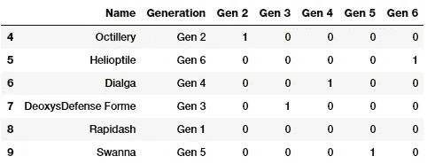*****

*****Dummy coded features for Pokémon g`eneration`*****

*****如果你愿意，你也可以选择丢弃最后一级二进制编码特征(`Gen 6`)如下。*****

```
*****gen_onehot_features = pd.get_dummies(poke_df['Generation'])
gen_dummy_features = gen_onehot_features.iloc[:,:-1]
pd.concat([poke_df[['Name', 'Generation']], gen_dummy_features],  
          axis=1).iloc[4:10]*****
```

*****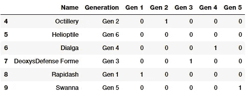*****

*****Dummy coded features for Pokémon g`eneration`*****

*****基于上面的描述，很清楚属于丢弃特征的类别被表示为零向量( **0)** ，就像我们之前讨论的那样。*****

## *****效果编码方案*****

*****效果编码方案实际上与虚拟编码方案非常相似，只是在编码过程中，虚拟编码方案中代表所有 **0** 的类别值的编码特征或特征向量在效果编码方案中被替换为 **-1** 。通过下面的例子，这将变得更加清楚。*****

```
*****gen_onehot_features = pd.get_dummies(poke_df['Generation'])
gen_effect_features = gen_onehot_features.iloc[:,:-1]
gen_effect_features.loc[np.all(gen_effect_features == 0, 
                               axis=1)] = -1.
pd.concat([poke_df[['Name', 'Generation']], gen_effect_features], 
          axis=1).iloc[4:10]*****
```

*****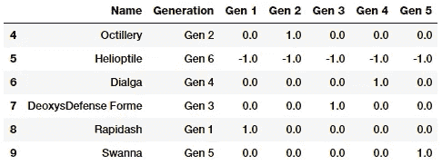*****

*****Effect coded features for Pokémon g`eneration`*****

*****上面的输出清楚地表明，与虚拟编码中的 0 相比，属于`Generation` 6 的神奇宝贝现在由值为-1 的向量表示。*****

## *****面元计数方案*****

*****到目前为止，我们讨论的编码方案在一般分类数据上工作得很好，但是当任何特征中不同类别的数量变得非常大时，它们就开始产生问题。对任何一个绝对特征都必不可少的 ***m*** 不同的标签，你就得到 ***m*** 单独的特征。这很容易增加特征集的大小，从而导致诸如存储问题、关于时间、空间和内存的模型训练问题之类的问题。除此之外，我们还必须处理通常所说的 [***【维数灾难】***](https://en.wikipedia.org/wiki/Curse_of_dimensionality)*等问题，在这些问题中，基本上有大量的特征和没有足够的代表性样本，模型性能开始受到影响，经常导致过度拟合。******

******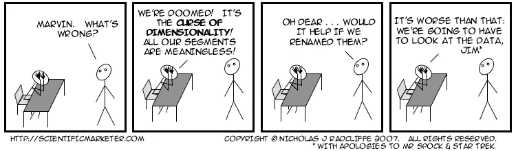******

******因此，对于具有大量可能类别(如 IP 地址)的特征，我们需要寻找其他分类数据特征工程方案。容器计数方案对于处理具有许多类别的分类变量是一种有用的方案。在该方案中，我们使用基于概率的关于值和实际目标或响应值的统计信息，而不是使用实际标签值进行编码，我们的目标是在建模工作中预测这些信息。一个简单的例子是基于 IP 地址和 DDOS 攻击中使用的 IP 地址的历史数据；我们可以为由任何 IP 地址引起的 DDOS 攻击建立概率值。使用该信息，我们可以对输入特征进行编码，该输入特征描述了如果相同的 IP 地址在将来出现，导致 DDOS 攻击的概率值是多少。这个方案需要历史数据作为先决条件，是一个精心制作的方案。用一个完整的例子来描述这一点目前是困难的，但是你可以参考网上的一些资源。******

## ******特征散列方案******

******特征散列方案是另一种用于处理大规模分类特征的有用的特征工程方案。在该方案中，散列函数通常与预设的编码特征数量(作为预定义长度的向量)一起使用，使得特征的散列值被用作该预定义向量中的索引，并且值被相应地更新。由于哈希函数将大量值映射到一个有限的小值集，多个不同的值可能会创建相同的哈希，这称为冲突。通常，使用带符号的散列函数，使得从散列中获得的值的符号被用作存储在最终特征向量中适当索引处的值的符号。这将确保更少的冲突和由于冲突导致的更少的误差累积。******

******哈希方案适用于字符串、数字和其他结构，如向量。您可以将哈希输出视为一组有限的 ***b*** 二进制文件，这样，当哈希函数应用于相同的值\类别时，它们会根据哈希值被分配到 ***b*** 二进制文件中的相同二进制文件(或二进制文件的子集)。我们可以预先定义 ***b*** 的值，该值成为我们使用特征散列方案编码的每个分类属性的编码特征向量的最终大小。******

******因此，即使我们在一个特征中有超过 **1000** 个不同的类别，并且我们将 ***b=10*** 设置为最终的特征向量大小，如果我们使用一位热码编码方案，则输出特征集将仍然只有 **10** 个特征，而不是 **1000** 个二进制特征。让我们考虑一下视频游戏数据集中的`Genre`属性。******

```
******unique_genres = np.unique(vg_df[['Genre']])
print("Total game genres:", len(unique_genres))
print(unique_genres)**Output
------**
Total game genres: 12
['Action' 'Adventure' 'Fighting' 'Misc' 'Platform' 'Puzzle' 'Racing'
 'Role-Playing' 'Shooter' 'Simulation' 'Sports' 'Strategy']******
```

******我们可以看到一共有 12 种类型的电子游戏。如果我们在`Genre` 特性上使用一个独热编码方案，我们最终会有 12 个二进制特性。相反，我们现在将通过利用`scikit-learn’s` `FeatureHasher`类来使用一个特性散列方案，它使用一个带符号的 32 位版本的 *Murmurhash3* 散列函数。在这种情况下，我们将预先定义最终的特征向量大小为 **6** 。******

```
******from sklearn.feature_extraction import FeatureHasherfh = FeatureHasher(n_features=6, input_type='string')
hashed_features = fh.fit_transform(vg_df['Genre'])
hashed_features = hashed_features.toarray()
pd.concat([vg_df[['Name', 'Genre']], pd.DataFrame(hashed_features)], 
          axis=1).iloc[1:7]******
```

******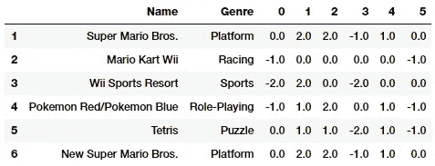******

******Feature Hashing on the Genre attribute******

******基于上述输出，`Genre` 分类属性已经使用哈希方案编码成 **6** 特征，而不是 **12** 。我们还可以看到，行 **1** 和 **6** 表示相同流派的游戏， ***平台*** 被正确地编码到相同的特征向量中。******

# ******结论******

******这些例子应该让您对离散、分类数据的特征工程的流行策略有一个很好的了解。如果你阅读了本系列的第一部分 ，你会发现与连续的数字数据相比，处理分类数据有点困难，但是绝对有趣！我们还讨论了一些使用特征工程来处理大特征空间的方法，但是你也应该记住还有其他的技术，包括 [*特征选择*](https://en.wikipedia.org/wiki/Feature_selection) 和 [*降维*](https://en.wikipedia.org/wiki/Dimensionality_reduction) 方法来处理大特征空间。我们将在后面的文章中讨论其中的一些方法。******

******接下来是针对非结构化文本数据的特征工程策略。敬请期待！******

******要了解连续数值数据的特征工程策略，请查看本系列的第 1 部分[](/understanding-feature-engineering-part-1-continuous-numeric-data-da4e47099a7b)**！********

********本文中使用的所有代码和数据集都可以从我的 [**GitHub**](https://github.com/dipanjanS/practical-machine-learning-with-python/tree/master/notebooks/Ch04_Feature_Engineering_and_Selection) 中获得********

******该代码也可作为 [**Jupyter 笔记本**](https://github.com/dipanjanS/practical-machine-learning-with-python/blob/master/notebooks/Ch04_Feature_Engineering_and_Selection/Feature%20Engineering%20on%20Categorical%20Data.ipynb)******