# 文本数据的传统方法

> 原文：<https://towardsdatascience.com/understanding-feature-engineering-part-3-traditional-methods-for-text-data-f6f7d70acd41?source=collection_archive---------0----------------------->

## [了解特征工程](https://towardsdatascience.com/tagged/tds-feature-engineering)(第三部分)

## 驯服非结构化文本数据的传统策略


# 介绍

在本系列*的前两部分中，我们已经介绍了处理结构化数据的各种特性工程策略。*检查[***第一部分:连续的数值数据***](/understanding-feature-engineering-part-1-continuous-numeric-data-da4e47099a7b) 和 [***第二部分:离散的分类数据***](/understanding-feature-engineering-part-2-categorical-data-f54324193e63)*复习*。在本文中，我们将了解如何处理文本数据，这无疑是最丰富的非结构化数据来源之一。文本数据通常由能够代表自由流动文本的单词、句子甚至段落的文档组成。*固有的非结构化(没有格式整齐的数据列！)和文本数据的噪声性质使得机器学习方法更难直接在原始文本数据上工作。因此，在本文中，我们将遵循动手实践的方法，探索一些最流行和最有效的从文本数据中提取有意义特征的策略。这些特征可以很容易地用于建立机器学习或深度学习模型。*

# *动机*

*特征工程通常被认为是创造卓越和性能更好的机器学习模型的秘方。仅仅一个优秀的功能就可能成为你赢得挑战的入场券！对于非结构化的文本数据，特征工程的重要性甚至更加重要，因为我们需要将自由流动的文本转换为一些数字表示，然后机器学习算法可以理解这些数字表示。即使有了自动化特征工程能力的出现，在将它们作为黑盒模型应用之前，您仍然需要理解不同特征工程策略背后的核心概念。永远记住，*“如果给你一盒修理房子的工具，你要知道什么时候用电钻，什么时候用锤子！”*。*

# *理解文本数据*

*我敢肯定，在这种情况下，你们所有人对文本数据的组成都有一个大致的概念。请记住，您总是可以拥有结构化数据属性形式的文本数据，但是这些数据通常属于结构化分类数据的范畴。*

*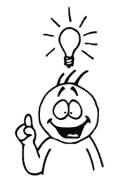*

*在这个场景中，我们谈论的是单词、短语、句子和整个文档形式的自由流动的文本。本质上，我们有一些句法结构，像单词组成短语，短语组成句子，句子又组成段落。然而，文本文档没有固有的结构，因为您可能有各种各样的单词，这些单词可能在文档之间有所不同，并且与结构化数据集中固定数量的数据维度相比，每个句子的长度也是可变的。这篇文章本身就是一个完美的文本数据例子！*

# *特征工程策略*

*让我们看看一些流行而有效的策略，用于处理文本数据并从中提取有意义的特征，这些策略可用于下游的机器学习系统。请注意，您可以在我的 GitHub 库 中访问本文中使用的所有代码，以供将来参考。我们将从加载一些基本的依赖项和设置开始。*

```
*import pandas as pd
import numpy as np
import re
import nltk
import matplotlib.pyplot as pltpd.options.display.max_colwidth = 200
%matplotlib inline*
```

*现在让我们来看一个样本文档集，我们将在本文中对其进行大部分分析。 [***语料库***](https://en.wikipedia.org/wiki/Text_corpus) 通常是通常属于一个或多个主题的文本文档的集合。*

*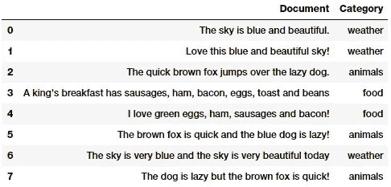*

*Our sample text corpus*

*您可以看到，我们已经为我们的玩具语料库提取了几个属于不同类别的样本文本文档。在我们谈论特征工程之前，一如既往，我们需要做一些数据预处理或争论，以删除不必要的字符，符号和令牌。*

## *文本预处理*

*可以有多种清理和预处理文本数据的方式。在下面的几个要点中，我们强调了自然语言处理(NLP)管道中大量使用的一些最重要的方法。*

*   ***去除标签:**我们的文本往往包含 HTML 标签这样不必要的内容，在分析文本的时候并没有增加多少价值。BeautifulSoup 库在为此提供必要的函数方面做得非常出色。*
*   ***删除带重音的字符:**在任何文本语料库中，尤其是在处理英语语言时，经常会遇到带重音的字符\字母。因此，我们需要确保这些字符被转换并标准化为 ASCII 字符。一个简单的例子就是将**转换成**再转换成 **e** 。*
*   ***扩展缩写:**在英语中，缩写基本上是单词或音节的缩短版本。这些现有单词或短语的缩短版本是通过删除特定的字母和声音创建的。例如， ***不要*** 要 ***不要*** 和 ***我要*** 要 ***我要*** 。将每个缩写转换为其扩展的原始形式通常有助于文本标准化。*
*   ***去除特殊字符:**通常为非字母数字字符的特殊字符和符号通常会增加非结构化文本中的额外噪声。更常见的是，简单的正则表达式(regexes)可以用来实现这一点。*
*   ***词干和词汇化:**词干通常是可能单词的基本形式，可以通过将*词缀*如*前缀*和*后缀*附加到词干来创建新单词。这就是所谓的变调。获得单词基本形式的反向过程被称为*词干提取*。一个简单的例子就是 ***手表*** *ES* ， ***手表*** *ING* 和 ***手表*** *ED* 这几个词。他们以词根词干 ***表*** 为基础形式。词汇化与词干化非常相似，我们移除词缀来获得单词的基本形式。然而，在这种情况下，基本形式被称为词根，而不是词干。区别在于词根总是字典上正确的单词(存在于字典中),但是词干可能不是这样。*
*   ***去除停用词:**意义不大或没有意义的词，尤其是在从文本中构建有意义的特征时，被称为停用词或停用词。如果你在语料库中做一个简单的术语或词频，这些通常是出现频率最高的词。像 ***a*** ，***a***，*，*等单词都被认为是停用词。没有通用的停用词表，但是我们使用来自`nltk`的标准英语停用词表。您也可以根据需要添加自己的特定领域的停用词。***

***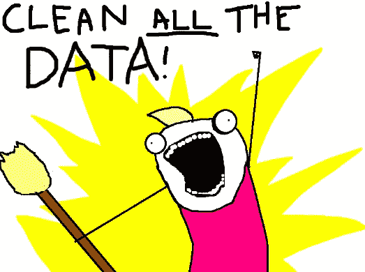***

***除此之外，您还可以进行其他标准操作，如标记化、删除多余的空格、文本小写以及更高级的操作，如拼写纠正、语法错误纠正、删除重复字符等。如果你有兴趣，你可以从[我最近的一本书](https://github.com/dipanjanS/practical-machine-learning-with-python)中查阅 [**一个关于文本预处理**](https://github.com/dipanjanS/practical-machine-learning-with-python/blob/master/notebooks/Ch07_Analyzing_Movie_Reviews_Sentiment/Text%20Normalization%20Demo.ipynb) 的样本笔记本。***

***由于本文的重点是特征工程，我们将构建一个简单的文本预处理程序，重点是删除文本语料库中的特殊字符、多余空格、数字、停用词和小写字母。***

***一旦我们准备好基本的预处理管道，让我们将同样的应用到我们的样本语料库。***

```
***norm_corpus = normalize_corpus(corpus)
norm_corpus**Output
------** array(['sky blue beautiful', 'love blue beautiful sky',
       'quick brown fox jumps lazy dog',
       'kings breakfast sausages ham bacon eggs toast beans',
       'love green eggs ham sausages bacon',
       'brown fox quick blue dog lazy', 
       'sky blue sky beautiful today',
       'dog lazy brown fox quick'],
      dtype='<U51')***
```

***上面的输出应该让您清楚地看到我们的每个样本文档在预处理后的样子。现在让我们来设计一些功能吧！***

## ***词汇袋模型***

***对于非结构化文本，这可能是最简单的向量空间表示模型。向量空间模型是一个简单的数学模型，将非结构化文本(或任何其他数据)表示为数字向量，这样向量的每个维度都是一个特定的特征\属性。单词袋模型将每个文本文档表示为数字向量，其中每个维度是来自语料库的特定单词，并且该值可以是它在文档中的频率、出现次数(用 1 或 0 表示)或者甚至是加权值。这个模型之所以叫这个名字，是因为每个文档都被字面上表示为它自己的单词的“包”,而不考虑单词顺序、序列和语法。***

```
*****Output
------**
array([[0, 0, 1, 1, 0, 0, 0, 0, 0, 0, 0, 0, 0, 0, 0, 0, 0, 1, 0, 0],
       [0, 0, 1, 1, 0, 0, 0, 0, 0, 0, 0, 0, 0, 0, 1, 0, 0, 1, 0, 0],
       [0, 0, 0, 0, 0, 1, 1, 0, 1, 0, 0, 1, 0, 1, 0, 1, 0, 0, 0, 0],
       [1, 1, 0, 0, 1, 0, 0, 1, 0, 0, 1, 0, 1, 0, 0, 0, 1, 0, 1, 0],
       [1, 0, 0, 0, 0, 0, 0, 1, 0, 1, 1, 0, 0, 0, 1, 0, 1, 0, 0, 0],
       [0, 0, 0, 1, 0, 1, 1, 0, 1, 0, 0, 0, 0, 1, 0, 1, 0, 0, 0, 0],
       [0, 0, 1, 1, 0, 0, 0, 0, 0, 0, 0, 0, 0, 0, 0, 0, 0, 2, 0, 1],
       [0, 0, 0, 0, 0, 1, 1, 0, 1, 0, 0, 0, 0, 1, 0, 1, 0, 0, 0, 0]
      ], dtype=int64)***
```

***因此，您可以看到我们的文档已经被转换成数字向量，这样，在上面的特征矩阵中，每个文档都由一个向量(行)表示。下面的代码将有助于用一种更容易理解的格式来表示这一点。***

***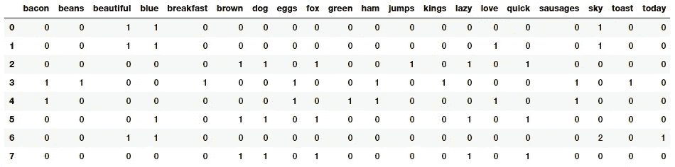***

***Our Bag of Words model based document feature vectors***

***这应该会让事情更清楚吧！您可以清楚地看到，特征向量中的每一列或每一个维度代表语料库中的一个单词，每一行代表我们的一个文档。任何单元格中的值表示该单词(由列表示)在特定文档(由行表示)中出现的次数。因此，如果文档集由跨越所有文档的 ***N 个*** 唯一单词组成，那么对于每个文档，我们将有一个 ***N 维*** 向量。***

## **N 克模型袋**

**一个单词只是一个标记，通常被称为一元语法或一元语法。我们已经知道单词袋模型不考虑单词的顺序。但是如果我们也想考虑出现在序列中的短语或单词集合呢？N-grams 帮助我们实现了这一点。N 元语法基本上是来自文本文档的单词标记的集合，使得这些标记是连续的并且按顺序出现。二元语法表示 2 阶的 n 元语法(两个单词)，三元语法表示 3 阶的 n 元语法(三个单词)，依此类推。因此，N-gram 模型只是单词模型的扩展，所以我们也可以利用基于 N-gram 的特征。下面的例子描述了每个文档特征向量中基于二元语法的特征。**

**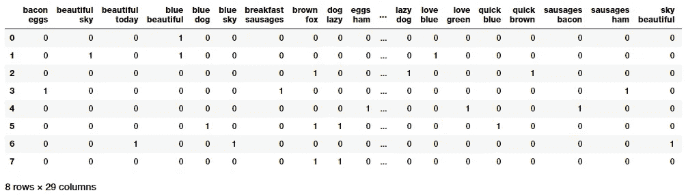**

**Bi-gram based feature vectors using the Bag of N-Grams Model**

**这为我们的文档提供了特征向量，其中每个特征由表示两个单词序列的二元语法组成，值表示该二元语法在我们的文档中出现的次数。**

## **TF-IDF 模型**

**词袋模型在用于大型语料库时可能会出现一些潜在的问题。因为特征向量是基于绝对术语频率的，所以可能有一些术语在所有文档中频繁出现，并且这些术语可能会盖过特征集中的其他术语。TF-IDF 模型试图通过在其计算中使用一个缩放或归一化因子来解决这个问题。TF-IDF 代表词频-逆文档频率，它在
的计算中使用了两个度量的组合，即: ***【词频】*** 和 ***逆文档频率(idf)*** 。这项技术是为搜索引擎中的查询结果排序而开发的，现在它是信息检索和 NLP 领域中不可或缺的模型。**

**数学上，我们可以将 TF-IDF 定义为 ***tfidf = tf x idf*** ，可以进一步展开表示如下。**

**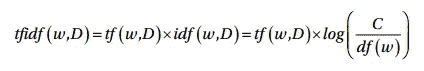**

**这里， ***tfidf(w，D)*** 是文档*中单词 ***w*** 的 TF-IDF 得分。术语 ***tf(w，D)*** 表示单词 ***w*** 在文档 ***D*** 中的词频，可以从词袋模型中得到。术语 ***idf(w，D)*** 是术语 ***w*** 的逆文档频率，其可以计算为语料库 ***C*** 中的文档总数除以单词 ***w*** 的文档频率的对数变换，这基本上是单词 ***w* 在语料库中的文档频率这个模型有多种变体，但最终都给出了非常相似的结果。现在让我们把它应用到我们的语料库中吧！*****

**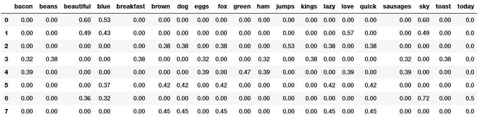**

**Our TF-IDF model based document feature vectors**

**我们的每个文本文档的基于 TF-IDF 的特征向量显示了与原始单词包模型值相比的缩放和归一化值。有兴趣的读者可能想深入了解这个模型内部工作原理的更多细节，可以参考第 181 页的 [*使用 Python 的文本分析(Springer \ ApressDipanjan Sarkar，2016)*](https://github.com/dipanjanS/text-analytics-with-python) 。**

## **文档相似度**

**文档相似性是使用基于距离或相似性的度量的过程，该度量可用于基于从文档中提取的特征(如单词袋或 tf-idf)来识别文本文档与任何其他文档的相似程度。**

****

**Are we similar?**

**因此，您可以看到，我们可以在上一节中设计的基于 tf-idf 的功能的基础上进行构建，并通过利用这些基于相似性的功能，使用它们来生成在搜索引擎、文档聚类和信息检索等领域中有用的新功能。**

**语料库中的成对文档相似性涉及计算语料库中每对文档的文档相似性。因此，如果在一个语料库中有 ***C*** 个文档，那么最终会得到一个 ***C* x *C*** 矩阵，使得每一行和每一列都代表一对文档的相似性得分，这分别代表该行和该列的索引。有几种用于计算文档相似性的相似性和距离度量。其中包括余弦距离/相似度、欧氏距离、曼哈顿距离、BM25 相似度、jaccard 距离等等。在我们的分析中，我们将使用可能是最流行和最广泛使用的相似性度量，
余弦相似性，并基于它们的 TF-IDF 特征向量来比较成对的文档相似性。**

**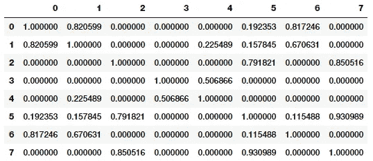**

**Pairwise document similarity matrix (cosine similarity)**

**余弦相似性基本上给出了一种度量，表示两个文本文档的特征向量表示之间的角度的余弦。文档之间的角度越小，它们就越接近和相似，如下图所示。**

**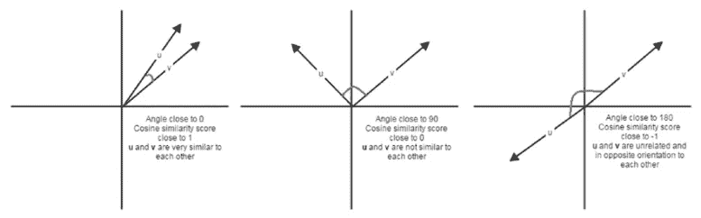**

**Cosine similarity depictions for text document feature vectors**

**仔细观察相似性矩阵清楚地告诉我们，文档(0、1 和 6)、(2、5 和 7)彼此非常相似，文档 3 和 4 彼此稍微相似，但是幅度不是很大，但是仍然比其他文档强。这一定表明这些相似的文件有一些相似的特征。这是一个分组或聚类的完美例子，可以通过无监督学习来解决，特别是当您处理数百万文本文档的庞大语料库时。**

## **基于相似特征的文档聚类**

**聚类利用无监督学习将数据点(在这个场景中是文档)分组到组或聚类中。我们将在这里利用无监督的层次聚类算法，通过利用我们之前生成的文档相似性特征，尝试将来自我们的玩具语料库的相似文档分组在一起。有两种类型的层次聚类算法，即凝聚和分裂方法。我们将使用凝聚聚类算法，这是一种使用自下而上方法的分层聚类，即每个观察或文件从其自己的聚类开始，然后使用测量数据点之间距离的距离度量和链接合并标准将聚类连续合并在一起。下图显示了一个示例描述。**

**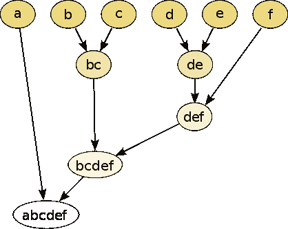**

**Agglomerative Hierarchical Clustering**

**关联标准的选择决定了合并策略。连锁标准的一些例子是沃德、完全连锁、平均连锁等。该标准对于在每个步骤中基于目标函数的最优值选择要合并的聚类对(最低步骤中的单个文档和较高步骤中的聚类)非常有用。我们选择沃德的*最小方差方法*作为我们的连锁标准，以最小化总的组内方差。因此，在每一步，我们找到合并后导致总的类内方差最小增加的那对类。因为我们已经有了相似性特征，所以让我们在样本文档上构建链接矩阵。**

**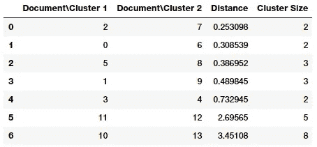**

**Linkage Matrix for our Corpus**

**如果仔细观察关联矩阵，您会发现关联矩阵的每一步(每一行)都告诉我们哪些数据点(或聚类)被合并在一起。如果你有 ***n*** 个数据点，那么链接矩阵， ***Z*** 将具有***(n-1)*x*4***其中*将告诉我们哪些聚类在步骤 ***i*** 被合并。每行有四个元素，前两个元素是数据点标识符或聚类标签(在矩阵的后面部分，一旦
多个数据点合并)，第三个元素是前两个元素(数据点或聚类)之间的聚类距离，最后一个元素是合并完成后聚类中元素\数据点的总数。我们推荐你参考 [**scipy 文档**](https://docs.scipy.org/doc/scipy/reference/generated/scipy.cluster.hierarchy.linkage.html) ，里面对此有详细解释。***

**现在让我们把这个矩阵想象成一个树状图，以便更好地理解这些元素！**

**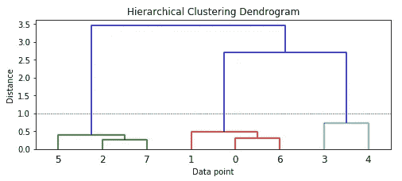**

**Dendrogram visualizing our hierarchical clustering process**

**我们可以看到每个数据点如何开始作为一个单独的集群，并慢慢开始与其他数据点合并形成集群。从颜色和树状图的高度来看，如果您考虑大约 **1.0** 或更高的距离度量(由虚线表示)，您可以看到该模型已经正确地识别了三个主要聚类。利用这个距离，我们得到我们的聚类标签。**

**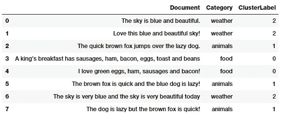**

**Clustering our documents into groups with hierarchical clustering**

**因此，您可以清楚地看到，我们的算法已经根据分配给它们的聚类标签，在我们的文档中正确地识别了三个不同的类别。这将让您很好地了解如何利用我们的 TF-IDF 特性来构建我们的相似性特性，这反过来又有助于对我们的文档进行聚类。您实际上可以在将来使用这个管道来聚集您自己的文档！**

## **主题模型**

**我们还可以使用一些摘要技术从文本文档中提取基于主题或概念的特征。主题模型的思想围绕着从表示为主题的文档语料库中提取关键主题或概念的过程。每个主题可以被表示为来自文档语料库的单词/术语的包或集合。总的来说，这些术语表示特定的主题、主题或概念，并且每个主题可以通过这些术语所传达的语义来容易地与其他主题区分开来。然而，基于这些数据，你经常会得到一些重叠的主题。这些概念可以从简单的事实和陈述到观点和展望。主题模型在总结大量文本文档以提取和描述关键概念时非常有用。它们还可用于从文本数据中提取特征，以捕捉数据中的潜在模式。**

**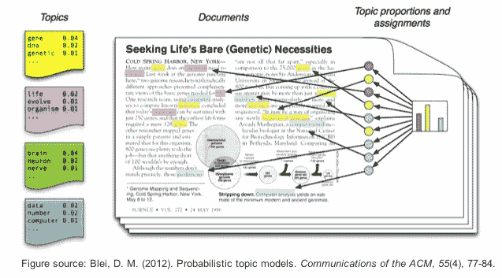**

**An example of topic models**

**主题建模有多种技术，其中大多数都涉及某种形式的矩阵分解。像潜在语义索引(LSI)这样的一些技术使用矩阵分解操作，更具体地说是奇异值分解。我们将使用另一种技术是潜在狄利克雷分配(LDA)，它使用一种生成概率模型，其中每个文档由几个主题的组合组成，每个术语或单词可以分配给一个特定的主题。这类似于基于 pLSI 的模型(概率 LSI)。在 LDA 的情况下，每个潜在主题包含一个 Dirichlet 先验。**

**这项技术背后的数学是相当复杂的，所以我会尽量总结一下，而不会用很多细节来烦你。我推荐读者去看看克里斯汀·多伊格的这篇精彩的演讲[](http://chdoig.github.io/pygotham-topic-modeling/#/)**。****

****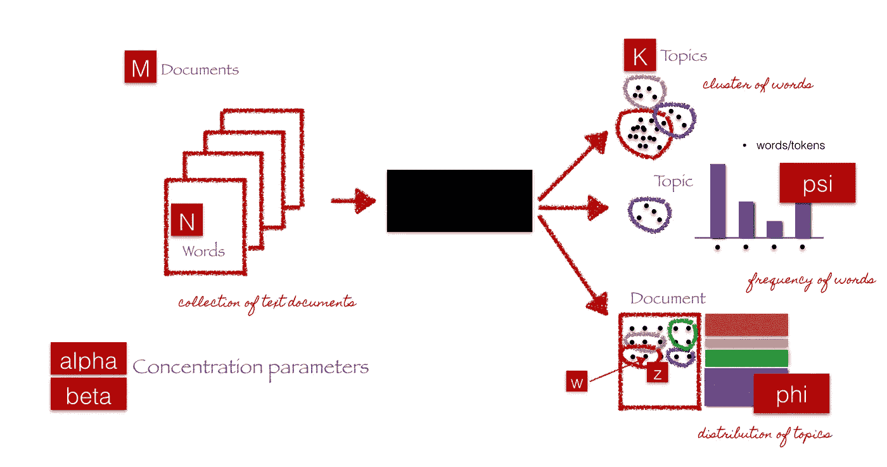****

****End-to-end LDA framework (courtesy of C. Doig, Introduction to Topic
Modeling in Python)****

****上图中的黑框表示核心算法，该算法利用前面提到的参数从 ***M*** 文档中提取 ***K*** 主题。下面的步骤简单地解释了算法在幕后发生了什么。****

****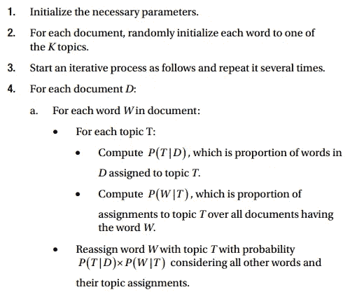****

****运行几次迭代后，我们应该为每个文档准备好主题混合，然后从指向该主题的术语中生成每个主题的成分。像`gensim`或`scikit-learn`这样的框架使我们能够利用 LDA 模型来生成主题。****

****出于特征工程的目的(这也是本文的目的)，您需要记住，当 LDA 应用于文档术语矩阵(TF-IDF 或单词包特征矩阵)时，它被分解为两个主要部分。****

*   ****文档-主题矩阵，这将是我们正在寻找的特征矩阵。****
*   ****一个主题术语矩阵，帮助我们在语料库中寻找潜在的主题。****

****让我们利用`scikit-learn`得到如下的文档-主题矩阵。****

****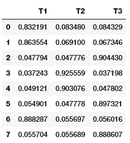****

****Document-Topic Matrix from our LDA Model****

****在上面的输出中，您可以清楚地看到哪些文档对三个主题中的哪一个贡献最大。您可以按如下方式查看主题及其主要组成部分。****

```
******Topic 1
-------**
[('sky', 4.3324395825632624), ('blue', 3.3737531748317711), ('beautiful', 3.3323652405224857), ('today', 1.3325579841038182), ('love', 1.3304224288080069)]**Topic 2
-------**
[('bacon', 2.3326959484799978), ('eggs', 2.3326959484799978), ('ham', 2.3326959484799978), ('sausages', 2.3326959484799978), ('love', 1.335454457601996), ('beans', 1.3327735253784641), ('breakfast', 1.3327735253784641), ('kings', 1.3327735253784641), ('toast', 1.3327735253784641), ('green', 1.3325433207547732)]**Topic 3
-------** [('brown', 3.3323474595768783), ('dog', 3.3323474595768783), ('fox', 3.3323474595768783), ('lazy', 3.3323474595768783), ('quick', 3.3323474595768783), ('jumps', 1.3324193736202712), ('blue', 1.2919635624485213)]****
```

****因此，你可以清楚地看到，这三个主题根据它们的构成术语彼此有很大的区别，第一个谈论天气，第二个谈论食物，最后一个谈论动物。选择主题建模的主题数量本身就是一个完整的主题(不是双关语！)是一门艺术，也是一门科学。有各种各样的方法和试探法来获得最佳的主题数量，但是由于这些技术的详细性质，我们在这里不讨论它们。****

## ****具有主题模型特征的文档聚类****

****我们使用基于特征的词袋模型，使用 LDA 建立基于特征的主题模型。我们现在实际上可以利用我们获得的文档术语矩阵，并使用无监督聚类算法来尝试对我们的文档进行分组，就像我们之前使用相似性特征所做的那样。****

****这一次，我们将使用一种非常流行的基于划分的聚类方法，K-means 聚类来根据这些文档的主题模型特征表示对它们进行聚类或分组。在 K-means 聚类中，我们有一个输入参数 ***k*** ，它指定了使用文档特征输出的聚类数。这种聚类方法是一种基于质心的聚类方法，它试图将这些文档聚类成等方差的聚类。它试图通过最小化类内平方和度量(也称为惯性)来创建这些类。有多种方法来选择 ***k*** 的最佳值，如使用误差平方和度量、轮廓系数和肘方法。****

****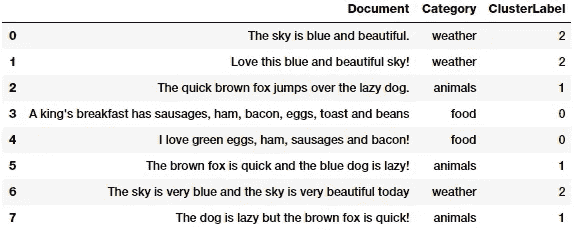****

****Clustering our documents into groups with K-means clustering****

****从上面的输出中我们可以看到，我们的文档被正确地分配到了正确的集群中！****

# ****高级策略的未来范围****

****我们在本文中没有涉及的是围绕文本数据的特征工程的几个高级策略，这些策略最近变得很突出。这包括利用基于深度学习的模型来获得单词嵌入。在本系列的下一部分中，我们将深入探讨这些模型，并通过详细的实践示例介绍流行的单词嵌入模型，如[***word 2 vec***](https://en.wikipedia.org/wiki/Word2vec)和[***GloVe***](https://nlp.stanford.edu/projects/glove/)，敬请关注！****

# ****结论****

****这些例子应该让您对文本数据的特征工程的流行策略有一个很好的了解。请记住，这些是基于数学、信息检索和自然语言处理概念的传统策略。因此，随着时间的推移，这些经过试验和测试的方法在各种数据集和问题中被证明是成功的。接下来将是利用深度学习模型对文本数据进行特征工程的详细策略！****

****要阅读关于连续数值数据的特征工程策略，请查看本系列的第 1 部分的 [**！**](/understanding-feature-engineering-part-1-continuous-numeric-data-da4e47099a7b)****

****要了解离散分类数据的特征工程策略，请查看本系列的 [**第 2 部分**](/understanding-feature-engineering-part-2-categorical-data-f54324193e63) ！****

****本文中使用的所有代码和数据集都可以从我的 [**GitHub**](https://github.com/dipanjanS/practical-machine-learning-with-python/tree/master/bonus%20content/feature%20engineering%20text%20data) 中获得****

****该代码也可作为 [**Jupyter 笔记本**](https://github.com/dipanjanS/practical-machine-learning-with-python/blob/master/bonus%20content/feature%20engineering%20text%20data/Feature%20Engineering%20Text%20Data%20-%20Traditional%20Strategies.ipynb)****

****如果你对我的文章或数据科学有任何反馈、评论或有趣的见解要分享，请随时通过我的 LinkedIn 社交媒体频道联系我。****

****[](https://www.linkedin.com/in/dipanzan/) [## Dipanjan Sarkar | LinkedIn

### 查看 Dipanjan Sarkar 在世界最大的职业社区 LinkedIn 上的个人资料。Dipanjan 有 5 份工作列在…

www.linkedin.com](https://www.linkedin.com/in/dipanzan/)****