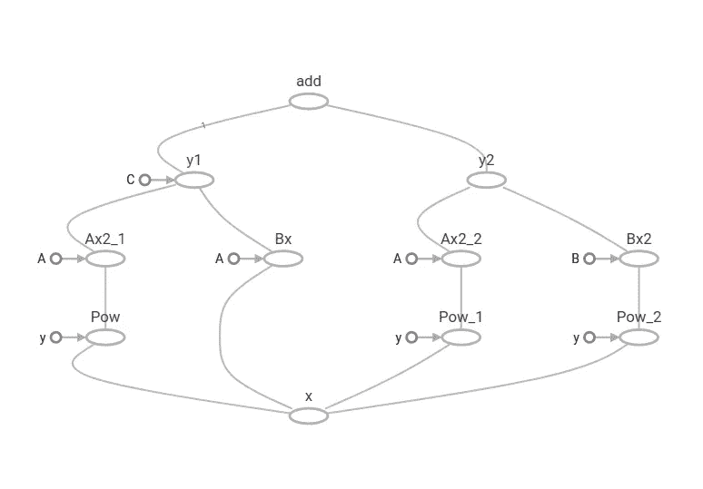

# 用简单的步骤理解张量流程序。

> 原文：<https://towardsdatascience.com/understanding-fundamentals-of-tensorflow-program-and-why-it-is-necessary-94cf5b60e255?source=collection_archive---------4----------------------->

ensorFlow 是一个库，可以应用于所有的机器学习算法，尤其是用神经网络进行深度学习。机器学习就是那些被编写来处理大型数据集以从中发现模式并提取信息的程序。它实际上从数据中学习，以做出准确或接近准确的预测，并更好地自我修正。就像我们希望有人做的那样。图像识别及其增强甚至识别是 ML 的一些应用。

自从我在 TF 上写了第一个故事后，我很高兴看到了可喜的变化。这个故事着重于理解 TensorFlow 程序的一些基础知识。我建议在你的机器上试试这段代码，看看它是如何工作的。

为了能够在不同的问题集上运行相同的模型，我们需要占位符和提要词典。随着我们的张量流程序变得越来越复杂，我们的可视化也需要跟上。回归试图对因果关系进行建模。原因是发生的独立变量，结果取决于原因。线性回归是一种直线回归，它是在对 X 导致 y 的回归进行建模时产生的。原因也称为解释变量

财富假说增加了预期寿命。

对于方程 Y=A+BX。为了找到最佳拟合，ML 算法将为 A 和 b 提供初始值。它将运行回归并找出 A 和 b 的这些值的误差。然后将这些误差反馈到输入中以获得 A 和 b 的新值。线性回归包括找到最佳拟合线

通过最小化最小平方误差来找到最佳拟合线。最佳拟合线是从底部连接到图中数据点的线的长度的平方和最小的线。

## 占位符

TensorFlow 中的占位符类似于变量，您可以使用 tf.placeholder 来声明它。您不必提供初始值，您可以在运行时使用 Session.run 中的 feed_dict 参数来指定它，而在 tf。变量，可以在声明它时提供初始值。

使用占位符的示例程序

```
import tensorflow as tf#setup placeholder using tf.placeholder
x = tf.placeholder(tf.int32, shape=[3],name='x')
'''it is of type integer and it has shape 3 meaning it is a 1D vector with 3 elements in it
we name it x. just create another placeholder y with same dimension. we treat the 
placeholders like we treate constants. '''
y = tf.placeholder(tf.int32, shape=[3],name='y')sum_x = tf.reduce_sum(x,name="sum_x")
prod_y = tf.reduce_prod(y,name="prod_y")
'''we dont know what values x and y holds till we run the graph'''
final_div = tf.div(sum_x,prod_y, nwe give fetches and feed_dict pass into every session.run commandame="final_div")final_mean = tf.reduce_mean([sum_x, prod_y], name="final_mean")sess = tf.Session()print ("sum(x): ", sess.run(sum_x, feed_dict={x: [100,200,300]}))
print ("prod(y): ", sess.run(prod_y, feed_dict={y: [1,2,3]}))writer = tf.summary.FileWriter('./tensorflow_example',sess.graph)writer.close()
sess.close()
```

## 取送字典

我们将 fetches 和 feed_dict 传递给每个 session.run 命令。获取参数指示我们想要计算什么，而提要字典为该计算指定占位符值

```
import tensorflow as tfW = tf.constant([10,100], name='const_W')#these placeholders can hold tensors of any shape
#we will feed these placeholders later
x = tf.placeholder(tf.int32, name='x')
b = tf.placeholder(tf.int32,name='b')#tf.multiply is simple multiplication and not matrix
Wx = tf.multiply(W,x, name="Wx")
y = tf.add(Wx,b,name='y')with tf.Session() as sess:
 '''all the code which require a session is writer here
 here Wx is the fetches parameter. fetches refers to the node of the graph we want to compute
 feed_dict is used to pass the values for the placeholders
 '''
 print( "Intermediate result Wx: ", sess.run(Wx, feed_dict={x: [3,33]}))
 print( "Final results y: ",sess.run(y, feed_dict={x:[5,50],b:[7,9]}))writer = tf.summary.FileWriter('./fetchesAndFeed',sess.graph)
writer.close()
```

## 变量

变量是允许你改变存储在那里的值的结构。监督学习算法在到达最终结论之前执行多次迭代，使用变量来存储随着模型收敛而变化的值。我们的目标是最小化回归线和数据集中的点之间的误差。所以我们在每次迭代中调整回归线来获得新的值。为了得到方程 y=A+Bx 的最佳拟合线，我们不断调整 A 和 b 的值。

变量是可变的张量值，在多次调用 sesssion.run()时保持不变。我用与上面相同的演示代码来解释这一点。

```
import tensorflow as tfW = tf.Variable([2.5,4.0],tf.float32, name='var_W')
#here W is a Variable
x = tf.placeholder(tf.float32, name='x')
b = tf.Variable([5.0,10.0],tf.float32, name='var_b')
#b is also a variable with initial value 5 and 10
y = W * x + b#initialize all variables defined
init = tf.global_variables_initializer()
#global_variable_initializer() will declare all the variable we have initilized
# use with statement to instantiate and assign a session
with tf.Session() as sess:
 sess.run(init)
 #this computation is required to initialize the variable
 print("Final result: Wx + b = ", sess.run(y,feed_dict={x:[10,100]}))
# changing values 
number = tf.Variable(2)
multiplier = tf.Variable(1)init = tf.global_variables_initializer()
result = number.assign(tf.multiply(number,multiplier))with tf.Session() as sess:
 sess.run(init)for i in range(10):
  print("Result number * multiplier = ",sess.run(result))
  print("Increment multiplier, new value = ",sess.run(multiplier.assign_add(1)))
```

## 一个 TensorFlow 程序的多个图形

我们可以在 TensorFlow 程序中显式创建尽可能多的图形。任何 TensorFlow 程序都有一个默认的图形，其中包含了您已经实例化的所有占位符和变量。但是我们可以通过使用 tf.graph()显式地实例化一个图来对图进行逻辑分段。下面的节目可能会解答你的一些疑惑。

```
import tensorflow as tfg1 = tf.Graph()
'''set g1 as default to add tensors to this graph using default methord'''
with g1.as_default():
 with tf.Session() as sess:
  A = tf.constant([5,7],tf.int32, name='A')
  x = tf.placeholder(tf.int32, name='x')
  b = tf.constant([3,4],tf.int32, name='b')y = A * x + bprint( sess.run(y, feed_dict={x: [10,100]}))
  '''to ensure all the tensors and computations are within the graph g1, we use assert'''
  assert y.graph is g1g2 = tf.Graph()with g2.as_default():
 with tf.Session() as sess:
  A = tf.constant([5,7],tf.int32, name='A')
  x = tf.placeholder(tf.int32, name='x')
  y = tf.pow(A,x,name='y')
  print( sess.run(y, feed_dict={x: [3,5]}))
  assert y.graph is g2'''same way you can access defaut graph '''
default_graph = tf.get_default_graph()
with tf.Session() as sess:
 A = tf.constant([5,7],tf.int32, name='A')
 x = tf.placeholder(tf.int32, name='x')
 y = A + x
 print(sess.run(y, feed_dict={x: [3,5]}))assert y.graph is default_graph
```

## 命名范围

TensorBoard 可能是最有用的调试工具，但是随着你的图表尺寸爆炸，你需要一些方法来获得更大的图片中的细节。现在使用 TensorFlow 运行下面的程序，并在 TensorBoard 中查看它的图形

```
import tensorflow as tfA = tf.constant([4], tf.int32, name='A')
B = tf.constant([4], tf.int32, name='B')
C = tf.constant([4], tf.int32, name='C')x = tf.placeholder(tf.int32, name='x')# y = Ax^2 + Bx + C
Ax2_1 = tf.multiply(A, tf.pow(x,2), name="Ax2_1")
Bx = tf.multiply(A,x, name="Bx")
y1 = tf.add_n([Ax2_1, Bx, C], name='y1')# y = Ax^2 + Bx^2
Ax2_2 = tf.multiply(A, tf.pow(x,2),name='Ax2_2')
Bx2 = tf.multiply(B, tf.pow(x,2),name='Bx2')
y2 = tf.add_n([Ax2_2,Bx2],name='y2')y = y1 + y2with tf.Session() as sess:
 print(sess.run(y, feed_dict={x:[10]}))writer = tf.summary.FileWriter('./named_scope',sess.graph)
 writer.close()
```



这张图表看起来真的很复杂！

现在我们可以使用命名作用域在 tensorboard 中组织事物。使用定义名称范围

```
with tf.name_scope("name the scope"):
```

并在这个范围内编写代码。上述程序可以使用如下所示的命名空间进行安排

```
import tensorflow as tfA = tf.constant([4], tf.int32, name='A')
B = tf.constant([4], tf.int32, name='B')
C = tf.constant([4], tf.int32, name='C')x = tf.placeholder(tf.int32, name='x')# y = Ax^2 + Bx + C
with tf.name_scope("Equation1"):
 Ax2_1 = tf.multiply(A, tf.pow(x,2), name="Ax2_1")
 Bx = tf.multiply(A,x, name="Bx")
 y1 = tf.add_n([Ax2_1, Bx, C], name='y1')# y = Ax^2 + Bx^2
with tf.name_scope("Equation2"):
 Ax2_2 = tf.multiply(A, tf.pow(x,2),name='Ax2_2')
 Bx2 = tf.multiply(B, tf.pow(x,2),name='Bx2')
 y2 = tf.add_n([Ax2_2,Bx2],name='y2')with tf.name_scope("final_sum"):
 y = y1 + y2with tf.Session() as sess:
 print(sess.run(y, feed_dict={x:[10]}))writer = tf.summary.FileWriter('./named_scope',sess.graph)
 writer.close()
```


## 将在接下来的故事中继续介绍图像识别。请分享帮助别人找到。欢迎发表评论。