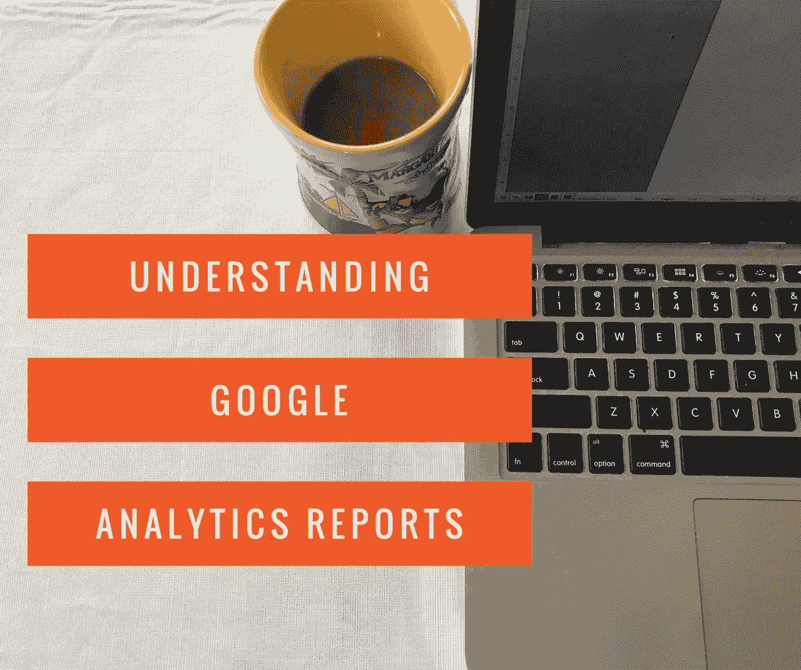
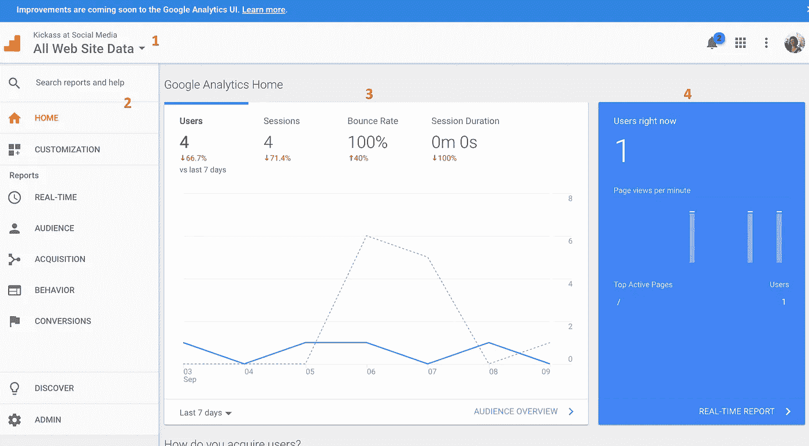
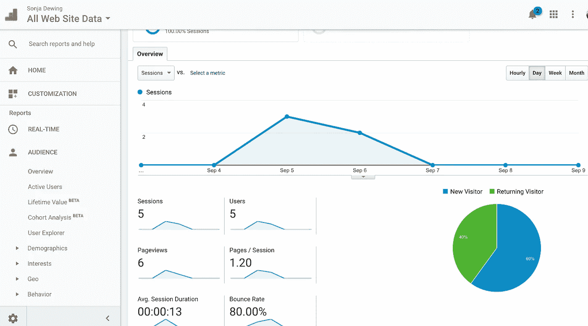
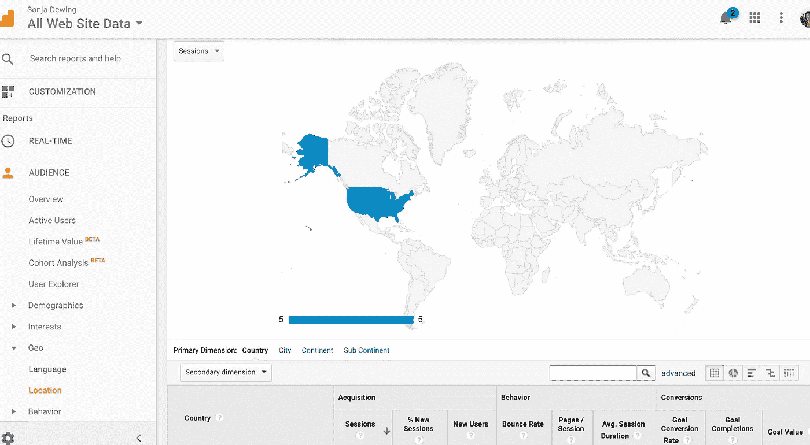
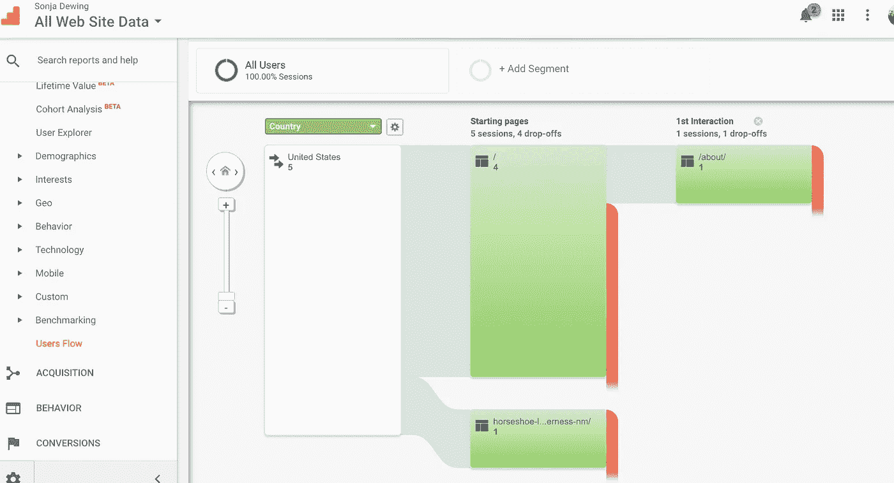
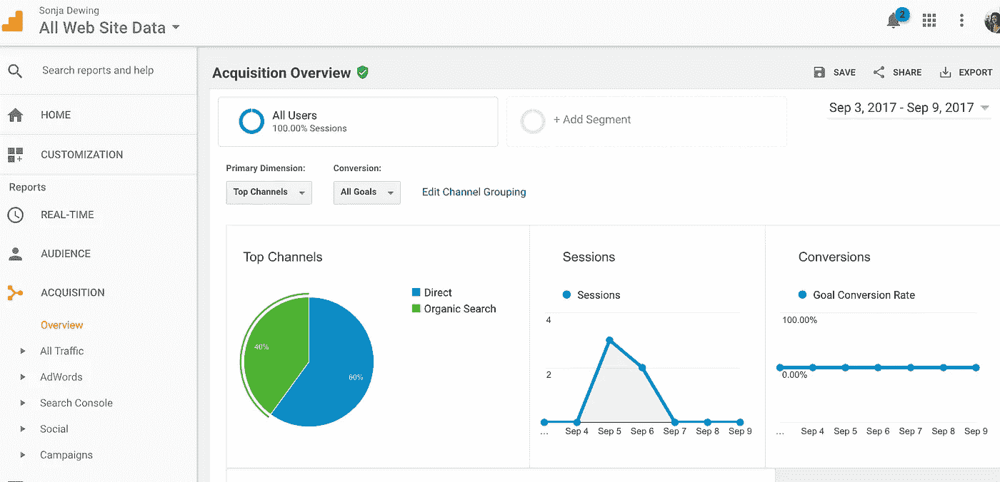
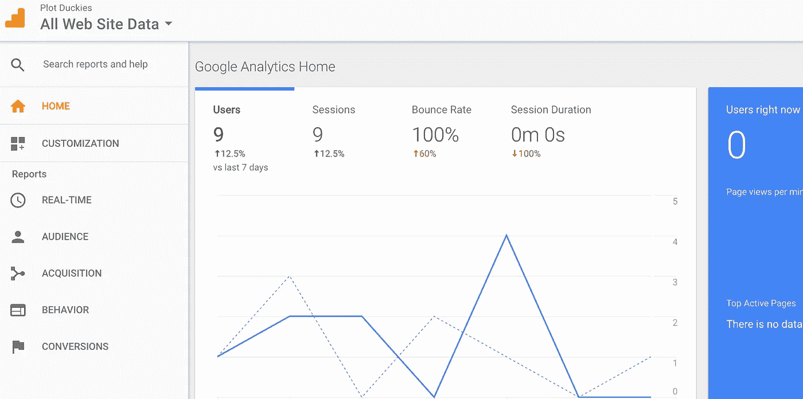
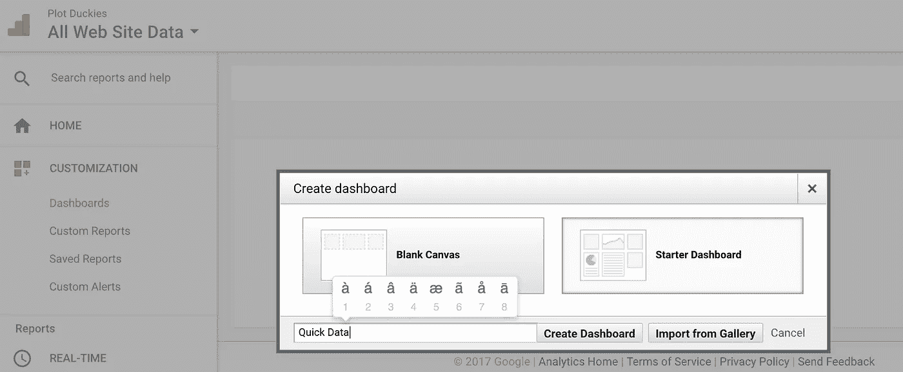
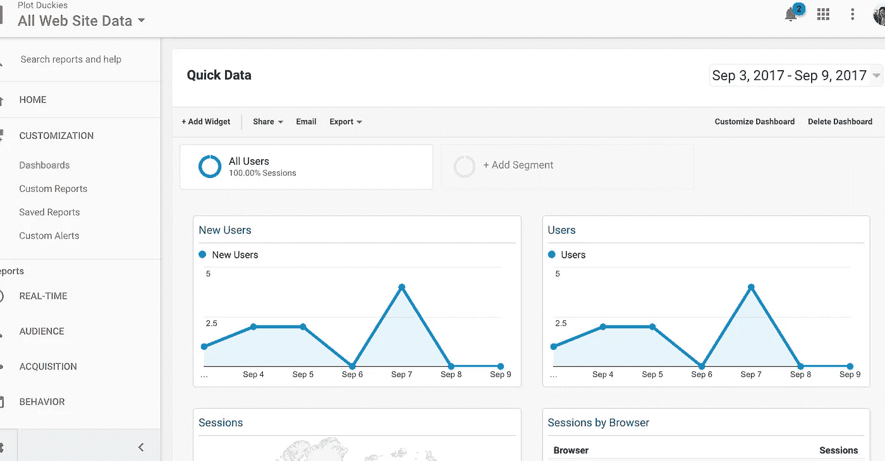

# 了解谷歌分析报告

> 原文：<https://towardsdatascience.com/understanding-google-analytics-reports-585a570bbee2?source=collection_archive---------4----------------------->

到现在为止，你应该已经完成了所有的艰苦工作，从而得到谷歌分析报告。这包括:

来自[博客 1](https://blog.amdeellc.com/4-things-to-know-before-you-start-using-google-for-your-web-analytics)

1.  提出一个测量计划
2.  准备您的网站

来自[博客 2](https://blog.amdeellc.com/track-your-website-statistics-with-google-analytics-tracking-code)

1.  将谷歌分析代码添加到您的网站页面
2.  让人们访问你的网站

现在，让我们深入研究 Google Analytics 报告，了解它们对于我们的目标和衡量计划的意义。请记住，有很多报告对小企业没什么帮助；因此，我们将只讨论重要的问题，以帮助您处理您的测量计划。

# 谷歌分析报告是什么意思

当你进入谷歌分析页面时，你会看到:

1.  你在哪个账户？如果您想更改帐户，请单击下拉箭头并选择您想查看的网站数据。
2.  报告导航
3.  网页上的一些快速数据
4.  你的网站上的一些实时数据(在这种情况下，我目前在我的网站上，所以它把我算作一个当前的访问者。)

让我们谈一谈我们在 3 中看到的数据。谷歌把这些数字放在一起，以帮助我们快速了解你的网站在过去七天里的情况。

在这个例子中，我在社交媒体数据上使用了 Kickass。

*   用户—显示过去 7 天有 9 个用户。即 9 个人访问了该网站。
*   Sessions —显示过去 7 天内有 9 个会话。“会话”是指某人访问网站的每一次独特的时间。如果这个数字是 10 或更多，这意味着同一个人(在过去 7 天访问的 9 个人之一)访问您的网站不止一次。
*   跳出率——这个数字指的是点击离开你的页面的用户的百分比。(我们将在本博客后面对此进行更深入的探讨)
*   会话持续时间——人们在你的网站上花了多少时间。

现在，让我们仔细看看与您的小型企业相关的每个导航选项。这个博客不会详细讨论每一个导航选项，因为很多都不相关。

# 观众

“观众报告”部分深入介绍了访问我们网站的人的详细情况。为了给你一些不同的数据，我用 SonjaDewing.com 作为例子。

这里最重要的细节是:

**概述**:和你在家里看到的信息一样。不同的是，这里的图表向您展示了新访客与回头客的对比。这意味着人们在已经访问过网站之后会再回来——可能是阅读博客，找到你的联系信息，等等。

跳出率:这里我们再次得到跳出率的信息。跳出率基本上是指当人们访问网站时，他们没有找到足够有趣的东西让他们留在那里。发生这种情况的原因有很多，包括:

*   他们是偶然进入你的网站的吗？
*   你网站的某个地方有没有没有意义的参考(例如，一个关于回收的博客有一个关于动物收容所的网站链接，所以访问者不会发现它有用。)
*   你的网站加载时间太长了吗？
*   你的网站在用户的浏览器上工作吗？
*   你的网站上有什么可以留住访客的内容吗(比如博客、活动日程等等)。)

跳出率有多重要？这取决于你网站的目标。如果你网站的目标是让人们注册你的时事通讯，用户可能会继续注册你的时事通讯，然后马上关闭网站。所以跳出率并不重要——只要你注册了时事通讯。

跳出率的理想目标是在 20–40%之间，平均值是 41–55%。

如果你想固定你的跳出率，在那些你能控制的事情上努力，比如:

*   装载速度。如果用户必须等待一个网站加载，他们很可能会关闭它，去别的地方。在这种情况下，请缩小图像尺寸以提高加载速度。{链接到以前的带有大小调整器的 wordpress 插件}，
*   浏览器可以正确加载你的网站。用户来自各种浏览器，如 Chrome、Firefox 和 Internet Explorer。你有没有检查过你的网站在所有这些浏览器中看起来都是正确的？
*   创造能让用户更长久停留的内容。这些内容可以是从博客到图片库的任何内容。

**技术/浏览器:**有趣的是，你可以向下滚动，点击“浏览器”，就可以快速看到人们浏览你的网站时使用的浏览器类型。当我们谈到跳出率时，这一点很重要。

如果 95%的用户都在使用 Chrome，一定要从 Chrome 上测试你的网站，以确保它看起来和工作正常。

**地理/位置**:受众也很重要。如果你关注的是你所在地区的受众，而人们从很远的地方来到你的网站，你可能想要创建更多关于你所在地区的内容，无论是博客还是你的联系页面上的更多信息。

如果你想更详细地了解这些信息，你可以点击地图上的蓝色区域，深入到各个州，等等。

如果你还没有使你的网站移动友好，这个信息是很重要的。如果你有很多人通过手机访问你的网站，你应该确保它适合移动环境。

**用户流量** : 如果你想让用户去某个页面，非常重要。例如，这里我们看到有 4 个人直接进入了主页，只有 1 个人进入了“关于”页面。1 个人直接去了一篇关于马蹄湖的博文。

如果我想让人们停留在某个页面上，我会在我的主页上做些改变。即。放一个大链接到我的博客或其他页面信息。

# 获得物ˌ获得

人们是如何找到你的网站的？

**概述**:概述将展示人们如何找到你的网站。

有机发现意味着他们通过链接到你的网站的另一个网站、广告或在谷歌等浏览器上的搜索找到了你的网站。

*直接搜索*意味着他们知道你的网址并输入到他们的网址中。

这对你意味着什么？有有机的流量是很好的，特别是如果流量来自搜索——这意味着他们通过你的搜索引擎优化(SEO)找到你的信息。

**Source/Medium** :转到 Source/Medium 会告诉你那些有机搜索来自哪里。

其余的呢？事实上，对于小型企业的测量计划，您需要了解的并不多。

## 根据报告和你的计划改进你的网站

具体来说一下你的测量计划。

我在[博客 1](https://blog.amdeellc.com/4-things-to-know-before-you-start-using-google-for-your-web-analytics) 中使用的例子

1.  [剧情小鸭](http://www.plotduckies.com/)。这家公司致力于帮助美国的作家更有创造力。

他们的网站业务目标是:

*   通过在网站上分享有用的信息来提高品牌知名度，在年底前增加网站的流量。
*   你可以看到有流量(最近 7 天 9)但跳出率很高。在这种情况下，这很可能是因为在这些博客中使用该网站作为例子。你不是网站的目标市场，所以你很快离开。
*   我会做什么来修复高跳出率:1。开始为目标市场添加更多有帮助的博客。2.开始在社交媒体上分享这些博客来吸引访问者。3.探究跳出率高的任何其他原因(如上文跳出率中所述)。
*   每次我对网站、博客等做出改变。我会回到这里，看看我的访问者数量是否上升，跳出率是否下降，并检查行为，看看观众/用户流是否去了我想要的地方。*每次都做些小改动，看看你的数字是如何随着更新而变化的。*
*   到月底，通过 50 个新的电子邮件/时事通讯注册来提高品牌知名度。

这个数字你不需要从谷歌分析中得到，你可以从注册人数中看到。但是如果你没有从你的网站上直接获得任何注册，你会从你的时事通讯注册中知道，你会想要让你的注册页面容易被找到。

1.  [在社交媒体上表现出色](http://www.kickassatsocialmedia.com/)。这家公司专注于向阿尔伯克基的小企业教授社交媒体。他们的网站业务目标:

*   通过销售更多 9 月份下一场活动的门票来增加收入。
*   收入数字将来自门票销售，但如果你得到了很多跳出率，这意味着没有人会花时间阅读你的活动。在这种情况下，我会围绕活动写一些博客(活动空间、活动主持人、从上次活动中吸取的教训、活动所在的城市等)。)这种方式增加了搜索引擎优化，让人们在网站上停留的时间更长一些。

## 创建自定义仪表板

如果你进入谷歌分析，只需要某些信息，创建一个仪表板会很有帮助。

谷歌已经有了一个入门仪表板，它非常有助于将所有东西放在一起。

1.  点击定制
2.  点击仪表板
3.  点击创建

从上图可以看出，Google 给了你一个选项，让你从一个空白的仪表板开始，或者从一个初学者仪表板开始。Starter Dashboard 实际上非常有用。

1.  点击启动仪表板
2.  为您的新仪表板键入一个名称(我使用了快速查看)
3.  点击创建仪表板

现在，您已经将数据分组到一个非常有用的页面上。要更改任何数据，请选择小部件上方的编辑按钮(小部件是页面上每个图形数据的引用)。要删除任何小部件，您可以选择每个图形右上角的关闭按钮。

在本例中，我将向下滚动并删除目标和收入的小部件，因为这些信息并不重要。

如果您想要添加新的小部件，请在页面的左上角选择+添加小部件。这将给出一个对话框，您可以在其中选择任何可用的小部件。然而，我不打算添加任何东西，因为这已经给了我需要一目了然的信息。

另外，那些我想添加的东西，比如有机/直接搜索，我不能添加到仪表板上。所以，我必须点击这些信息才能看到数据。

曾经有一种方法可以找到一份报告，并将其添加到您的仪表板上，但由于谷歌分析正在经历一些变化，目前还不可用。

这就是谷歌分析。当你了解这些报告时，事情就变得很简单了。留意那些数据，记得记录你做了什么。祝您的测量计划好运！

## 如果你喜欢这篇文章，请分享和推荐它，这样其他人就可以找到它！

# 在你走之前…

如果你喜欢这篇文章，你将会喜欢上《阿姆迪周刊》。这是我们免费的每周文摘。[今天就订阅！](http://marketing.amdeellc.com/weekly-subscription-signup)