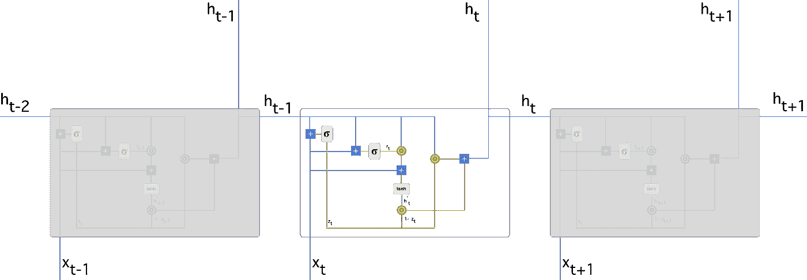
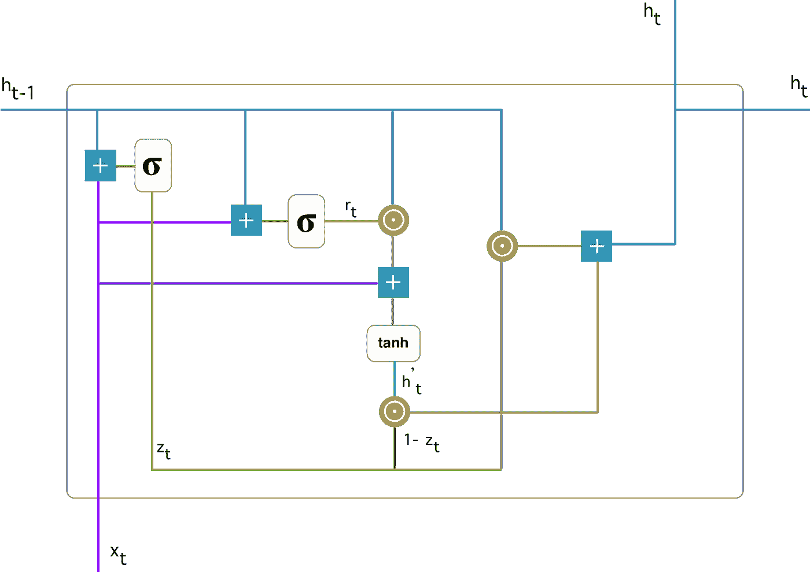
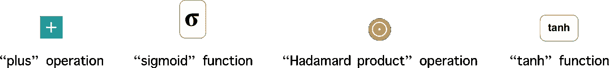
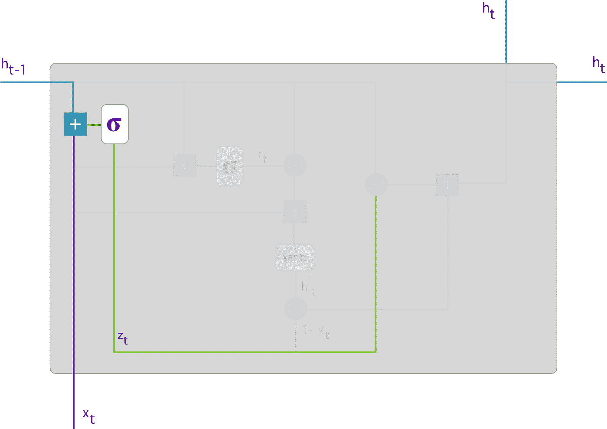
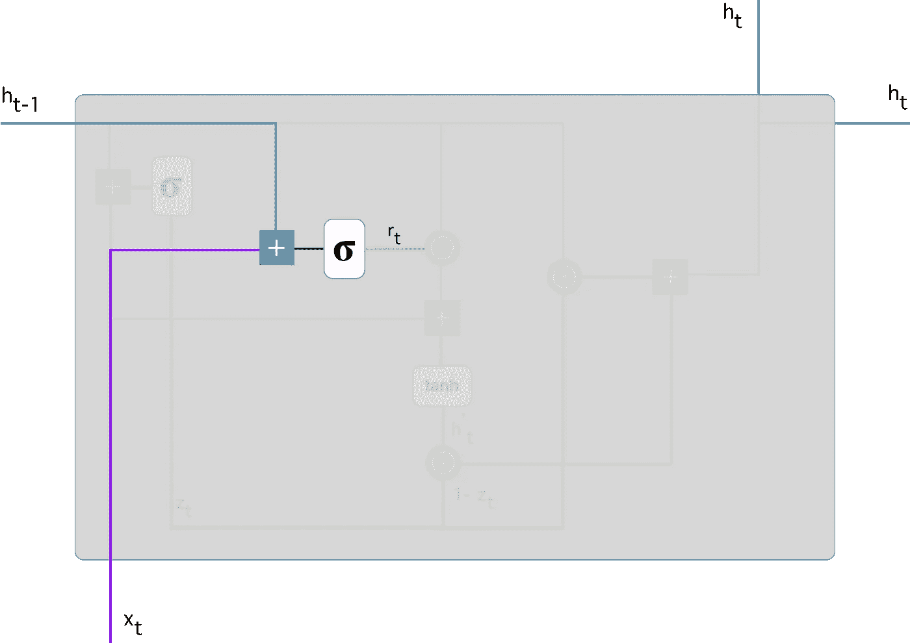
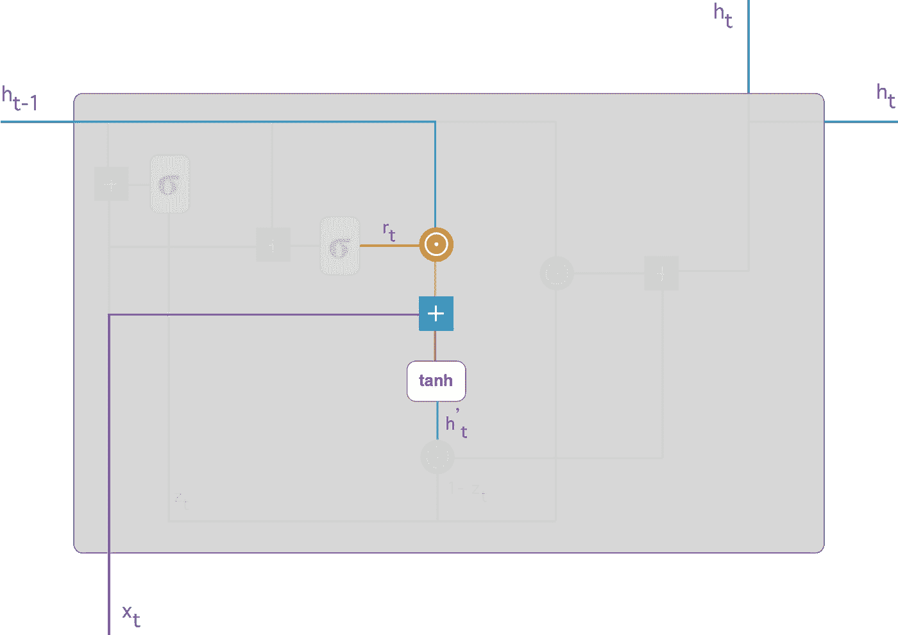
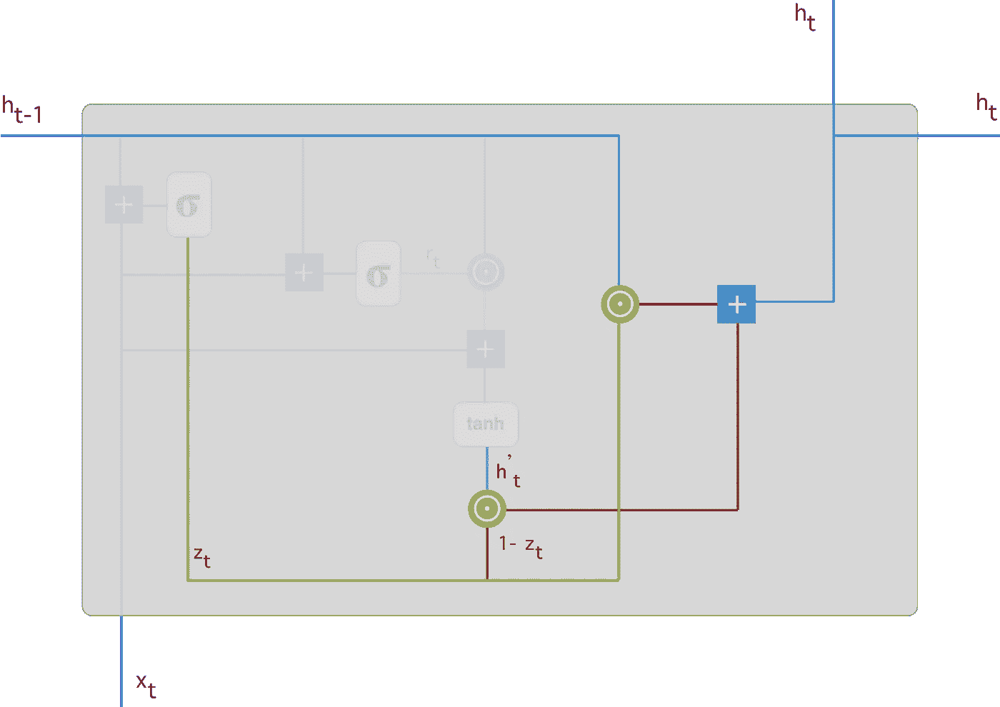

# 了解 GRU 网络

> 原文：<https://towardsdatascience.com/understanding-gru-networks-2ef37df6c9be?source=collection_archive---------0----------------------->

[https://pixabay.com](https://pixabay.com)

在本文中，我将尝试对一种真正令人着迷的神经网络类型给出一个相当简单易懂的解释。由 [Cho 等人](https://arxiv.org/pdf/1406.1078v3.pdf)在 2014 年提出的 GRU(门控递归单元)旨在解决标准递归神经网络中的**消失梯度问题**。GRU 也可以被认为是 LSTM 的变体，因为两者设计相似，在某些情况下，产生同样优秀的结果。如果你不熟悉递归神经网络，我推荐阅读[我的简介](https://medium.com/@simeon.kostadinoff/learn-how-recurrent-neural-networks-work-84e975feaaf7)。为了更好地了解 LSTM，许多人推荐克里斯托弗·奥拉的文章。我还想补充一下这篇论文，它清楚地区分了 GRU 和 LSTM。

## GRUs 是如何工作的？

如上所述，GRUs 是标准递归神经网络的改进版本。但是是什么让它们如此特别和有效呢？

为了解决标准 RNN 的消失梯度问题，GRU 使用所谓的**更新门和**复位门。基本上，这是决定什么信息应该被传递到输出的两个向量。它们的特别之处在于，它们可以被训练来保留很久以前的信息，而不会随着时间的推移而消失，也不会删除与预测无关的信息。

为了解释这一过程背后的数学原理，我们将考察以下递归神经网络中的一个单元:

Recurrent neural network with Gated Recurrent Unit

以下是那首单曲《GRU》的更详细版本:

Gated Recurrent Unit

首先，让我们介绍一下符号:

如果你不熟悉以上术语，我推荐你看这些关于[“sigmoid”和“tanh”功能](https://www.youtube.com/watch?v=9vB5nzrL4hY)和[“hada mard product”操作](https://www.youtube.com/watch?v=2GPZlRVhQWY)的教程。

## #1.更新门

我们从使用以下公式计算时间步长 t 的**更新门 z_t 开始:**

当 *x_t* 插入网元时，乘以自身重量 *W(z)* 。对于 *h_(t-1)* 来说也是如此，它保存先前 *t-1* 单元的信息，并乘以其自身的权重 *U(z)。*将两个结果相加，并应用 sigmoid 激活函数将结果压缩在 0 和 1 之间。按照上面的模式，我们有:

**更新门帮助模型确定有多少过去的信息(来自以前的时间步骤)需要传递给未来。**这非常强大，因为模型可以决定复制过去的所有信息，并消除消失梯度问题的风险。稍后我们将看到更新门的用法。现在记住 *z_t* 的公式。

## #2.复位门

本质上，**这个门是用来从模型中决定有多少过去的信息要忘记**。为了计算它，我们使用:

该公式与更新门的公式相同。区别在于重量和门的用途，稍后会看到。下图显示了重置门的位置:

像以前一样，我们插入 *h_(t-1) —蓝线*和 *x_t —紫线*，将它们与相应的权重相乘，将结果求和并应用 sigmoid 函数。

## #3.当前存储内容

让我们看看这些门究竟会如何影响最终输出。首先，我们从复位门的使用开始。我们引入了一种新的存储内容，它将使用复位门来存储过去的相关信息。其计算方法如下:

1.  将输入 *x_t* 乘以权重 *W* 并将 *h_(t-1)* 乘以权重 *U.*
2.  计算复位门 *r_t* 和 *Uh_(t-1)之间的 Hadamard(逐元素)乘积。*这将决定从先前的时间步骤中删除什么。假设我们有一个情感分析问题，要从一个人写的评论中判断他对一本书的看法。正文以“这是一本奇幻的书，它阐释了……”开始，几段后以“我不太喜欢这本书，因为我认为它捕捉了太多的细节”结束。要确定这本书的总体满意度，我们只需要最后一部分的评论。在这种情况下，随着神经网络接近文本的结尾，它将学习将 *r_t* 向量赋值为接近 0，洗去过去，只关注最后的句子。
3.  总结第一步和第二步的结果。
4.  应用非线性激活功能 *tanh* 。

你可以清楚地看到这里的步骤:

我们对 *h_(t-1) —蓝线*和 *r_t —橙线*进行逐元素乘法，然后将*结果—粉线*与输入 *x_t —紫线*相加。最后用 *tanh* 产生*h’_ t—亮绿线*。

## #4.当前时间步的最终记忆

作为最后一步，网络需要计算 *h_t* —保存当前单元信息的向量，并将其传递给网络。为此，需要更新门。它决定了从当前内存内容中收集什么— *h'_t* ，从前面的步骤中收集什么— *h_(t-1)* 。这是按如下方式完成的:

1.  对更新门 *z_t* 和 *h_(t-1)应用逐元素乘法。*
2.  对 *(1-z_t)* 和 *h'_t.* 应用逐元素乘法
3.  将步骤 1 和步骤 2 的结果相加。

让我们举一个关于书评的例子。这一次，最相关的信息被定位在正文的开头。该模型可以学习将向量 *z_t* 设置为接近 1，并保留大部分先前信息。由于 *z_t* 在这个时间步将接近于 1， *1-z_t* 将接近于 0，这将忽略当前内容的大部分(在这种情况下是解释书籍情节的评论的最后部分),这与我们的预测无关。

下面是一个强调上述等式的例子:

接下来，您可以看到如何使用 *z_t —绿线*来计算 *1-z_t* ，它与*h’_ t—亮绿线*一起产生结果*暗红线*。 *z_t* 也与 *h_(t-1) —蓝线*一起用于逐元素乘法。最后， *h_t —蓝线*是对应于*亮红线和暗红线*的输出相加的结果。

现在，您可以看到 gru 如何使用它们的更新和重置门来存储和过滤信息。这消除了消失梯度问题，因为模型不是每次都洗去新的输入，而是保留相关信息，并将其传递给网络的下一个时间步骤。如果仔细训练，他们甚至可以在复杂的情况下表现得非常好。

我希望这篇文章能让你更好地理解这个被称为 GRU 的最先进的深度学习模型。

> 更多 AI 内容，[关注我 LinkedIn](https://www.linkedin.com/in/simeonkostadinov/) 。

## 感谢您的阅读。如果你喜欢这篇文章，给它一些掌声👏。希望你有一个伟大的一天！