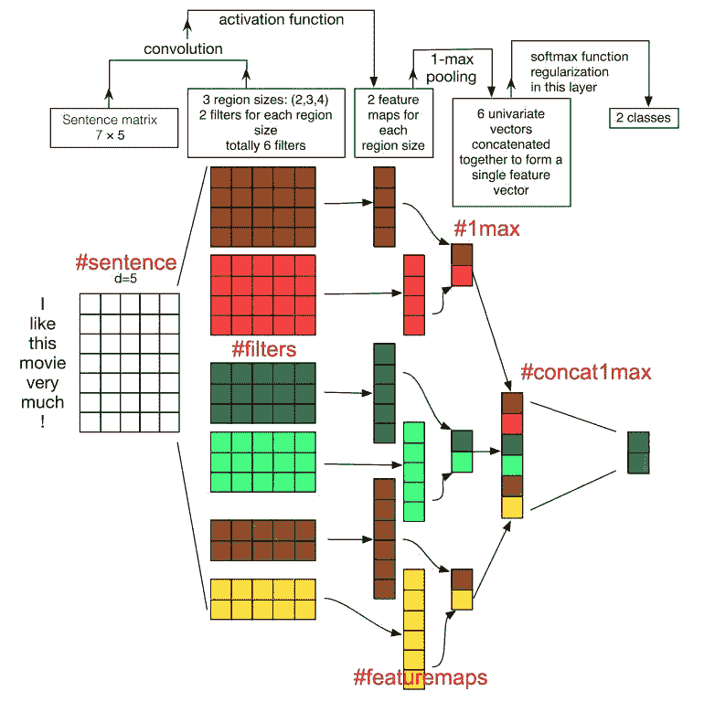
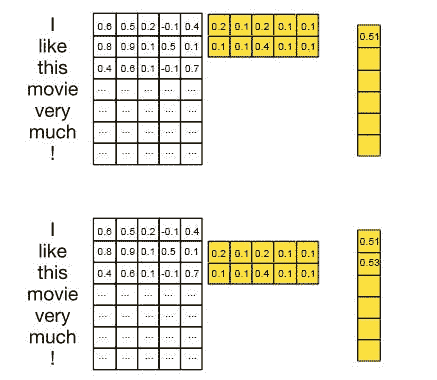

# 理解卷积神经网络(CNN)如何使用单词嵌入执行文本分类

> 原文：<https://towardsdatascience.com/understanding-how-convolutional-neural-network-cnn-perform-text-classification-with-word-d2ee64b9dd0b?source=collection_archive---------2----------------------->

CNN 已经在各种文本分类任务中取得了成功。在[1]中，作者展示了一个简单的 CNN，具有很少的超参数调整和静态向量，在多个基准上取得了优异的结果——在 7 个任务中的 4 个上改进了现有技术。

然而，当学习将 CNN 应用于单词嵌入时，跟踪矩阵的维度可能会令人困惑。这篇短文的目的是简单地跟踪这些维度，并理解 CNN 是如何进行文本分类的。我们将在一个 7 个单词的句子上使用一层 CNN，单词嵌入为 5 维——这是一个帮助理解 CNN 的玩具示例。所有的例子都来自[2]。

**设置**

Above figure is from [2], with *#hash-tags* added to aid discussion. Quoting the original caption here, to be discussed later. *“Figure 1: Illustration of a CNN architecture for sentence classification. We depict three filter region sizes: 2,3,4, each of which has 2 filters. Filters perform convolutions on the sentence matrix and generate (variable-length) feature maps; 1-max pooling is performed over each map, i.e., the largest number from each feature map is recorded. Thus, a univariate feature vector is generated from all six maps, and these 6 features are concatenated to form a feature vector for the penultimate layer. The final softmax later then receives this feature vector as input and uses it to classify the sentence; here we assume binary classification and hence depict two possible output states.”*

**#句子**

例子是“我很喜欢这部电影！”，这里有 6 个单词，感叹号被当作一个单词来处理-一些研究人员以不同的方式处理，忽略感叹号-句子中总共有 7 个单词。作者选择 5 作为单词向量的维数。我们让 *s* 表示句子的长度，而 *d* 表示单词向量的维数，因此我们现在有一个形状为 *s* x *d* 的句子矩阵，即 7×5。

**#过滤器**

CNN 的一个令人满意的特性是它保持了计算机视觉中的 2D 空间方向。文字和图片一样，都是有方向性的。文本不是二维的，而是一维结构，其中单词序列很重要。我们还记得，示例中的所有单词都被一个 5 维的单词向量替换，因此我们固定过滤器的一个维度来匹配单词向量(5)并改变区域大小， *h* 。区域大小指的是要过滤的句子矩阵中代表单词的行数。

在图中，#filters 是过滤器的说明，而不是过滤器从句子矩阵中过滤出来的内容，下一段将使这种区别更加清楚。这里，作者选择使用 6 个过滤器——2 个互补的过滤器来考虑(2，3，4)个单词。

**#功能地图**

在本节中，我们将逐步介绍 CNN 如何执行卷积/过滤。为了清楚起见，我在句子矩阵和过滤器矩阵中填入了一些数字。

The action of the 2-word filter on the sentence matrix.

首先，由 2×5 黄色矩阵 **w** 表示的双字过滤器，覆盖在“I”和“like”的字向量上。接下来，它对其所有 2 x 5 元素执行元素式乘积，然后将它们相加并获得一个数字(0.6 x 0.2 + 0.5 x 0.1 + … + 0.1 x 0.1 = 0.51)。0.51 被记录为该滤波器输出序列的第一个元素 **o** 。然后，过滤器向下移动 1 个单词并覆盖单词向量“like”和“this ”,并执行相同的操作以获得 0.53。因此， **o** 将具有(*s*–*h*+1 x 1)的形状，在本例中为(7–2+1 x 1)

为了获得特征图， **c** ，我们添加一个偏置项(一个标量，即形状 1×1)并应用一个激活函数(例如 [ReLU](https://en.wikipedia.org/wiki/Rectifier_(neural_networks)) )。这给了我们 **c，**与**o**(*s*–*h*+1 x 1)相同的形状。

**# 1 最大**

请注意， **c** 的维数取决于 *s* 和 *h* ，换句话说，它会随着不同长度的句子和不同区域大小的过滤器而变化。为了解决这个问题，作者采用了 1-max 池函数，并从每个 **c** 向量中提取最大数。

**#concat1max**

在 1-max 池化之后，我们确定具有 6 个元素的固定长度向量(=过滤器数量=每个区域大小的过滤器数量(2) x 考虑的区域大小的数量(3))。这个固定长度的向量然后可以被馈送到 softmax(全连接)层以执行分类。作为学习的一部分，来自分类的误差然后被反向传播回以下参数:

*   产生 **o** 的 **w** 矩阵
*   添加到 **o** 以产生 **c** 的偏置项
*   单词向量(可选，使用验证性能来决定)

**结论**

这篇短文通过关注每个中间步骤中矩阵的维度，阐明了 CNN 在单词嵌入方面的工作。

**参考文献**

1.  用于句子分类的卷积神经网络。2014;
2.  用于句子分类的卷积神经网络的敏感性分析(和实践者指南)。arXiv 预印本 arXiv:151003820。2015;PMID: 463165