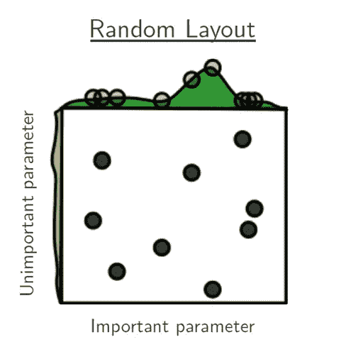
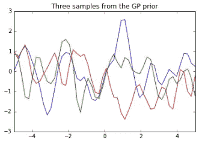

# 理解超参数及其优化技术

> 原文：<https://towardsdatascience.com/understanding-hyperparameters-and-its-optimisation-techniques-f0debba07568?source=collection_archive---------3----------------------->

Figure 1: [https://pixabay.com/en/thoughts-think-psyche-psychology-551263/](https://pixabay.com/en/thoughts-think-psyche-psychology-551263/)

什么是超参数？
在统计学中，超参数是来自先验分布的参数；它在数据被观察到之前捕捉先验信念。

在任何机器学习算法中，这些参数都需要在训练模型之前进行初始化。

**模型参数对超参数**

***模型参数*** 是分类器或其他 ML 模型在训练过程中将自行学习的训练数据的属性。举个例子，

*   权重和偏差
*   决策树中的分割点

Figure 2: Hyperparameters vs model parameters → [Source](https://www.slideshare.net/AliceZheng3/evaluating-machine-learning-models-a-beginners-guide)

***模型超参数*** 是管理整个训练过程的属性。以下是在训练模型之前通常配置的变量。

*   学习率
*   时代数
*   隐藏层
*   隐藏单元
*   激活功能

**为什么超参数必不可少？**

> 超参数非常重要，因为它们直接控制训练算法的行为，并对正在训练的模型的性能产生重大影响。
> 
> “一个好的超参数选择，真的可以让一个算法大放异彩”。

选择合适的超参数在我们的神经网络体系结构的成功中起着至关重要的作用。因为它对学习模型有巨大的影响。例如，如果学习率太低，模型将错过数据中的重要模式。如果高，可能会有碰撞。

*选择好的超参数有两个好处:*

*   有效地搜索可能的超参数空间
*   易于管理超参数调整的大量实验。

**超参数优化技术**

> 机器学习中寻找最优超参数的过程称为超参数优化。

常见算法包括:

*   网格搜索
*   随机搜索
*   贝叶斯优化

***网格搜索***

网格搜索是实现超参数的一种非常传统的技术。它强力破解所有组合。网格搜索需要创建两组超参数。

1.  学习率
2.  层数

网格搜索通过使用两组超参数(学习速率和层数)为所有组合训练算法，并使用“[交叉验证](https://en.wikipedia.org/wiki/Cross-validation_(statistics))技术测量性能。这种验证技术保证了我们的训练模型从数据集中获得了大多数模式。使用“ [*K 重交叉验证*](https://en.wikipedia.org/wiki/Cross-validation_(statistics)#k-fold_cross-validation) 进行验证的最佳方法之一，这有助于为模型的训练和验证提供充足的数据。

Figure 3: Grid Search → [Source](http://jmlr.csail.mit.edu/papers/volume13/bergstra12a/bergstra12a.pdf)

网格搜索方法是一种使用起来更简单的算法，但是如果数据具有被称为 [*维数灾难*](https://en.wikipedia.org/wiki/Curse_of_dimensionality) *的高维空间，它就会受到影响。*

***随机搜索***

随机对搜索空间进行采样，并根据指定的概率分布计算集合。例如，我们可以检查 1000 个随机参数，而不是试图检查所有 100，000 个样本。

Figure 4: Random Search → [Source](http://jmlr.csail.mit.edu/papers/volume13/bergstra12a/bergstra12a.pdf)

然而，使用随机搜索算法的缺点是，它不使用来自先前实验的信息来选择下一组，并且也很难预测下一组实验。

**贝叶斯优化**

超参数设置使模型在验证集上的性能最大化。机器学习算法经常需要微调模型超参数。不幸的是，这种调整通常被称为“*黑函数*”，因为由于函数的导数未知，它不能被写入公式。

更吸引人的优化和微调超参数的方法是 ***通过使用贝叶斯优化算法***启用自动模型调整方法。用于逼近目标函数的模型被称为[代理模型](https://en.wikipedia.org/wiki/Surrogate_model)。*用于贝叶斯优化的流行代理模型是高斯过程(GP)* 。贝叶斯优化通常通过假设从高斯过程(GP)中采样未知函数来工作，并在进行观察时保持该函数的后验分布。

执行贝叶斯优化时，必须做出两个主要选择。

1.  选择先验函数，它将表达关于被优化函数的假设。为此，我们选择 ***高斯过程*** 先验
2.  接下来，我们必须选择一个 ***采集函数*** ，用于从模型后验构建一个效用函数，允许我们确定下一个要评估的点。

***高斯过程***

高斯过程定义了函数的先验分布，一旦我们看到一些数据，它可以转换成函数的后验分布。高斯过程使用协方差矩阵来确保值非常接近。协方差矩阵以及输出期望值的均值函数定义了高斯过程。

> 1.高斯过程将作为 ***的先验*** 用于贝叶斯推理
> 2。计算*的后验概率在于它可以用来对看不见的测试用例进行预测。*

**

*Figure 5: Gaussian Process **prior** distribution → [Source](http://katbailey.github.io/post/gaussian-processes-for-dummies/)*

**

*Figure 6: Gaussian Process **posterior** distribution by applying covariance matrix → [Source](http://katbailey.github.io/post/gaussian-processes-for-dummies/)*

****采集功能****

*通过采集功能将采样数据引入搜索空间。这有助于最大化采集函数以确定下一个采样点。常见的采集功能有*

*   *最大改善概率(MPI)*
*   *预期改善*
*   *置信上限(UCB)*

***预期改善(EI)** 功能似乎是一个受欢迎的功能。它被定义为*

*EI(x)=𝔼[max{0,ƒ(x)−ƒ(x̂ )}]*

*其中ƒ(x̂)是超参数的当前最佳集合。最大化超参数将改善*的性能。**

1.  *当损失的后验期望值 *(x)* 高于当前最佳值ƒ(x̂时，EI 为高)*
2.  *当围绕点 **x** x 的不确定性σ( **x** )σ(x)高时，EI 高。*

***概要:***

*   *超参数调谐是一门艺术，也就是我们常说的“黑函数”。选择合适的超参数将使算法发光并产生最大的精确度*
*   *超参数优化技术大多使用任何一种优化算法*

1.  *网格搜索*
2.  *随机搜索*
3.  *贝叶斯优化*

*   *贝叶斯优化使用高斯过程(GP)函数来获得后验函数，以基于先验函数进行预测*
*   *采集功能有助于最大化和确定下一个采样点。*