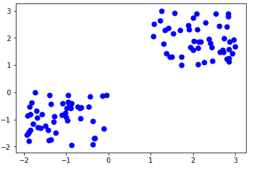
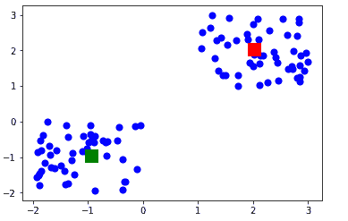

# 理解机器学习中的 K-均值聚类

> 原文：<https://towardsdatascience.com/understanding-k-means-clustering-in-machine-learning-6a6e67336aa1?source=collection_archive---------0----------------------->

K-means 聚类是最简单和最流行的无监督机器学习算法之一。

通常，无监督算法仅使用输入向量从数据集进行推断，而不参考已知或标记的结果。

AndreyBu 拥有超过 5 年的机器学习经验，目前正在向人们传授他的技能，他说“K-means 的目标很简单:将相似的数据点组合在一起，并发现潜在的模式。为了实现这个目标，K-means 在数据集中寻找固定数量( *k* )的聚类

聚类是指由于某些相似性而聚集在一起的数据点的集合。

您将定义一个目标数 *k* ，它指的是您在数据集中需要的质心数。质心是代表群集中心的虚拟或真实位置。

通过减少类内平方和，将每个数据点分配给每个类。

换句话说，K-means 算法识别 *k* 个质心，然后将每个数据点分配到最近的簇，同时保持质心尽可能小。

K-means 中的*表示*是指数据的平均值；也就是求质心。

# **K 均值算法的工作原理**

为了处理学习数据，数据挖掘中的 K-means 算法从第一组随机选择的质心开始，这些质心用作每个聚类的起始点，然后执行迭代(重复)计算以优化质心的位置

当出现以下任一情况时，它会停止创建和优化集群:

*   质心已经稳定，因为聚类成功，所以它们的值没有变化。
*   已达到定义的迭代次数。

# **K-means 算法例题**

让我们看看 K-means 机器学习算法如何使用 Python 编程语言工作的步骤。

我们将使用 Scikit-learn 库和一些随机数据来说明 K-means 聚类的简单解释。

**步骤 1:导入库**

```
import pandas as pdimport numpy as npimport matplotlib.pyplot as pltfrom sklearn.cluster import KMeans%matplotlib inline
```

从上面的代码中可以看出，我们将在项目中导入以下库:

*   熊猫用于阅读和书写电子表格
*   用于执行有效计算的数字
*   用于数据可视化的 Matplotlib

**第二步:生成随机数据**

下面是在二维空间中生成一些随机数据的代码:

```
X= -2 * np.random.rand(100,2)X1 = 1 + 2 * np.random.rand(50,2)X[50:100, :] = X1plt.scatter(X[ : , 0], X[ :, 1], s = 50, c = ‘b’)plt.show()
```

总共产生了 100 个数据点，并分成两组，每组 50 个点。

以下是数据在二维空间中的显示方式:



**第三步:使用 Scikit-Learn**

我们将使用 [Scikit-learn 库](http://scikit-learn.org/stable/)中的一些可用函数来处理随机生成的数据。

代码如下:

```
from sklearn.cluster import KMeansKmean = KMeans(n_clusters=2)Kmean.fit(X)
```

在这种情况下，我们任意给 *k* (n_clusters)一个任意值 2。

下面是我们运行代码时得到的 K-means 参数的输出:

```
KMeans(algorithm=’auto’, copy_x=True, init=’k-means++’, max_iter=300
 n_clusters=2, n_init=10, n_jobs=1, precompute_distances=’auto’,
 random_state=None, tol=0.0001, verbose=0)
```

**第四步:寻找质心**

下面是查找聚类中心的代码:

```
Kmean.cluster_centers_
```

以下是质心值的结果:

```
array([[-0.94665068, -0.97138368],
 [ 2.01559419, 2.02597093]])
```

让我们显示集群质心(使用绿色和红色)。

```
plt.scatter(X[ : , 0], X[ : , 1], s =50, c=’b’)plt.scatter(-0.94665068, -0.97138368, s=200, c=’g’, marker=’s’)plt.scatter(2.01559419, 2.02597093, s=200, c=’r’, marker=’s’)plt.show()
```

以下是输出:



**第五步:测试算法**

下面是获取 K 均值聚类示例数据集的 labels 属性的代码；也就是说，如何将数据点分类到两个集群中。

```
Kmean.labels_
```

下面是运行上述 K-means 算法代码的结果:

```
array([0, 0, 0, 0, 0, 0, 0, 0, 0, 0, 0, 0, 0, 0, 0, 0, 0, 0, 0, 0, 0, 0,
 0, 0, 0, 0, 0, 0, 0, 0, 0, 0, 0, 0, 0, 0, 0, 0, 0, 0, 0, 0, 0, 0,
 0, 0, 0, 0, 0, 0, 1, 1, 1, 1, 1, 1, 1, 1, 1, 1, 1, 1, 1, 1, 1, 1,
 1, 1, 1, 1, 1, 1, 1, 1, 1, 1, 1, 1, 1, 1, 1, 1, 1, 1, 1, 1, 1, 1,
 1, 1, 1, 1, 1, 1, 1, 1, 1, 1, 1, 1])
```

正如您在上面看到的，50 个数据点属于 **0** 簇，而其余的属于 **1** 簇。

例如，让我们使用下面的代码来预测数据点的聚类:

```
sample_test=np.array([-3.0,-3.0])second_test=sample_test.reshape(1, -1)Kmean.predict(second_test)
```

结果如下:

```
array([0])
```

显示测试数据点属于 **0** (绿色质心)簇。

# **包装**

以下是 Python 中完整的 K-means 聚类算法代码:

```
import pandas as pdimport numpy as npimport matplotlib.pyplot as pltfrom sklearn.cluster import KMeans%matplotlib inlineX= -2 * np.random.rand(100,2)X1 = 1 + 2 * np.random.rand(50,2)X[50:100, :] = X1plt.scatter(X[ : , 0], X[ :, 1], s = 50, c = ‘b’)plt.show()from sklearn.cluster import KMeansKmean = KMeans(n_clusters=2)Kmean.fit(X)Kmean.cluster_centers_plt.scatter(X[ : , 0], X[ : , 1], s =50, c=’b’)plt.scatter(-0.94665068, -0.97138368, s=200, c=’g’, marker=’s’)plt.scatter(2.01559419, 2.02597093, s=200, c=’r’, marker=’s’)plt.show()Kmean.labels_sample_test=np.array([-3.0,-3.0])second_test=sample_test.reshape(1, -1)Kmean.predict(second_test)
```

k-均值聚类是一种广泛使用的数据聚类分析技术。

这很容易理解，尤其是如果你使用 K-means 聚类教程来加速你的学习。此外，它可以快速提供培训结果。

但是，它的性能通常不如其他复杂的聚类技术有竞争力，因为数据中的微小变化会导致很大的差异。

此外，聚类被假设为球形且大小均匀，这可能会降低 K-means 聚类 Python 结果的准确性。

在机器学习中使用 K-means 聚类有什么经验？

请在下面分享你的评论。