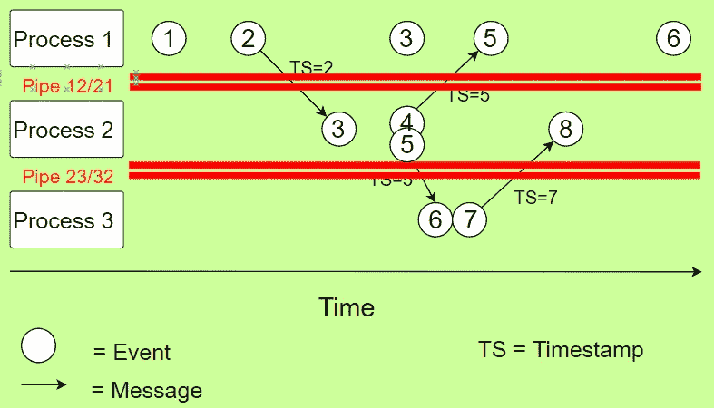
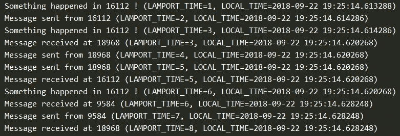
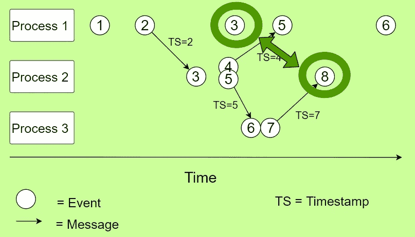
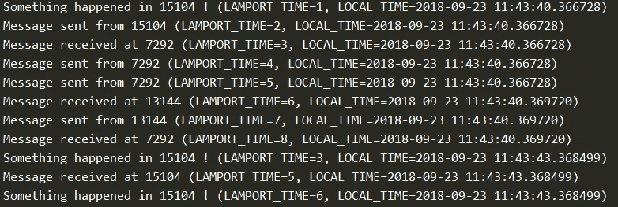
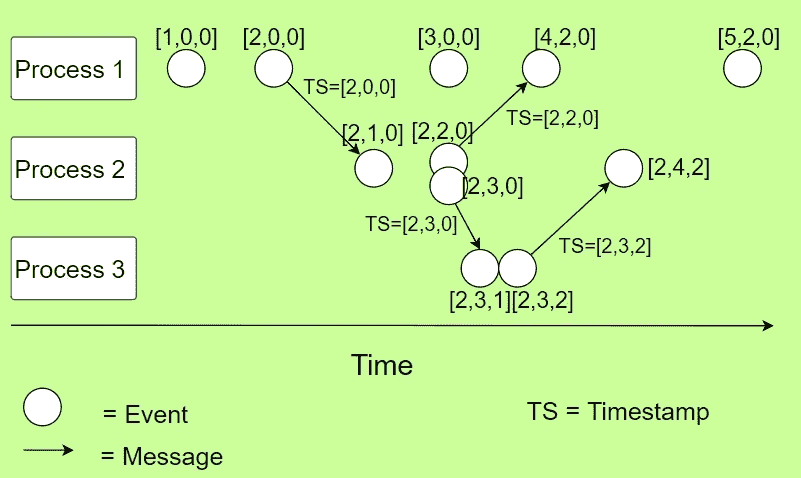
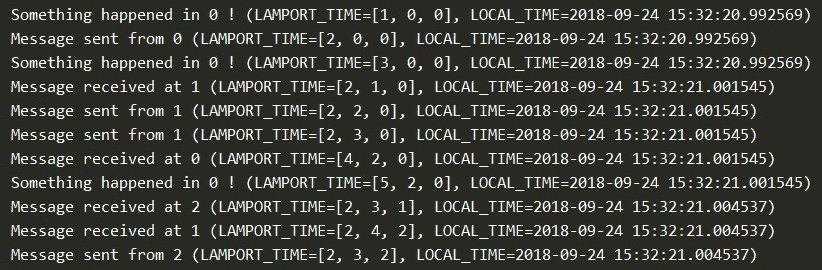

# 使用 Python 的多处理库理解 Lamport 时间戳

> 原文：<https://towardsdatascience.com/understanding-lamport-timestamps-with-pythons-multiprocessing-library-12a6427881c6?source=collection_archive---------7----------------------->

每个使用分布式系统或来自这种系统的日志的人都直接或间接地遇到过 **Lamport 时间戳**。Lamport 时间戳用于在分布式系统中对事件进行(部分)排序。该算法基于事件的**因果排序**，是矢量时钟和间隔树时钟(ITC)等更高级时钟的基础。

在本文中，我们将首先简要介绍逻辑时钟的概念，解释为什么分布式系统中需要事件排序，并讨论一些替代方案。然后，我们将讨论 Lamport 时间戳的算法，并使用三个流程进行示例。接下来，我们将使用 Python 的*多重处理*库，用易于理解的代码实现这个例子。最重要的是，我们将用**矢量时钟**将代码转换成实现。

# 逻辑时钟

为了理解为什么需要逻辑时钟，理解什么是分布式系统是很重要的。**分布式系统**是一个系统，其组件(这里称为**进程**)位于不同的联网计算机上，然后这些计算机通过相互传递**消息**来协调它们的动作。

分布式系统的主要特性之一是它没有一个全局时钟。所有进程都有自己的本地时钟，但是由于[时钟偏移](https://en.wikipedia.org/wiki/Clock_skew)和[时钟漂移](https://en.wikipedia.org/wiki/Clock_drift)，它们没有直接的方法知道自己的时钟是否与系统中其他进程的本地时钟一致，这个问题有时被称为时钟同步的**问题。**

这个问题的解决方案包括使用中央时间服务器( [Cristian 的算法](https://en.wikipedia.org/wiki/Cristian%27s_algorithm))或称为**逻辑时钟**的机制。中央时间服务器的问题在于，它的误差取决于消息从进程到时间服务器的往返时间。

逻辑时钟基于捕捉过程的时间顺序和因果关系，并基于这些关系对事件进行排序。第一个实现，Lamport 时间戳，是由 Leslie Lamport 在 1978 年提出的，现在仍然是几乎所有逻辑时钟的基础。

# Lamport 时间戳算法

Lamport 逻辑时钟是在每个进程中维护的递增计数器。从概念上讲，这个逻辑时钟可以被认为是一个只对在进程间移动的消息有意义的时钟。当一个进程接收到一条消息时，它会将其逻辑时钟与发送方重新同步(因果关系)。

Lamport 时间戳的算法可以通过一些规则来捕获:

*   所有进程计数器都从值 0 开始。
*   对于流程中的每个事件(内部事件、消息发送、消息接收),流程的计数器都会递增。
*   当进程发送消息时，它会在消息中包含其(递增的)计数器值。
*   在接收到消息时，接收方的计数器被更新为其当前计数器和接收到的消息中的时间戳中的较大者，然后递增 1。

查看这些规则，我们可以看到该算法将创建最小的开销，因为计数器仅由一个整数值组成，并且消息传递搭载在进程间消息上。

Lamport 时间戳的缺点之一是，它们只对事件进行部分排序(而不是全部排序)。**偏序**表示并非每对事件都需要具有可比性。如果两个事件不能比较，我们称这些事件为**并发**。Lamport 时间戳的问题在于，它们不能判断事件是否是并发的。矢量时钟解决了这个问题。

# 例子

如果上面的描述对你来说有点模糊，看看下面的例子。所有进程的内部计数器(时钟)都从零开始。对于由圆圈表示的每个事件，计数器增加 1。当进程接收到消息时，它将其计数器设置为其内部计数器和消息中包含的时间戳中的较大者。


Lamport Timestamps example

例如，考虑流程 2 中的第一个事件，它从流程 1 接收一条消息。进程 2 的本地计数器此时为 0，但增加到 1，因为接收消息是一个事件。消息中包含的时间戳将是 2:进程 1 的本地时间加 1 (1+1)。进程 1 在发送消息的同时也将自己的时钟加 1。

为了在进程 2 中设置新的时间，取接收到的时间戳和它自己的本地时间之间的最大值( *max(2，1)* )并加 1。这将产生一个值为 3 的新时间戳。这是有意义的，因为消息永远不会在发送之前或发送的同时被接收。

# 履行

我们的实现将运行**三个独立的进程**，它们可以通过消息相互通信。**每个进程都有自己的内部计数器**，它将随着每个事件而更新。我们的脚本将为每个事件打印一行，连同更新的内部计数器和运行进程的机器上的时间。

在开始之前，我们需要从标准模块中导入一些函数:*多处理*中的*进程*和*管道*用一个脚本运行多个 Python 进程，从 *os* 中的 *getpid* 获取每个进程的进程 id，从 *datetime* 中的 *datetime* 获取当前时间。

如果你需要更多关于多处理库的信息，请阅读文档，观看[这个很棒的教程系列](https://www.youtube.com/watch?v=Lu5LrKh1Zno)或者看一看[这个(免费的)网络研讨会](https://www.youtube.com/watch?v=s1SkCYMnfbY)。

```
from multiprocessing import Process, Pipe
from os import getpid
from datetime import datetime
```

然后我们创建一些辅助函数。第一个简单地**打印本地 Lamport 时间戳**和执行进程的机器上的实际时间。请注意，打印“实际”时间在真正的分布式系统中没有意义，因为本地时钟不会彼此同步。

```
def local_time(counter):
    return ' (LAMPORT_TIME={}, LOCAL_TIME={})'.format(counter,
                                                     datetime.now())
```

第二个是在流程收到消息时计算**新时间戳。该函数取接收到的时间戳及其本地计数器中的最大值，并将其加 1。**

```
def calc_recv_timestamp(recv_time_stamp, counter):
    return max(recv_time_stamp, counter) + 1
```

接下来，我们想为每个可能发生的事件创建一个函数。在我们的例子中，它们是三个事件:*事件*(任何本地事件)*消息发送*和*消息接收*。为了使我们的代码易于阅读，**事件函数将为事件发生的流程返回更新的时间戳**。

*事件*事件获取本地*计数器*和进程 id ( *pid* )，将计数器递增 1，打印一行以便我们知道事件发生了，并返回递增后的计数器。

```
def event(pid, counter):
    counter += 1
    print('Something happened in {} !'.\
          format(pid) + local_time(counter))
    return counter
```

*send_message* 事件也以 *pid* 和*计数器*作为输入，但是额外需要一个*管道*。**管道**是多处理库中的一个对象，代表两个进程之间的双向连接。每个管道由两个**连接对象**组成，每个方向一个。要发送或接收消息，我们需要在这些连接对象上调用 *send* 或 *recv* 函数。

如果你看一下我们的例子，你会发现我们只需要两个消息管道。一个在进程 1 和进程 2 之间，一个在进程 2 和进程 3 之间。因此，我们的示例将有四个连接对象: *pipe12* 、 *pipe21* 、 *pipe23* 和 *pipe32* (见下文)。



Example with two pipes

我们的 *send_message* 事件首先将计数器加 1，然后发送一个实际的消息(这里内容并不重要)及其增加的时间戳，并打印一个简短的语句，包括新的本地 Lamport 时间和机器上的实际时间。就像我们所有的事件函数一样，它返回新的本地时间戳。

```
def send_message(pipe, pid, counter):
    counter += 1
    pipe.send(('Empty shell', counter))
    print('Message sent from ' + str(pid) + local_time(counter))
    return counter
```

*recv_message* 事件采用与 *send_message* 相同的三个参数。它通过调用*管道*上的 *recv* 函数来接收实际消息和时间戳。然后，它使用我们之前创建的 *calc_recv_timestamp* 函数计算新的时间戳，并打印一行包括更新的计数器和机器上的实际时间。

```
def recv_message(pipe, pid, counter):
    message, timestamp = pipe.recv()
    counter = calc_recv_timestamp(timestamp, counter)
    print('Message received at ' + str(pid)  + local_time(counter))
    return counter
```

我们已经准备好开始创建我们的三个过程的定义。每个进程从**获得其唯一的进程 id** (这是在我们的机器上运行的进程的实际进程 id)和**将自己的计数器设置为 0** 开始。然后，根据我们前面的示例，通过调用不同的事件函数来更新计数器，并将返回值传递给计数器。

```
def process_one(pipe12):
    pid = getpid()
    counter = 0
    counter = event(pid, counter)
    counter = send_message(pipe12, pid, counter)
    counter  = event(pid, counter)
    counter = recv_message(pipe12, pid, counter)
    counter  = event(pid, counter)

def process_two(pipe21, pipe23):
    pid = getpid()
    counter = 0
    counter = recv_message(pipe21, pid, counter)
    counter = send_message(pipe21, pid, counter)
    counter = send_message(pipe23, pid, counter)
    counter = recv_message(pipe23, pid, counter)

def process_three(pipe32):
    pid = getpid()
    counter = 0
    counter = recv_message(pipe32, pid, counter)
    counter = send_message(pipe32, pid, counter)
```

请注意，到目前为止，如果您执行代码，什么也不会发生。这是因为实际上没有创建任何进程，更不用说启动了。在脚本的 *main* 部分，我们将创建成功运行脚本所需的两个管道( *Pipe()* )和三个进程( *Process()* )。要启动流程，我们需要在每个流程上调用 *start* 和 *join* 。*加入*向我们保证*所有*流程将在退出前完成。

```
if __name__ == '__main__': oneandtwo, twoandone = Pipe()
    twoandthree, threeandtwo = Pipe()

    process1 = Process(target=process_one, 
                       args=(oneandtwo,))
    process2 = Process(target=process_two, 
                       args=(twoandone, twoandthree))
    process3 = Process(target=process_three, 
                       args=(threeandtwo,))

    process1.start()
    process2.start()
    process3.start()

    process1.join()
    process2.join()
    process3.join()
```

现在，尝试运行代码。如果一切正常，您将得到与下图非常相似的输出。请注意，每个进程都有自己唯一的进程 id(每次运行代码时，这些 id 都会改变):

*   进程 1 的 id 为 16112
*   进程 2 的 id 为 18968
*   进程 3 的 id 为 9584

每个事件都打印了一行，包括事件的类型和更新的 Lamport 时间戳。花一分钟时间将时间戳与我们示例中的戳记进行比较，您会发现它们都彼此一致。您可以通过绘制时间线来测试新的示例，并相应地更改过程定义。



Script output with Lamport Timestamps

# 矢量时钟

如前所述，Lamport 时间戳有一个很大的缺点:**它们不能告诉你两个事件何时并发**。回到我们的例子，通过检查时间戳，我们可以得出结论，流程 1 中的事件 3 发生在流程 3 中的事件 8 之前，但这不一定是真的。



Compare event 3 in process 1 with event 8 in process 2

如果事件 3 需要几秒钟，这不会影响事件 8，因此事件 8 将在事件 3 之前执行。您可以通过在流程 1 中执行事件 3 之前添加一点延迟来轻松验证这一点。

```
from time import sleepdef process_one(pipe12):
    pid = getpid()
    counter = 0
    counter = event(pid, counter)
    counter = send_message(pipe12, pid, counter)
    sleep(3)
    counter  = event(pid, counter)
    counter = recv_message(pipe12, pid, counter)
    counter  = event(pid, counter)
```

请注意，我们的事件顺序发生了变化，而我们的时间戳保持不变。



Output with delay in process 15104

矢量时钟通过使用矢量计数器而不是整数计数器**来解决这个问题。具有 N 个进程的系统的向量时钟是 N 个计数器的向量，每个进程一个计数器。向量计数器必须遵循以下更新规则:**

*   最初，所有的计数器都是零(在我们的例子中是*【0，0，0】*)
*   每当一个进程经历一个事件，它就把自己在 vector 中的计数器加 1。
*   每当一个进程发送一条消息时，它都会在消息中包含一个它自己的(递增的)向量的副本。
*   每当一个进程接收到一条消息，它就将自己在向量中的计数器加 1，并通过取自己的向量计数器中的值和接收到的消息的向量中的值的最大值来更新其向量中的每个元素。

将向量时钟应用于我们之前的示例时，我们为每个事件获取一个向量，如下图所示。



Vector Clocks example

考虑我们之前的例子，我们比较了流程 1 中的第三个事件和流程 2 中的第四个事件。向量读作*【3，0，0】*和*【2，4，2】*。**对于在另一个事件之前发生的一个事件，其向量的所有元素需要小于或等于另一个向量中的匹配元素**。

这里显然有冲突( *3 > 2 和 0 < 4* )，因此我们可以断定这些事件是同时发生的，并没有相互影响。

要将我们的代码转换成矢量时钟，我们需要做一些最小的调整。最大的问题在于当我们收到一条消息时，我们如何计算新的计数器。因为我们将使用**数组**，所以我们需要为每个元素计算消息中的计数器和流程的计数器**之间的最大值。**

```
def calc_recv_timestamp(recv_time_stamp, counter):
    for id  in range(len(counter)):
        counter[id] = max(recv_time_stamp[id], counter[id])
    return counter
```

接下来，同样因为我们使用数组，我们需要替换

```
counter += 1
```

经过

```
counter[pid] += 1
```

在我们所有的活动中。

最后，我们希望通过用长度为 3 的向量替换初始计数器，并根据它在向量中的位置手动设置我们的流程 id，来更改我们的流程定义。对于过程一

```
pid = getpid()
counter = 0
```

应替换为

```
pid = 0
counter = [0,0,0]
```

如果您对所有进程进行相应的更改并运行您的代码，您将得到以下输出。将输出与我们的示例进行比较，得出结论，它工作正常。



Output of Vector Clocks script

一旦你正确理解了 Lamport 时间戳和向量时钟是如何工作的，看看其他一些逻辑时钟可能会很有趣，比如**矩阵时钟**、**版本向量**或**间隔树时钟**。或者，用于跟踪分布式系统中数据变化的其他机制，例如**散列历史**。

—请随时在评论中或私信中向我指出任何不一致或错误。—

# 来源

Time, Clocks, and the Ordering of Events in a Distributed System, Leslie Lamport, 1978

[](https://www.coursera.org/learn/cloud-computing) [## 云计算概念，第 1 部分| Coursera

### 关于本课程:今天的云计算系统，无论是开源的还是在公司内部使用的，都是使用…

www.coursera.org](https://www.coursera.org/learn/cloud-computing) [](https://en.wikipedia.org/wiki/Partially_ordered_set) [## 偏序集-维基百科

### 在数学中，尤其是在序论中，偏序集(也称偏序集)形式化并概括了直觉…

en.wikipedia.org](https://en.wikipedia.org/wiki/Partially_ordered_set)