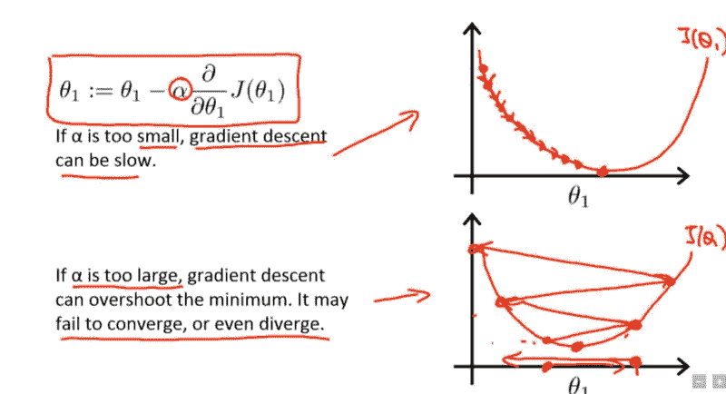
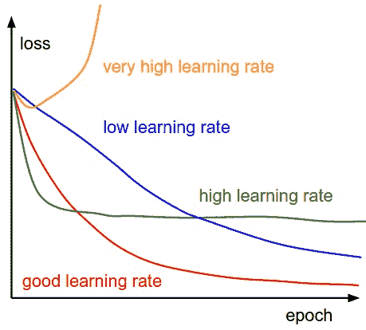
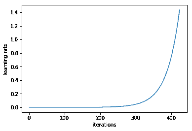
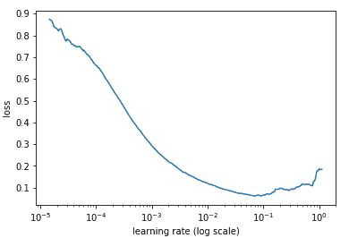
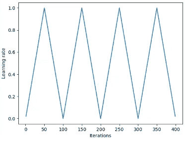
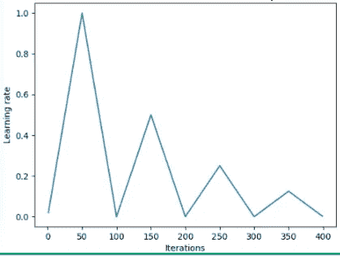
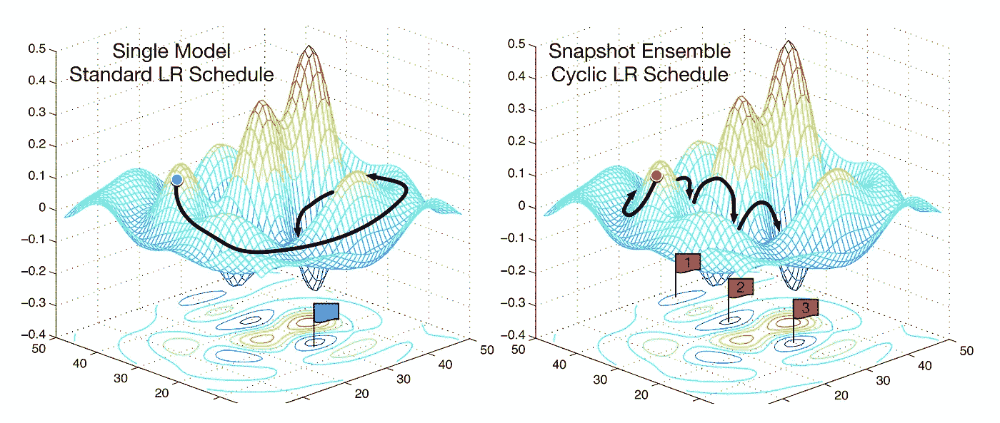
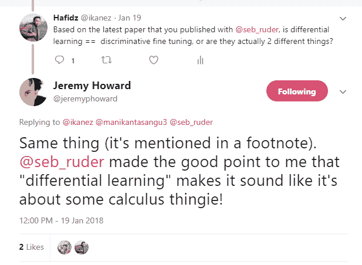
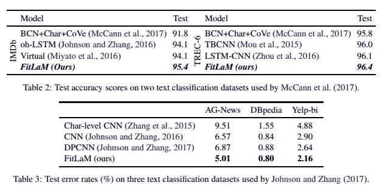

# 了解学习率及其如何提高深度学习的性能

> 原文：<https://towardsdatascience.com/understanding-learning-rates-and-how-it-improves-performance-in-deep-learning-d0d4059c1c10?source=collection_archive---------0----------------------->

这篇文章试图记录我对以下主题的理解:

*   学习率是多少？它的意义是什么？
*   一个人如何系统地达到一个好的学习率？
*   为什么我们在训练时要改变学习率？
*   使用预训练模型时，我们如何处理学习率？

这篇文章的大部分内容是基于过去 fast.ai 研究员写的东西[1]、[2]、[5]和[3]。这是它的一个简明版本，以一种能让人快速得到材料实质的方式安排。请仔细阅读参考资料，了解更多细节。

## 首先，什么是学习率？

学习率是一个超参数，它控制我们根据损失梯度调整网络权重的程度。该值越低，我们沿下坡行驶的速度越慢。虽然在确保我们不会错过任何局部最小值方面，这可能是一个好主意(使用低学习率),但这也可能意味着我们将需要很长时间才能收敛——特别是如果我们被困在一个平坦区域。

下面的公式显示了这种关系。

```
new_weight = existing_weight — learning_rate * gradient
```



Gradient descent with small (top) and large (bottom) learning rates. Source: Andrew Ng’s Machine Learning course on Coursera

通常，学习速率是由用户天真地随机配置的。在最好的情况下，用户将利用过去的经验(或其他类型的学习材料)来获得在设置学习率时使用的最佳值的直觉。

因此，通常很难做到正确。下图展示了配置学习率时可能遇到的不同情况。



*Effect of various learning rates on convergence (Img Credit:* [*cs231n*](http://cs231n.github.io/neural-networks-3/)*)*

此外，学习率影响我们的模型能够多快收敛到局部最小值(也就是达到最佳精度)。因此，从一开始就把它做好意味着我们训练模型的时间会更少。

```
**Less training time, lesser money spent on GPU cloud compute. :)**
```

## 有没有更好的方法来确定学习率？

在**的第 3.3 节中，用于训练神经网络**的循环学习率[4]les lie n . Smith 认为，可以通过最初以非常低的学习速率训练模型，并在每次迭代中增加学习速率(线性或指数)来估计良好的学习速率。



Learning rate increases after each mini-batch

如果我们记录每次迭代的学习，并绘制学习率(log)与损失的关系图；我们会看到，随着学习率的增加，会有一个点，损耗停止减少，开始增加。实际上，我们的学习率应该理想地在图表最低点的左边(如下图所示)。在这种情况下，0.001 到 0.01。



## 以上似乎有用。我该如何开始使用它？

目前，它作为 fast.ai 包中的一个函数受到支持，由杰瑞米·霍华德开发，作为一种抽象 pytorch 包的方法(很像 Keras 是 Tensorflow 的抽象)。

在训练神经网络之前，只需要键入以下命令就可以开始寻找最佳学习速率。

# 让它变得更好

在这个节骨眼上，我们已经讨论了学习率是什么，它的重要性，以及当我们开始训练我们的模型时，我们如何系统地得出一个最佳值。

接下来，我们将讨论如何使用学习率来提高模型的性能。

## 传统智慧

典型地，当一个人设置他们的学习速率并训练模型时，他将只等待学习速率随着时间的推移而降低，并等待模型最终收敛。

然而，随着梯度达到稳定水平，训练损失变得更难改善。在[3]中， *Dauphin 等人认为最小化损失的困难来自鞍点而不是不良的局部最小值。*


*A saddle point in the error surface. A saddle point is a point where derivatives of the function become zero but the point is not a local extremum on all axes. (Img Credit:* [*safaribooksonline*](https://www.safaribooksonline.com/library/view/fundamentals-of-deep/9781491925607/ch04.html)*)*

## 那么，我们如何摆脱这种情况呢？

我们可以考虑几个选择。一般来说，引用[1]中的话，

> …如果训练不再改善我们的损失，我们将根据某种循环函数 *f* 在每次迭代中改变学习率，而不是使用一个固定的学习率值并随时间减少。就迭代次数而言，每个周期具有固定的长度。这种方法让学习率在合理的边界值之间循环变化。**这很有帮助，因为如果我们在鞍点上停滞不前，提高学习速率可以更快地穿越鞍点平台。**

在[2]中，Leslie 提出了一种“三角形”方法，其中学习速率在每几次迭代后重新开始。



‘Triangular’ and ‘Triangular2’ methods for cycling learning rate proposed by Leslie N. Smith. On the left plot min and max lr are kept the same. On the right the difference is cut in half after each cycle.

另一种同样流行的方法叫做*热重启随机梯度下降，由 Loshchilov&Hutter*【6】提出。这种方法基本上使用余弦函数作为循环函数，并在每个循环中以最大值重新开始学习速率。“暖”位来自于当学习率重新启动时，并不是从零开始；而是根据模型在最后一步[7]中收敛的参数。

虽然有各种变化，下图展示了它的一种实现，其中每个周期都设置为相同的时间段。


SGDR plot, learning rate vs iteration.

因此，我们现在有了一种减少训练时间的方法，基本上就是周期性地绕着“*山”跳(如下)。*



Comparing fixed LR and Cyclic LR (img credit: [https://arxiv.org/abs/1704.00109](https://arxiv.org/abs/1704.00109))

除了节省时间之外，研究还表明，使用这些方法可以在不调整和较少迭代的情况下提高分类精度。

# 迁移学习中的学习速率

在 fast.ai 课程中，非常强调在解决人工智能问题时利用预训练模型。例如，在解决图像分类问题时，学生将学习如何使用 VGG 或 Resnet50 等预训练模型，并将其连接到您想要预测的任何图像数据集。

为了总结如何在 fast.ai(该程序，不要与 fast.ai 包混淆)中建立模型，下面是我们通常会采取的几个步骤:

> 1.启用数据扩充，预计算=真
> 
> **2。使用** `**lr_find()**` **找到损失仍在明显改善的最高学习率**
> 
> 3.从预计算的激活中训练最后一层，持续 1-2 个时期
> 
> 4.在 cycle_len=1 的情况下，对最后一层进行 2–3 个历元的数据扩充训练(即 precompute=False)
> 
> 5.解冻所有层
> 
> **6。将前几层的学习速率设置为比下一个更高层低 3-10 倍**
> 
> **7。再次使用**`**lr_find()**`
> 
> **8.用 cycle_mult=2 训练整个网络，直到过度拟合**

**从上面的步骤中，我们注意到步骤 2、5 和 7 与学习速度有关。在这篇文章的前面部分，我们已经基本上涵盖了提到的步骤的第二项——在那里我们谈到了如何在训练模型之前获得最佳的学习率。**

**在接下来的部分中，我们回顾了如何通过使用 SGDR，我们能够减少训练时间，并通过不时地重新启动学习速率来避免梯度接近零的区域，从而提高精度。**

**在最后一节中，我们将讨论差分学习，以及当训练模型与预训练模型相关联时，如何使用差分学习来确定学习率。**

## **什么是差异学习？**

**这是一种在训练期间为网络中的不同层设置不同学习速率的方法。这与人们通常配置学习速率的方式形成对比，后者是在训练期间在整个网络中使用相同的速率。**

****

**One reason why I just love Twitter — direct answer from the man himself.**

**写这篇文章的时候，Jeremy 和 Sebastian Ruder [9]发表了一篇论文，深入探讨了这个话题。所以我猜想差别学习率现在有了一个新名字——***区别性微调*** *。:)***

**为了更清楚地说明这个概念，我们可以参考下图，其中一个预训练模型被分成 3 组，每组将配置一个递增的学习率值。**

****

**Sample CNN with differential learning rate. Image credit from [3]**

**这种配置方法背后的直觉是，前几层通常会包含非常细粒度的数据细节，如线条和边缘，我们通常不希望对其进行太多更改，而是希望保留其信息。因此，没有必要大幅度改变它们的权重。**

**相比之下，在后面的图层中，如上面绿色的图层，我们可以获得数据的详细特征，如眼球、嘴或鼻子；我们不一定需要保留它们。**

## **这与其他微调方法相比如何？**

**在[9]中，有人认为微调整个模型的成本太高，因为有些模型可能有 100 多个层。因此，人们通常做的是一次一层地微调模型。**

> **然而，这引入了顺序要求，阻碍了并行性，并且需要多次通过数据集，导致对小数据集的过度拟合。**

**还证明了[9]中介绍的方法能够在各种 NLP 分类任务中提高准确性并降低错误率(如下)**

****

**Results taken from [9]**

## **参考资料:**

**[*【1】用学习率改善我们的工作方式。*](https://techburst.io/improving-the-way-we-work-with-learning-rate-5e99554f163b)**

**[*【2】循环学息术*](http://teleported.in/posts/cyclic-learning-rate/) *。***

**[*【3】利用差异学习率进行迁移学习。*](/transfer-learning-using-differential-learning-rates-638455797f00)**

**[*【4】莱斯利·n·史密斯。训练神经网络的循环学习率。*](https://arxiv.org/abs/1506.01186)**

**[*【5】估计深度神经网络的最优学习速率*](/estimating-optimal-learning-rate-for-a-deep-neural-network-ce32f2556ce0)**

**[*【6】随机梯度下降带温重启*](https://arxiv.org/abs/1608.03983)**

**[*【7】2017 年深度学习优化亮点*](http://ruder.io/deep-learning-optimization-2017)**

***【*[*8】第一课笔记本，fast.ai 第一部分 V2*](https://github.com/fastai/fastai/blob/master/courses/dl1/lesson1.ipynb)**

**[*【9】用于文本分类的微调语言模型*](https://arxiv.org/abs/1801.06146)**