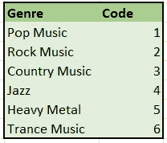
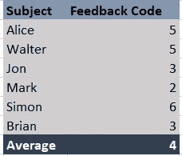

# 了解测量级别

> 原文：<https://towardsdatascience.com/understanding-levels-of-measurement-97ecfe94c388?source=collection_archive---------21----------------------->

因此，我想成为一名数据炼金术士(更普遍的说法是数据科学家)。炼金术士是试图将金属物质转化为黄金的人。在我的情况下，唯一的区别是我的金属是数据，而我的黄金是我希望数据承认的令人瞠目结舌的洞察力！

所以，如果你还在读这篇文章，你可能是这个社区的一员，你可能知道统计学在我们的技能组合中占有重要地位。在这篇文章中，我将使用一个故事来阐述我对测量及其水平的理解。当然，它必须是一个故事，毕竟数据科学家是高超的故事讲述者！

Our Day Dreaming Friend, Bob..Yeah, of course, he has to look cute ;)

见见我的朋友，鲍勃。他是一个非常有创造力和想象力的学生，正在从事统计学方面的职业。一天，大学毕业后，他决定去一家比萨饼店吃午饭。那里有很多顾客，鲍勃不得不等着下订单。

鲍勃是一个想象力丰富、沉浸在自己世界里的男孩，他只是瞥了一眼菜单。他进入了自己的统计世界。他注意到比萨饼的类别是名义上的数据。*名义数据*通常被称为分类数据，因为它们只是将给定的数据放入定义的类别中。例如，比萨饼可以有蔬菜或非蔬菜配料。名义上的数据并不能说明顺序，我们无法仅仅通过所用的配料来描述“披萨的美味”程度。另一个最好的例子是一个人的性别，即男性、女性或变性人

鲍勃然后意识到比萨饼的尺寸是*有序的*类型。顾名思义，序数数据清楚地表明一个有意义的顺序。鲍勃可以在菜单上看到小号、中号和大号比萨饼，清楚地表明了等级的顺序。然而，顺序变量并不意味着两组值(区间)之间的差是相等的。这意味着我们不能说小号和中号披萨的区别等于中号和大号披萨的区别。

鲍勃的白日梦被服务员打断了，因为他要求鲍勃点菜。Bob 点了他最爱吃的芝士爆鸡烧烤披萨(啊，我都流口水了！)并在比萨饼店四处张望。

在他面前的桌子上，有一家人正在享用他们的比萨饼，一对父母和他们的婴儿在助步车里。这个婴儿的脚太小了，鲍勃确信他的鞋号肯定是零！然后他意识到鞋码是一个区间变量。找到了。一个*区间*变量在数值之间有一个确定的区间，但缺少一个零点。考虑鞋号，我们可以说鞋号 8 和鞋号 7 的差等于鞋号 2 和鞋号 3 的差。但不代表 6 码是 3 码的 2 倍。当我们说鞋码为零时，并不意味着没有鞋。但它却表示鞋号，也就是说，它是一个任意的零点。

Aww!

鲍勃的奶酪热比萨饼现在已经到了，他的思想现在只集中在比萨饼上。鲍勃狼吞虎咽地吃着比萨饼，吃完后，比萨饼店非常安静。令人惊讶的是，所有的顾客都不见了，包括他前面的那家人。只有服务员和他。

鲍勃很快就离开了这个地方。他的思绪回到了统计世界，他得出结论，一个比萨饼店的顾客数量是一个比率比例。一个*比*秤是区间秤的老大哥。它有明确的间隔，也有一个真正的零点值。这意味着在 Bob 离开比萨店时，顾客为零，即真正没有顾客。而如果有 20 个客户，这实际上意味着现在客户数量的 20 倍。故事结束！

我希望我们的男孩鲍勃已经用他自己的方式帮助你理解了测量的水平。我试图用一个故事来给你最简单的解释。但是为什么要学习测量的级别呢？

了解测量水平有助于我们解释该变量的数据。例如，对于数据变量*颜色，*，你可以将红色编码为 0，蓝色编码为 1，绿色编码为 2。将分类数据编码成数字是优选的，因为计算机倾向于比字母更容易解释数字。此外，我们可以尽量减少数据输入时出错的机会。例如，输入数据的人会像写“红色”一样写“红色”。“r”和“r”对计算机的意义不同，因此会影响我们的分析。此外，如果我们知道数据是名义上的，我们永远不会平均它。为什么？

Encoding for the music genre

为了更好地理解，考虑上面的音乐流派编码。使用上面的编码，如果我们让六个人选择一种颜色，我们得到的假设数据如下图所示。

它说我们调查的平均反馈是 4。这显然是误导。因此，在分析变量之前，有必要了解变量的测量水平。那都是乡亲们！

唷！我终于在 Medium 上写了我的第一篇博客。请留下您的回复，朋友们！