# 位置敏感散列法

> 原文：<https://towardsdatascience.com/understanding-locality-sensitive-hashing-49f6d1f6134?source=collection_archive---------0----------------------->

## 减少数据维数的有效方法

# 动机

寻找最近邻居的任务很常见。您可以考虑像查找重复或相似文档、音频/视频搜索这样的应用程序。虽然使用暴力来检查所有可能的组合会给你精确的最近邻，但它根本不可伸缩。完成这项任务的近似算法一直是积极研究的领域。虽然这些算法不能保证给你准确的答案，但通常它们会提供一个很好的近似值。这些算法速度更快，可伸缩性更强。

位置敏感散列(LSH)就是这样一种算法。LSH 有许多应用，包括:

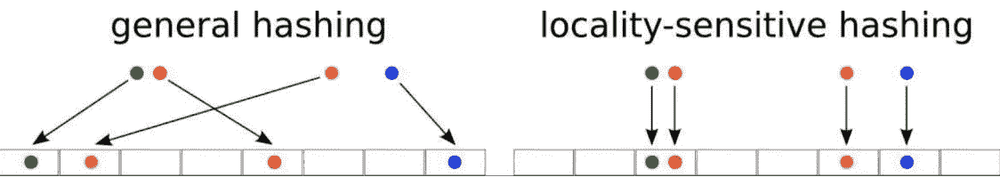

*   近似重复检测:LSH 通常用于对大量文档、网页和其他文件进行重复数据删除。
*   全基因组关联研究:生物学家经常使用 LSH 在基因组数据库中识别相似的基因表达。
*   大规模图片搜索:谷歌使用 LSH 和 PageRank 来构建他们的图片搜索技术。
*   音频/视频指纹识别:在多媒体技术中，LSH 被广泛用作音频/视频数据的指纹识别技术。

在这篇博客中，我们将试图理解这种算法的工作原理。

# 大意

**是指一族函数(称为 LSH 族)将数据点散列到桶中，使得彼此靠近的数据点*大概率位于同一个桶中*，而彼此远离的数据点*很可能在不同的桶中*。这使得识别具有不同相似度的观察结果变得更加容易。**

# **查找相似的文档**

**让我们试着去理解我们如何利用 LSH 来解决一个实际问题。我们试图解决的问题是:**

> **目标:您已经收到了大量的文档。您希望找到“近似重复”的配对。**

**在这个问题的背景下，我们可以将 LSH 算法分解为 3 个主要步骤:**

1.  ****皱缩****
2.  ****最小哈希****
3.  ****区分位置的散列法****

**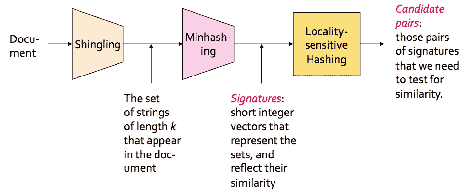**

**暂时不要过多地解读这个数字。它只是给你一个流程的概念。我们将详细讨论每个步骤。**

# **叠瓦作用**

**在这一步中，我们将每个文档转换成一个长度为 k 的*字符集(也称为 k-瓦片区或 k-grams)。*关键思想是将我们集合中的每个文档表示为一组 k 瓦片区。**

**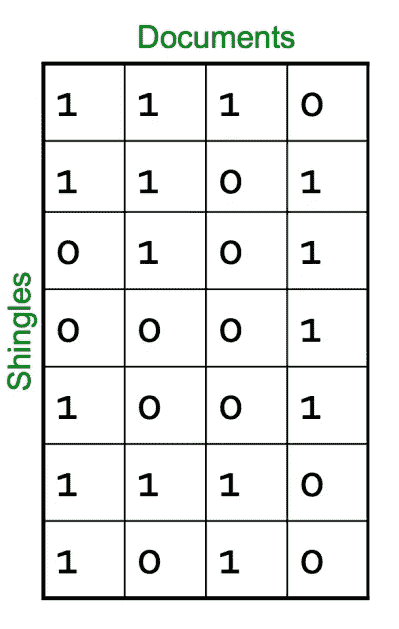**

**举个例子:你的一个文档(D):“纳达尔”。如果我们对 2-带状疱疹感兴趣，那么我们的集合:{Na，ad，da，al}。类似的 3-带状疱疹集:{Nad，ada，dal}。**

*   **相似的文档更有可能共享更多的瓦片区**
*   **在改变单词的文档中重新排序段落对带状疱疹没有太大影响**
*   ***实际中一般采用 8–10*的 k 值。较小的值将导致出现在大多数文档中的许多带状疱疹(*不利于区分文档***

# **Jaccard 索引**

**我们以瓦片的形式表示每个文档。现在，我们需要一个度量来衡量文档之间的相似性。Jaccard Index 是一个很好的选择。文档 A & B 之间的 Jaccard 索引可以定义为:**

**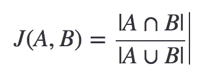**

**它也被称为*(IOU)*。**

**假设 A:“Nadal”和 B:“Nadia”，那么 2-带状疱疹表示将是:**

**A: {Na，ad，da，al}和 B: {Na，ad，di，ia}。**

**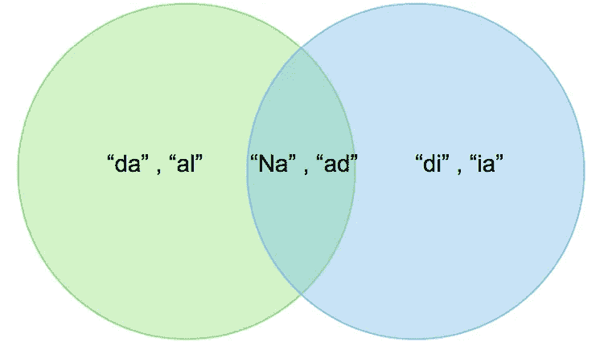**

**雅克卡指数= 2/6**

**更多数量的公共瓦片区将导致更大的 Jaccard 索引，因此文档更可能是相似的。**

**让我们讨论一下我们需要解决的两个大问题:**

# **时间复杂度**

**现在你可能认为我们可以就此打住。但是如果考虑到可伸缩性，仅仅这样做是行不通的。对于 n 个文档的集合，需要做 *n*(n-1)/2* 比较，基本上就是 *O(n )* 。假设你有 100 万个文档，那么比较的数量将是 5*10(完全不可伸缩！).**

# **空间复杂性**

**文档矩阵是一个稀疏矩阵，按原样存储它将是一个很大的内存开销。解决这个问题的一种方法是散列法。**

# **散列法**

**散列的思想是使用散列函数 **H *将每个文档转换成一个小签名。*** 假设我们语料库中的一个文档用 **d.** 表示，那么:**

*   **H(d)是签名，它足够小，可以放在内存中**
*   **如果*相似度(d1，d2)* 高，则 ***概率(H(d1)==H(d2))*** 高**
*   **如果*相似度(d1，d2)* 低，则 ***概率(H(d1)==H(d2))*** 低**

**哈希函数的选择与我们使用的相似性度量紧密相关。对于 Jaccard 相似性，合适的散列函数是**最小散列**。**

## **最小散列法**

**这是这个算法最关键也是最神奇的地方，所以请注意:**

****第一步:文档瓦片矩阵*行索引*的**随机排列 *(π)* 。**

**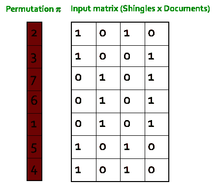**

****第二步:**哈希函数是 C 列值为 1 的第一行(按排列顺序)的*索引。*这样做几次(使用不同排列)来创建列的签名。**

**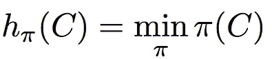****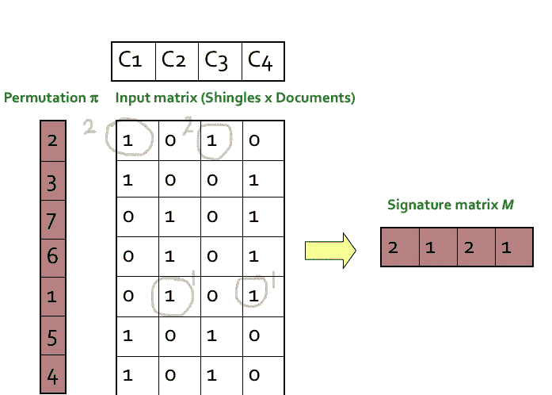****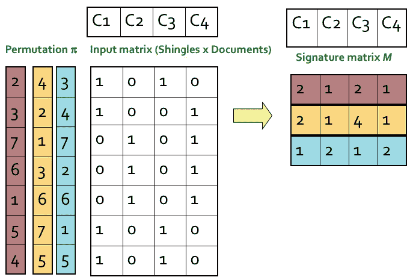**

## **最小散列属性**

**签名的相似性是它们一致的最小散列函数(行)的分数。所以 C1 和 C3 的签名相似度是 2/3，因为第一行和第三行是相同的。**

**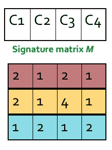****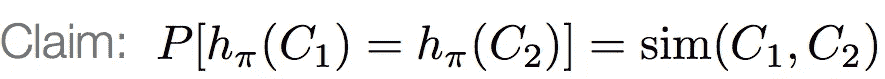**

> **两个签名的预期相似性等于列的 Jaccard 相似性。签名越长，误差越小**

**在下面的例子中，你可以在某种程度上看到这一点。有所不同，因为我们只有长度为 3 的签名。但是如果增加长度，这两个相似点会更接近。**

**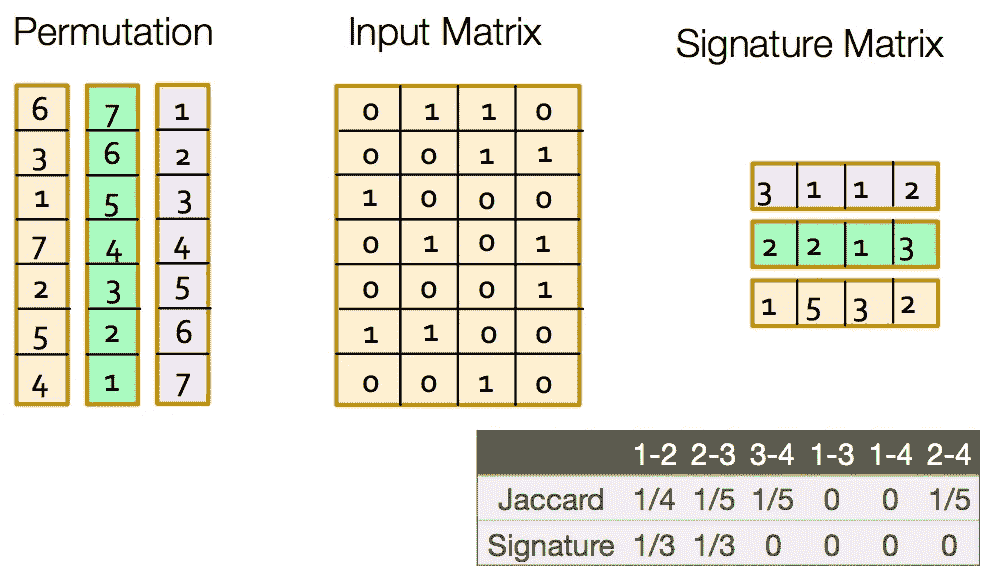**

**因此，使用最小散列法，我们通过消除稀疏性并同时保持相似性的*，解决了*空间复杂度*的问题。在实际实施中，他们是一个创造指数排列的技巧，我不会覆盖，但你可以在 15:52 左右检查这个视频。 [**Min-hash 实现**](https://www.youtube.com/watch?v=96WOGPUgMfw)***

# **局部敏感散列法**

> **目标:找到 Jaccard 相似度至少为 t 的文档**

**LSH 的总体思想是找到一种算法，使得如果我们输入两个文档的签名，它告诉我们这两个文档是否形成候选对，即它们的相似性大于阈值 **t** 。请记住，我们将签名的相似性作为原始文档之间 Jaccard 相似性的代理。**

****专门针对最小哈希签名矩阵:****

*   **使用几个散列函数散列签名矩阵 **M** 的列**
*   **如果对于至少一个散列函数的**来说，两个文档散列到同一个桶中，我们可以将这两个文档作为候选对****

**现在的问题是如何创建不同的散列函数。为此，我们进行波段划分。**

## **波段划分**

**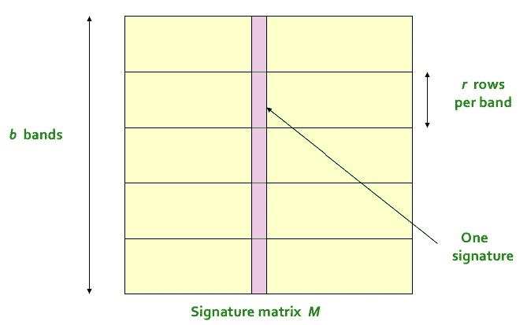**

**算法是这样的:**

*   **将签名矩阵分成 *b 个带*，每个带有 *r 行***
*   **对于每个带，用 k 个桶将它在每列中的部分散列到一个散列表中**
*   **候选列对是那些对于*至少 1 个带*散列到相同桶的列对**
*   **调整 b 和 r 以捕捉最相似的对，但很少捕捉不相似的对**

**这里的考虑很少。理想情况下，对于每个波段，我们希望 k 等于一个列在一个波段内可以采用的所有可能的值组合。这将等同于身份匹配。但是这样，k 将是一个巨大的数字，在计算上是不可行的。举个例子:如果一个乐队有 5 行。现在，如果签名中的元素是 32 位整数，那么这种情况下的 k 将是(2 )⁵ ~ 1.4615016e+48。你可以看到这里有什么问题。通常 k 取 100 万左右。**

**其思想是，如果两个文档相似，那么它们将作为候选对出现在至少一个波段中。**

## ****选择 b & r****

**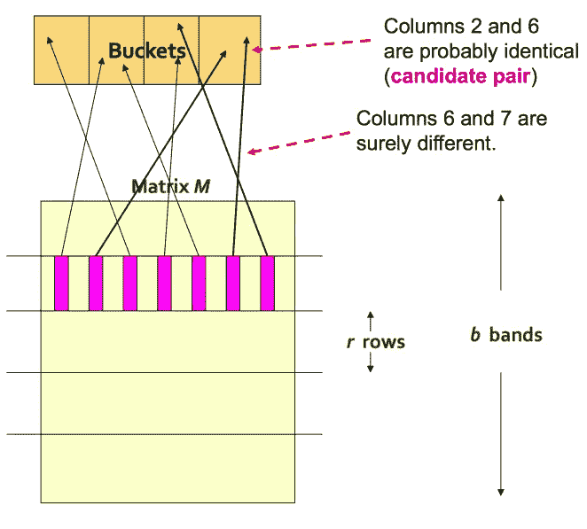**

**如果我们取 b 大，即更多数量的散列函数，那么我们减少 r，因为 b*r 是常数(签名矩阵中的行数)。直觉上，这意味着我们正在增加找到候选配对的可能性。这个案例相当于取了一个小 **t(相似度阈值)****

**假设你的签名矩阵有 100 行。考虑两种情况:**

**b1 = 10 → r = 10**

**b2 = 20 → r = 5**

**在第二种情况下，两个文档在同一个桶中出现至少一次的可能性更大，因为它们有*更多的机会(20 比 10)* 和*更少的签名元素被比较(5 比 10)。***

> **更高的 b 意味着更低的**相似性阈值(更高的假阳性)，而更低的 b 意味着更高的相似性阈值(更高的假阴性)****

**我们试着通过一个例子来理解这一点。**

****设置:****

*   **100k 文档存储为长度为 100 的签名**
*   **签名矩阵:100*100000**
*   **签名的暴力比较将导致 100C2 比较= 50 亿(相当多！)**
*   **让我们取 b = 20 → r = 5**

****相似度阈值(t) : 80%****

**我们希望 20 个波段中至少有一个波段的两个文档(D1 和 D2)具有 80%的相似性，在同一个桶中进行哈希运算。**

**P(D1 和 D2 在特定波段相同)= (0.8)⁵ = 0.328**

**P(D1 和 D2 在所有 20 个波段中不相似)=(1–0.328)^20 = 0.00035**

**这意味着在这种情况下，我们有大约 0.035%的机会出现 80%相似文档的假阴性。**

**我们还希望对于 20 个波段中的任何一个(阈值= 80%)，具有 30%相似性的 2 个文档(D3 和 D4)不在同一个桶中被散列。**

**P(D3 和 D4 在特定波段中相同)= (0.3)⁵ = 0.00243**

**P(D3 和 D4 在 20 个波段中的至少一个波段中相似)= 1-(1–0.00243)^20 = 0.0474**

**这意味着在这种情况下，我们有大约 4.74%的机会在 30%的相似文档中出现误报。**

**所以我们可以看到，我们有一些假阳性和几个假阴性。这些比例将随着 b 和 r 选择而变化**

**我们在这里想要的是像下面这样的东西。如果我们有两个相似度大于阈值的文档，那么它们在至少一个波段中共享同一个桶的概率应该是 1，否则为 0。**

**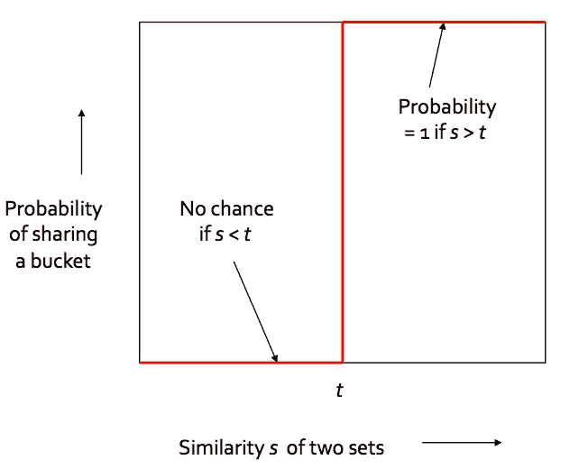**

**最坏的情况是，如果我们有如下所示的签名矩阵中的 *b =行数。***

**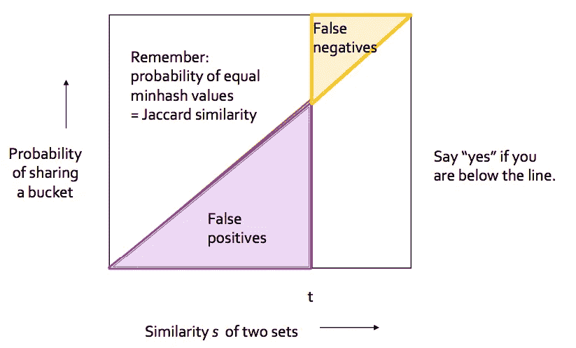**

**任何 b 和 r 的一般情况如下所示。**

**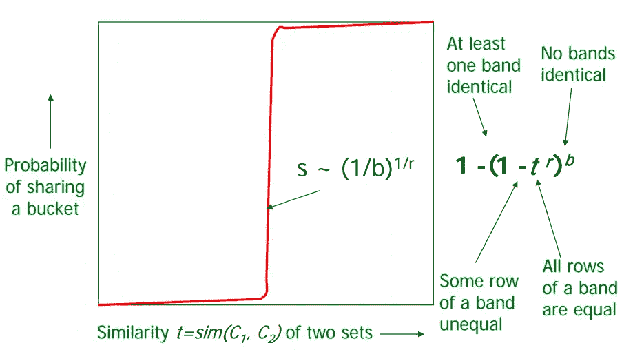**

> **选择 b 和 r 以获得最佳的 S 曲线，即最小的假阴性和假阳性率**

**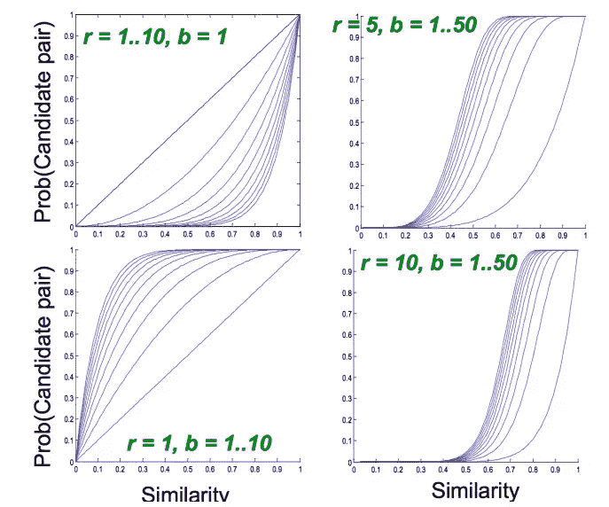**

## **LSH 摘要**

*   **调整 **M，b，r** 以获得几乎所有具有相似签名的文档对，但排除大多数没有相似签名的对**
*   **在主存储器中检查*候选对*确实有*相似的签名***

# **结论**

**我希望你很好地理解这个强大的算法，以及它如何减少搜索时间。你可以想象 LSH 如何适用于几乎任何类型的数据，以及它在当今的大数据世界中有多大的相关性。**

**要阅读更多关于 LSH 的代码实现，请查看本文。[**https://santhoshhari.github.io/Locality-Sensitive-Hashing/**](https://santhoshhari.github.io/Locality-Sensitive-Hashing/)**

# **参考**

1.  **[http://joyceho.github.io/cs584_s16/slides/lsh-11.pdf](http://joyceho.github.io/cs584_s16/slides/lsh-11.pdf)**
2.  **https://www.youtube.com/watch?v=96WOGPUgMfw**
3.  **【https://eng.uber.com/lsh/ **
4.  **[https://medium . com/engineering-brainly/locality-sensitive-hashing-explained-304 EB 39291 E4](https://medium.com/engineering-brainly/locality-sensitive-hashing-explained-304eb39291e4)**
5.  **[http://www.mit.edu/~andoni/LSH/](http://www.mit.edu/~andoni/LSH/)**