# 理解逻辑回归

> 原文：<https://towardsdatascience.com/understanding-logistic-regression-9b02c2aec102?source=collection_archive---------1----------------------->

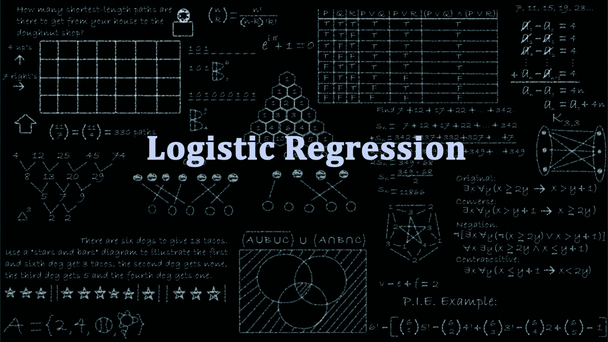

逻辑回归是解决分类问题的基本和流行的算法之一。它被命名为“逻辑回归”,因为它的基本技术与线性回归完全相同。术语“逻辑”取自该分类方法中使用的**逻辑函数**。

**本博客旨在回答以下问题**:

1.分类问题是什么？

2.为什么不用线性回归？

3.逻辑回归算法？

4.什么是决策边界？

5.如何检查模型性能？

今天，我们来一劳永逸地了解一下逻辑回归。我们开始吧，

**什么是分类问题？**

当自变量在本质上是连续的并且因变量是分类形式时，即在像正类和负类这样的类中，我们将该问题识别为分类问题。分类实例的实际例子是，将邮件分类为垃圾邮件或非垃圾邮件，将肿瘤分类为恶性或良性，并将交易分类为欺诈性或真实性。所有这些问题的答案都是分类形式的，即是或否。这就是为什么它们是两类分类问题。

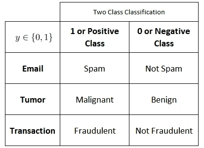

*[Image 1] (Image courtesy: My Photoshopped Collection)*

虽然，有时我们会遇到两个以上的类，但这仍然是一个分类问题。这些类型的问题被称为多类分类问题。

**为什么不用线性回归？**

假设我们有肿瘤大小与其恶性程度的数据。由于这是一个分类问题，如果我们绘图，我们可以看到，所有的值将位于 **0** 和 **1** 。如果我们拟合最好的回归线，假设阈值为 0.5，我们可以做线相当合理的工作。

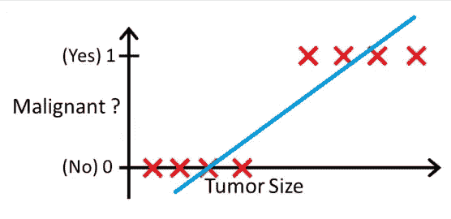

*[Image 2] (Image courtesy: Andrew Ng provided image + Photoshopped)*

我们可以确定 x 轴上的点，从该点开始，位于其左侧的所有值都被认为是负类，而位于其右侧的所有值都是正类。

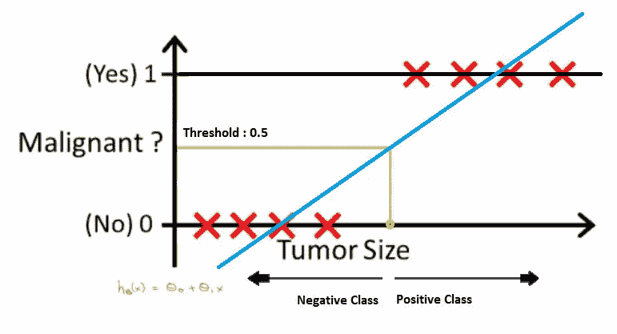

*[Image 3] (Image courtesy: Andrew Ng provided image + Photoshopped)*

但是如果数据中有异常值呢？事情会变得相当混乱。例如，对于 0.5 的阈值，

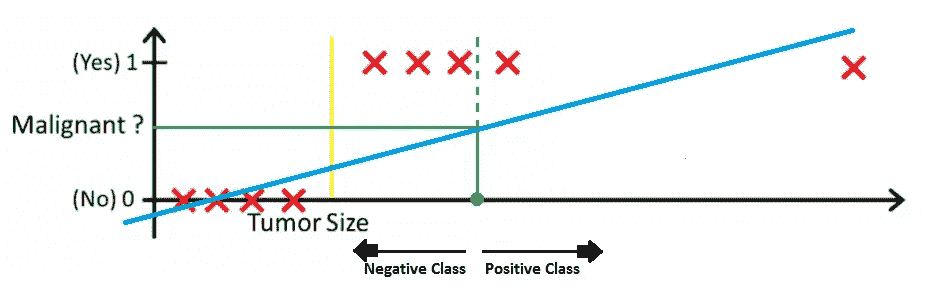

*[Image 4] (Image courtesy: Andrew Ng provided image + Photoshopped)*

如果我们拟合最佳回归线，它仍然不足以决定我们可以区分阶级的任何点。它会把一些正面类的例子放到负面类里。绿色虚线(决策边界)将恶性肿瘤与良性肿瘤区分开来，但该线应该位于黄线处，黄线清楚地将阳性和阴性示例区分开来。因此，仅仅一个异常值就会扰乱整个线性回归预测。这就是逻辑回归发挥作用的地方。

**逻辑回归算法**

如前所述，为了处理异常值，逻辑回归使用 Sigmoid 函数。

解释逻辑回归可以从解释标准逻辑函数开始。逻辑函数是一个 Sigmoid 函数，它取 0 到 1 之间的任何实数值。它被定义为

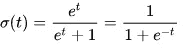

而如果我们绘制它，图形会是 ***S*** 曲线，

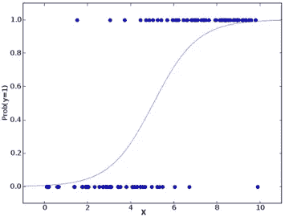

*[Image 5]* *(Image courtesy:* [https://openclassrooms.com/en/courses/6389626-train-a-supervised-machine-learning-model/6405876-understand-the-logistic-regression-algorithm](https://openclassrooms.com/en/courses/6389626-train-a-supervised-machine-learning-model/6405876-understand-the-logistic-regression-algorithm))

让我们把 ***t*** 看作一元回归模型中的线性函数。

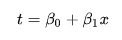

所以逻辑方程式会变成

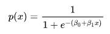

现在，当逻辑回归模型遇到异常值时，它会处理它。

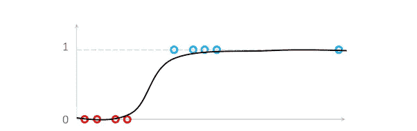

*[Image 6] (Image courtesy: Andrew Ng provided image + Photoshopped)*

但有时它会根据异常值的位置将其 y 轴向左或向右移动。

**什么是决策边界？**

决策边界有助于将概率分为正类和负类。

线性决策边界

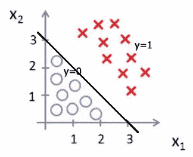

*[Image 7] (Image courtesy: Andrew Ng provided image + Photoshopped)*

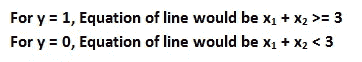

*[Image 8] (Image courtesy: My Photoshopped Collection)*

非线性决策边界

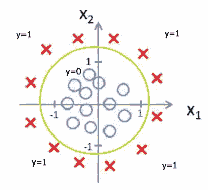

*[Image 9] (Image courtesy: Andrew Ng provided image + Photoshopped)*

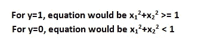

*[Image 10] (Image courtesy: My Photoshopped Collection)*

**如何检查绩效？**

为了检查性能，我们可以使用混淆矩阵和 AUC - ROC 曲线。要知道它是什么，可以查看我关于[混淆矩阵](https://medium.com/@narkhedesarang/understanding-confusion-matrix-a9ad42dcfd62)和 [AUC - ROC 曲线](/understanding-auc-roc-curve-68b2303cc9c5)的文章。

**参考文献:**

图片取自**吴恩达球场**并做了一些修改，以便于理解😁。

感谢阅读。

我希望我已经让你对什么是逻辑回归有了一些了解。如果你喜欢这篇文章，给这篇文章一些掌声会对你有所帮助👏。我随时欢迎你的问题和建议。你可以在脸书、推特、Linkedin 上分享这个，这样有需要的人可能会偶然发现这个。

您可以通过以下方式联系到我:

领英:[https://www.linkedin.com/in/narkhedesarang/](https://www.linkedin.com/in/narkhedesarang/)

推特:[https://twitter.com/narkhede_sarang](https://twitter.com/narkhede_sarang)

github:[https://github.com/TheSarang](https://github.com/TheSarang)