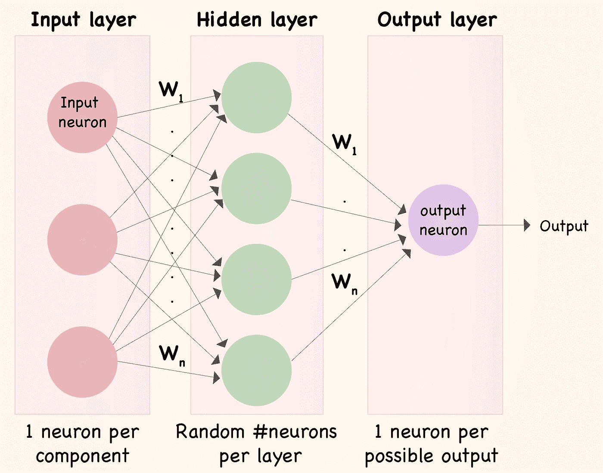
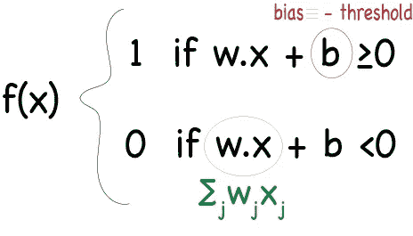
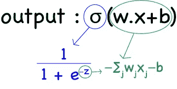
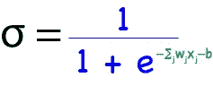
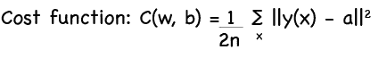
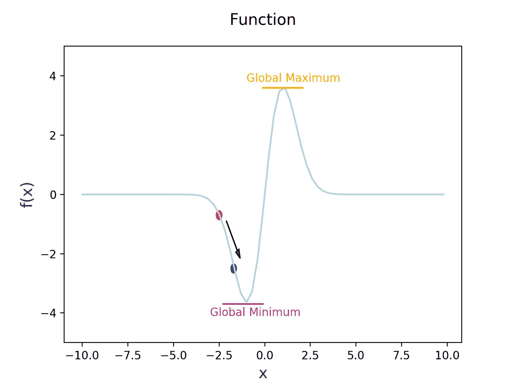
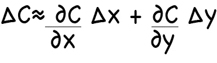
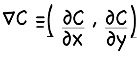
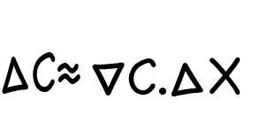
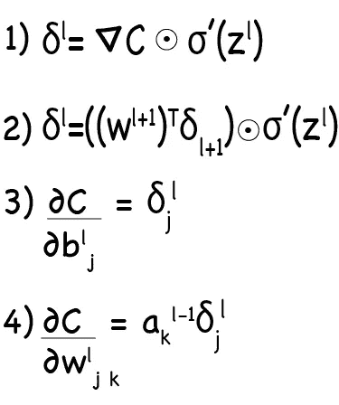

# 理解神经网络:什么，如何和为什么？

> 原文：<https://towardsdatascience.com/understanding-neural-networks-what-how-and-why-18ec703ebd31?source=collection_archive---------1----------------------->

## 解开*黑盒*

N 就称为深度学习的机器学习子领域而言，神经网络是最强大和最广泛使用的算法之一。乍一看，神经网络似乎是一个*黑盒*；输入层将数据输入到“*隐藏层*中，变戏法之后，我们可以看到由*输出层*提供的信息。然而，理解隐藏层在做什么是神经网络实现和优化的关键步骤。

在我们理解神经网络的道路上，我们将回答三个问题:*什么*、*如何*和*为什么*？

## **什么是神经网络？**

我们将要考虑的神经网络被严格地称为人工神经网络，顾名思义，它是基于科学对人脑结构和功能的了解。

简而言之，神经网络被定义为一种计算系统，它由许多简单但高度互连的元素或节点组成，这些元素或节点被称为“神经元”，它们被组织成使用对外部输入的动态状态响应来处理信息的层。正如我们将在后面解释的那样，这种算法在寻找太复杂而无法手动提取和教会机器识别的模式方面非常有用。在这种结构的背景下，模式通过*输入* *层*被引入神经网络，该层对于输入数据中存在的每个分量具有一个神经元，并且被传送到网络中存在的一个或多个*隐藏层*；被称为“隐藏”仅仅是因为它们不构成输入或输出层。在隐藏层中，所有的处理实际上是通过一个连接系统发生的，该连接系统的特征是**(通常称为 W 和 b)* ***:*** 接收输入，神经元计算加权和，并根据结果加上偏差和预设的**激活函数**(最常见的是 sigmoid，*ψ* 即使它几乎不再被使用，并且有更好的像 ReLu *)* 一样，它决定它是否应该被‘发射’或激活。 然后，神经元将信息向下游传输到其他连接的神经元，这个过程称为“*前向传递*”。在这个过程的最后，最后一个隐藏层被链接到*输出层*，它有一个神经元用于每个可能的期望输出。*

**

*Basic structure of a 2-layer Neural Network. Wi: Weight of the corresponding connection. Note: The input layer is not included when counting the number of layers present in the network.*

## *神经网络是如何工作的？*

*现在我们对神经网络的基本结构有了一个概念，我们将继续解释它是如何工作的。为了做到这一点，我们需要解释我们可以在网络中包含的不同类型的神经元。*

*我们要解释的第一类神经元是***感知器*** *。尽管今天它的使用已经衰退，但理解它们如何工作将为我们提供更多现代神经元如何运作的线索。**

*感知器使用函数通过将二进制变量的向量映射到单个二进制输出来学习二进制分类器，并且它也可以用于监督学习。在这种情况下，感知器遵循以下步骤:*

1.  *将所有的输入乘以它们的权重 ***w*** ，实数表示对应的输入对输出有多重要，*
2.  *将它们加在一起称为 ***加权和:∑ wj xj*** ，*
3.  *应用 ***激活函数*** ，换句话说，确定加权和是否大于一个*阈值，其中-阈值相当于*偏差，*并赋值 1 或更少，赋值 0 为输出*。***

**我们也可以用下面的术语来写感知器函数:**

****

**Notes: b is the bias and is equivalent to -threshold, w.x is the dot product of w, a vector which component is the weights, and x, a vector consisting of the inputs.**

**这种算法的最大优点之一是我们可以改变权重和偏差来获得不同的决策模型。我们可以赋予这些输入更多的权重，这样如果它们是积极的，它将有利于我们期望的输出。此外，因为偏差可以理解为输出 1 的难易程度的度量，所以如果我们想使期望的输出更可能或更不可能发生，我们可以降低或提高它的值。如果我们注意公式，我们可以观察到一个大的正偏差会使输出 1 变得非常容易；然而，非常负的偏差将使输出 1 的任务变得非常不可能。**

**因此，感知器可以分析不同的证据或数据，并根据设定的偏好做出决定。事实上，有可能创建更复杂的网络，包括更多层的感知器，其中每一层都采用前一层的输出并对其进行加权，从而做出越来越复杂的决策。**

**什么等一下:如果感知器可以很好地做出复杂的决定，为什么我们需要其他类型的神经元？包含感知器的网络的缺点之一是，即使只有一个感知器，权重或偏差的微小变化也会严重改变我们的输出，从 0 变为 1，反之亦然。我们真正想要的是能够通过引入权重或偏差的小修改来逐渐改变我们网络的行为。这就是一种更现代的神经元类型派上用场的地方(如今它的用途已被其他类型取代，如 Tanh 和最近的 ReLu): ***乙状结肠神经元。***sigmoid 神经元和感知器的主要区别在于，输入和输出可以是 0 到 1 之间的任何连续值。考虑到权重 w 和偏差 b，将 ***sigmoid 函数*** 应用于输入后，获得输出。为了更好地形象化，我们可以写下:**

****

**因此，输出的公式是:**

****

**如果我们对这个函数进行数学分析，我们可以制作函数 *σ* 的图表，如下所示，并得出结论:当 z 大且为正时，函数达到其最大渐近值 1；然而，如果 z 很大并且是负的，则函数达到其最小渐近值 0。这就是 sigmoid 函数变得非常有趣的地方，因为在 z 值适中的情况下，函数呈现出平滑且接近线性的形状。在此区间内，权重(δwj)或偏置(δbj)的微小变化将导致输出的微小变化；我们所期望的行为是对感知机的改进。**

**Shape of the sigmoid function used in sigmoid neurons to obtain small changes in the output making small changes in weights or bias. z=-∑wj xj-b**

**我们知道，函数的导数是值 y 相对于变量 x 的变化率的度量。在这种情况下，变量 y 是我们的输出，变量 x 是权重和偏差的函数。我们可以利用这一点，利用导数，特别是偏导数(相对于 w 和 b)来计算输出的变化。你可以阅读[这篇文章](https://theclevermachine.wordpress.com/2014/09/08/derivation-derivatives-for-common-neural-network-activation-functions/)来进行计算，但是在 sigmoid 函数的情况下，导数将被简化为计算:f(z)*(1-f(z))。**

**这是一个简单的代码，可用于模拟 sigmoid 函数:**

**我们刚刚解释了我们网络中每个神经元的功能，但是现在，我们可以检查它的其余部分是如何工作的。一种神经网络，其中一层的输出被用作下一层的输入，这种神经网络被称为*前馈*，特别是因为它不涉及环路，信息只向前传递，从不向后传递。**

**假设我们有一个训练集，我们想使用一个 3 层神经网络，其中我们也使用我们上面看到的 sigmoid 神经元来预测某个特征。以我们对神经网络结构的解释为例，权重和偏差需要首先分配给一层和下一层神经元之间的连接。通常，偏差和权重都是在突触矩阵中随机初始化的。如果我们用 python 对神经网络进行编码，我们可以使用 Numpy 函数`np.random.random` 生成一个高斯分布(其中均值等于 0，标准差等于 1 ),以便有一个开始学习的地方。**

**之后，我们将构建神经网络，从 ***前馈*** 步骤开始计算预测输出；换句话说，我们只需要构建网络中涉及的不同层:**

*   **`layer0`是输入层；我们的训练集读作一个矩阵(我们可以称之为 X)**
*   **`layer1`是通过应用激活函数 a’=σ(w . X+b)获得的，在我们的例子中，执行输入`layer0`和突触矩阵`syn0`之间的点乘**
*   **`layer2`是`layer1`与其突触`syn1`点乘得到的输出层**

**我们还需要迭代训练集，让网络学习(我们将在后面看到)。为了做到这一点，我们将为 循环添加一个*。***

**到目前为止，我们已经创建了神经网络的基本结构:不同的层，神经元之间连接的权重和偏差，以及 sigmoid 函数。但是这些都不能解释神经网络如何在预测数据集中的模式方面做得如此好。这是我们的最后一个问题。**

## **为什么神经网络能够学习？**

**机器学习算法的主要优势在于它们每次在预测输出时都能够学习和改进。但这意味着他们可以学习吗？在神经网络的背景下，它意味着定义神经元之间连接的权重和偏差变得更加精确；最终，选择权重和偏差，使得网络的输出接近所有训练输入的真实值 y(x)。**

**那么，我们如何量化我们的预测与我们的真实值有多远，以便我们知道我们是否需要继续寻找更精确的参数？为此，我们需要计算一个误差，或者换句话说，定义一个 ***成本函数*** (成本函数不是预测我们的网络的正确输出的误差；换句话说，就是预期输出和预测输出之间的差异)。在神经网络中，最常用的是二次成本函数，也称为均方误差，由以下公式定义:**

****

**w and b referred to all the weights and biases in the network, respectively. n is the total number of training inputs. a is the outputs when x is the input. ∑ is the sum over all training inputs.**

**该函数优于线性误差，因为在神经网络中，权重和偏差的微小变化不会产生正确输出数量的任何变化；因此，使用二次函数(其中大的差异对成本函数的影响大于小的差异)有助于找出如何修改这些参数。**

**另一方面，我们可以看到，对于所有训练输入，随着输出更接近真实值 *y* ，我们的成本函数变得更小。我们算法的主要目标是通过找到一组权重和偏差使其尽可能小来最小化这个成本函数。而实现这个目标的主要工具就是一种叫做 ***梯度下降*** 的算法。**

**那么，我们应该回答的下一个问题是，我们如何使成本函数最小化。从微积分中，我们知道一个函数可以有全局最大值和/或最小值，也就是函数达到它所能有的最大值或最小值的地方。我们也知道，得到那个点的一个方法是计算导数。然而，当我们有一个具有两个变量的函数时，很容易计算，但是在神经网络的情况下，它们包括许多变量，使得这种计算很难进行。**

**相反，让我们来看看下图中的随机函数:**

****

**我们可以看到这个函数有一个全局最小值。我们可以，如前所述，计算导数，来计算最小值在哪里，或者我们可以采取另一种方法。我们可以从一个随机点开始，尝试在箭头方向上做一个小的移动，从数学上来说，我们可以在 x 方向上移动δx，在 y 方向上移动δy，然后计算我们的函数δc 的变化，因为一个方向上的变化率是一个函数的导数，我们可以将函数的变化表示为:**

****

**这里，我们将从函数梯度的微积分中得到定义:**

****

**Gradient of a function: Vector with partial derivatives**

**现在，我们可以将函数中的变化重写为:**

****

**Gradient of C relates the change in function C to changes in (x,y)**

**现在，我们可以看到，当我们选择参数的某个变化时，成本函数会发生什么。我们选择向任何方向移动的量被称为*学习速率*，它定义了我们向全局最小值移动的速度。如果我们选择一个非常小的数字，我们将需要进行太多的移动来达到这一点；但是，如果我们选择了一个非常大的数字，我们就有可能过了这个点，永远也到不了。因此，挑战在于选择足够小的学习率。选择学习率后，我们可以更新我们的权重和偏差，并再次移动；我们在每次迭代中重复的过程。**

**因此，简而言之，梯度下降法的工作原理是重复计算梯度∇C，然后更新权重和偏差，并试图找到正确的值，从而最小化函数的成本。这就是神经网络学习的方式。**

**有时，计算梯度可能非常复杂。然而，有一种叫做*随机梯度下降的方法可以加速这种计算。*这通过计算随机选择的训练输入的小样本的梯度来估计梯度∇C。然后，对这些小样本进行平均，以获得对真实梯度的良好估计，加速梯度下降，从而更快地学习。**

**但是等一下？我们如何计算成本函数的梯度？这里是另一个算法进入的地方: ***反向传播*** 。该算法的目标是计算成本函数相对于任何权重 *w* 和任何偏差 *b 的偏导数；*在实践中，这意味着从最后一层开始计算误差向量，然后将其传播回来以更新权重和偏差。我们需要返回的原因是，成本是我们网络输出的函数。我们需要计算几个计算和误差，其公式由反向传播算法给出:1)输出误差(δL)与梯度(▽C)对激活函数(σ′(z)的导数的逐元素(⦿)乘积相关， 2)一层的误差(ẟl ),根据与权重的转置矩阵(Wl+1)乘以下一层的误差(ẟl+1)和激活函数的导数的逐元素乘法相关的下一层的误差，3)成本相对于网络中任何偏差的变化率:这意味着 c 相对于任何偏差(∂C/∂bj)的偏导数等于误差ẟl， 4)成本相对于网络中任何权重的变化率:意味着 c 相对于任何权重的偏导数(∂C/∂wj)等于误差(ẟl)乘以神经元输入的激活。 这最后两个计算构成了成本函数的梯度。在这里，我们可以观察公式。**

****

**Four essential formulas given by backpropagation algorithms that are useful to implement neural networks**

**反向传播算法只为一个训练示例计算成本函数的梯度。因此，我们需要将反向传播与学习算法相结合，例如随机梯度下降，以便计算所有训练集的梯度。**

**现在，我们如何在 python 中将它应用到我们的神经网络中呢？。在这里，我们可以看到一步一步的计算:**

## **让我们把一切都包起来…**

**现在，我们可以把所有这些公式和概念放在一个算法中，看看我们如何实现它:**

*   ****输入**:我们输入一组训练样本，我们设置输入层*对应的激活 *a* 。***
*   ***前馈**:对于每一层，我们计算函数 z = w . a + b，即 a = σ(z)*
*   ***输出误差**:我们使用上面引用的公式#1 计算输出误差。*
*   ***反向传播**:现在我们反向传播误差；对于每一层，我们计算上面引用的公式#2。*
*   ***输出**:我们使用公式#3 和#4 计算任何重量和偏差的梯度下降。*

*当然，神经网络可以有更多的概念、实现和改进，在过去的几年里，神经网络可以变得越来越广泛地使用和强大。但我希望这些信息能给你一点提示，告诉你什么是神经网络，它是如何工作的，以及如何使用梯度下降和反向传播来学习。*

***参考文献:***

*   *[神经网络和深度学习](http://neuralnetworksanddeeplearning.com/)。迈克尔·尼尔森*
*   *[4 分钟构建一个神经网络](https://www.youtube.com/watch?v=h3l4qz76JhQ)。西拉伊·拉瓦尔*