# 理解数字总和

> 原文：<https://towardsdatascience.com/understanding-numpy-sum-1587eec69527?source=collection_archive---------2----------------------->


如果你不清楚 NumPy 是什么或者它是如何工作的，请先看看这篇文章。

[](/first-step-in-data-science-with-python-numpy-5e99d6821953) [## Python 数据科学的第一步— NumPy

### 我读到过学习的最好方法是写博客。因为我学习数据科学已经有一段时间了…

towardsdatascience.com](/first-step-in-data-science-with-python-numpy-5e99d6821953) 

在那篇介绍 NumPy 的文章中，我在 NumPy 数组上做了一个**按行添加的操作**。然后，帖子的一位读者回应说，我所做的是列方向的添加，而不是行方向的添加。事实上，当我学习它的时候，我同样觉得它不应该这样工作。这与它应该如何工作正好相反。所以，我看了一下[文件](https://docs.scipy.org/doc/numpy-1.10.0/glossary.html)，但是上面说

> *我们可以对数组的每一行求和，在这种情况下，我们沿着列或轴 1 进行操作*

没用。我还是很困惑。我继续寻找，然后我发现了[Aerin Kim](https://medium.com/@aerinykim/numpy-sum-axis-intuition-6eb94926a5d1)的这篇文章，它改变了我看待 NumPy 数组求和的方式。所以以她的帖子为基础，这是我对 NumPy 数组和的看法。

如果你不清楚问题是什么，让我们正式定义它。

# 问题

我们有一个 5x5 NumPy 阵列，如下所示

```
a = array([[ 12., -22., -20., -19.,  -3.],
       [-23.,  21., -17., -11.,  -1.],
       [ -4.,  -5.,  16.,  -9., -14.],
       [-10.,  -6., -18.,  15.,  -8.],
       [-25.,  -2., -13.,  -7.,  24.]])
```

我们在上面的数组中使用

```
sum_matrix = a.sum(axis=1)
```

我们最终在`sum_matrix`中得到下面的数组

```
array([-52., -31., -16., -27., -23.])
```

如果`axis=1`指的是逐行相加，这似乎是正确的。没问题。除此之外，`axis=0`实际上应该是指行而不是`axis=1`。当我们看到 NumPy 数组是如何形成的时，这一点会更清楚。让我们取另一个 NumPy 数组。

```
arr = np.arange(12).reshape(4,3)
```

我们在`arr`得到的是

```
array([[ 0,  1,  2],
       [ 3,  4,  5],
       [ 6,  7,  8],
       [ 9, 10, 11]])
```

很明显，它是 4 行 3 列。因此，第一个轴`axis=0`应该表示行，第二个轴`axis=1`应该表示列。

如果你观察熊猫，这一点也会得到证实。让我们举一个数据帧的例子。

```
df = pd.DataFrame(data=np.arange(12).reshape(4,3),index=['row1','row2','row3','row4'],columns=['col1','col2','col3'])
```

`df`看起来是这样的

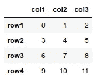

如果你现在做`df.drop(labels=[‘row1’], axis=0)`，你会得到的回报是

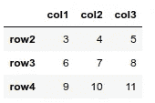

如果你做了`df.drop(labels=[‘col2’], axis=1)`，你会得到

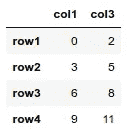

显然，`axis=0`表示行，`axis=1`表示列。那么，为什么 NumPy sum 的做法不同呢？

# 解决办法

引用 [Aerin Kim](https://medium.com/@aerinykim) 在她的[帖子](https://medium.com/@aerinykim/numpy-sum-axis-intuition-6eb94926a5d1)中的话，她写道

> *的方式来理解 numpy 的* ***轴*** *求和就是将* ***折叠*** *指定轴。所以当它折叠轴 0(行)时，它就变成了一行和一列的总和。*

让我们看看这是什么意思。现在，它在 2D 可能会变得有点混乱，所以让我们首先在一个更高的维度上理解这一点，然后我们将逐步进入 2D；就像她在岗位上做的一样。

所以，我们来取一个形状为`(4,3,2)`的 3D 数组。

```
three_d_array = np.arange(24).reshape(4,3,2)
```

`three_d_array`现在变成等于

```
array([[[ 0,  1],
        [ 2,  3],
        [ 4,  5]],

       [[ 6,  7],
        [ 8,  9],
        [10, 11]],

       [[12, 13],
        [14, 15],
        [16, 17]],

       [[18, 19],
        [20, 21],
        [22, 23]]])
```

现在，让我们看看沿第一轴的元素，`axis=0`。沿着`axis=0`我们有 4 个元素。这些可以用`three_d_array[0]`、`three_d_array[1]`、`three_d_array[2]`和`three_d_array[3]`查看

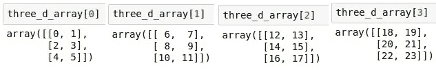

每一个都是形状为`(3,2)`的 2D 阵列。现在，如果我们把上面所有的 2D 阵列加起来，

```
three_d_array[0]+three_d_array[1]+three_d_array[2]+three_d_array[3]
```

在逐个元素相加之后，我们得到一个 3x2 的数组，如下所示:

```
array([[36, 40],
       [44, 48],
       [52, 56]])
```

这正是我们做`three_d_array.sum(axis=0)`时得到的结果。我们将带走`axis=0`的所有元素。然后我们一个元素一个元素地求和。最初，我们有一个 3D 形状数组`(4,3,2)`。求和之后，我们得到了一个形状为`(3,2)`的 2D 数组。于是，我们丢掉了第一轴`4`，保留了剩下的两根`(3,2)`。这可能就是 Kim 所说的“**它会折叠轴**”的意思。

现在，我们来看看`axis=1`。这次我们保持第一个轴不变，沿着第二个轴求和，`axis=1`。这里，我们有 12 个元素，从第一个轴 0 开始，每个轴上有 3 个元素。

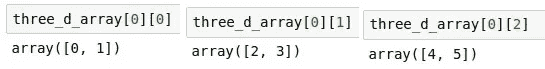

加上所有这些，我们回到

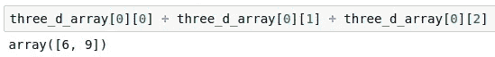

类似地，我们为剩下的三个添加

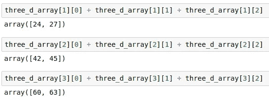

将所有 4 个组合起来，我们得到一个如下所示的数组:

```
array([[ 6,  9],
       [24, 27],
       [42, 45],
       [60, 63]])
```

这正是我们做`three_d_array.sum(axis=1)`时得到的；沿着`axis=1`逐个元素执行加法。同样，和矩阵的形状是`(4,2)`，这表明我们从原来的`(4,3,2)`中去掉了第二轴`3`。

对于最后的轴 2，我们做同样的事情。这次我们有所有 24 个元素，我们通过保持前两个轴不变来沿着`axis=2`求和。这里，我们只看前 6 个元素。

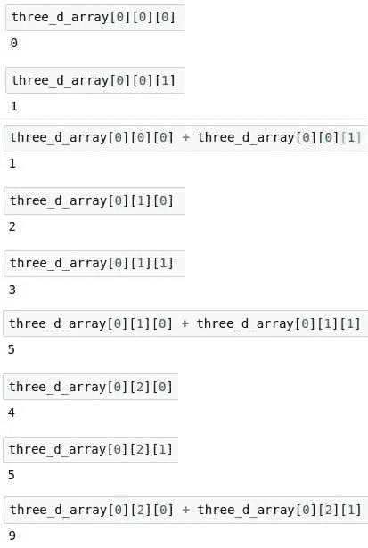

这给了我们一行 sum 数组。我们对剩下的部分做同样的事情，最后我们得到了下面的数组，

```
array([[ 1,  5,  9],
       [13, 17, 21],
       [25, 29, 33],
       [37, 41, 45]])
```

这正是我们在`three_d_array.sum(axis=2)`上得到的。同样，求和数组的形状是`(4,3)`，这里我们失去了最后一个轴`2`。

## 最后，回到最初的问题

我们的阵列是

```
a = array([[ 12., -22., -20., -19.,  -3.],
       [-23.,  21., -17., -11.,  -1.],
       [ -4.,  -5.,  16.,  -9., -14.],
       [-10.,  -6., -18.,  15.,  -8.],
       [-25.,  -2., -13.,  -7.,  24.]])
```

现在，当我们沿着`axis=0`移动元素时，我们得到

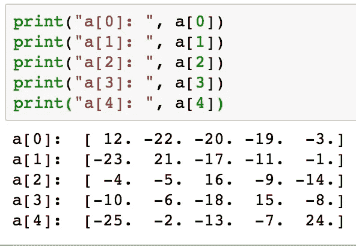

一个元素一个元素地添加这些元素给我们


这相当于`a.sum(axis=0)`。

类似地，当我们沿着`axis=1`提取元素时，

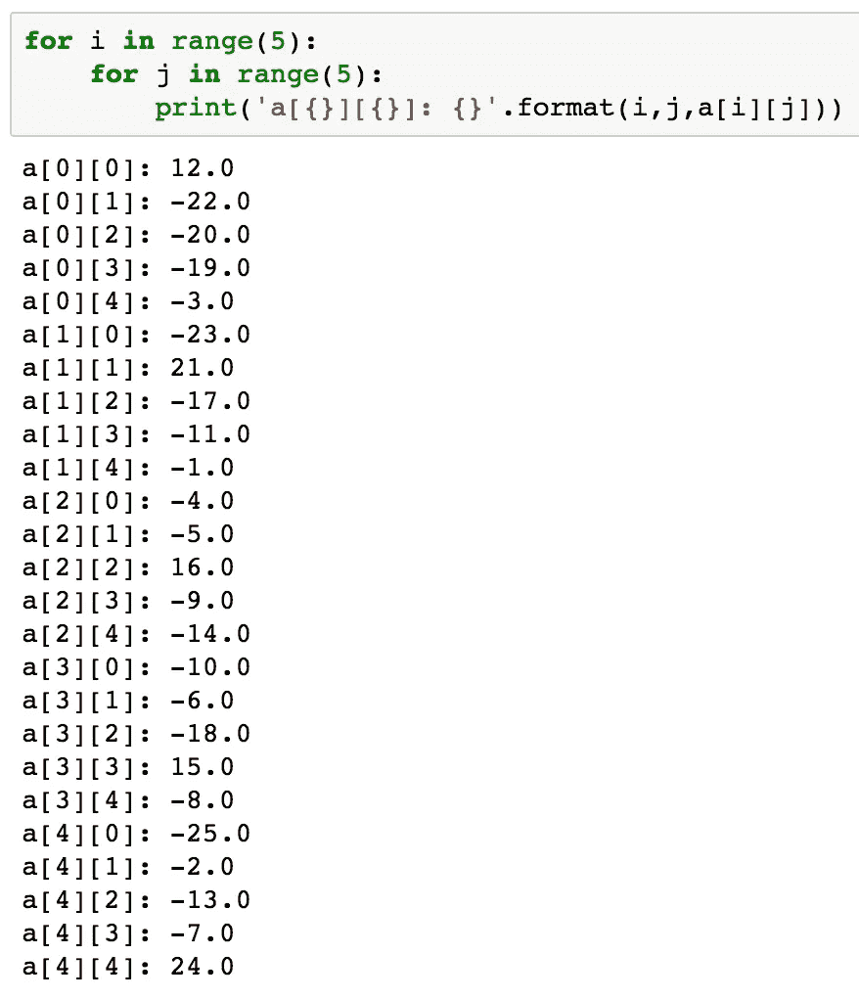

现在，如果我们分别对所有的`a[0]s`、所有的`a[1]s`、所有的`a[2]s`、所有的`a[3]s`和所有的`a[4]s`求和，我们得到

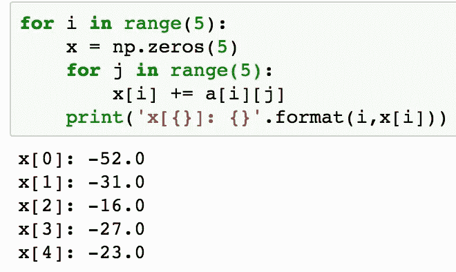

这就是我们用`a.sum(axis=1)`得到的。如果我们检查形状，我们得到`(5,)`。如果我们只看 2D 数组，这可能不清楚，但正如我们前面看到的，这只是折叠轴 1 并返回剩余轴 0 的形状。

现在，如果我们回头看看文档中的语句，“我们可以对数组的每一行求和，在这种情况下，我们沿着列或轴 1 操作”，我认为这更有意义。因此，尽管我们计算了每行的总和，但从技术上讲，这是一个**列相加**而不是**行相加**，因为 axis=0 是行，axis=1 是列。

为什么 NumPy 不像熊猫那样直截了当？嗯，老实说，我也不知道答案。但这就是饼干碎裂的方式。