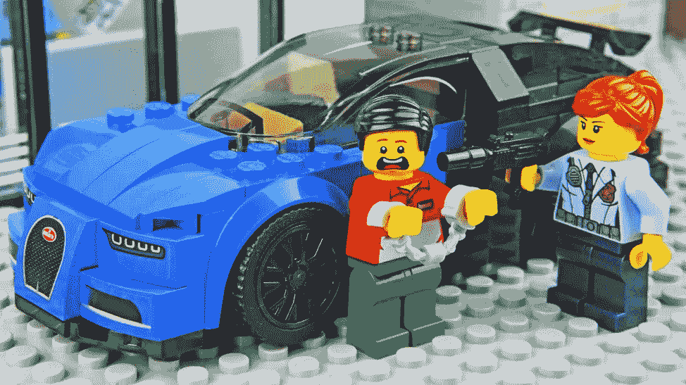
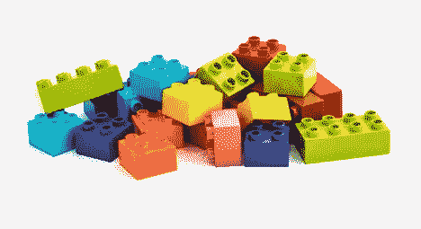
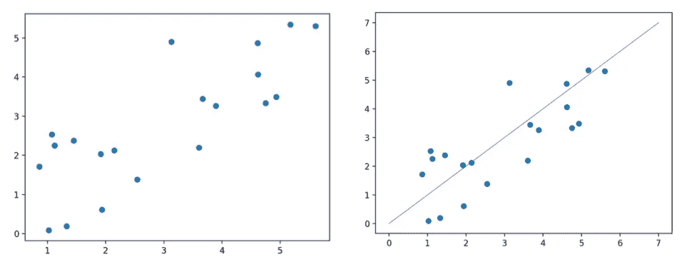
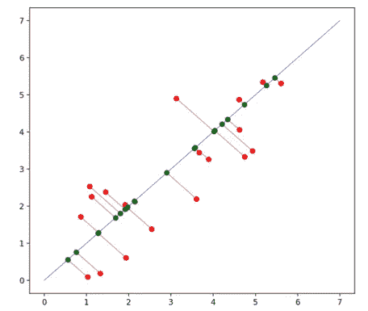
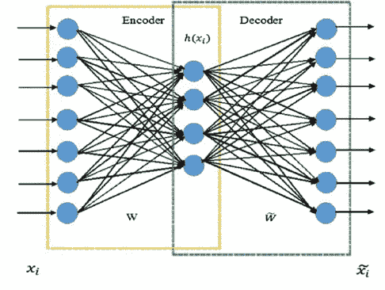
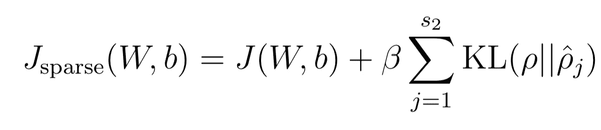

# PCA 和自动编码器:人人都能理解的算法

> 原文：<https://towardsdatascience.com/understanding-pca-autoencoders-algorithms-everyone-can-understand-28ee89b570e2?source=collection_archive---------5----------------------->

本文的主要重点是为主成分分析(PCA)和 Autoencoder 数据转换技术提供直觉。我不打算深入研究支撑这些模型的数学理论，因为已经有太多的资源可用了。

Source: [FK Films](https://www.youtube.com/watch?v=ICY5cfCeUic)

**简介:**

自动编码器通过组合数据最重要的特征，将它们输入的数据映射到一个较低的维度空间。他们*将原始数据*编码成更紧凑的表示，并决定如何组合数据，因此在 Autoencoder 中有了 *auto* 。这些编码特征通常被称为潜在变量。

有几个原因可以说明这样做是有用的:

1.降维可以减少训练时间

2.使用潜在特征表示可以提高模型性能

像机器学习中的许多概念一样，自动编码器看起来很深奥。如果你不熟悉潜在变量，潜在变量本质上是一些数据的隐含特征。这是一个无法直接观察或测量的变量。例如，幸福是一个潜在的变量。我们必须使用类似问卷调查的方法来推断一个人的幸福程度。

像自动编码器模型一样，主成分分析(PCA)也被广泛用作降维技术。但是，PCA 算法映射输入数据的方式与自动编码器不同。

**直觉:**

假设你有一套很棒的跑车乐高玩具，想送给你的朋友作为生日礼物，但是你的盒子不够大，装不下所有的乐高玩具。你决定打包最重要的乐高零件——对汽车制造贡献最大的零件，而不是根本不送。所以，你扔掉一些琐碎的零件，如门把手和挡风玻璃雨刷，打包一些零件，如车轮和框架。然后，你把盒子寄给你的朋友。收到包裹后，你的朋友对没有说明的各种乐高积木感到困惑。尽管如此，他们还是组装了该套件，并且能够识别出这是一辆可驾驶的车辆。可能是沙滩车、赛车或轿车——他们不知道。

上面的类比是有损数据压缩算法的一个例子。数据的质量没有完全保持。这是一个*有损*算法，因为一些原始数据(即乐高积木)已经丢失。虽然使用 PCA &自动编码器进行维数缩减是有损耗的，但是这个例子并没有准确地描述这些算法——它描述了一个特征选择算法。特征选择算法丢弃数据的一些特征并保留显著特征。它们保留的特征通常是出于统计原因而选择的，例如属性和目标标签之间的相关性。

## **主成分分析:**

假设一年过去了，你朋友的生日又快到了。你决定再给他们买一套乐高玩具汽车，因为他们去年告诉你他们有多爱他们的礼物。你也犯了一个大错，买了一个太小的盒子。这一次，你认为你可以更好地利用乐高，将它们系统地切割成更小的块。乐高积木的粒度更细，可以让你比上次装得更多。以前，收音机天线太高，放不进盒子里，但现在你把它切成三份，包括三份中的两份。当你的朋友收到邮寄的礼物时，他们会把某些零件粘在一起组装成汽车。他们能够将扰流器和一些轮毂盖粘合在一起，因此汽车更容易识别。接下来，我们将探索这个类比背后的数学概念。

*LEGO klodser©2015 LEGO/Palle Peter SkovP 1*

**阐述:**

PCA 的工作原理是将输入数据投影到数据协方差矩阵的特征向量上。协方差矩阵量化了数据的方差以及每个变量相对于另一个变量的变化程度。特征向量是通过线性变换保持其跨度的简单向量；也就是说，它们在变换前后指向相同的方向。协方差矩阵将原始基向量转换为每个变量之间的协方差方向。更简单地说，特征向量允许我们重新构建原始数据的方向，以便从不同的角度查看它，而无需实际转换数据。当我们将数据投影到这些向量上时，我们实质上是在提取每个变量中导致最大方差的分量。然后，我们可以使用协方差矩阵的特征值来选择主轴，因为它们反映了相应特征向量方向上的方差的大小。

Original Data (left) 1st Principal Component & Data (right)

这些投影产生一个新的空间，其中每个基向量包含最大的方差(即，在具有最大特征值的特征向量上的投影具有最大的方差，在第二特征向量上的投影具有第二大的方差，等等)。).这些新的基向量被称为主分量。我们希望主成分朝着最大方差的方向，因为属性值的方差越大，预测能力越强。例如，假设您试图预测一辆汽车的价格，给定两个属性:颜色和品牌。假设所有的车颜色都一样，但是其中有很多品牌。在这个例子中，根据颜色猜测汽车的价格是不可能的，因为颜色是一个零方差的特性。然而，如果我们考虑一个有更多变化的特征——品牌——我们将能够得出更好的价格估计，因为奥迪和法拉利的价格往往高于本田和丰田。PCA 产生的主要成分是输入变量的线性组合，就像胶合的乐高积木是原件的线性组合一样。这些主成分的线性性质也允许我们解释转换后的数据。

Data projected onto 1st principal component (Source: Author)

**PCA 优点:**

*   降低维度
*   可解释的
*   快速运行时间

**PCA 缺点:**

*   不能学习非线性特征表示

## **自动编码器:**

Autoencoder Architecture

自动编码器的事情变得有点奇怪。你不再只是切割积木，而是开始融化、拉长和弯曲整个乐高积木，这样最终的积木代表了汽车最重要的特征，同时又符合盒子的限制。这样做不仅可以让你在盒子里放入更多的乐高积木，还可以让你定制积木。这很好，但是当包裹到达时，你的伙伴不知道如何处理它。对他们来说，它只是看起来像一堆随机操纵的乐高积木。事实上，这些零件是如此的不同，以至于你需要对几辆车重复这个过程无数次，以一种系统的方式将原始零件转化为可以由你的朋友组装到汽车上的零件。

**阐述:**

希望上面的类比有助于理解自动编码器如何类似于 PCA。在自动编码器的环境中，你是编码器，你的朋友是解码器。你的工作是以一种解码器可以解释的方式转换数据，然后以最小的误差重建。

自动编码器只是一个重新设计的前馈神经网络。我不打算在这里深究本质细节，但可以随意查看 [Piotr Skalski 的伟大文章](/https-medium-com-piotr-skalski92-deep-dive-into-deep-networks-math-17660bc376ba)或[深度学习书籍](http://www.deeplearningbook.org/)以获得对神经网络更全面的了解。

尽管它们能够学习复杂的特征表示，但自动编码器最大的缺陷在于它们的可解释性。就像你的朋友收到扭曲的乐高玩具时毫无头绪一样，我们也不可能想象和理解非视觉数据的潜在特征。接下来，我们将研究稀疏自动编码器。

**自动编码器优点:**

*   能够学习非线性特征表示
*   降低维度

**自动编码器缺点:**

*   训练的计算成本很高
*   无法解释的
*   更复杂
*   倾向于过度拟合，虽然这可以通过正则化来减轻

**稀疏自动编码器:**

Sparse Autoencoder Loss Function (Source: Andrew Ng)

认为人类没有充分利用大脑能力的观点是基于神经科学研究的误解，该研究表明大脑中最多有 1 %- 4%的神经元同时放电。人类大脑中神经元的稀疏放电可能有几个好的进化原因。如果所有神经元同时放电，我们能够“释放大脑的真正潜力”，它可能看起来像[这个](https://youtu.be/-kdkFJa2VJM?t=15s)。我希望你喜欢这个题外话。回到神经网络。大脑中突触的稀疏性可能是稀疏自动编码器的灵感来源。整个神经网络中的隐藏神经元学习输入数据的分级特征表示。我们可以认为，当一个神经元看到它正在寻找的输入数据的特征时，它就“触发”了。传统的自动编码器依靠其欠完整架构(欠完整意味着隐藏层比输入层包含更少的单元)来强制学习潜在特征。稀疏自动编码器背后的想法是，我们可以通过与架构无关的约束(稀疏性约束)来迫使模型学习潜在的特征表示。

稀疏性约束是我们想要的平均隐藏层激活，并且通常是接近零的浮点值。稀疏约束超参数在上面的函数中用希腊字母 rho 表示。hat j 表示隐藏单元 j 的平均激活度。

我们使用 KL 散度对模型施加这种约束，并用β对这种施加进行加权。简而言之，KL 散度衡量两个分布的不相似性。将此项添加到我们的损失函数中激励模型优化参数，使得激活值的分布和稀疏参数的均匀分布之间的 KL 散度最小化。

将激活限制在接近零意味着神经元只会在优化准确性最关键的时候触发。KL 散度意味着神经元也会因为过于频繁的放电而受到惩罚。如果你有兴趣了解更多关于稀疏自动编码器的知识，我强烈推荐你阅读这篇文章。吴恩达的这些讲座([讲座 1](https://www.youtube.com/watch?v=vfnxKO2rMq4) 、[讲座 2](https://www.youtube.com/watch?v=wqhZaWR-J94) )也是很好的资源，帮助我更好地理解支撑自动编码器的理论。

## **结论:**

在整篇文章中，我们深入研究了 PCA 和自动编码器背后的概念。不幸的是，没有灵丹妙药。PCA 和自动编码器模型之间的决定是依情况而定的。在许多情况下，PCA 更优越——它更快，更容易解释，可以像自动编码器一样减少数据的维数。如果你能雇用 PCA，你应该。但是，如果您正在处理的数据需要高度非线性的特征表示来获得足够的性能或可视化，PCA 可能会有所不足。在这种情况下，训练自动编码器可能是值得的。再者，即使自动编码器产生的潜在特征提高了模型性能，这些特征的模糊性对知识发现构成了障碍。

感谢阅读！我希望你喜欢这篇文章，并获得一些有用的见解。如果你做了，请随意留下掌声！感谢建设性的反馈。

**参考文献**:

神经科学研究:[https://www . science direct . com/science/article/pii/s 0960982203001350？通过%3Dihub](https://www.sciencedirect.com/science/article/pii/S0960982203001350?via%3Dihub)

[https://www . coursera . org/learn/neural-networks/lecture/JiT1i/from-PCA-to-auto encoders-5-mins](https://www.coursera.org/learn/neural-networks/lecture/JiT1i/from-pca-to-autoencoders-5-mins)

[https://arxiv.org/pdf/1801.01586.pdf](https://arxiv.org/pdf/1801.01586.pdf)

**其他图像来源:**

自动编码器架构:

*   基于稀疏过完备特征的高压缩测量值的轴承故障智能状态监测方法 ResearchGate 上的科学数字。可从:[https://www . research gate . net/auto encoder-architecture _ fig 1 _ 318204554](https://www.researchgate.net/Autoencoder-architecture_fig1_318204554)获取【2018 年 9 月 4 日】

另一篇值得一读的文章:https://Neptune . ai/blog/understanding-re presentation-learning-with-auto encoder-everything-you-Neptune-to-know-about-re presentation-and-feature-learning