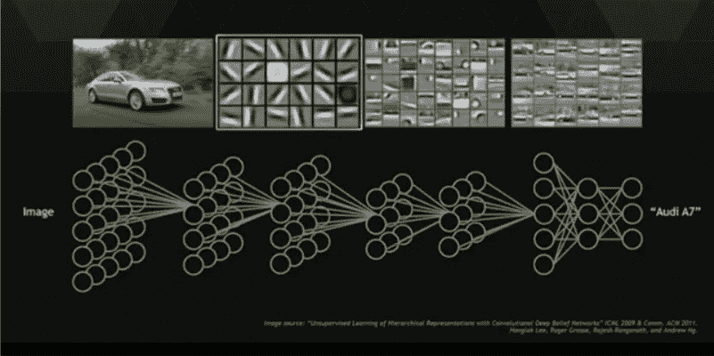
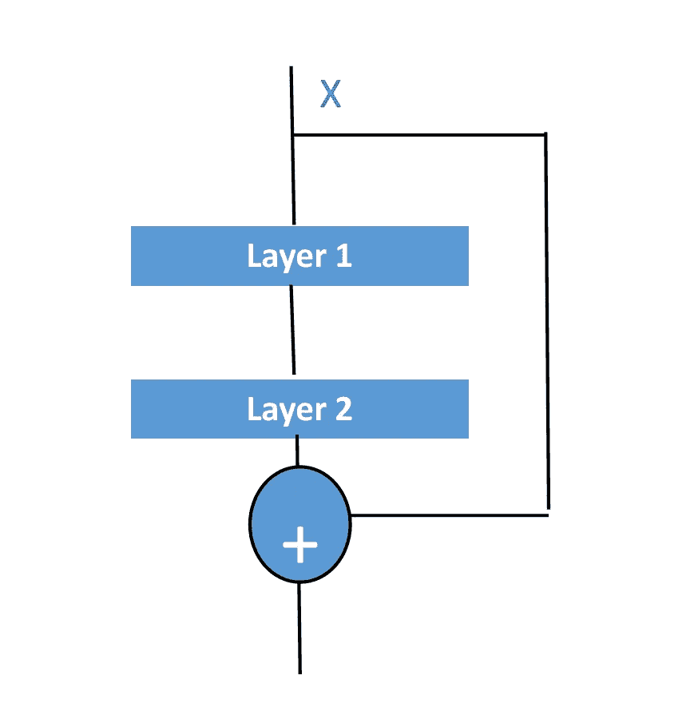

# 了解剩余网络

> 原文：<https://towardsdatascience.com/understanding-residual-networks-9add4b664b03?source=collection_archive---------1----------------------->



由于大型数据集和强大的 GPU 的可用性，图像识别近年来取得了进展，这使得非常深入的架构训练成为可能。Simonyan 等人,《VGG》的作者证明了通过简单地堆叠更多的层，我们可以提高精确度，在此之前，Yoshua Bengio 在他的专著《学习人工智能的深度架构》中对深度架构的有效性进行了令人信服的理论分析。
在以前的帖子中，我演示了如何将各种技术应用于卷积神经网络，包括批量标准化、丢弃和数据扩充。通过简单地叠加越来越多的卷积-批量归一化-relu 层，能建立更精确的系统吗？在某种程度上，精确度会提高，但是超过大约 25+层，精确度会下降。
明凯等人 2015 首次演示了深度问题，并提出了一个卓越的解决方案，此后允许训练超过 2000 层！越来越准确。在这篇文章中，我将解释他们的技术以及如何应用。
首先，由于渐变消失，许多层的精度下降，随着层深入，渐变变小，导致性能变差。这与过度拟合无关，因此，辍学者无法挽救它。微软亚洲研究院的何和他的同事设计的最终解决方案是引入剩余连接。这只是描述将先前层的输出连接到新层的输出的简单术语。
假设您有一个七层网络。在残差设置中，不仅要将第 1 层的输出传递到第 2 层，还要将第 1 层的输出加到第 2 层的输出上。
在标准网络中用***【f(x)*** *表示每一层 ***y = f(x)***
然而，在残差网络中，
***y = f(x)+x****

**

*Typical Structure of A Resnet Module*

*应用这一原理，作者赢得了 Imagenet 2015 ，并在所有标准计算机视觉基准测试中取得了新的最先进的结果。这个想法后来被扩展到深度学习的所有其他领域，包括语音和自然语言处理。*

*基础数学讲够了，让我们用代码来弄脏我们的手。*

*标准的两层模块如下*

```
***def** Unit(x,filters):

    out = BatchNormalization()(x)
    out = Activation(**"relu"**)(out)
    out = Conv2D(filters=filters, kernel_size=[3, 3], strides=[1, 1], padding=**"same"**)(out)

    out = BatchNormalization()(out)
    out = Activation(**"relu"**)(out)
    out = Conv2D(filters=filters, kernel_size=[3, 3], strides=[1, 1], padding=**"same"**)(out)

    **return** out* 
```

*概括地说，在这个模块中，我们传入一个输入 x，对它进行批处理规范化— relu- conv2d，然后输出通过同一个堆栈。*

*下面是一个 resnet 模块*

```
***def** Unit(x,filters):
    res = x
    out = BatchNormalization()(x)
    out = Activation(**"relu"**)(out)
    out = Conv2D(filters=filters, kernel_size=[3, 3], strides=[1, 1], padding=**"same"**)(out)

    out = BatchNormalization()(out)
    out = Activation(**"relu"**)(out)
    out = Conv2D(filters=filters, kernel_size=[3, 3], strides=[1, 1], padding=**"same"**)(out)

    out = keras.layers.add([res,out])

    **return** out*
```

*这看起来非常相似，但有一个主要区别，首先，我们存储一个对原始输入的引用“res ”,在通过 batchnorm-relu-conv 层后，我们将输出添加到残差中，为了清楚起见，这是在该行中完成的*

```
*out = keras.layers.add([res,out])*
```

*这部分对应方程 ***y = f(x) + x****

*因此，我们可以通过将许多模块堆叠在一起来构建一个 resnet。*

*在此之前，我们需要稍微修改一下代码来考虑池。*

```
***def** Unit(x,filters,pool=**False**):
    res = x
    **if** pool:
        x = MaxPooling2D(pool_size=(2, 2))(x)
        res = Conv2D(filters=filters,kernel_size=[1,1],strides=(2,2),padding=**"same"**)(res)
    out = BatchNormalization()(x)
    out = Activation(**"relu"**)(out)
    out = Conv2D(filters=filters, kernel_size=[3, 3], strides=[1, 1], padding=**"same"**)(out)

    out = BatchNormalization()(out)
    out = Activation(**"relu"**)(out)
    out = Conv2D(filters=filters, kernel_size=[3, 3], strides=[1, 1], padding=**"same"**)(out)

    out = keras.layers.add([res,out])

    **return** out*
```

*请注意上面的一些内容，当我们合并时，我们输出的维数将不再匹配我们残差的维数，因此，我们不仅将合并应用于输入，而且残差也将通过步长为 1×1 的 conv 变换，该变换将滤波器投影为与输出相同，并且步长为 2 将是维数的一半，就像最大合并一样。*

*解释完之后，我现在将给出完整的答案。*

```
***def** Unit(x,filters,pool=**False**):
    res = x
    **if** pool:
        x = MaxPooling2D(pool_size=(2, 2))(x)
        res = Conv2D(filters=filters,kernel_size=[1,1],strides=(2,2),padding=**"same"**)(res)
    out = BatchNormalization()(x)
    out = Activation(**"relu"**)(out)
    out = Conv2D(filters=filters, kernel_size=[3, 3], strides=[1, 1], padding=**"same"**)(out)

    out = BatchNormalization()(out)
    out = Activation(**"relu"**)(out)
    out = Conv2D(filters=filters, kernel_size=[3, 3], strides=[1, 1], padding=**"same"**)(out)

    out = keras.layers.add([res,out])

    **return** out**def** MiniModel(input_shape):
    images = Input(input_shape)
    net = Conv2D(filters=32, kernel_size=[3, 3], strides=[1, 1], padding=**"same"**)(images)
    net = Unit(net,32)
    net = Unit(net,32)
    net = Unit(net,32)

    net = Unit(net,64,pool=**True**)
    net = Unit(net,64)
    net = Unit(net,64)

    net = Unit(net,128,pool=**True**)
    net = Unit(net,128)
    net = Unit(net,128)

    net = Unit(net, 256,pool=**True**)
    net = Unit(net, 256)
    net = Unit(net, 256)

    net = BatchNormalization()(net)
    net = Activation(**"relu"**)(net)
    net = Dropout(0.25)(net)

    net = AveragePooling2D(pool_size=(4,4))(net)
    net = Flatten()(net)
    net = Dense(units=10,activation=**"softmax"**)(net)

    model = Model(inputs=images,outputs=net)

    **return** model*
```

*这不包括训练代码，你可以看到，下面是训练代码，纪元设置为 50 个纪元。*

*你可以用[谷歌实验室](https://colab.research.google.com)在 GPU 上免费运行这个*

```
**#import needed classes* **import** keras
**from** keras.datasets **import** cifar10
**from** keras.layers **import** Dense,Conv2D,MaxPooling2D,Flatten,AveragePooling2D,Dropout,BatchNormalization,Activation
**from** keras.models **import** Model,Input
**from** keras.optimizers **import** Adam
**from** keras.callbacks **import** LearningRateScheduler
**from** keras.callbacks **import** ModelCheckpoint
**from** math **import** ceil
**import** os
**from** keras.preprocessing.image **import** ImageDataGenerator

**def** Unit(x,filters,pool=**False**):
    res = x
    **if** pool:
        x = MaxPooling2D(pool_size=(2, 2))(x)
        res = Conv2D(filters=filters,kernel_size=[1,1],strides=(2,2),padding=**"same"**)(res)
    out = BatchNormalization()(x)
    out = Activation(**"relu"**)(out)
    out = Conv2D(filters=filters, kernel_size=[3, 3], strides=[1, 1], padding=**"same"**)(out)

    out = BatchNormalization()(out)
    out = Activation(**"relu"**)(out)
    out = Conv2D(filters=filters, kernel_size=[3, 3], strides=[1, 1], padding=**"same"**)(out)

    out = keras.layers.add([res,out])

    **return** out

*#Define the model* **def** MiniModel(input_shape):
    images = Input(input_shape)
    net = Conv2D(filters=32, kernel_size=[3, 3], strides=[1, 1], padding=**"same"**)(images)
    net = Unit(net,32)
    net = Unit(net,32)
    net = Unit(net,32)

    net = Unit(net,64,pool=**True**)
    net = Unit(net,64)
    net = Unit(net,64)

    net = Unit(net,128,pool=**True**)
    net = Unit(net,128)
    net = Unit(net,128)

    net = Unit(net, 256,pool=**True**)
    net = Unit(net, 256)
    net = Unit(net, 256)

    net = BatchNormalization()(net)
    net = Activation(**"relu"**)(net)
    net = Dropout(0.25)(net)

    net = AveragePooling2D(pool_size=(4,4))(net)
    net = Flatten()(net)
    net = Dense(units=10,activation=**"softmax"**)(net)

    model = Model(inputs=images,outputs=net)

    **return** model

*#load the cifar10 dataset* (train_x, train_y) , (test_x, test_y) = cifar10.load_data()

*#normalize the data* train_x = train_x.astype(**'float32'**) / 255
test_x = test_x.astype(**'float32'**) / 255

*#Subtract the mean image from both train and test set* train_x = train_x - train_x.mean()
test_x = test_x - test_x.mean()

*#Divide by the standard deviation* train_x = train_x / train_x.std(axis=0)
test_x = test_x / test_x.std(axis=0)

datagen = ImageDataGenerator(rotation_range=10,
                             width_shift_range=5\. / 32,
                             height_shift_range=5\. / 32,
                             horizontal_flip=**True**)

*# Compute quantities required for featurewise normalization
# (std, mean, and principal components if ZCA whitening is applied).* datagen.fit(train_x)

*#Encode the labels to vectors* train_y = keras.utils.to_categorical(train_y,10)
test_y = keras.utils.to_categorical(test_y,10)

*#define a common unit* input_shape = (32,32,3)
model = MiniModel(input_shape)

*#Print a Summary of the model* model.summary()
*#Specify the training components* model.compile(optimizer=Adam(0.001),loss=**"categorical_crossentropy"**,metrics=[**"accuracy"**])

epochs = 50
steps_per_epoch = ceil(50000/128)

*# Fit the model on the batches generated by datagen.flow().* model.fit_generator(datagen.flow(train_x, train_y, batch_size=128),
                    validation_data=[test_x,test_y],
                    epochs=epochs,steps_per_epoch=steps_per_epoch, verbose=1, workers=4)

*#Evaluate the accuracy of the test dataset* accuracy = model.evaluate(x=test_x,y=test_y,batch_size=128)
model.save(**"cifar10model.h5"**)*
```

*希望你喜欢这一点，未来的帖子将致力于通过宽度和深度轻松扩展剩余网络的方法，以及调整学习速度的方法。*

*玩得开心，别忘了留下一些掌声！*

*你可以随时在推特上通过 [@johnolafenwa](https://twitter.com/johnolafenwa) 联系我*