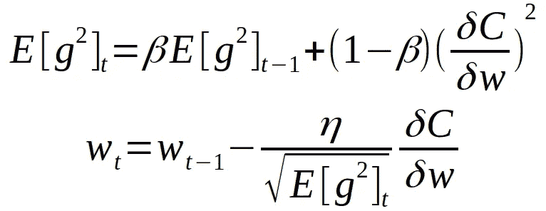

# 了解 RMSprop —更快的神经网络学习

> 原文：<https://towardsdatascience.com/understanding-rmsprop-faster-neural-network-learning-62e116fcf29a?source=collection_archive---------1----------------------->

*免责声明:我假定关于神经网络优化算法的基础知识。特别是关于* [*SGD*](/how-do-we-train-neural-networks-edd985562b73) *和* [*SGD 带动量*](/stochastic-gradient-descent-with-momentum-a84097641a5d) *的知识，会对理解这篇帖子很有帮助。*

# **一、简介**

RMSprop—是为神经网络设计的未发布的优化算法，由 [Geoff Hinton](https://en.wikipedia.org/wiki/Geoffrey_Hinton) 在在线课程“[用于机器学习的神经网络](https://www.coursera.org/learn/neural-networks/home/welcome)”【1】的第 6 讲中首次提出。RMSprop 属于自适应学习率方法领域，这种方法近年来越来越受欢迎，但也受到一些批评[6]。它因没有出版而出名，但却非常出名；大多数深度学习框架都包括开箱即用的实现。

有两种方法可以引入 RMSprop。首先，将它视为 rprop 算法对小批量学习的适应。这是开发这种算法的最初动机。另一种方法是看看它与 Adagrad[2]的相似之处，并将 RMSprop 视为应对其学习率急剧下降的一种方式。我将尝试触及这两点，这样就能更清楚为什么这个算法有效。

# 二。RPROP

让我们先来了解一下`rprop`——用于整批优化的算法。Rprop [3]试图解决梯度幅度可能变化很大的问题。一些梯度可能很小，而另一些可能很大，这导致了非常困难的问题——试图为算法找到单一的全局学习速率。如果我们使用整批学习，我们可以通过只使用梯度的符号来处理这个问题。这样，我们可以保证所有权重更新的大小相同。这种调整对鞍点和平台有很大帮助，因为我们即使在很小的坡度下也能迈出足够大的步伐。请注意，我们不能仅仅通过提高学习率来做到这一点，因为我们在大梯度下采取的步骤会更大，这将导致发散。Rprop 结合了仅使用梯度符号的思想和为每个权重单独调整步长的思想。因此，我们不看梯度的大小，而是看为特定权重定义的步长。步长随着时间的推移而不断调整，这样我们就可以朝着我们需要的方向加速学习。为了调整某些权重的步长，使用以下算法:

1.  首先，我们看看重量的最后两个梯度的符号。
2.  如果它们具有相同的符号，这意味着我们正朝着正确的方向前进，并且应该将它加速一小部分，这意味着我们应该成倍地增加步长(例如，增加 1.2 倍)。如果它们不同，这意味着我们做了太大的步长并且跳过了局部最小值，因此我们应该成倍地减小步长(例如通过因子 0.5)。
3.  然后，我们将步长限制在两个值之间。这些值实际上取决于您的应用程序和数据集，默认的好值是 50 和百万分之一，这是一个好的开始。
4.  现在我们可以应用权重更新。

注意，作者定义了不同版本的 rprop 算法。为了让您熟悉它，我已经展示了最简单的一个。虽然我喜欢用等式正式定义优化算法，但这种算法最好通过代码来表达；因此，rprop 更新规则的最简单版本如下所示:

# 三。Rprop 至 RMSprop

当我们拥有非常大的数据集并且需要执行小批量权重更新时，Rprop 实际上不起作用。为什么它不适用于小批量？人们已经尝试过了，但是发现很难成功。它不起作用的原因是它违反了随机梯度下降背后的中心思想，即当我们有足够小的学习率时，它会在连续的小批量上平均梯度。考虑重量，九个小批量的梯度为 0.1，十分之一小批量的梯度为-0.9。我们想要的是这些梯度大致互相抵消，这样保持大致相同。但 rprop 不是这样。使用 rprop，我们将权重增加 9 次，只减少一次，因此权重会增加很多。

要结合 rprop 的稳定性(仅通过使用梯度的符号)、我们从小批量获得的效率以及对小批量求平均值(允许以正确的方式结合梯度)，我们必须从不同的角度来看待 rprop。Rprop 相当于使用梯度，但也除以梯度的大小，因此无论特定梯度有多小，我们都会得到相同的幅度。小批量的问题是，我们每次除以不同的梯度，那么为什么不强制我们除以的数字对于相邻的小批量是相似的呢？`RMSprop`的中心思想是保持每个权重的平方梯度的移动平均值。然后我们将梯度除以均方根。这就是它被称为 RMSprop(均方根)的原因。使用数学等式，更新规则如下所示:

E[g] — moving average of squared gradients. dC/dw — gradient of the cost function with respect to the weight. n — learning rate. Beta — moving average parameter (good default value — 0.9)

从上面的等式可以看出，我们通过除以梯度的平方根来调整学习率，但是由于我们只有当前小批量的梯度估计值，因此我们需要使用它的移动平均值。您可以在项目中使用的移动平均参数的默认值是 0.9。对于大多数应用程序来说，它工作得非常好。在代码中，该算法可能如下所示:

# 四。与阿达格拉德相似。

Adagrad[2]是自适应学习速率算法，看起来很像 RMSprop。Adagrad 基于每个维度中的历史平方和添加元素式渐变缩放。这意味着我们保留了一个梯度平方和。然后我们通过除以总和来调整学习率。在代码中，我们可以这样表达它:

当我们有高条件数时，这个比例有什么作用？如果我们有两个坐标——一个总是有大的梯度，另一个有小的梯度，我们将通过相应的大或小的数字潜水，所以我们在小的方向上加速运动，在梯度大的方向上，我们将减速，因为我们除以某个大的数字。

培训过程中会发生什么？步数变得越来越小，因为我们在训练中不断更新增长的平方梯度。所以我们每次都除以较大的数。在凸优化中，这很有意义，因为当我们接近 minina 时，我们希望慢下来。在非凸的情况下，这是不好的，因为我们可以卡在鞍点。我们可以将 RMSprop 视为解决这一问题的算法。

使用 RMSprop，我们仍然保留平方梯度的估计值，但我们保留了它的移动平均值，而不是让该估计值在训练中不断累积。

# 动词 （verb 的缩写）结果

我[为不同的优化算法找到了这些令人敬畏的可视化效果](https://imgur.com/a/Hqolp#NKsFHJb),展示了它们在不同情况下的表现。

Source: [https://imgur.com/a/Hqolp#NKsFHJb](https://imgur.com/a/Hqolp#NKsFHJb)

如你所见，在[鞍点](https://en.wikipedia.org/wiki/Saddle_point)的情况下，RMSprop(黑线)直线下降，梯度有多小并不重要，RMSprop 缩放学习速率，因此算法通过鞍点的速度比大多数算法都快。

Source: [https://imgur.com/a/Hqolp#NKsFHJb](https://imgur.com/a/Hqolp#NKsFHJb)

在这种情况下，算法从初始梯度非常大的点开始。RMSprop(黑线)走的几乎是最优路径，而动量法超调很多。阿达格拉德在那一瞬间变得不稳定。

# 不及物动词结论(了解更多信息)

RMSprop 是一款优秀、快速且非常受欢迎的优化器。[Andrej Karpathy](https://medium.com/@karpathy?source=post_header_lockup)[的《机器学习趋势一瞥](https://medium.com/@karpathy/a-peek-at-trends-in-machine-learning-ab8a1085a106)【4】显示，它是深度学习中使用的最流行的优化算法之一，其受欢迎程度仅次于 Adam【5】。如果你想了解更多关于深度学习中的优化，你应该查看以下一些来源:

1.  [Sebastian Ruder 的博客](http://ruder.io/optimizing-gradient-descent/index.html#fn:15)有几篇关于深度学习优化趋势的文章。
2.  [fast.ai](http://fast.ai) 是一门很棒的关于深度学习的课程，他们通过最流行的优化算法，在 excel 表格上解释它们。
3.  [吴恩达在 coursera](https://www.coursera.org/learn/deep-neural-network/home/welcome) 上的深度学习专业的第二门课程也触及了流行的算法，以非常清晰的方式解释了它们。

# 七。参考

[1] [Geoffrey Hinton 用于机器学习的神经网络 nline 课程。https://www.coursera.org/learn/neural-networks/home/welcome](https://www.coursera.org/learn/neural-networks/home/welcome)

[2]阿达格勒:杜奇，j .，哈赞，e .，辛格，Y. (2011 年)。在线学习和随机优化的自适应次梯度方法。机器学习研究杂志，12，2121–2159。从 http://jmlr.org/papers/v12/duchi11a.html[取回](http://jmlr.org/papers/v12/duchi11a.html)

[3]克里斯蒂安·伊格尔和迈克尔·̈usken(2000 年)。改进 Rprop 学习算法。【http://citeseerx.ist.psu.edu/viewdoc/summary? doi=10.1.1.17.1332

[4]安德烈·卡帕西(2017)。机器学习趋势一瞥。[https://medium . com/@ karpathy/a-peek-at-trends-in-machine-learning-ab8a 1085 a 106](https://medium.com/@karpathy/a-peek-at-trends-in-machine-learning-ab8a1085a106)

[5]金马，D. P .，&巴，J. L. (2015 年)。亚当:一种随机优化方法。学习表征国际会议，1–13

[6] [Ashia C. Wilson](https://papers.nips.cc/author/ashia-c-wilson-6459) [、Rebecca Roelofs](https://papers.nips.cc/author/rebecca-roelofs-10019) [、Mitchell Stern](https://papers.nips.cc/author/mitchell-stern-10020) [、Nati Srebro、](https://papers.nips.cc/author/nati-srebro-5014)[Benjamin Recht](https://papers.nips.cc/author/benjamin-recht-3537)(2017)机器学习中自适应梯度方法的边际价值。arXiv:1705.08292v2