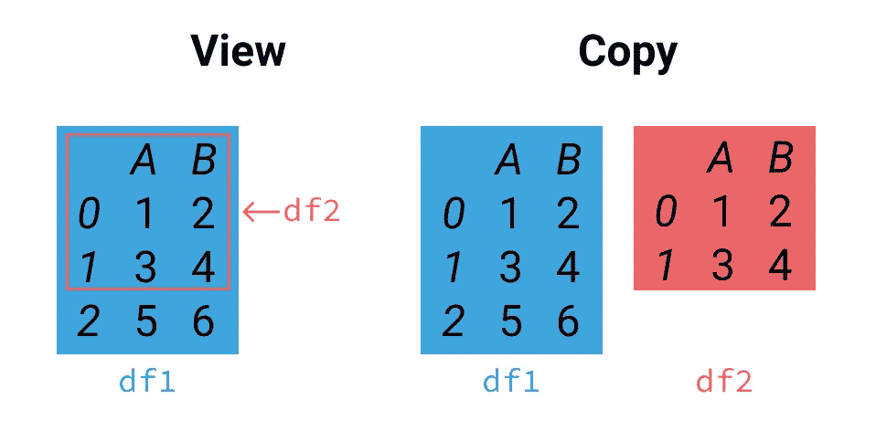
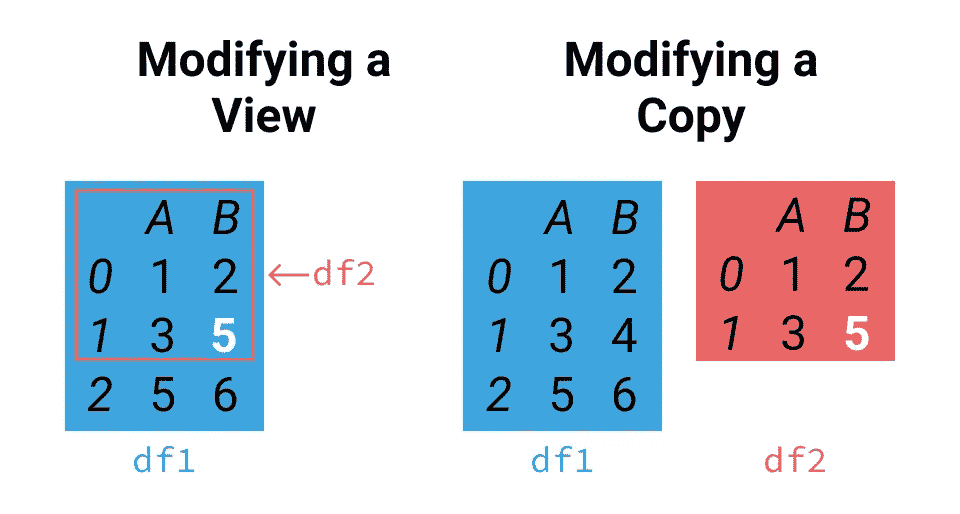
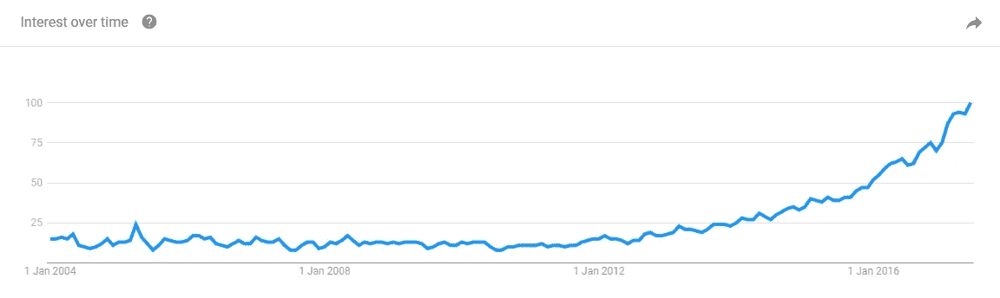

# 了解设置 SettingWithCopyWarning

> 原文：<https://towardsdatascience.com/understanding-settingwithcopywarning-7142952a01fa?source=collection_archive---------12----------------------->

[Photo](https://pixabay.com/photos/lighthouse-sea-horizon-coast-2225445/) from [Pixabay](https://pixabay.com/)

是人们在学习熊猫时遇到的最常见的障碍之一。快速的网络搜索会发现大量的堆栈溢出问题、GitHub 问题和来自程序员的论坛帖子，他们试图理解这个警告在他们的特定情况下意味着什么。这并不奇怪，许多人都在为此挣扎；有很多方法来索引 pandas [数据结构](https://en.wikipedia.org/wiki/Data_structure)，每种方法都有其独特的细微差别，甚至 pandas 本身也不能保证两行看起来相同的代码有一个单一的结果。

本指南解释了产生警告的原因，并向您展示了解决方法。它还包括引擎盖下的细节，让您更好地了解正在发生的事情，并提供了一些关于该主题的历史，让您了解为什么它都是这样工作的。

为了探究`SettingWithCopyWarning`，我们将使用《建模在线拍卖[一书](http://www.modelingonlineauctions.com/datasets)中易贝 3 天拍卖中销售的 Xboxes 价格的数据集。让我们来看看:

正如你所看到的，我们数据集的每一行都涉及到一次特定的易贝 Xbox 拍卖的单一出价。以下是对每列的简要描述:

*   `auctionid` —每个拍卖的唯一标识符。
*   `bid` —投标的价值。
*   `bidtime` —投标时拍卖的期限，以天为单位。
*   `bidder` —投标人的易贝用户名。
*   `bidderrate` -投标人的易贝用户评级。
*   `openbid` —卖家为拍卖设定的开价。
*   `price` —拍卖结束时胜出的出价。

# 什么是 SettingWithCopyWarning？

首先要明白的是`SettingWithCopyWarning`是一个警告，而不是一个错误。

虽然错误表明出现了问题，例如无效的语法或试图引用未定义的变量，但警告的作用是提醒程序员他们的代码存在潜在的错误或问题，而这些错误或问题在该语言中仍然是允许的操作。在这种情况下，警告很可能表示一个严重但不明显的错误。

`SettingWithCopyWarning`通知您您的操作可能没有按预期运行，您应该检查结果以确保没有出错。

如果您的代码仍然像预期的那样工作，忽略这个警告是很有诱惑力的。这是不好的做法，并且`SettingWithCopyWarning`不应该被**忽略。在采取行动之前，花些时间去理解为什么你会得到警告。**

为了理解`SettingWithCopyWarning`是关于什么的，理解 pandas 中的一些操作可以返回您的数据的视图，而其他操作将返回副本是有帮助的。

View vs copy

正如你在上面看到的，左边的视图`df2`只是原始视图`df1`的一个子集，而右边的副本创建了一个新的、唯一的对象`df2`。

当我们试图进行更改时，这可能会导致问题:

Modifying a view vs modifying a copy

根据我们正在做的事情，我们可能想要修改原始的`df1`(左)，或者我们可能想要只修改`df2`(右)。警告是让我们知道我们的代码可能做了一件事，而我们希望它做了另一件事。

稍后我们将深入探讨这个问题，但是现在让我们先来解决这个警告的两个主要原因以及如何修复它们。

# 链式分配

Pandas 在检测到一种叫做链式分配的东西时会发出警告。让我们定义几个我们将用来解释事情的术语:

*   赋值——设置值的操作，例如`data = pd.read_csv('xbox-3-day-auctions.csv')`。通常称为**组**。
*   访问—返回某个值的操作，例如下面的索引和链接示例。通常被称为 **get** 。
*   索引—引用数据子集的任何分配或访问方法；比如`data[1:5]`。
*   链接——连续使用多个索引操作；比如`data[1:5][1:3]`。

链式赋值是链接和赋值的组合。让我们快速看一个例子，它包含了我们之前加载的数据集。我们稍后将更详细地讨论这一点。为了这个例子，假设我们被告知用户`'parakeet2004'`的投标人评级不正确，我们必须更新它。让我们从当前值开始。

我们有三行来更新`bidderrate`字段；让我们继续做那件事。

哦不！我们神秘地发现了`SettingWithCopyWarning`！

如果我们看一下，我们可以看到在这种情况下，值没有改变:

生成该警告是因为我们将两个索引操作链接在一起。这更容易发现，因为我们已经使用了两次方括号，但是如果我们使用其他访问方法，如`.bidderrate`、`.loc[]`、`.iloc[]`、`.ix[]`等等，情况也是如此。我们的连锁经营包括:

*   `data[data.bidder == 'parakeet2004']`
*   `['bidderrate'] = 100`

这两个连锁操作一个接一个地独立执行。第一个是访问方法(get 操作)，它将返回一个包含所有行的`DataFrame`，其中`bidder`等于`'parakeet2004'`。第二个是赋值操作(set 操作)，在这个新的`DataFrame`上调用。我们根本没有在原来的`DataFrame`上操作。

解决方案很简单:使用`loc`将链接的操作组合成一个操作，这样 pandas 可以确保原始的`DataFrame`被设置。熊猫将始终确保不被束缚的集合操作(如下所示)正常工作。

这是警告建议我们做的，并且在这种情况下非常有效。

# 隐藏链接

接下来是人们遇到的第二种最常见的方式`SettingWithCopyWarning`。让我们调查中标情况。我们将创建一个新的数据框架来处理它们，注意使用`loc`，现在我们已经学习了关于链式赋值的课程。

我们可能会用 winners 变量写几行后续代码。

一个偶然的机会，我们在`DataFrame`中遇到了另一个错误。这一次，标记为`304`的行中缺少了`bidder`值。

为了我们的例子，让我们说，我们知道这个投标人的真实用户名，并更新我们的数据。

又一个`SettingWithCopyWarning`！但是我们用了`loc`，怎么又出现这种情况了？为了进行研究，让我们看看代码的结果:

这次成功了，那我们为什么会收到警告呢？

链式索引既可以出现在两行中，也可以出现在一行中。因为`winners`是作为 get 操作(`data.loc[data.bid == data.price]`)的输出创建的，所以它可能是原始`DataFrame`的副本，也可能不是，但是在我们检查之前没有办法知道！当我们索引`winners`时，我们实际上使用的是链式索引。

这意味着当我们试图修改`winners`时，我们可能也修改了`data`。

在真正的代码库中，这些代码行可能相隔很远，因此追踪问题的根源可能更困难，但情况是一样的。

为了防止在这种情况下出现警告，解决方案是明确地告诉 pandas 在我们创建新的数据帧时制作一个副本:

就是这样！就这么简单。

诀窍是学会识别链式索引，并不惜一切代价避免它。如果你想改变原来的，使用单一的赋值操作。如果你想要一份拷贝，确保你强迫熊猫这么做。这将节省时间，并使您的代码滴水不漏。

还要注意的是，即使`SettingWithCopyWarning`只会在你设置的时候出现，也最好避免 gets 的链式索引。链式操作速度较慢，如果您决定稍后添加赋值操作，会导致问题。

# 处理设置 SettingWithCopyWarning 的提示和技巧

在我们下面做更深入的分析之前，让我们拿出显微镜，看看`SettingWithCopyWarning`的一些细微之处和本质细节。

# 关闭警告

首先，如果不讨论如何显式控制`SettingWithCopy`设置，这篇文章将是不完整的。熊猫`mode.chained_assignment`选项可以取其中一个值:

*   `'raise'` —引发异常而不是警告。
*   `'warn'` —生成警告(默认)。
*   `None` —完全关闭警告。

例如，让我们关闭警告:

因为这不会给我们任何警告，所以除非你完全明白自己在做什么，否则不推荐这样做。如果你感到一丝怀疑，这是不可取的。一些开发人员非常认真地对待`SettingWithCopy`,并选择将其提升为一个例外，就像这样:

如果您的团队中有一个没有经验的 pandas 开发人员，或者一个需要高度严谨性或完整性的确定性的项目，这可能会特别有用。

使用该设置的更精确的方法是使用[上下文管理器](https://jeffknupp.com/blog/2016/03/07/python-with-context-managers/)。

如您所见，这种方法支持细粒度的警告抑制，而不是不加区别地影响整个环境。

# is_copy 属性

另一个可以用来避免警告的技巧是修改熊猫用来解释`SettingWithCopy`场景的工具之一。每个`DataFrame`都有一个默认为`None`的`is_copy`属性，但是如果是副本，则使用一个`[weakref](https://docs.python.org/3/library/weakref.html)`来引用源`DataFrame`。通过将`is_copy`设置为`None`，可以避免生成警告。

然而，请注意，这将**而不是**奇迹般地解决问题，但是它确实使 bug 检测变得非常困难。

# 单类型与多类型对象

值得强调的另一点是单数据类型和多数据类型对象之间的区别。如果一个`DataFrame`的所有列都是相同的数据类型，那么它就是单数据类型的；例如:

而如果`DataFrame`的列不都具有相同的数据类型，那么它就是多数据类型的，例如:

由于下面的*历史*部分解释的原因，在多数据类型对象上的索引器获取操作将总是返回一个副本。然而，主要为了提高效率，索引器对单数据类型对象的 get 操作几乎总是返回一个视图；这里需要注意的是，这取决于对象的内存布局，并且不能保证。

# 假阳性

假阳性，或无意中报告了连锁分配的情况，过去在早期版本的 pandas 中更常见，但后来基本上被消除了。为了完整起见，这里包括一些固定误报的例子是有用的。如果您在使用早期版本的 pandas 时遇到以下任何情况，那么可以安全地忽略或取消警告(或者通过升级来完全避免警告！)

使用用于[的当前列的值向`DataFrame`添加新列会生成警告](https://stackoverflow.com/q/42105859/604687)，但此问题已得到解决。

直到最近，当在一个`DataFrame`的片上使用`apply`方法设置时，一个假阳性[也发生了](https://stackoverflow.com/q/42190175/604687)，尽管这也已经被修复。

最后，直到版本 0.17.0，在`[DataFrame.sample](http://pandas.pydata.org/pandas-docs/stable/generated/pandas.DataFrame.sample.html)`方法中有一个错误导致了虚假的`SettingWithCopy`警告。`sample`方法现在每次都返回一个副本。

# 深度链式赋值

让我们重新使用之前的例子，我们试图用`'parakeet2004'`的`bidder`值更新`data`中每一行的`bidderrate`列。

pandas 用这个`SettingWithCopyWarning`真正告诉我们的是，我们代码的行为是不明确的，但是要理解为什么是这样以及警告的措辞，回顾一些概念将是有帮助的。

我们之前简单地讨论了视图和副本。有两种方法可以访问一个`DataFrame`的子集:要么在内存中创建一个对原始数据的引用(一个视图)，要么将子集复制到一个新的、更小的`DataFrame`(一个副本)。视图是查看原始数据特定部分的一种方式，而副本是数据在内存中新位置的 T21 克隆。正如我们前面的图表所示，修改视图会修改原始变量，但修改副本不会。

由于我们将在后面讨论的原因，熊猫的“get”操作的输出不能保证。当您索引一个 pandas 数据结构时，可能会返回一个视图或一个副本，这意味着对一个`DataFrame`的 get 操作会返回一个新的`DataFrame`，其中可能包含:

*   原始对象中数据的副本。
*   对原始对象数据的引用，但不制作副本。

因为我们不知道会发生什么，每种可能性都有非常不同的行为，忽视警告是在玩火。

为了更清楚地说明视图、副本和这种模糊性，让我们创建一个简单的`DataFrame`并将其编入索引:

让我们将`df1`的子集分配给`df2`:

根据我们所了解的，我们知道`df2`可能是`df1`上的一个视图，或者是`df1`的一个子集的副本。

在我们着手解决这个问题之前，我们还需要再看一看链式索引。用`'parakeet2004'`扩展我们的例子，我们将两个索引操作链接在一起:

其中`__intermediate__`代表第一次调用的输出，对我们完全隐藏。请记住，如果我们使用属性访问，也会得到同样有问题的结果:

这同样适用于任何其他形式的链式调用**，因为我们正在生成这个中间对象**。

实际上，链式索引意味着不止一次调用`__getitem__`或`__setitem__`来完成一个操作。这些是[特殊的 Python 方法](https://docs.python.org/3/reference/datamodel.html#special-method-names)，通过在实现它们的类的实例上使用方括号来调用，这是所谓的[语法糖](https://en.wikipedia.org/wiki/Syntactic_sugar)的一个例子。让我们看看 Python 解释器将在我们的例子中执行什么。

您可能已经意识到，`SettingWithCopyWarning`是这个链式`__setitem__`调用的结果。您可以自己尝试一下——上面几行的功能完全相同。为了清楚起见，请注意第二个`__getitem__`调用(针对`bidder`列)是嵌套的，根本不属于这里的链接问题。

一般来说，如前所述，pandas 不保证 get 操作将返回数据的视图还是副本。如果在我们的例子中返回一个视图，那么我们的链式赋值中的第二个表达式将是对原始对象的`__setitem__`调用。但是，如果返回一个副本，将被修改的是该副本——原始对象不会被修改。

这就是警告所说的“试图在数据帧的切片副本上设置值”的含义。由于没有对该副本的引用，它最终将被[垃圾收集](https://en.wikipedia.org/wiki/Garbage_collection_%28computer_science%29)。`SettingWithCopyWarning`让我们知道 pandas 不能确定第一个`__getitem__`调用返回的是视图还是副本，因此不清楚赋值是否改变了原始对象。另一种思考熊猫为什么给我们这个警告的方式是因为“我们在修改原作吗？”是未知的。

我们确实想修改原始操作，警告建议的解决方案是使用`loc`将这两个独立的链式操作转换成一个赋值操作。这将从我们的代码中删除链式索引，我们将不再收到警告。我们的固定代码及其扩展版本将如下所示:

我们的 DataFrame 的`loc`属性保证是原始的`DataFrame`本身，但是具有扩展的索引功能。

# 假阴性

使用`loc`并不能解决我们的问题，因为使用`loc`的 get 操作仍然可以返回视图或副本。让我们快速检查一个有点复杂的例子。

这次我们抽出了两列，而不是一列。让我们尝试设置所有的`bid`值。

没有效果也没有警告！我们在一个切片的拷贝上设置了一个值，但熊猫没有检测到它—这是一个假阴性。仅仅因为我们使用了`loc`并不意味着我们可以再次开始使用链式赋值。GitHub 上有一个关于这个特殊 bug 的旧的未解决的[问题。](https://github.com/pandas-dev/pandas/issues/9767)

正确的做法如下:

您可能想知道在实践中怎么可能有人会遇到这样的问题，但是当我们在下一节中将`DataFrame`查询的结果赋给变量时，这比您想象的要容易。

# 隐藏链接

让我们再来看看前面的隐藏链接示例，我们试图从我们的`winners`变量中标有`304`的行中设置`bidder`值。

即使我们使用了`loc`，我们还是得到了另一个`SettingWithCopyWarning`。这个问题非常令人困惑，因为警告信息似乎在建议我们做我们已经做过的事情。

但是想想`winners`这个变量。到底是什么？假设我们通过`data.loc[data.bid == data.price]`实例化了它，我们无法知道它是视图还是原始`data`T5 的副本(因为 get 操作要么返回视图，要么返回副本)。将实例化与生成警告的代码行结合起来，可以清楚地看出我们的错误。

我们再次使用了链式赋值，但是这次它被分成了两行。思考这个问题的另一种方式是问这样一个问题“这是修改了一个还是两个东西？”在我们的例子中，答案是未知的:如果`winners`是一个副本，那么只有`winners`受到影响，但是如果它是一个视图，`winners`和`data`都将显示更新的值。这种情况可能发生在脚本或代码库中相距很远的代码行之间，使得问题的根源很难追踪。

这里警告的目的是防止我们认为我们的代码会修改原来的`DataFrame`，而实际上它不会，或者我们正在修改一个副本而不是原来的。深入研究熊猫 GitHub repo 的老问题，你可以阅读开发者自己对此的解释。

我们如何解决这个问题在很大程度上取决于我们自己的意图。如果我们乐于使用原始数据的副本，解决方案就是简单地强迫熊猫制作一个副本。

另一方面，如果您要求更新原始的`DataFrame`，那么您应该使用原始的`DataFrame`，而不是实例化具有未知行为的其他变量。我们之前的代码会变成:

在更复杂的情况下，例如修改一个`DataFrame`的子集的子集，而不是使用链式索引，可以通过在原始`DataFrame`上的`loc`修改正在制作的切片。例如，您可以更改上面的新`winner_mask`变量，或者创建一个新变量来选择获胜者的子集，如下所示:

这种技术对于未来的代码库维护和扩展更加健壮。

# 历史

您可能想知道为什么不能通过显式地指定返回视图或副本的索引方法来完全避免整个`SettingWithCopy`问题，而不是制造我们发现自己所处的混乱局面。为了理解这一点，我们必须了解熊猫的过去。

pandas 用来确定它是返回一个视图还是一个副本的逻辑源于它对 NumPy 库的使用，这是 pandas 操作的基础。观点实际上是通过 NumPy 进入熊猫词典的。事实上，视图在 NumPy 中非常有用，因为它们是可预测地返回的。因为 NumPy 数组是单一类型的，pandas 试图通过使用最合适的[数据类型](https://docs.scipy.org/doc/numpy/reference/arrays.dtypes.html)来最小化空间和处理需求。因此，包含单个 dtype 的`DataFrame`的片可以作为单个 NumPy 数组上的视图返回，这是处理操作的高效方式。然而，在 NumPy 中，多数据类型片不能以同样的方式高效地存储。Pandas 将通用的索引功能与最有效地使用其 NumPy 内核的能力结合在一起。

最终，pandas 中的索引被设计成有用和通用的，其核心并不完全结合底层 NumPy 数组的功能。随着时间的推移，设计和功能的这些元素之间的相互作用导致了一组复杂的规则，这些规则决定了视图或副本是否可以被返回。有经验的 pandas 开发人员通常对 pandas 的行为感到满意，因为他们可以轻松地导航其索引行为。

不幸的是，对于库的新手来说，链式索引几乎是不可避免的，尽管这并不是想要的方法，因为 get 操作返回可索引的 pandas 对象。更进一步，[用熊猫几年的核心开发者之一 Jeff Reback](https://github.com/pandas-dev/pandas/issues/10954#issuecomment-136446453) 的话说，“从语言的角度来说，直接检测链式索引根本不可能；必须推断出来”。

因此，该警告在 2013 年底的版本 0.13.0 中引入，作为许多开发人员遇到的链式分配的[静默失败](https://stackoverflow.com/q/16553298/604687)的解决方案。

在 0.12 版本之前，`[ix](http://pandas.pydata.org/pandas-docs/version/0.19.2/generated/pandas.DataFrame.ix.html)` [索引器](http://pandas.pydata.org/pandas-docs/version/0.19.2/generated/pandas.DataFrame.ix.html)是最流行的(在 pandas 命名法中，`ix`、`loc`和`iloc`等“索引器”是简单的构造，允许对象像数组一样用方括号索引，但具有特殊的行为)。但是大约在这个时候，也就是 2013 年年中，熊猫项目开始获得动力，迎合新手用户变得越来越重要。从这个版本开始，`loc`和`iloc`索引器因其更清晰的本质和更容易解释的用法而更受青睐。

Google Trends: pandas

在推出之后，`SettingWithCopyWarning`一直在继续发展，几年来在许多 GitHub 问题上被[热烈讨论](https://github.com/pandas-dev/pandas/issues/10954)，甚至现在还在[更新](http://pandas.pydata.org/pandas-docs/stable/whatsnew.html?highlight=settingwithcopywarning)，但是它还在这里，理解它对于成为熊猫专家仍然至关重要。

# 包扎

隐藏在`SettingWithCopyWarning`背后的复杂性是熊猫库中为数不多的粗糙边缘之一。它的根源深深植根于图书馆，不应该被忽视。用 Jeff Reback 自己的话来说,“就我所知，没有任何情况下你应该忽略这个警告。...如果你做某些类型的索引，它永远不会工作，其他的它会工作。你真是在玩火。”

幸运的是，解决这个警告只需要您识别链式赋值并修复它。如果说我们能从这一切中吸取什么的话，那就是。

*原文* [*发表*](https://www.dataquest.io/blog/settingwithcopywarning/) *于*[*data quest*](https://www.dataquest.io/)*。*