# 了解 SSD 多盒—深度学习中的实时对象检测

> 原文：<https://towardsdatascience.com/understanding-ssd-multibox-real-time-object-detection-in-deep-learning-495ef744fab?source=collection_archive---------0----------------------->

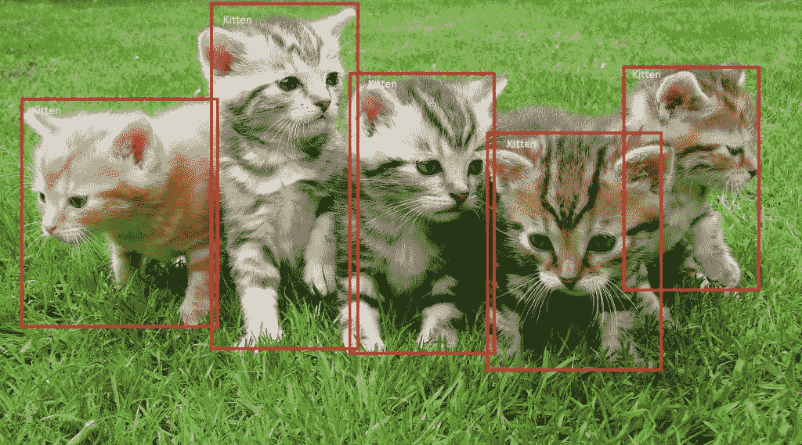

Example of end-to-end object detection (from [Microsoft](https://www.microsoft.com/developerblog/2017/04/10/end-end-object-detection-box/))

*这篇文章旨在直观地解释固态硬盘多盒物体检测技术。我试图将数学最小化，而是慢慢地引导你理解这个架构的原则，包括解释多盒算法的作用。看完这篇文章后，我希望你对 SSD 有更好的了解，并亲自试用它！*

自从 [AlexNet](https://papers.nips.cc/paper/4824-imagenet-classification-with-deep-convolutional-neural-networks.pdf) 在 2012 ImageNet 大规模视觉识别挑战赛(ILSVRC)上席卷研究界以来，深度学习已经成为图像识别任务的首选方法，远远超过了文献中使用的更传统的计算机视觉方法。在计算机视觉领域，卷积神经网络擅长图像*分类*，它包括对图像进行分类，给定一组*类*(例如猫、狗)，并让网络确定图像中存在的*最强的*类。

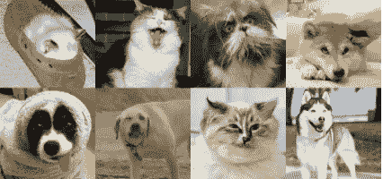

Images of cats and dogs (from kaggle)

如今，深度学习网络在图像分类方面比人类更好，这表明了这项技术的强大。然而，我们人类在观察世界和与世界互动时，不仅仅是对图像进行分类。我们还*定位*和*分类*我们视野内的每个元素。这些任务要复杂得多，机器仍然难以像人类一样完成。事实上，我认为当物体检测表现良好时，会使机器更接近真实场景的理解。

Does the image show cat, a dog, or do we have both? (from kaggle)

# 区域卷积神经网络(R-CNN)

几年前，通过利用 CNN 在计算机视觉中实现的一些飞跃，研究人员开发了 R-CNN 来处理对象检测、定位和分类的任务。概括地说，R-CNN 是一种特殊类型的 CNN，能够定位和检测图像中的对象:输出通常是一组与每个检测到的对象紧密匹配的边界框，以及每个检测到的对象的类输出。下图显示了典型的 R-CNN 的输出:

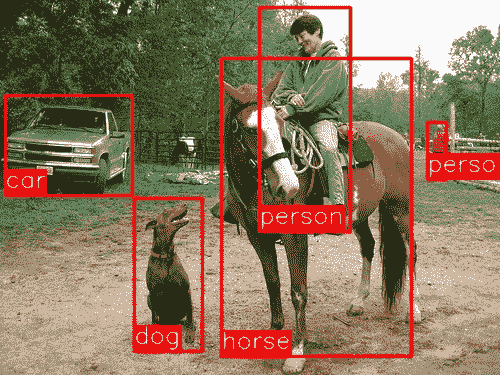

Example output of R-CNN

在这个领域有一个详尽的论文列表，对于任何渴望进一步探索的人，我建议从以下围绕该主题的论文“三部曲”开始:

*   美国有线电视新闻网
*   [美国有线电视新闻网](https://arxiv.org/abs/1504.08083)
*   [更快-R-CNN](https://arxiv.org/abs/1506.01497)

正如你可能已经猜到的，接下来的每篇论文都提出了对 R-CNN 所做的开创性工作的改进，以开发更快的网络，目标是实现实时物体检测。通过这组工作展示的成就确实令人惊讶，然而这些架构中没有一个能够创建实时对象检测器。在不涉及太多细节的情况下，确定了上述网络的以下问题:

*   训练数据既麻烦又耗时
*   训练发生在多个阶段(例如，训练区域提议与分类器)
*   在*推断* *时间*(即处理非训练数据时)网络太慢

幸运的是，在过去几年中，新的架构被创建来解决 R-CNN 及其后继者的瓶颈，实现实时对象检测。最著名的有 [YOLO](https://arxiv.org/abs/1506.02640) (你只看一次)和 [SSD](https://arxiv.org/abs/1512.02325) MultiBox(单发探测器)。在本帖中，我们将讨论 SSD，因为关于这种架构的报道似乎比 YOLO 少。此外，一旦你了解了固态硬盘，你应该会发现更容易掌握 YOLO。

# 单发多盒探测器

关于[SSD:Single Shot multi box Detector](https://arxiv.org/abs/1512.02325)(作者 C. Szegedy 等人)的论文于 2016 年 11 月底发布，并在对象检测任务的性能和精度方面创下新纪录，在标准数据集如 [PascalVOC](http://host.robots.ox.ac.uk/pascal/VOC/) 和 [COCO](http://cocodataset.org/#home) 上以每秒 59 帧的速度获得超过 74%的 mAP ( *均值* *平均精度*)。为了更好地理解 SSD，我们先来解释一下这种架构的名称来源:

*   **单镜头:**这意味着物体定位和分类的任务是在网络的*单次* *前向传递*中完成的
*   多框:这是 Szegedy 等人开发的一种包围盒回归技术的名字(我们将很快简要介绍)
*   **检测器:**网络是一个对象检测器，它也对那些检测到的对象进行分类

## 体系结构

Architecture of Single Shot MultiBox detector (input is 300x300x3)

从上图中可以看出，SSD 的架构建立在古老的 VGG-16 架构之上，但抛弃了完全连接的层。VGG-16 被用作*基础网络*的原因是它在高质量图像分类任务中的强大性能，以及它在解决*转移学习*有助于改善结果的问题中的受欢迎程度。取代原来的 VGG 全连接层，增加了一组*辅助*卷积层(从 *conv6* 开始)，从而能够在多个尺度上提取特征，并逐渐减小每个后续层的输入大小。

VGG architecture (input is 224x224x3)

## 多框

SSD 的边界框回归技术受到 Szegedy 在[多框](https://arxiv.org/abs/1412.1441)上的工作的启发，这是一种快速*类不可知*边界框坐标提议的方法。有趣的是，在 MultiBox 上完成的工作中，使用了 [Inception](https://arxiv.org/abs/1409.4842) 风格的卷积网络。您在下面看到的 1x1 卷积有助于降维，因为维度的数量会减少(但“宽度”和“高度”将保持不变)。

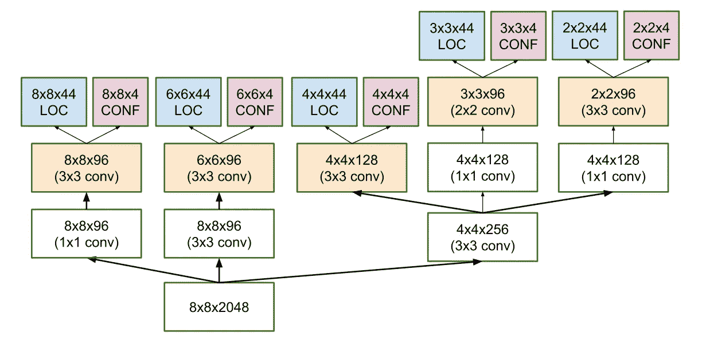

Architecture of multi-scale convolutional prediction of the location and confidences of multibox

MultiBox 的损失功能还结合了进入 SSD 的两个关键组件:

*   **置信度损失**:测量网络对计算边界框的*对象*的置信度。分类[交叉熵](https://rdipietro.github.io/friendly-intro-to-cross-entropy-loss/#cross-entropy)用于计算这种损失。
*   **位置损失:**这度量了*距离*多远网络的预测边界框与训练集中的地面真实边界框有多远。这里使用的是 L2 规范。

在不深究数学的情况下(如果你很好奇，想要一个更精确的符号，请阅读这篇论文)，损失的表达式是这样的，它衡量我们的预测“着陆”有多远:

***多框 _ 损失=置信度 _ 损失+阿尔法*位置 _ 损失***

*α*项帮助我们平衡位置损失的贡献。像通常在深度学习中一样，目标是找到最佳地减少损失函数的参数值，从而使我们的预测更接近地面事实。

## 多箱前科和欠条

围绕边界框生成的逻辑实际上比我前面所说的更复杂。但不要害怕:它仍然触手可及。

在 MultiBox 中，研究人员创建了我们所谓的 *priors* (或 fast-R-CNN 术语中的*锚点*)，它们是预先计算好的固定大小的边界框，与原始地面真相框的分布紧密匹配。事实上，那些*先验*是以这样一种方式选择的，即它们的交集/并集比(又名 IoU，有时也称为 [Jaccard index](https://en.wikipedia.org/wiki/Jaccard_index) )大于 0.5。正如您可以从下图中推断的那样，IoU 为 0.5 仍然不够好，但它确实为边界框回归算法提供了一个强有力的起点-这是一个比用随机坐标开始预测好得多的策略！**因此，多框以先验作为预测开始，并试图回归更接近真实边界框。**

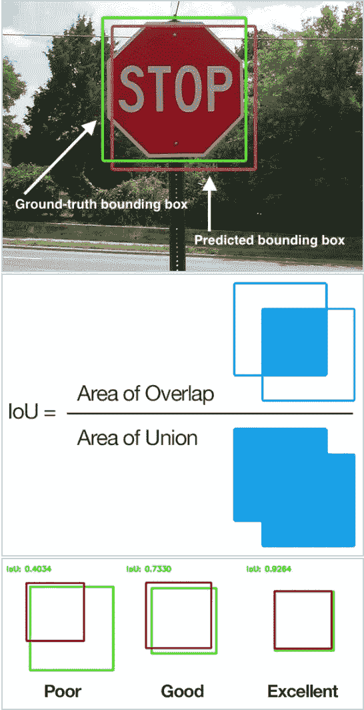

Diagram explaining IoU (from Wikipedia)

所得到的架构(再次检查上面的多盒架构图以供参考)每个特征地图单元包含 11 个先验(8×8、6×6、4×4、3×3、2×2)并且在 1×1 特征地图上只有一个先验，导致每幅图像总共有 1420 个先验，从而能够以多种比例稳健地覆盖输入图像，以检测各种大小的对象。

最后，MultiBox 仅保留使位置( *LOC* )和置信度( *CONF* )损失最小化的前 K 个预测。

## 固态硬盘的改进

回到 SSD，增加了一些调整，使这个网络更有能力定位和分类对象。

**固定先验:**与多框不同，每个特征映射单元都与一组不同尺寸和纵横比的默认边界框相关联。这些先验是手动(但仔细)选择的，而在 MultiBox 中，选择它们是因为它们相对于地面真值的 IoU 超过 0.5。这在理论上应该允许 SSD 针对任何类型的输入进行推广，而不需要针对前一代的预训练阶段。例如，假设我们已经为每个 *b* 默认边界框配置了 2 个对角相对的点 *(x1，y1)* 和 *(x2，y2)* 以及 *c* 类进行分类，在给定大小为*f =**m***n*的特征图上，SSD 将计算 *f* *

SSD default boxes at 8x8 and 4x4 feature maps

**位置损失:** SSD 使用[平滑 L1 范数](http://christopher5106.github.io/deep/learning/2016/09/16/about-loss-functions-multinomial-logistic-logarithm-cross-entropy-square-errors-euclidian-absolute-frobenius-hinge.html)计算位置损失。虽然不像 L2 范数那样精确，但它仍然非常有效，并给 SSD 更多的操作空间，因为它不会试图在其边界框预测中做到“像素完美”(即，几个像素的差异对我们许多人来说很难察觉)。

**分类:** MultiBox 不执行对象分类，而 SSD 执行。因此，对于每个预测的边界框，为数据集中每个可能的类计算一组 *c* 类预测。

# 培训和运行固态硬盘

## 数据集

您将需要带有地面真实边界框和分配的类标签(每个边界框只有一个)的训练和测试数据集。Pascal VOC 和 COCO 数据集是一个很好的起点。

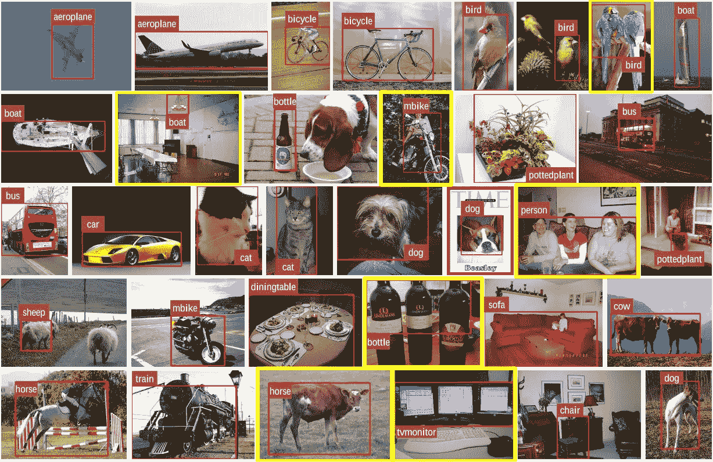

Images from Pascal VOC dataset

## **默认边界框**

建议配置不同比例和长宽比的一组不同的默认边界框，以确保可以捕捉大多数对象。SSD 文件中每个要素地图像元大约有 6 个边界框。

## 特征地图

特征图(即卷积块的结果)是图像在不同比例下的主要特征的表示，因此在多个特征图上运行多框增加了任何物体(大的和小的)最终被检测、定位和适当分类的可能性。下图显示了网络如何通过其要素地图“看到”给定图像:

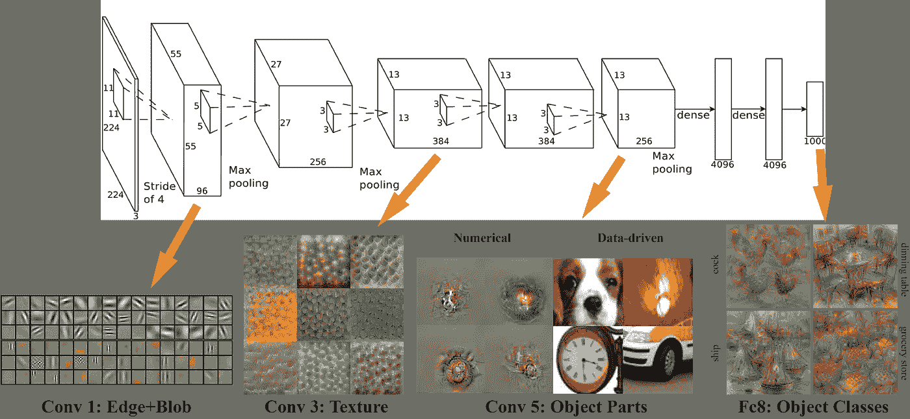

VGG Feature Map Visualisation (from Brown Uni)

## 硬负开采

在训练期间，由于大多数边界框将具有低 IoU，因此被解释为*负*训练示例，我们可能会在训练集中以不成比例数量的负示例结束。因此，不要使用所有的负面预测，建议保持负面与正面的比例在 3:1 左右。之所以需要保留阴性样本，是因为网络也需要学习并被明确告知什么构成了不正确的检测。

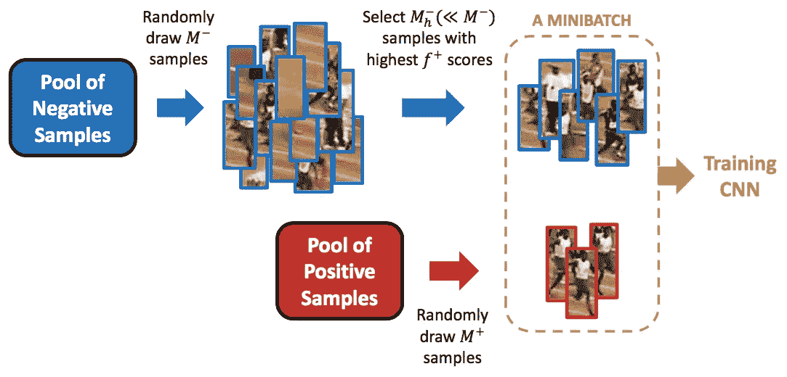

Example of hard negative mining (from Jamie Kang [blog](https://jamiekang.github.io/2017/05/28/faster-r-cnn/))

## 数据扩充

SSD 的作者表示，与许多其他深度学习应用一样，数据增强对于教会网络变得对输入中的各种对象大小更加鲁棒至关重要。为此，他们使用不同 IoU 比率(例如，0.1、0.3、0.5 等)的原始图像的补丁来生成额外的训练示例。)和随机补丁。此外，每个图像还以 0.5 的概率随机水平翻转，从而确保潜在的对象以相似的可能性出现在左侧和右侧。

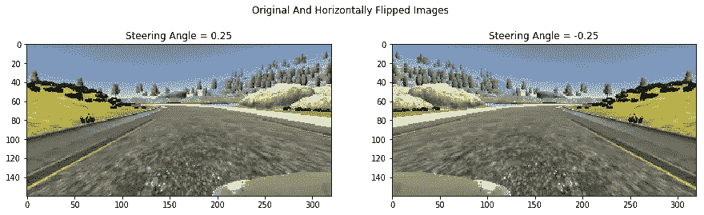

Example of horizontally flipped image (from [Behavioural Cloning](/teaching-cars-to-drive-using-deep-learning-steering-angle-prediction-5773154608f2) blog post)

## 非最大抑制(NMS)

假设在推理时间 SSD 的向前传递期间产生大量的盒子，通过应用被称为*非最大值抑制的技术来修剪大部分边界盒子是必要的:置信损失阈值小于 *ct* (例如 0.01)并且 IoU 小于 *lt* (例如 0.45)的*盒子被丢弃，并且仅顶部的 *N* 预测被保留。这确保了网络只保留最有可能的预测，而去除更嘈杂的预测。

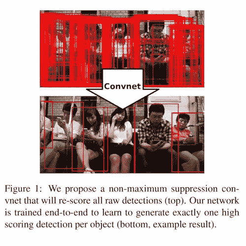

NMS example (from DeepHub [tweet](https://twitter.com/deep_hub/status/861966336527872000))

# 固态硬盘的附加说明

SSD 文件提出了以下附加意见:

*   默认框越多，检测就越准确，尽管对速度有影响
*   由于检测机在多个分辨率的要素上运行，因此在多个图层上使用多盒子也能实现更好的检测
*   80%的时间花在基本的 VGG-16 网络上:这意味着如果有更快和同样准确的网络，SSD 的性能可能会更好
*   SSD 混淆了具有相似类别的对象(例如动物)。这可能是因为多个类共享位置
*   SSD-500(使用 512x512 输入图像的最高分辨率变体)在 Pascal VOC2007 上实现了 76.8%的最佳 mAP，但以速度为代价，其帧速率降至 22 fps。因此，SSD-300 是一个更好的折衷方案，在 59 fps 时具有 74.3 的 mAP。
*   SSD 在较小的对象上产生较差的性能，因为它们可能不会出现在所有的要素地图上。提高输入图像分辨率可以缓解这个问题，但不能完全解决它

# 玩 SSD

网上有一些 SSD 的实现，包括来自本文作者的原始 Caffe [代码](https://github.com/weiliu89/caffe/tree/ssd)。在我的例子中，我选择了 Paul Balanç的 TensorFlow 实现，可以在 github 上获得。为了更好地理解所有东西是如何组合在一起的，阅读代码和文章是值得的。

我最近还决定重新实施一个使用传统计算机视觉技术的[车辆检测](/teaching-cars-to-see-vehicle-detection-using-machine-learning-and-computer-vision-54628888079a)项目，这次采用 SSD。我使用 SSD 输出的一个小 gif 显示它工作得非常好:

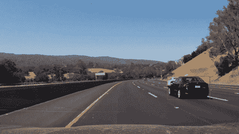

GIF of vehicle detection Using SSD

# 超越固态硬盘

这一领域的最新研究成果已经问世，我建议有兴趣在这一领域进一步拓展知识的人继续阅读以下两篇论文:

*   [YOLO9000:更好更快更强](https://arxiv.org/abs/1612.08242)(那是论文的题目；不开玩笑)
*   [屏蔽 R-CNN](https://arxiv.org/abs/1703.06870) :像素级非常精确的实例分割

瞧啊。我们已经完成了单次多盒探测器的参观。我试图用简单的术语来解释这种技术背后的概念，尽我所能地理解它们，并用许多图片来进一步说明这些概念并促进您的理解。我真的建议你读读报纸(如果你像我一样反应迟钝的话，可能要读几遍)🙃)，包括在这项技术的一些数学背后形成良好的直觉，以巩固你的理解。如果这篇文章的某些部分有助于你理解这篇文章，你可以随时查看。一路平安！

*感谢你阅读这篇文章。希望你觉得有用。我现在正在建立一个新的创业公司，叫做* [*EnVsion*](https://envsion.io) *！在 EnVsion，我们正在为 UX 的研究人员和产品团队创建一个中央存储库，以从他们的用户采访视频中挖掘见解。当然我们用人工智能来做这个。).*

*如果你是 UX 的研究人员或产品经理，对与用户和客户的视频通话感到不知所措，那么 EnVsion 就是为你准备的！*

*你也可以关注我的* [*推特*](https://twitter.com/Ed_Forson) *。*