# 支持向量机:完整理论

> 原文：<https://towardsdatascience.com/understanding-support-vector-machine-part-1-lagrange-multipliers-5c24a52ffc5e?source=collection_archive---------0----------------------->

## 了解 SVM 系列:第一部分

在这篇文章中，我将介绍支持向量机分类器。这篇文章将是我将解释支持向量机(SVM)的系列文章的一部分，包括它背后所有必要的细节和数学。这很容易，相信我！没有任何延迟，让我们开始吧—

假设我们得到了蓝色星星和紫色心的这两个样本(只是为了示意性的表示，这里没有使用真实的数据)，我们的工作是找出一条线来最好地分开它们。这里我们所说的最好是什么意思？

Figure 1: Samples in a 2D plane with some separation between them

我们来看下图。你能猜出哪条线能更好地分开这两个样本吗？

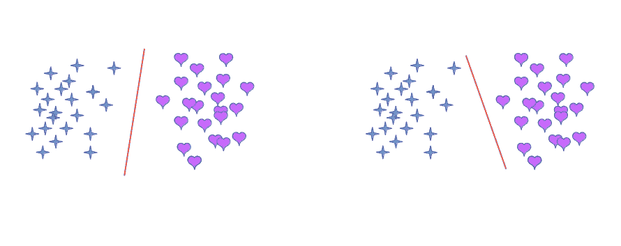

Figure 2: Lines (Hyperplanes?) that could potentially separate the two samples

是的，左边的红线比橙线好，因为，我们说红线在两组之间创造了'**最宽的路'**(边距)。见下图

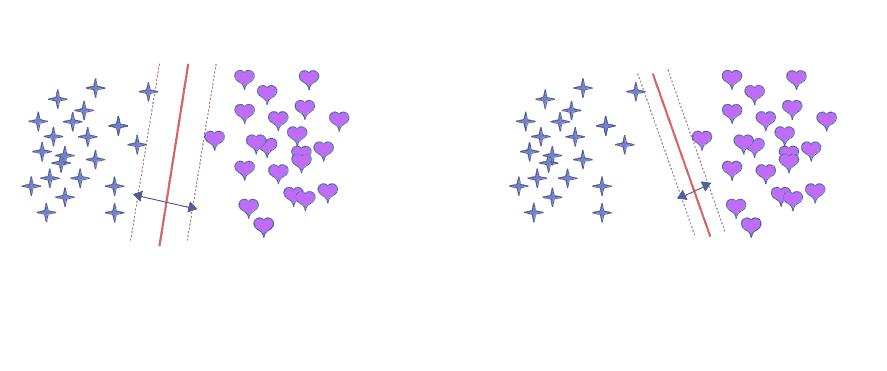

Figure 3: **Widest road** approach for separating two groups

边界线(虚线)边缘的样本线，被称为'**支持向量'。**与右侧的样本相比，左侧有两个这样的样本(蓝色星星)。关于支持向量的几个要点是-

1.  *支持向量是最难分类的样本。*
2.  *它们直接影响寻找决策边界(虚线)最佳位置的过程。*
3.  *只有一个非常小的训练样本子集(支持向量)可以完全指定决策函数(一旦我们了解 SVM 背后的数学，我们将会看到更多细节)。*
4.  ***如果从数据集中移除支持向量，将有可能改变分割线*** *的位置(对于维数高于 2 的空间，该线称为超平面)。*

我们已经认识到这是一个受约束的优化问题。*优化* —因为，我们要找到支持向量分离最大的线*约束—* 因为，支持向量应该远离道路，而不是在道路上。我们将使用**拉格朗日乘数**来解决这个问题，所以让我们从一个非常简单的使用拉格朗日乘数的例子开始。

## 拉格朗日乘数:何时和如何使用

假设我们给定一个函数 *f(x，y，z，…)* ，我们想要找到它的极值，服从条件 *g(x，y，z，…)= k。*拉格朗日乘子中使用的思想是，目标函数 *f* 的梯度在一个最佳点上与约束 *g* 的梯度平行或反平行排列。在这种情况下，一个梯度应该是另一个梯度的倍数。让我们看一个例子——

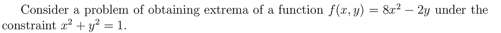

使用拉格朗日乘数法，我们解决它如下

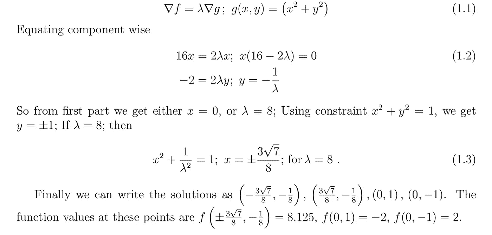

所以我们找到了函数的最大值和最小值，并且看到*它有一个唯一的最小值，两个最大值和一个鞍点*。如果我们画出这些函数 *f* 和 *g，*，那么我们将更好地理解拉格朗日乘数的概念。

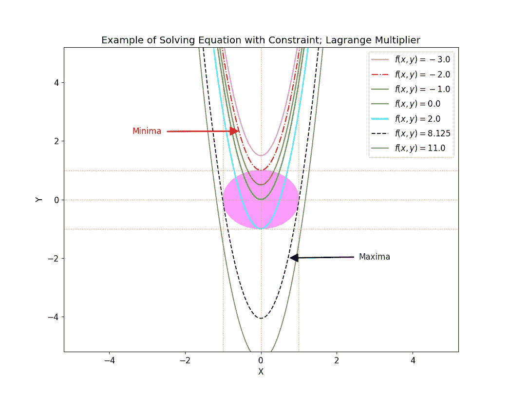

Figure 4: Visualizing Lagrange Multiplier Method

从上图我们可以清楚地体会到 ***约束函数 f 的极值，位于约束 g 的曲面上，*** 是一个单位半径的圆。这是一个必要条件。此外，函数和约束的切向量在每个极值处平行或反平行。用于这个情节的代码可以在我的 [github](https://github.com/suvoooo/Machine_Learning/blob/master/lagmult.py) 中找到。

我们现在准备深入 SVM 背后的数学，并成功地应用这一技术。

## 支持向量机的数学；

如果你忘记了问题陈述，让我再次提醒你。在图 1 中，我们要找到一条能最好地分离两个样品的线。我们考虑一个垂直于中线(红线)的向量(W)和一个未知样本，该样本可由向量 *x.* 表示

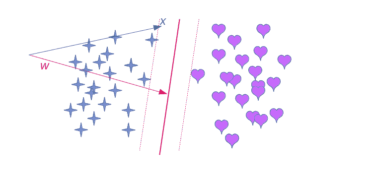

Figure 5: Determine on which side of the road a new sample X lies

为了确定未知样本 X 位于中线(红色实线)的哪一侧，我们首先取 X 沿中线垂线的投影，即 *w* 。如果这个投影大于某个数(称为偏差)，那么我们说未知样本 X 在线的右侧。它通常被称为**决策规则**。让我们把它放进一个等式里

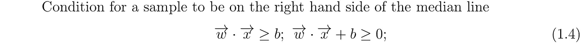

在这一点上，我们对数字 *b* 一无所知。我们对 *w* 也一无所知，只知道它垂直于中线。为了确定 *w* 和 *b* ，我们现在考虑已知样本并坚持如下条件

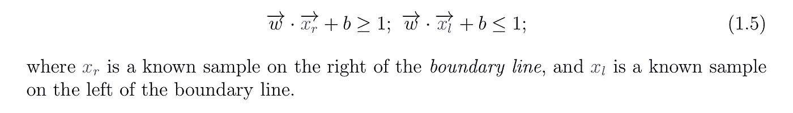

因此，对于右边(左边)的已知样本，我们坚持判定规则(等式。1.4)大于(小于)或等于 1。*对于边界线上的样本(支持向量),等号成立。接下来，我们的目标是用一个等式代替两个，为此，我们引入一个变量，它对右边的样本为正，对左边的样本为负。*

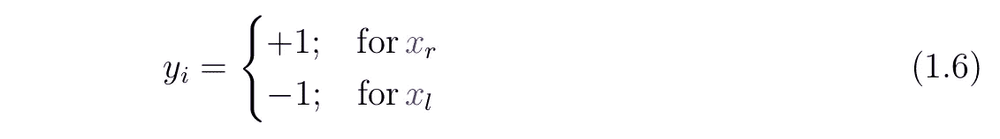

随着这一新变量的引入，我们将把两个条件方程的 L.H.S .相乘。1.5)我们得到

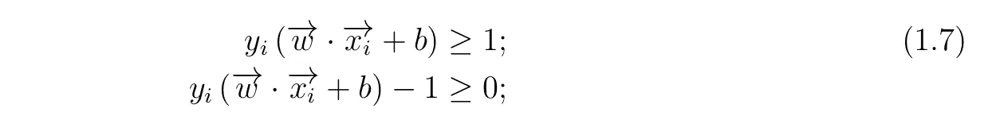

我们将在这里强加的另一个条件(相当直观)是，对于槽(“支持向量”)上的样本，L.H.S 将正好为零。

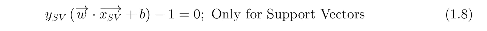

*由于我们的主要目的是找到样本之间最宽的道路，*我们现在将继续定义两条平行线之间的距离(或道路的宽度)。

为此，我们首先在任一侧选择任意两个支持向量，并计算差向量

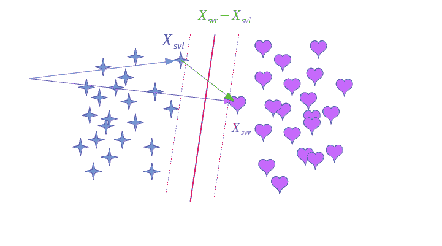

Figure 6: Difference of two support vectors

从上图可以了解到*道路的宽度将是这个差向量与一个垂直于道路的单位向量的点积。*

但是等等！我们已经定义了一个垂直于最佳直线的矢量，即 *w.* ，因此我们准备将道路的距离公式化为

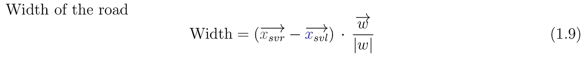

我们能简化这个等式吗？让我们回头看看情商。1.8，看看能不能想出点什么。

使用 eq。1.8 并且利用 *y* 对于右边的样本为正，对于左边的样本为负的事实，我们可以将等式 1.9 简化为

*因为我们想要最大化道路的宽度，我们现在的整个问题可以归结为一个非常重要的信息—*

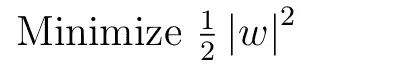

*牢记我们之前的约束条件，即 eq。1.8.*

因此，我们不再像以前那样凭直觉，现在我们可以从数学上理解，找到最佳线路确实是一个**约束优化**问题。

我们现在准备应用我们对拉格朗日方法的理解。

首先，取决于支持向量的数量，将有几个约束，因此包含乘数的约束项将是

我们想要最小化的拉格朗日量，可以写成

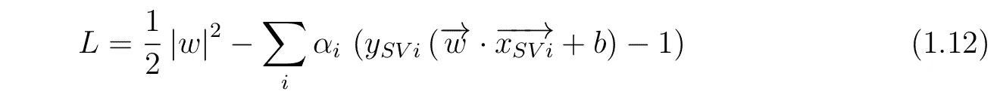

扩展表达式，

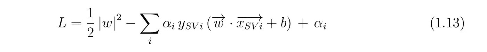

现在，在开始最小化之前，我们应该确定变量 w.r.t .,我们将对其进行拉格朗日微分，并将其设置为零。如果你记住了问题陈述，回到 eq。1.4.，我们看到向量 *w* 和偏差 *b* 是独立变量。因此

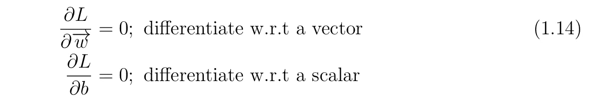

标量微分和往常一样，但矢量微分是在标量上执行的，首先是垂直矢量的大小，其次是支持矢量和法向矢量的点积。向量微分的后一项很容易解决，对第一项来说很直观，我想给你们一个提示

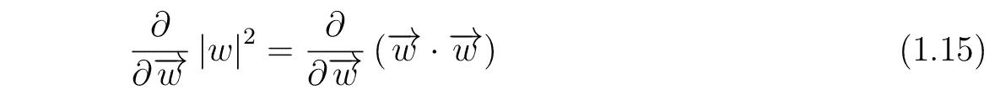

使用这个我们可以最终写出如下结果

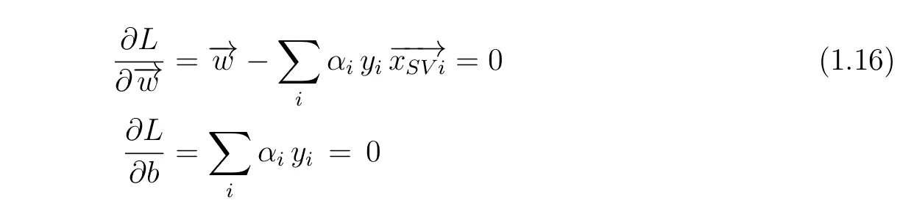

到目前为止，上述结果在这篇文章中是最重要的，我们已经发现**法向量( *w* )是支持向量的线性组合。**我们将使用这个条件来得到我们的决策规则，但是让我们意识到我们已经减少了公式中的另一个问题，那就是——因为等式的条件。1.16.现在我们可以去掉 w 和 b，取而代之的是只用拉格朗日乘数。所以我们从等式中使用这些条件。1.16，并尽量简化 eq。1.13

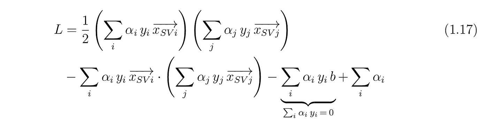

让我们进一步简化这个表达式

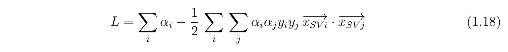

最后，我们在文章末尾发现**最大化将只取决于支持向量对的点积。多棒啊！！！！**

一个更有趣的结果可以得到，一旦我们把 w 放回去，我们从等式。1.16.决策规则，即等式。1.4 我们得到

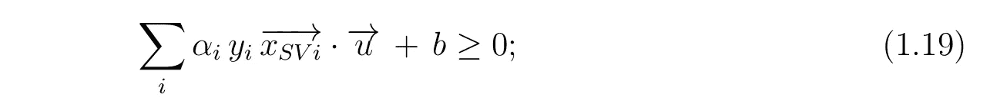

因此，新样本是否将位于道路右侧取决于支持向量和未知样本的点积(这里由向量 *u* 表示)。

本质上，**与 SVM 相关的一切都依赖于样本的简单点积**，这对我来说是令人兴奋的。希望它也能给你提供一些思考的素材。

让我们总结一下我们学到的最重要的两点

1.  通过简单的直觉和严格的数学，我们知道 SVM 问题是约束最小化问题。
2.  我们学习了求解约束优化问题的简单拉格朗日方法，并成功地应用于开发 SVM 算法。

下面是我下一篇关于 SVM 背后的数学以及使用 python 和 scikit-learn 的应用的文章的链接。

*第二贴:* [*内核绝招&默塞尔定理*](/understanding-support-vector-machine-part-2-kernel-trick-mercers-theorem-e1e6848c6c4d)

*第三贴:* [*现实生活中 SVM 的例子*](/support-vector-machine-mnist-digit-classification-with-python-including-my-hand-written-digits-83d6eca7004a)

*第四帖:* [*标图决定功能为*](/visualizing-support-vector-machine-decision-boundary-69e7591dacea)

保持坚强！干杯！！

***如果你对更深入的基础机器学习概念感兴趣，可以考虑加盟 Medium 使用*** [***我的链接***](https://saptashwa.medium.com/membership) ***。你不用额外付钱，但我会得到一点佣金。感谢大家！！***

 [## 通过我的推荐链接加入媒体

### 更多来自 Saptashwa(以及媒体上的所有其他作者)。你的会员费直接支持 Saptashwa 和其他作家…

medium.com](https://medium.com/@saptashwa/membership?source=publishing_settings-------------------------------------)