# 支持向量机:核技巧；默瑟定理

> 原文：<https://towardsdatascience.com/understanding-support-vector-machine-part-2-kernel-trick-mercers-theorem-e1e6848c6c4d?source=collection_archive---------2----------------------->

## 了解 SVM 系列:第二部分

先决条件:1。关于支持向量机算法的知识，我在[的上一篇文章](/understanding-support-vector-machine-part-1-lagrange-multipliers-5c24a52ffc5e)中已经讨论过了。2.代数的一些基础知识。

在本系列的第一部分中，从支持向量的数学公式中，我们发现了 SVM 的两个重要概念，它们是

*   SVM 问题是一个约束最小化问题，我们已经学会了使用拉格朗日乘数法来处理这个问题。
*   为了找到不同样本之间的最宽路径，我们只需要考虑支持向量和样本的点积。

在 SVM 的上一篇文章中，我举了一个简单的线性可分样本的例子来演示支持向量分类器。如果我们有一个如下的样本集，会发生什么？

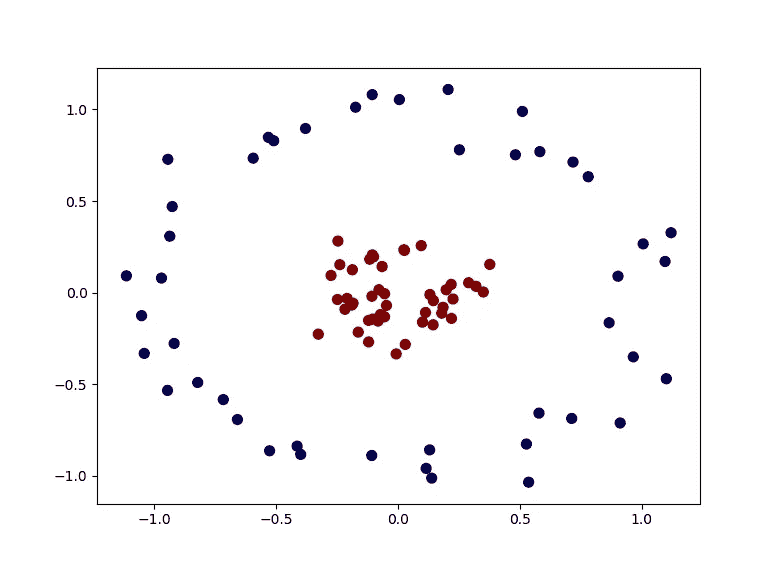

Blue and Red samples all over the place !!!! At least it seems like (Source: Author)

该图使用`sklearn.`的内置`make_circles` [数据集](https://scikit-learn.org/stable/modules/generated/sklearn.datasets.make_circles.html#sklearn-datasets-make-circles)生成

```
import numpy as np 
import sklearn 
import matplotlib.pyplot as plt
from sklearn.datasets.samples_generator import make_circlesX,y = make_circles(90, factor=0.2, noise=0.1) 
#noise = standard deviation of Gaussian noise added in data. 
#factor = scale factor between the two circlesplt.scatter(X[:,0],X[:,1], c=y, s=50, cmap='seismic')
plt.show()
```

如你所知，在这个 2d 图中不可能画出一条线来区分蓝色样品和红色样品。我们还有可能应用 SVM 算法吗？

如果我们给这个 2d 空间一点震动，红色样本飞离平面，看起来与蓝色样本分离，会怎么样？看一看！

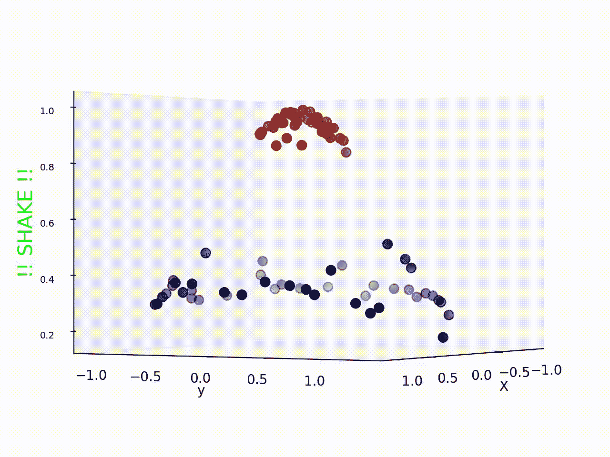

After ‘shaking’ the data samples now it seems there is a great possibility of classification! Find the code [in my github](https://github.com/suvoooo/Machine_Learning/blob/master/SVMdemo.py) (Source: Author)

看来摇动数据样本确实有效，现在我们可以很容易地画一个平面(而不是我们以前使用的线)来分类这些样本。那么在摇晃过程中到底发生了什么呢？

当我们没有如上例的线性可分训练数据集时(在现实生活中，大多数数据集都相当复杂)，内核技巧就派上用场了。其思想是将非线性可分离数据集映射到一个更高维的空间，在那里我们可以找到一个可以分离样本的超平面。

*因此，这一切都是为了找到将 2D 输入空间转换为 3D 输出空间的映射函数。或者是？内核技巧到底是什么？*

从上一篇关于[支持向量的帖子中，](/understanding-support-vector-machine-part-1-lagrange-multipliers-5c24a52ffc5e)我们已经看到(请查看理解数学公式)最大化只取决于支持向量的点积，

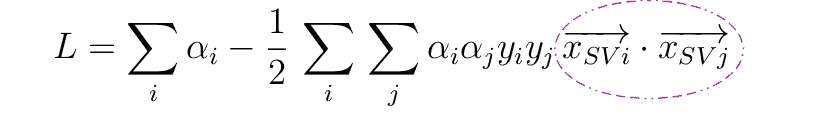

不仅如此，由于决策规则还依赖于支持向量和新样本的点积

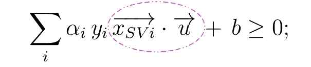

这意味着，如果我们使用映射函数将数据映射到更高维度的空间，那么，最大化和决策规则将取决于不同样本的映射函数的点积，如下所示

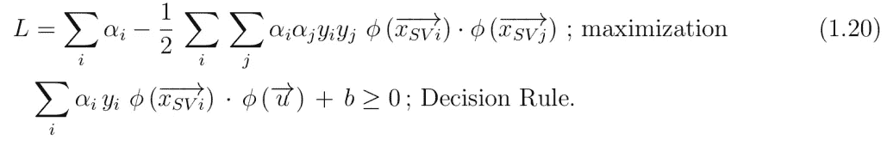

瞧啊。！如果我们有一个函数 *K* 定义如下

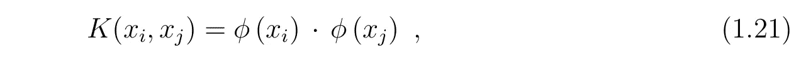

那么我们只需要知道 *K* 而不是映射函数本身。这个函数被称为**核函数**，它降低了寻找映射函数的复杂性。所以，**核函数在变换空间定义了内积。**

让我们看看一些最常用的内核函数

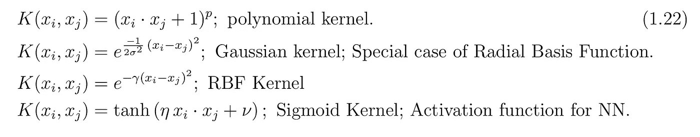

我已经使用径向基函数核绘制了图 2，其中从 2D 空间到 3D 空间的映射确实有助于我们分类。

除了这个预定义的内核，*哪些条件决定了哪些函数可以被认为是内核？*这是由**默瑟定理给出的。**第一个条件相当简单，即**内核函数必须对称。**作为核函数是*点积(内积)*的映射函数我们可以写成如下——

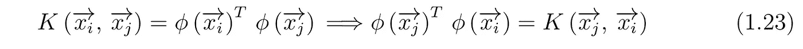

Mercer 定理给出了函数是核函数的充要条件。理解这个定理的一种方式是—

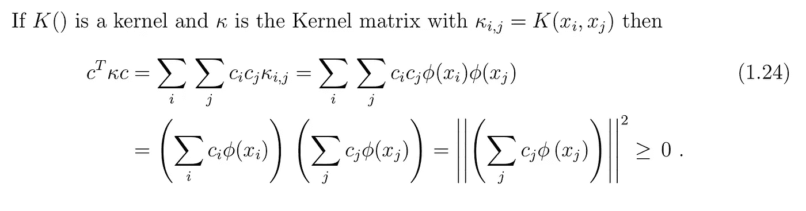

**换句话说，在有限输入空间中，如果核矩阵(也称为 Gram 矩阵)是*正半定的*那么，矩阵元素即函数 K 可以是核函数。**因此 Gram matrix 将学习算法所需的所有信息、数据点和映射函数合并成内积。

让我们看一个从核函数中找到**映射函数的例子，这里我们将使用高斯核函数**

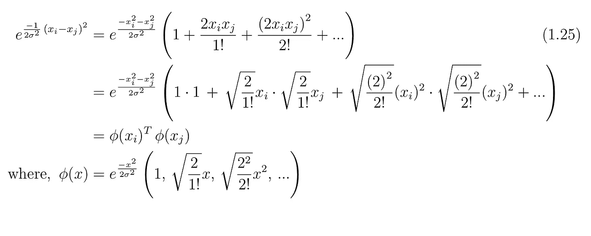

## 调谐参数

既然我们已经讨论了非线性核，特别是高斯核(或 RBF 核)，我将以对 SVM 中的一个调整参数—*γ的直观理解来结束这篇文章。*

观察 RBF 核，我们看到它取决于两点之间的欧几里德距离，即如果两个向量越近，则该项越小。由于方差总是正的，这意味着对于较近的向量，RBF 核比较远的向量分布更广。当 *gamma* 参数较高时，核函数值会较小，即使对于两个邻近的样本也是如此，这可能导致复杂的判定边界或引起过拟合。你可以在我的另一篇文章中读到更多。

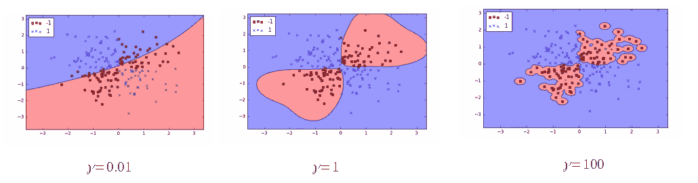

Example of over-fitting and complex decision boundary with high values of gamma. [Image Courtesy : [Chris Albon]](https://chrisalbon.com/machine_learning/support_vector_machines/svc_parameters_using_rbf_kernel/)

在结束讨论之前，让我们回顾一下到目前为止我们在本章中学到了什么

1.  将数据点从低维空间映射到高维空间可以使得即使对于非线性数据样本也可以应用 SVM。
2.  我们不需要知道映射函数本身，只要知道核函数即可； ***内核绝招***
3.  函数被认为是核函数的条件；*半正定格拉姆矩阵。*
4.  最常用的内核类型。
5.  调节参数γ如何导致 RBF 核的过度拟合或偏差。

希望你喜欢这篇文章，在下一章，我们将看到一些使用 SVM 算法的机器学习例子。

**SVM 算法背后的完整数学在这里讨论:**

[](/understanding-support-vector-machine-part-1-lagrange-multipliers-5c24a52ffc5e) [## 支持向量机:完整理论

### SVM 的决策规则

towardsdatascience.com](/understanding-support-vector-machine-part-1-lagrange-multipliers-5c24a52ffc5e) 

关于绘制和理解支持向量机决策边界的更多信息，请查看这篇文章:

[](/visualizing-support-vector-machine-decision-boundary-69e7591dacea) [## 用 Python 实现流水线中的主成分分析和 SVM

### 管道、网格搜索和等高线图

towardsdatascience.com](/visualizing-support-vector-machine-decision-boundary-69e7591dacea) 

保持坚强！干杯！！

***如果你对更深入的基础机器学习概念感兴趣，可以考虑加盟 Medium 使用*** [***我的链接***](https://saptashwa.medium.com/membership) ***。你不用额外付钱，但我会得到一点佣金。感谢大家！！***

[](https://medium.com/subscribe/@saptashwa?source=publishing_settings-------------------------------------) [## 每当 Saptashwa Bhattacharyya 发表文章时，收到一封电子邮件。

### 每当 Saptashwa Bhattacharyya 发表文章时，收到一封电子邮件。通过注册，您将创建一个中等帐户，如果您没有…

medium.com](https://medium.com/subscribe/@saptashwa?source=publishing_settings-------------------------------------) 

## 参考资料:

1.  “统计学习的要素”；Hastie，t .等人；[亚马逊链接](https://www.amazon.com/Elements-Statistical-Learning-Prediction-Statistics-ebook/dp/B00475AS2E)
2.  ”内核的属性”；伯克利[大学；pdf](https://people.eecs.berkeley.edu/~jordan/kernels/0521813972c03_p47-84.pdf) 。
3.  “内核”；麻省理工学院[讲稿](https://ocw.mit.edu/courses/sloan-school-of-management/15-097-prediction-machine-learning-and-statistics-spring-2012/lecture-notes/MIT15_097S12_lec13.pdf)。