# 用 Dialogflow 理解基本的对话式人工智能概念

> 原文：<https://towardsdatascience.com/understanding-the-basic-conversational-ai-concepts-with-dialogflow-b0604d957d5c?source=collection_archive---------8----------------------->

这是一个初学者指南，旨在理解围绕设计对话和使用 Google Dialogflow 实现对话的不同概念。其他对话式人工智能工具使用相同的概念，因此这些应该可以转移到任何平台。我使用过各种各样的机器人构建器，在我看来，Dialogflow 是最容易快速创建简单机器人或非程序员的工具。本概述涵盖了如何创建意图及其组成的不同部分，培训您的机器人，以及其他有助于使用 Dialogflow 的有用提示。

在将你的第一个机器人实现到 dialogflow 之前，最好先绘制出对话流，就像思维导图一样。当一些对话可能会很长并且很难跟上时，拥有这种观想将会派上用场。注意:下面的截图来自 Dialogflow，用例是针对内部业务流程助理的。

# **创作意图**

意图用于定义当机器人获得用户的意图时，或者当您希望基于其他事件触发响应时，您希望机器人做出什么响应。基本上，如果一个用户说 X，我们希望我们的机器人用 y 来回应。

**话语——或训练短语**

这些是用户所说的被机器人理解为某种意图的短语。许多不同的短语可能实际上描述了该短语的同一个*动机*。例如:“我需要找人”，“我在找人帮忙…”和“你能帮我找一个人吗？”是指用户想要找到一个人的所有话语。最好在一个意图中有大约 10 个不同的短语，作为自然语言理解(NLU)引擎的良好基础。在此基础上，Dialogflow 可以自信地连接来自用户的新短语和最接近的意图。我们永远无法真正假设我们会知道我们的用户会为每一个意图说话的每一种方式，所以这就是利用谷歌的 NLU 功能真正帮助我们的地方。

此外，对于后续对话，你可能只需要非常简单的话语，如是或否，并将其与上下文相关联，但我们将在稍后讨论。

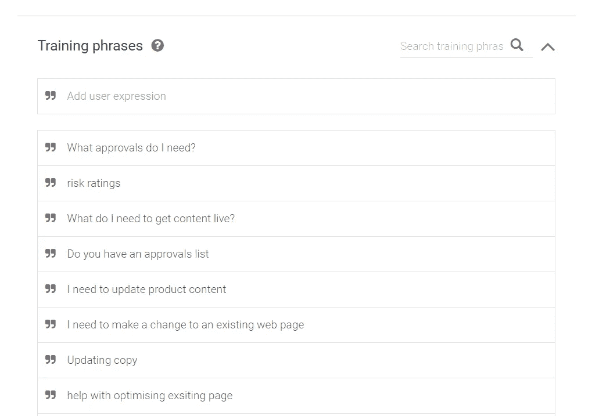

Example of training phrases in Dialogflow

**实体**

实体是用户输入的一部分，它描述了一些有用的信息，Dialogflow 可以从中提取并执行操作。例如，如果用户输入“我想找人帮我修车”，其意图将是找人，主题的实体将被选择为汽车。要定义一个新的实体，您需要在 Dialogflow 中的 entity 部分定义一组在一个实体中具有相同目的的相关信息。

还有一些系统定义的实体，比如位置、日期、数字等等，您可以加以利用。

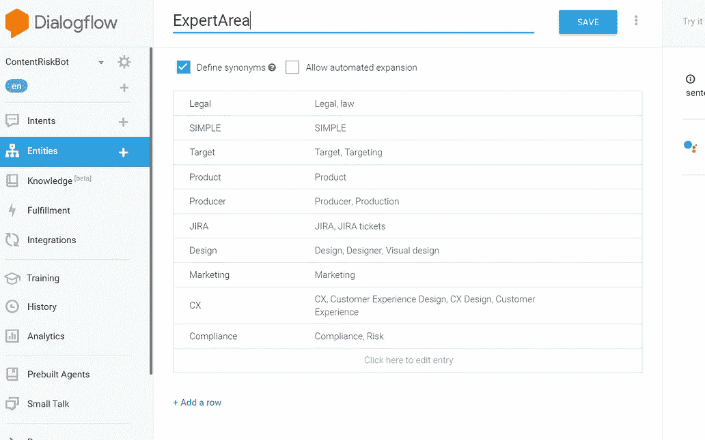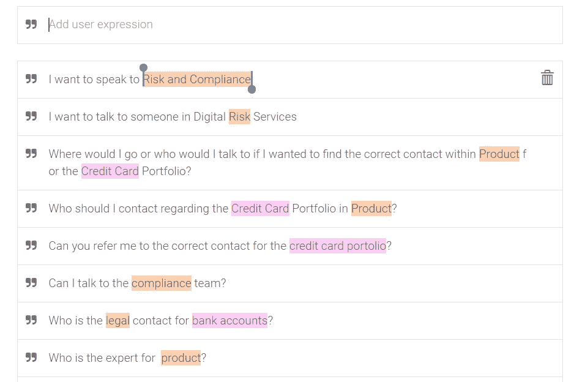

Entities in the definition screen and when they are being picked up inside user phrases

**响应—标准**

这些是当一个意图匹配时，您的 bot 服务将发送回用户的响应。以某种方式确认响应中的意图是很好的，比如“好的，所以你想找到一个人……”，这样用户就可以看到机器人确实理解他们所说的话。如果你想每次都给人一种稍微不同的体验，你可以给一个意图添加不同的回答，dialogflow 会随机选择一个。如果您希望在同一个输出中显示多个单独的消息，可以通过添加文本响应模块来实现。

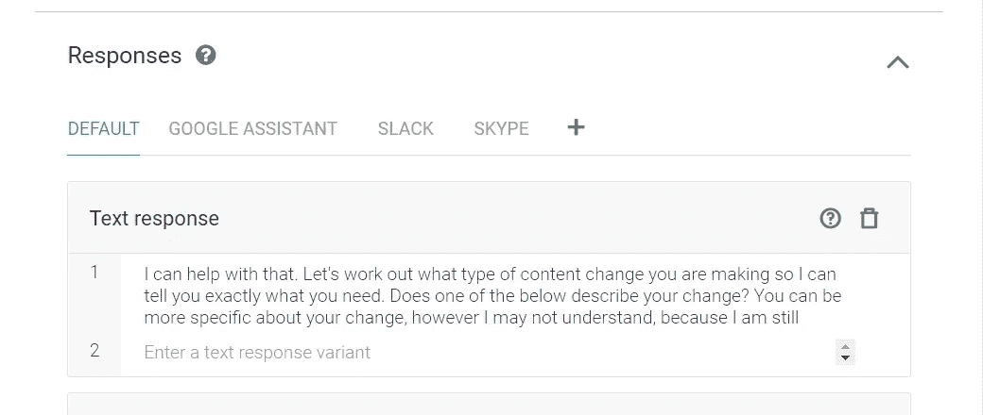

**响应——特定于渠道的丰富消息**

要利用通道独特的消息传递功能，您可以通过选择+图标并选择您喜欢的通道，在响应部分添加该功能。您还可以选择让这些特定于通道的响应取代标准响应，或者将其添加到总输出中。特定于渠道的响应通常包括易于使用的富 UI 消息类型，包括按钮、卡片和图像等元素。例如在 Slack 中，我经常使用快速回复给用户一个选项列表和卡片来显示图片和/或链接。这些使得用户的体验更加容易。

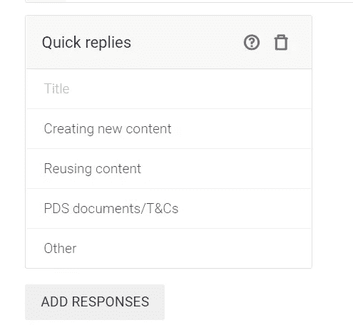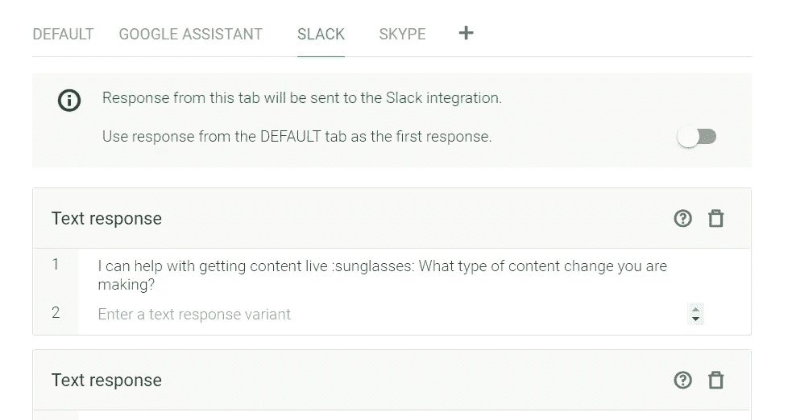

An example of a rich UI element, Quick Replies, and the slack tab in responses

如果你想跨频道做任何丰富的 UI，或者做任何更加定制化的事情，那么你必须利用定制有效载荷响应选项，或者在实现中对它进行编码。您可以在 dialogflow 文档中了解更多信息。

这些丰富的 UI 元素在 slack 中是什么样子的:

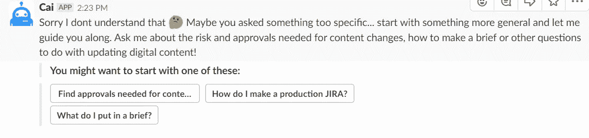

**参数**

参数与用户输入中的实体相关联，可用于在履行中执行某些动作或用于响应。通过在参数部分中定义一个实体，意味着它们可以在该意图中用作变量。您还可以将一个参数设置为强制参数，机器人会询问后续问题，直到给出合适的答案。如果查找一个人的意图需要一个主题参数，对话流将询问“你到底要找谁？”所以它能给出一个合适的答案。您可以通过勾选该字段将参数设置为强制参数；如果你这样做，你还需要写下必要的跟进问题。

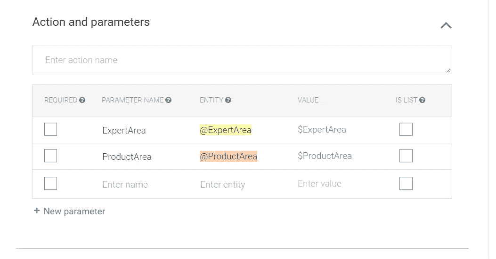

Parameters in the intent window

**注意:**有一个已知的问题是，如果用户不理解后续问题，并且回答与所需实体不匹配的响应，那么机器人会无休止地循环相同的问题。所以如果你要用这个，最好把问题弄清楚。

您可以通过编写$和参数名在响应中使用该参数

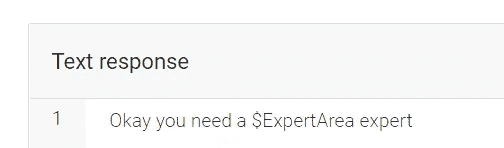

Calling a parameter in a response

实体和参数是一回事吗？？为什么两者都有？参数与实体值相关联，但是有时您可能希望跟踪意图对话中的多个参数，并且所有这些参数可能是一个实体的不同情况。例如，在两个意图中，您可能希望找出某件事情的开始日期和结束日期，这将是两个不同的参数，都对应于一个“日期”实体。

**语境——进行更长的对话**

上下文用于跟踪用户在对话中的位置。它们代表当前状态。要使一个意图跟随另一个意图，可以从第一个意图创建一个输出上下文，并将相同的上下文放在第二个意图的输入上下文字段中。您可以同时使用多个上下文。每个上下文旁边的数字对应于您希望上下文持续的响应数量，这是可以更改的。如果您想让上下文在某个意图之后不再继续，您可以将它放在传出上下文中，并将数字设置为 0。

上下文还保存在该上下文中定义的参数，所以您可以在以后再次使用它们，但是我还没有对此进行过实验。

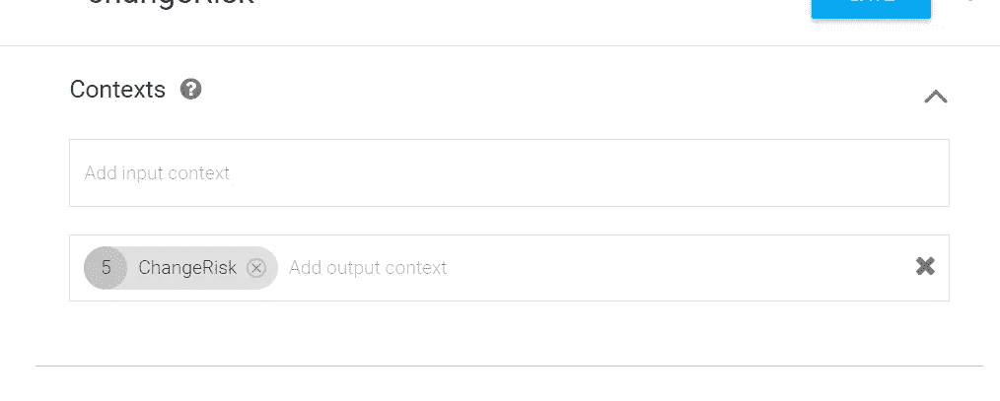

An example of an output context

**事件**

当您希望机器人在没有用户输入但发生特定事件时被触发时，例如，如果您希望机器人在某人第一次开始聊天时或可能在每天中午 12 点时说些什么，则可以使用这些。

**命名意图**

最佳实践是描述用户的意图。可以用空格。名称越明显越好，因为各种后端用户可能需要解释这些意图的内容。

例如，如果用户想为某个主题找到合适的人，名称可以是“查找一个人”

如果在较长的对话中有后续意图，最好在命名约定中表明这一点(我建议不要使用实际的“后续”意图，因为它们不灵活)，所以如果你在较长的对话中，你可以做类似“餐厅->预订->确认”的事情。使用像“Q1”、“Q2”这样的系统…..对于机器人的工程师来说，一系列问题可能是有意义的，但当涉及到与其他管理员一起训练机器人时，就很难理解其中的内容了。

**履行**

当你想要一个引发某种行动的意图时，就使用满足感。例如，如果你想将对话输入到外部数据库，调用外部服务来查找某个位置的天气，执行一些计算，给某人发送电子邮件，在预订系统中检查可用性，或者只是搜索随机的 GIF。实现在每个意图中被打开。您可以在 dialogflow 内部对此进行编码，也可以将您的 bot 连接到另一个名为 webhook 的服务，该服务可以处理该操作。这更复杂，通常需要开发来创建适当的动作。我只是在一些基本的方面使用了满足感。

示例:我希望多个 intent 共享一个响应，因此创建了一个函数来保存共享部分，并使用一个命令来调用在 intent 中管理的初始响应。

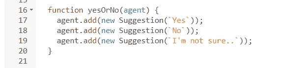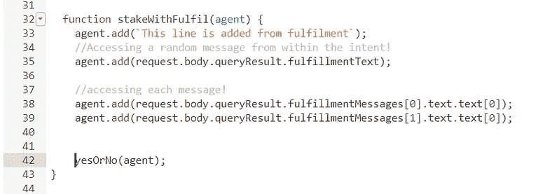

Fulfilment code example

要了解更多关于如何编写代码实现的信息，文档中有很多相关内容，还有很多例子可以下载。对于非开发人员来说，过多地涉及履行确实意味着 bot 变得更难管理。

# **最佳实践意图包括**

为了机器人的可用性，包含一些标准响应总是好的。

介绍或欢迎——回答你好或任何其他问候，它应该给出机器人做什么的概述，可能还有一些示例问题。这也可以由一个事件触发，比如当你打开一个聊天。

*   默认的后退意图或不理解-当没有其他意图匹配时，此意图匹配，并且应该给用户一些关于接下来要问什么的指导。
*   与人交谈——一些用户可能会对机器人的回答感到失望，可能会要求与真人交谈。有这个选择总是好的。你也许不能马上把他们和聊天中的人联系起来，但即使是一些联系方式也是值得的。
*   错误的答案——如果用户说机器人给了他们错误的答案，那么最好提出反馈，并给用户其他联系方式。

在某个意图或对话的一部分之后包含一组常用选项也是很好的，这样可以将用户引导到机器人可以协助的方向。例如，在预订了一家餐馆之后，用户接下来可能要做的就是想出如何到达那里，或者将预订添加到您的日历中。

# **知识库**

知识库是从电子表格中制作 FAQ 类型列表的简单方法。这是 Dialogflow 的一个非常新的功能，所以不要期望能够通过这种方式上传你所有的意图，最好保持非常简单的问答回复。在 CSV 电子表格中，第一列是用户输入，第二列是响应。它为列表中的每个条目都创建了一个单独的意图。由于每个条目只有一个用户短语，所以它们不是很强大，但是对于 FAQ 列表来说很有用。例如，对于一个内部业务聊天机器人，我使用知识库上传一个业务缩写和术语列表。

您也可以将知识库连接到 FAQ 格式的网页，但是我认为这只是扫描页面一次，而不是实时连接，因此如果您稍后更改网页，知识库将不会保持最新。

您可以管理如何在 dialogflow 的知识库部分实际显示响应。

# **训练**

我们在这里讨论的训练是你训练机器人，并有效地让它变得更聪明。在培训窗口中，您可以看到对话日志。打开对话会显示每个用户输入和 dialogflow 触发的匹配意图，您可以选择确认 dialogflow 给出了正确的答案(在您进行确认之前，机器人不会将这些新的话语提交到内存中，即机器人无法自行学习)，将其更改为另一个意图，或者将其添加到默认的回退意图(如果它超出了机器人的知识范围)。这就是为什么给意图一个容易理解的名字是好的；如果其他团队成员正在训练不是他们自己创建意图的机器人，那么他们可以很容易地找到匹配的那个。通过批准对话，您有效地将任何新的用户短语添加到您已经确认正确匹配的意图中。

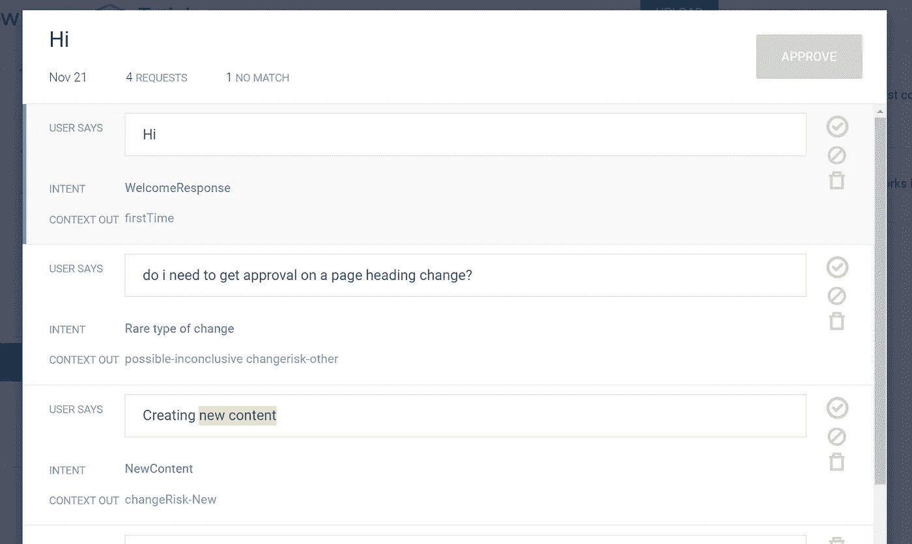

example training conversation log

训练有点有限，如果你想在对话中准确地看到机器人的响应，并按日期或频道过滤，那么你可以在 Dialogflow 的*历史*部分中完成这一操作。

# **集成**

Dialogflow 可以很容易地将 bot 服务连接到多个频道:slack、facebook、kik 等。完全完成连接通常需要几个步骤，其中大部分都在通道端。连接 slack 需要创建一个应用程序，然后在相关字段中插入一些 URL。这种设置通常不需要编码。所有这些联系都有很好的记录。

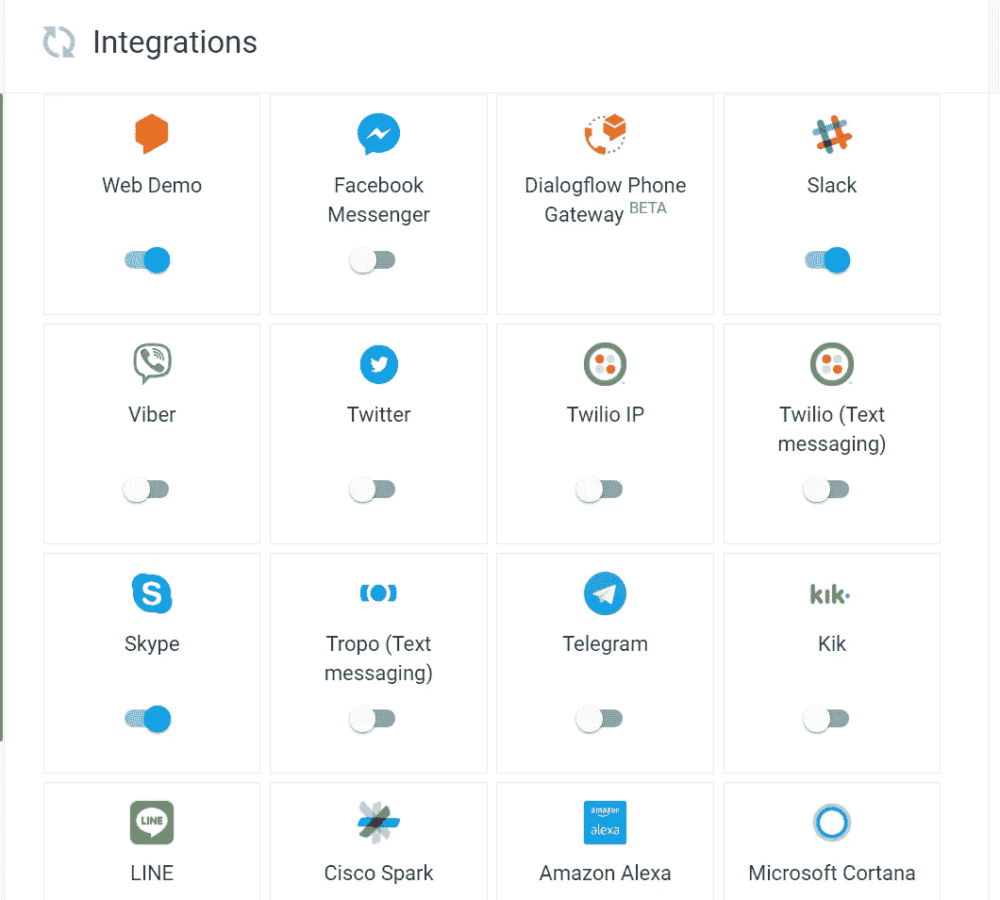

Integrations available from Dialogflow, plus of course google assistant actions.

如果您想要连接到这些简单集成之外的自定义接口，那么这需要一些额外的工作来连接到您可以在 bot 的设置中找到的 dialogflow API 端点。我找不到关于这方面的很好的文档，但这确实取决于您选择使用的 UI。

# **闲聊**

闲聊是对机器人个性的一个有趣的小补充。这给非常简单的流行输入，如“怎么了”或“我恨你”，添加了大量预先制造的意图，dialogflow 机器人会用一组随机答案来响应它们。你可以打开它，也可以选择自定义一些答案。第一个“你是谁？”可能是一个很好的更新。

# **分析**

简而言之，你可以看到你的机器人获得了多少流量，你可以看到最匹配的意图列表和一些基本的对话旅程。这让你很好地了解人们是否在使用这个机器人，他们什么时候使用它最多，以及他们真正使用它的目的是什么。然而，直到你有一个大的用户群，这不是很强大。

你也可以将你的机器人连接到另一个谷歌平台——https://chatbase.com

# **向后端添加用户**

你可以在 dailogflow 的设置->共享部分进行设置。最好用谷歌邮箱添加用户。在 bot 设置中添加该地址，确保保存。您可以授予用户“审阅者”角色(可以查看所有内容，但不能进行修改)，或者授予用户“开发人员”角色(可以更新除管理设置之外的所有内容)。

一旦你设置好了，他们就可以在 https://console.dialogflow.com 找到机器人

如果你想改变机器人的所有者或添加一名管理员，那么你必须在谷歌云中这样做。这是说明。

[https://dialogflow.com/docs/concepts/sharing#gcpconsole](https://dialogflow.com/docs/concepts/sharing#gcpconsole)

# **更多资源**

**文档中的更多帮助**

https://dialogflow.com/docs

# 希望这对您有所帮助！如果你需要更多的机器人帮助，请联系我们。

[nicholaspollard.com](http://nicholaspollard.com)