# 理解层次聚类技术的概念

> 原文：<https://towardsdatascience.com/understanding-the-concept-of-hierarchical-clustering-technique-c6e8243758ec?source=collection_archive---------0----------------------->

**层次聚类技术**是机器学习**中流行的聚类技术之一。**在我们试图理解层次聚类技术的概念之前让我们先了解一下聚类…

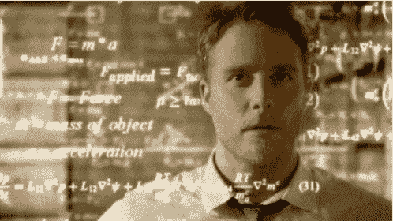

**什么是聚类？？**

**聚类**基本上是一种对相似数据点进行分组的技术，使得同一组中的点比其他组中的点更加相似。一组相似的数据点被称为**簇。**

**聚类和分类/回归模型的区别:**

## 在分类和回归模型中，我们得到一个数据集(D ),其中包含数据点(Xi)和类别标签(易)。其中，Yi 属于分类模型的{0，1}或{0，1，2，…，n ), Yi 属于回归模型的真实值。

说到聚类，我们得到的数据集只包含数据点(Xi)。这里我们**没有**提供的类标签(Yi)。

现在，让我们回到最初的主题，即**层次聚类技术。**

这里有一个小礼物，特别送给我的读者，作为善意的表示:)亚马逊音乐无限**免费**3 个月:[【https://amzn.to/2ZBlWI7】](https://amzn.to/2ZBlWI7)**(注册支持)感谢。**

****层次聚类技术:****

**层次聚类是一种流行且易于理解的聚类技术。这种聚类技术分为两种类型:**

1.  **结块的**
2.  **分裂的**

**点击此处申领免费麦当劳礼品卡**

****凝聚层次聚类技术:**在该技术中，最初每个数据点被认为是一个单独的聚类。在每次迭代中，相似的聚类与其他聚类合并，直到形成一个聚类或 K 个聚类。**

**凝聚的基本算法是简单明了的。**

*   **计算邻近矩阵**
*   **让每个数据点成为一个集群**
*   **重复:合并两个最近的聚类并更新邻近矩阵**
*   **直到只剩下一个集群**

**关键操作是计算两个聚类的接近度**

**为了更好地理解，让我们看一个凝聚层次聚类技术的图示。假设我们有六个数据点{A，B，C，D，E，F}。**

*   **步骤 1:在初始步骤中，我们计算各个点的接近度，并将所有六个数据点视为独立的聚类，如下图所示。**

**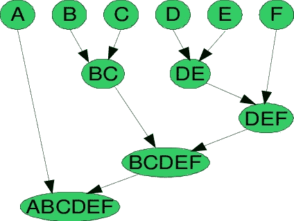**

**Agglomerative Hierarchical Clustering Technique**

*   **步骤 2:在步骤 2 中，相似的聚类被合并在一起并形成单个聚类。让我们考虑 B、C 和 D、E 是在第二步中合并的相似集群。现在，我们剩下四个集群，分别是 A，BC，DE，f。**
*   **步骤 3:我们再次计算新聚类的接近度，并合并相似的聚类以形成新的聚类 A、BC、DEF。**
*   **步骤 4:计算新群的接近度。聚类 DEF 和 BC 是相似的，并且合并在一起以形成新的聚类。我们现在剩下两个星团 A，BCDEF。**
*   **第 5 步:最后，所有的集群合并在一起，形成一个单一的集群。**

**可以使用**树状图来可视化分层聚类技术。****

****树状图**是一个树形图，记录了合并或拆分的顺序。**

**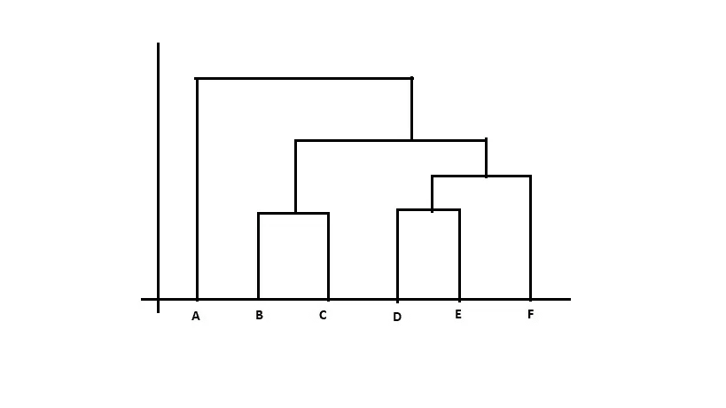****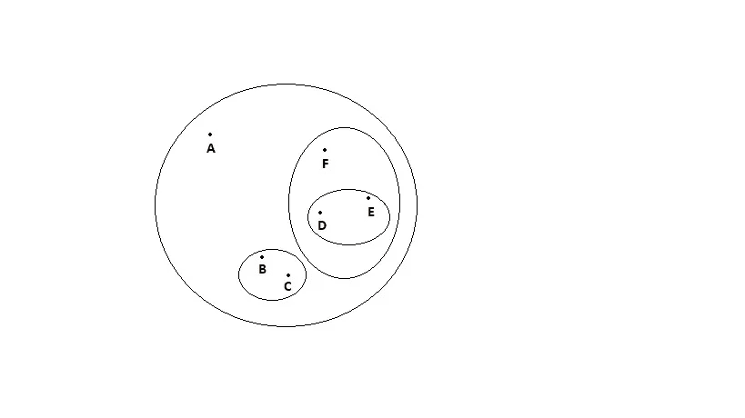**

**Dendrogram representation**

****2。分裂式** **层次聚类技术:**由于分裂式层次聚类技术在现实世界中使用不多，我就简单介绍一下分裂式层次聚类技术。**

**简单来说，我们可以说分裂式层次聚类与**凝聚式层次聚类正好相反。**在分裂层次聚类中，我们将所有数据点视为单个聚类，并且在每次迭代中，我们从聚类中分离不相似的数据点。每个被分离的数据点被认为是一个单独的聚类。最终，我们会剩下 n 个集群。**

**由于我们将单个聚类分成 n 个聚类，因此称之为**分裂式** **层次聚类。****

**因此，我们已经讨论了两种类型的层次聚类技术。**

**但是等等！！我们还剩下层次聚类的**重要部分**。**

****

****“我们如何计算两个聚类之间的相似度？？?"****

**计算两个聚类之间的相似性对于合并或划分聚类是重要的。有一些方法可用于计算两个聚类之间的相似性:**

*   **部**
*   **马克斯(男子名ˌ等于 Maximilian)**
*   **群体平均值**
*   **质心之间的距离**
*   **沃德方法**
*   ****MIN:** 也称为单链算法可以定义为两个聚类 C1 和 C2 的相似度等于点 Pi 和 Pj 之间的相似度的最小值**使得 Pi 属于 C1，Pj 属于 C2。****

****从数学上讲，这可以写成:****

****Sim(C1，C2) = Min Sim(Pi，Pj)使得 Pi ∈ C1 & Pj ∈ C2****

****简而言之，选取两个最近的点，使得一个点位于聚类 1 中，另一个点位于聚类 2 中，并获取它们的相似性，将其声明为两个聚类之间的相似性。****

****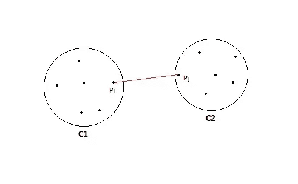****

******敏的优点:******

*   ****只要两个簇之间的间隙不小，这种方法就可以分离非椭圆形状。****

****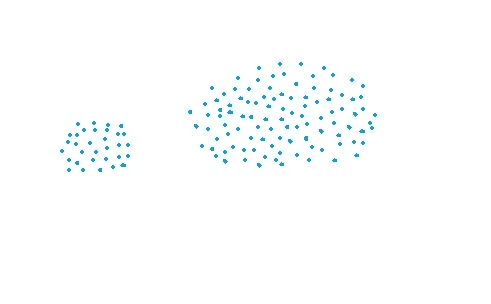********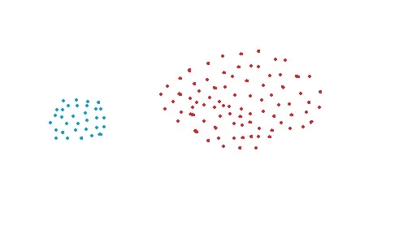********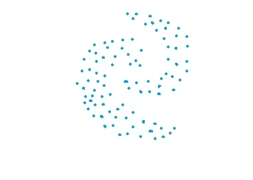********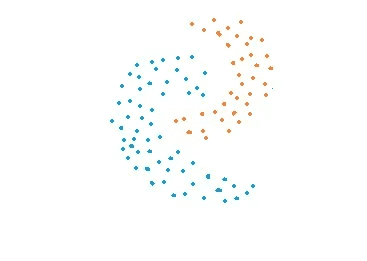

Original data vs Clustered data using MIN approach**** 

******MIN 的缺点:******

*   ****如果聚类之间存在噪声，最小方法不能正确地分离聚类。****

****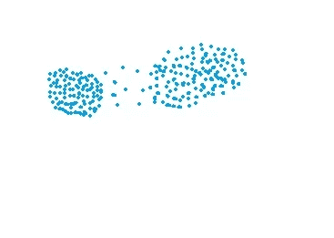********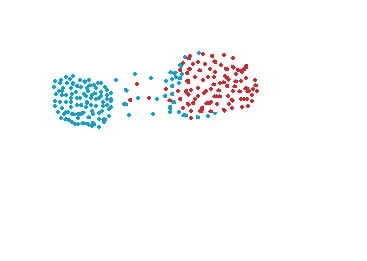

Original data vs Clustered data using MIN approach**** 

*   ******MAX:** 也称为完全联动算法，这与 **MIN** 方法正好相反。两个群集 C1 和 C2 的相似性等于点 Pi 和 Pj 之间的相似性的最大值**,使得 Pi 属于 C1，Pj 属于 C2。******

******从数学上讲，这可以写成:******

******Sim(C1，C2) = Max Sim(Pi，Pj)使得 Pi ∈ C1 & Pj ∈ C2******

******简而言之，选取两个最远的点，使得一个点位于聚类 1 中，另一个点位于聚类 2 中，并获取它们的相似性，将其声明为两个聚类之间的相似性。******

******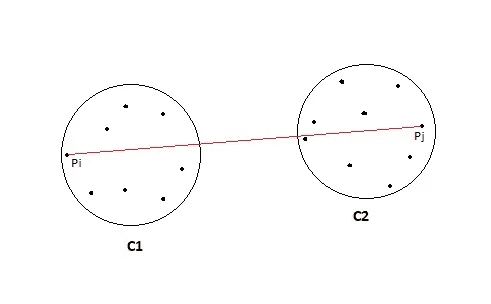******

********MAX 的优点:********

*   ****如果聚类之间存在噪声，最大值方法在分离聚类方面表现良好。****

****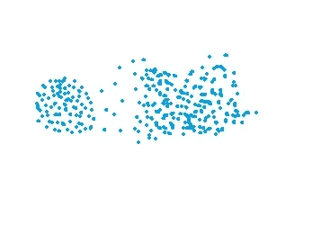********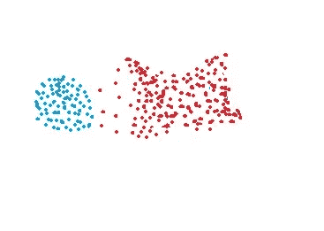

Original data vs Clustered data using MAX approach**** 

******Max 的缺点:******

*   ****Max 方法偏向球状星团。****
*   ****最大值方法倾向于打破大的集群。****

****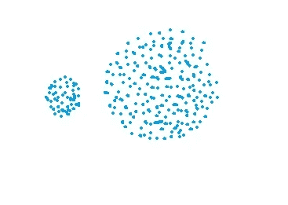********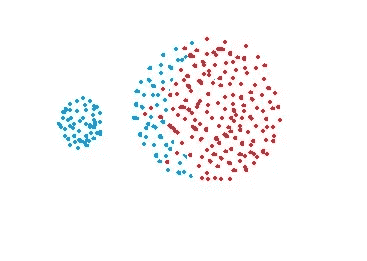

Original data vs Clustered data using MAX approach**** 

*   ******组平均:**取所有的点对，计算它们的相似度，并计算相似度的平均值。****

****从数学上讲，这可以写成:****

****sim(C1，C2) = [∑](https://en.wiktionary.org/wiki/%E2%88%91) sim(Pi，Pj)/|C1|*|C2|****

****其中，π∈C1 & Pj∈C2****

****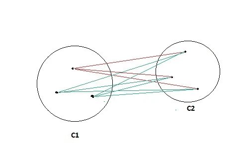****

******组平均的优点:******

*   ****如果聚类之间存在噪声，则组平均方法在分离聚类方面表现良好。****

******组平均的缺点:******

*   ****群平均法偏向球状星团。****
*   ******质心距离:**计算两个聚类 C1 & C2 的质心，将两个质心之间的相似度作为两个聚类之间的相似度。这是现实世界中不太流行的技术。****

********

*   ******沃德方法:**除了沃德方法计算距离 Pi 和 PJ 的平方和之外，这种计算两个聚类之间相似性的方法与组平均完全相同。****

****从数学上讲，这可以写成:****

****sim(C1，C2) = [∑](https://en.wiktionary.org/wiki/%E2%88%91) (dist(Pi，Pj)) /|C1|*|C2|****

******沃德方法的优点:******

*   ****如果聚类之间存在噪声，Ward 的方法在分离聚类方面也做得很好。****

******沃德方法的缺点:******

*   ****沃德的方法也偏向球状星团。****

******层次聚类技术的空间和时间复杂度:******

******空间复杂度:**当数据点的数量很大时，层次聚类技术所需的空间非常大，因为我们需要将相似性矩阵存储在 RAM 中。空间复杂度是 n 的平方的数量级。****

****空间复杂度= O(n)其中 n 是数据点的数量。****

******时间复杂度:**由于我们要进行 n 次迭代，并且在每次迭代中，我们需要更新相似度矩阵和恢复矩阵，所以时间复杂度也很高。时间复杂度是 n 的立方的数量级。****

****时间复杂度= O(n)其中 n 是数据点的数量。****

********层次聚类技术的局限性:********

1.  ****分层聚类没有数学目标。****
2.  ****所有计算聚类之间相似度的方法都有其自身的缺点。****
3.  ****层次聚类的高空间和时间复杂度。因此，当我们有大量数据时，不能使用这种聚类算法。****

## ****相关文章:[K 近邻入门](https://bit.ly/37pQ2yy)****

**** [## 机器学习:K 近邻入门。

### 我们将在本文中了解到:

medium.com](https://medium.com/datadriveninvestor/machine-learning-getting-started-with-k-nearest-neighbours-6851280d4c93) 

**参考文献:**

1.  [https://cs . wmich . edu/alfuqaha/summer 14/cs 6530/lectures/clustering analysis . pdf](https://cs.wmich.edu/alfuqaha/summer14/cs6530/lectures/ClusteringAnalysis.pdf)
2.  [www.appliedaicourse.com](http://www.appliedaicourse.com)
3.  [https://en.wikipedia.org/wiki/Hierarchical_clustering](https://en.wikipedia.org/wiki/Hierarchical_clustering)

****