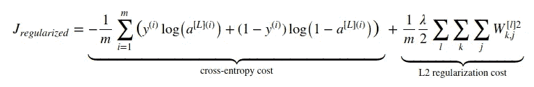
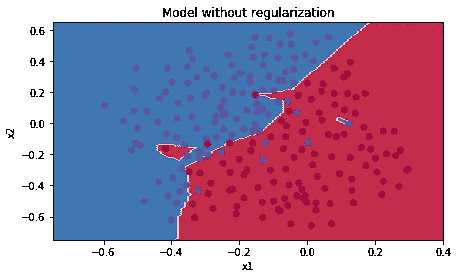
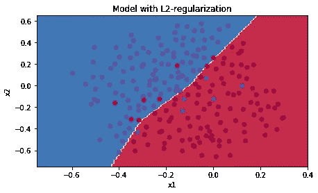
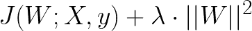
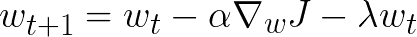
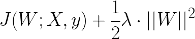

# 在神经网络的上下文中理解 L 正则化的缩放

> 原文：<https://towardsdatascience.com/understanding-the-scaling-of-l%C2%B2-regularization-in-the-context-of-neural-networks-e3d25f8b50db?source=collection_archive---------4----------------------->

你是否曾经看到过神经网络成本函数的 L 正则化项，并想知道为什么它同时被 2 和 *m* 缩放？

Equation 1: An L2-regularized version of the cost function used in SGD for NN

您可能在众多使用它来正则化神经网络模型的论文中遇到过它，或者在学习关于神经网络主题的课程时遇到过它。令人惊讶的是，当 L 正则化的概念在这种情况下出现时，该术语通常与这些因素一起引入，而没有进一步的解释。

[我](http://www.shaypalachy.com/)最近在学习 [*改进深度神经网络*](https://www.coursera.org/learn/deep-neural-network/home/welcome) 课程(吴恩达/ [deeplearning.ai](https://www.deeplearning.ai/) 在 Coursera 的优秀深度学习专业化中的第二门课程)时再次遇到了这个术语，其中确实没有对这些比例因子做出解释，所以我开始在互联网上搜索。下面的帖子总结了我在搜索过程中所学到的东西。

# 提醒:神经网络中梯度下降的 L 正则化

只是为了确保我们都在同一页上，这里有一个在神经网络的随机梯度下降背景下什么是 L 正则化的简要回顾。

通常在机器学习中，当我们拟合我们的模型时，我们在[解空间](https://en.wikipedia.org/wiki/Statistical_learning_theory#Formal_description)中搜索最合适的解；在神经网络的上下文中，解空间可以被认为是我们的网络可以表示的所有函数的空间(或者更准确地说，接近任何期望的程度)。我们知道这个空间的大小取决于(至少)网络的深度和使用的激活函数。我们还知道，使用“挤压”  函数，至少有一个隐藏层后跟一个激活层，这个空间非常大，并且它随着网络的深度呈指数增长(参见 [*通用近似定理*](https://en.wikipedia.org/wiki/Universal_approximation_theorem) )。

当我们使用[随机梯度下降](https://en.wikipedia.org/wiki/Stochastic_gradient_descent) (SGD)来使我们的网络参数适合手头的学习问题时，我们在算法的每次迭代中，在解空间中朝着损失函数*J(θ；x，y)* 相对于网络的参数 *θ* 。由于深度神经网络的解空间非常丰富，这种学习方法可能会过度适应我们的训练数据。如果不使用应对措施，这种过度拟合可能会导致显著的[泛化误差](https://en.wikipedia.org/wiki/Generalization_error)和对看不见的数据(或模型开发环境中的测试数据)的不良性能。那些反措施被称为[正则化](https://en.wikipedia.org/wiki/Regularization_(mathematics))技术。

Figure 1: An unregularized model can overfit to noise/outliers in the training data

> “正则化是我们对学习算法进行的任何修改，旨在减少其泛化误差，而不是训练误差。”伊恩·古德菲勒

在迭代学习算法的一般情况下，有几种正则化技术，如早期停止，特别是神经网络，如辍学。统计学和机器学习中的一种常见方法是在损失函数中添加一个正则项，这意味着将模型复杂性的一种度量纳入到要最小化的函数中。这种方法既不是迭代学习算法也不是神经网络所独有的，它将众多学习算法的共同形式化为优化问题。

现在，我们不再只是在解决方案空间中搜索训练集损失最小的解决方案，而是考虑解决方案的简单性。这增加了选择更简单且因此更通用的解决方案的机会，同时保持训练数据的低误差。用 Tim Roughgarden 的话说，我们变得*“偏向于更简单的模型，因为它们捕捉的是更基本的东西，而不是特定数据集的一些工件”*。

Figure 2: Applying regularization can help prevent overfitting on the training data

现在我们已经讨论了泛化错误和正则化，让我们回到 L 正则化。这种技术在统计学中也被称为 [*吉洪诺夫正则化*](https://en.wikipedia.org/wiki/Tikhonov_regularization) 和*岭回归*，是一种通过添加复杂性表示项来正则化成本函数的特定方式。在神经网络中的 L 正则化的情况下，该术语简单地是网络的隐藏层的权重矩阵的平方[欧几里德范数](https://en.wikipedia.org/wiki/Norm_(mathematics)#Euclidean_norm) (或者在多个隐藏层的情况下，包括输出层，是所有这种平方范数的总和)。添加附加参数 *λ* ，以允许控制正则化的强度。

添加 L 项通常会导致整个模型的权重更小。其他类型的基于项的正则化可能具有不同的效果；例如， [L](https://en.wikipedia.org/wiki/Taxicab_geometry) 正则化导致更稀疏的解，其中更多的参数将以零值结束。

具有 L 和 L 的正则化也有一个漂亮的概率解释:它相当于在权重矩阵的分布上添加一个先验*W*；这将优化问题从执行 [*最大似然估计* (MLE)](https://en.wikipedia.org/wiki/Maximum_likelihood_estimation) 转换为执行 [*最大后验概率* (MAP)](https://en.wikipedia.org/wiki/Maximum_a_posteriori_estimation) 估计；即从使用[频率主义推理](https://en.wikipedia.org/wiki/Frequentist_inference)移动到[贝叶斯推理](https://en.wikipedia.org/wiki/Bayesian_inference)。Brian Keng 的[一篇伟大的文章中可以找到对这一解释的全面概述。](http://bjlkeng.github.io/posts/probabilistic-interpretation-of-regularization/)

回到 L 正则化，我们得到一个形式的项

Equation 2 : Adding L² regularization to a cost function

其中∨≈∨是 L 范数。这确实是我们在经典 [*吉洪诺夫正则化*](https://en.wikipedia.org/wiki/Tikhonov_regularization) 中遇到的形式。

那么被 *m* 和 *2* 的划分又是从何而来呢？此处将该项减半似乎特别多余，因为它只增加了除以一个常数，因此如果我们也像通常所做的那样搜索超参数(如 *λ* )的最佳值，则没有任何意义。事实上，在经典机器学习中，没有这两个因素也会遇到相同的正则化项。

一个可能的答案是，L 正则化可能是通过引入相关但不相同的概念*权重衰减*而进入深度学习领域的。

# 重量衰减

权重衰减的想法很简单:为了防止过度拟合，每当我们用相对于 *w* 的梯度 *∇J* 更新权重 *w* 时，我们还要从中减去*λ*∏*w*。这使得重量趋向于衰减为零，因此得名。

这其实是深度学习历史上相当早期的概念。Nowlan 和 hint on 1992 年的一篇论文 [*通过软权重共享*](http://www.cs.toronto.edu/~hinton/absps/sunspots.pdf) 简化神经网络，不经意地引用了 Plaut、Nowlan 和 hint on 1986 年 6 月的一篇论文 [*通过反向传播*](https://pdfs.semanticscholar.org/5909/99a3b8e6e484260b671682c4f704e90bfdac.pdf) 进行学习的实验。因为那里引用的几篇论文似乎都没有使用这个概念，这实际上可能是在神经网络的上下文中引入这个概念的地方。甚至[汉森&普拉特(1988)](https://pdfs.semanticscholar.org/f4ea/5a6ff3ffcd11ec2e6ed7828a7d41279fb3ad.pdf) 似乎也在脚注中暗示，他们当时找不到*发表的*论文来引用这个概念。

Equation 3: Weight decay for neural networks

当从这个角度看正则化时，常见形式开始变得清晰。为了将这一项添加到权重更新中，我们“劫持”了成本函数 *J* ，并且添加了一项，该项在被导出时将产生这个期望的*-λ∙w*；要加的项当然是 *-0.5 λ∙w* 。对 *J -0.5 λ∙w* 求导，将得到*∇j-λ*∙w，这就是我们的目标。

Equation 4 : L² regularization from a weight decay perspective

Plaut 等人已经在上述论文中指出了这种与 L 范数的关系:

> “看待术语 *h∙w* 的一种方式是将其视为 0.5 *h∙w* 的导数，因此我们可以将学习过程视为最小化 *E* (误差)和最小化权重的平方和之间的折衷。”

事实上，L 正则化和权重衰减正则化对于标准随机梯度下降是等价的(当通过学习率重新调整时)。对于所有基于梯度的学习算法来说，这并不一定是真的，最近[显示](https://arxiv.org/pdf/1711.05101.pdf)对于自适应梯度算法来说，例如 [Adam](https://arxiv.org/abs/1412.6980) 。

# 为什么要除以 m？

所以，我们仍然有被 m 分割的问题。毕竟，适当的超参数优化也应该能够处理规模的变化(至少在理论上)。

## 选项 1:批量梯度下降的副作用

让我们从重量衰减的角度来看这个问题。在*梯度下降* (SGD)的随机变量中，我们每次在单个训练样本上评估损失函数的梯度(关于参数 *θ* )。如果我们认为权重衰减是在每个示例级别中引入的(如最初那样)，我们自然会得到，当*梯度下降*的单次迭代在整个训练集上被形式化时，导致算法有时被称为*批量梯度下降， *1/m* 的比例因子(被引入以使成本函数在不同大小的数据集之间具有可比性)自动应用于权重衰减项。*

## 选项 2:重新调整单个示例的权重

我在[一个由用户 grez](https://stats.stackexchange.com/questions/287920/regularisation-why-multiply-by-1-2m) 验证的关于交叉的答案中遇到的第二种方式是，这种缩放确保正则化项对损失函数的影响大致对应于单个训练示例。这确保了正则化的实际效果不会随着数据量的增加而爆炸——这可能解释了为什么当 SGD 用于神经网络时，这个比例因子开始具体出现，神经网络在大数据时代再次出现。

从单个例子的角度考虑这个术语，考虑没有这种缩放的正则化术语:在学习算法解决的一些第一批问题中，一个术语可能具有 1000 个例子的权重，在大数据集时代，突然在算法的每次迭代中获得与 10，000，000 个例子相同的权重。从信息论的角度来看，这个论点在某种程度上是有道理的；这是很多与我们之前提到的假设相关的信息，更简单的模型捕捉一些基本的东西，当训练集变得非常大时，这可能成为太强的假设。

## 选项 3:训练集代表性

我还想就这个问题提出一个统计学的观点。我们可以把我们的训练集想象成未知复杂性的未知分布的样本。然而，无论这种看不见的分布有多复杂，随着我们的训练集的增长，它成为这种看不见的源分布的代表性样本的概率也在增长，这总是事实。因此，它也更能代表未来未知数据(或测试集)的任何足够大的样本。简而言之，训练集越有代表性，需要做的过度拟合就越少。

在这个意义上，随着例子数量的增加，缩小正则化项编码了这样一个概念，即我们拥有的数据越多，在查看任何特定的 SGD 步骤时，我们可能需要的正则化就越少；毕竟，当损失项应该随着 *m* 增长而保持不变时，网络的权重也应该增长，使得正则化项本身相对于原始损失项收缩。

[最近的一篇论文](https://arxiv.org/abs/1806.03852)(以及[的后续论文](https://arxiv.org/pdf/1806.03852.pdf))提出，如果引入足够的数据扩充，权重衰减和丢失对于目标识别 NNs 来说可能不是必要的，这或许可以被视为支持这一概念，即我们拥有的数据越多，需要的正则化就越少。

## 选项 4:使 *λ可比*

最后一个很好的动机是:当 *m* 改变时，通过希望减轻改变 *λ* 的需要，这种缩放使得 *λ* 本身在不同大小的数据集之间具有可比性。这使得 *λ* 成为针对特定学习问题的特定模型所需的实际正则化程度的更具代表性的估计值。

## 选项 5:经验值

无论你觉得哪个直观的理由令人满意，至少对于使用 ReLU 作为激活函数的前馈网络来说，通过 *1/m* 缩放正则项的经验值在下面的笔记本中由前述的[grez](https://github.com/grez911):
[https://github . com/grez 911/machine-learning/blob/master/L2 . ipynb](https://github.com/grez911/machine-learning/blob/master/l2.ipynb)优雅地展示

# 最后的话

就是这样！我希望你喜欢这个小而重要的数学术语。如果你对这些比例术语的形成原因和方式有任何更正、补充或其他想法，请在评论中告诉我，或者通过我在个人网站上链接的任何方式联系我。:)

## 脚注:

1.  在这种情况下,“挤压”函数是任何非常数、有界且连续的函数，因此是满足通用逼近定理条件的函数，而不是通常称为“挤压函数”的任何特定函数，如 sigmoid 函数。
2.  欧几里德范数是一般的[*p*-范数](https://en.wikipedia.org/wiki/Norm_(mathematics)#p-norm)(又名*lᵖ*-范数)当 *p=2* 时的情况；*L*-定额。因此，取名为 *L* 正规化。