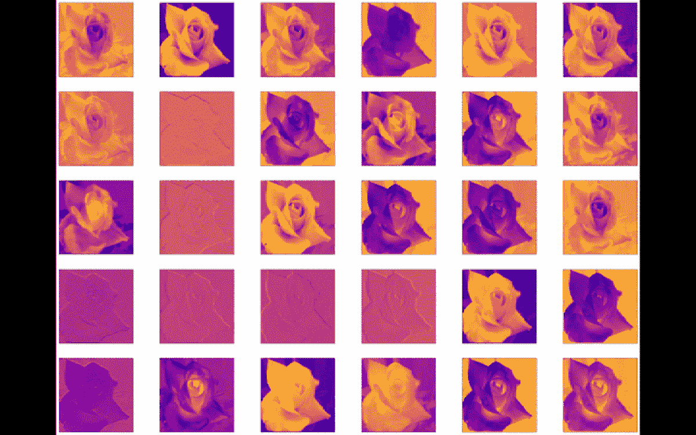
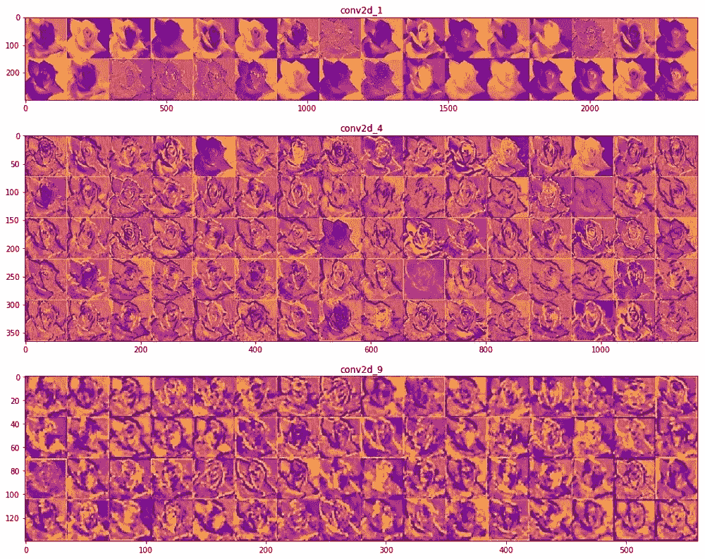
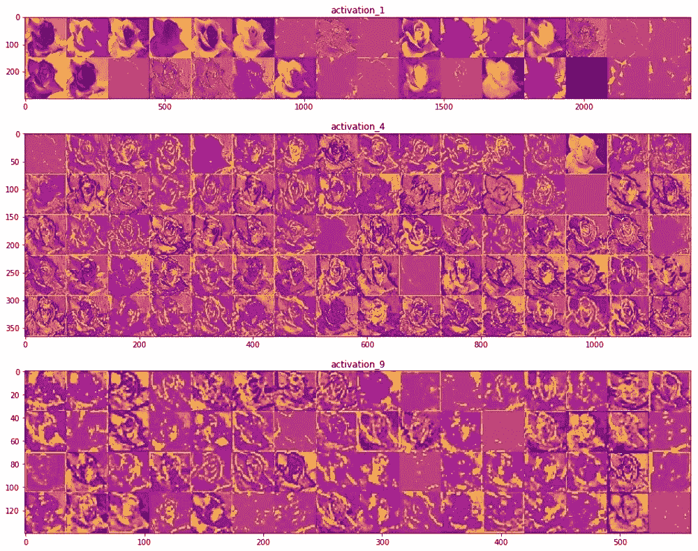
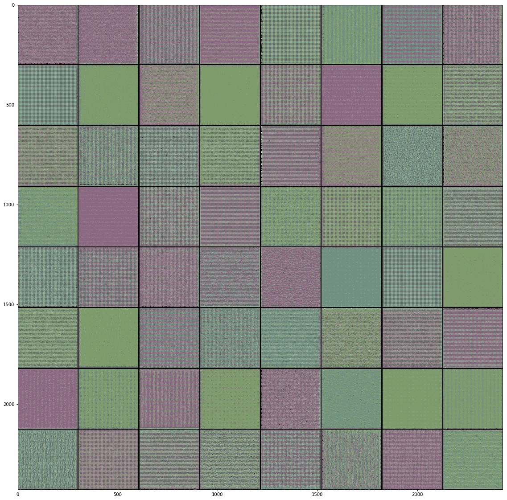
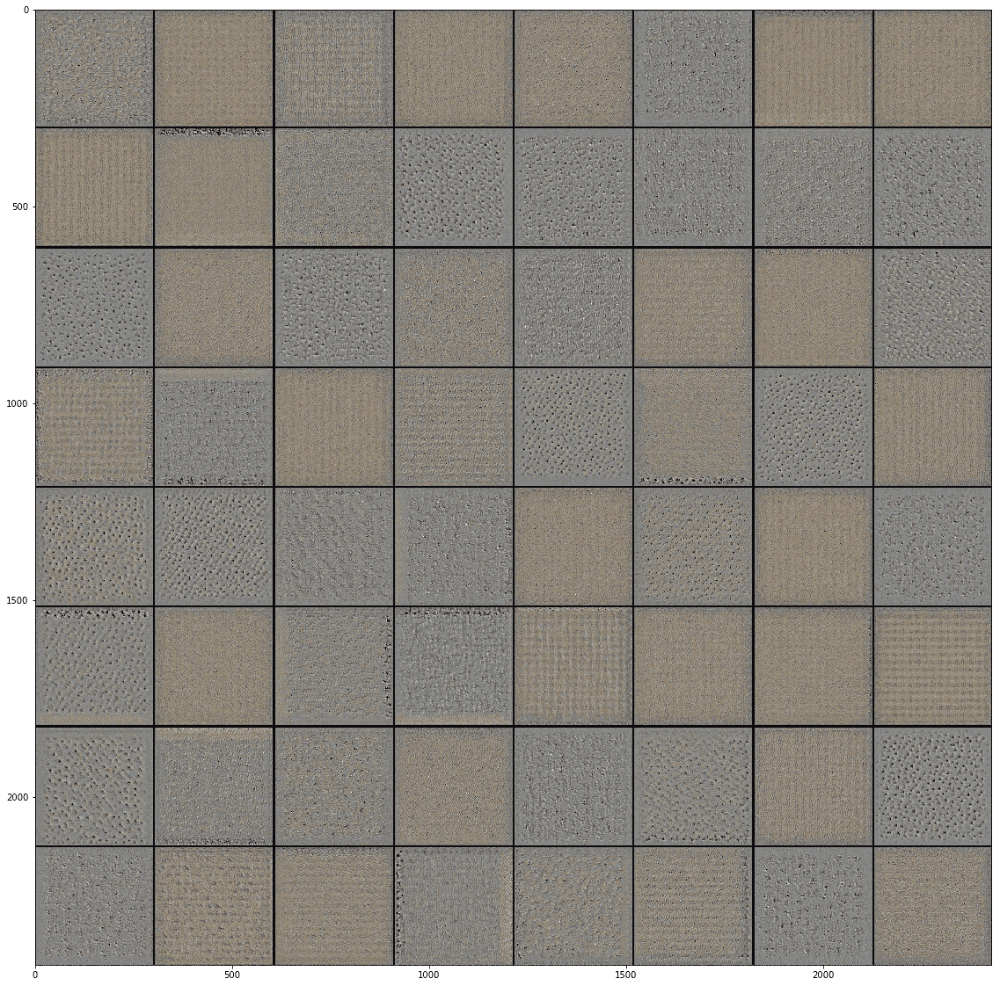
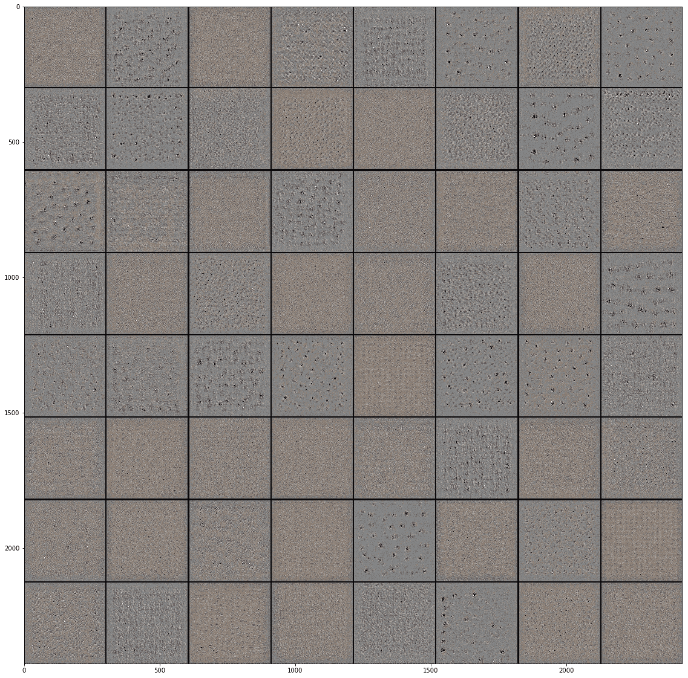
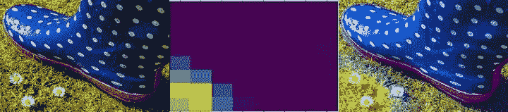

# 通过可视化了解您的卷积网络

> 原文：<https://towardsdatascience.com/understanding-your-convolution-network-with-visualizations-a4883441533b?source=collection_archive---------1----------------------->

**Convolution layer outputs from InceptionV3 model pre-trained on Imagenet**

自从卷积神经网络出现以来，计算机视觉领域已经取得了巨大的进步。在过去的几年里，这一领域令人难以置信的研究速度，加上网上大量图像数据库的开放可用性，给了我们令人难以置信的结果。大型卷积神经网络的兴起始于 2012 年的 **AlexNet** ，由 **Alex Krizhevsky** 、 **Ilya Sutskever** 和 **Geoffrey Hinton** 创建，是当年 **ImageNet 大规模视觉识别挑战赛**的获奖作品。从那以后，这个领域的研究人员再也没有回头看，计算机视觉各个领域的结果就是一个明显的证明。从手机中的人脸识别到驾驶汽车，CNN 的巨大力量正被用来解决许多现实世界的问题。

但是，尽管大型数据库和预先训练的 CNN 模型广泛可用，但有时很难理解你的大型模型到底在学习什么以及如何学习，特别是对于没有机器学习所需背景的人来说。虽然，阅读基础统计和概率有助于克服一些障碍，但当涉及到调试大型卷积架构(如 Inception 模型)时，许多人会上当。大多数人的目标只是使用预先训练好的模型来进行一些图像分类或任何其他相关的问题，以得到最终的结果。他们最不关心网络的内部工作，这实际上可以告诉他们很多关于他们的网络如何学习和学习什么，以及调试它的故障。

最近偶然看到这本**Fran ois Chollet([Twitter](https://twitter.com/fchollet))**用 Python** 深度学习的超棒的书。如果你正开始你的深度学习之旅，这本书是一个瑰宝。它使用 Keras，这是一个优秀的深度学习库，运行在 TensorFlow，MXNET 和 Theano 上，解释了深度学习的基础知识以及前沿和最新的事情和结果。在我阅读这本书学到的许多新东西中，真正激发我兴趣的是可视化如何用于学习 conv 网。在这篇博客中，我总结了我学到的三种技术以及我复制它们的结果。**

# Eenter 可视化

可视化机器学习模型的输出是一种很好的方式来查看它的进展情况，无论是基于树的模型还是大型神经网络。在训练深度网络时，大多数人只关心训练误差(精度)和验证误差(精度)。虽然判断这两个因素确实可以让我们了解我们的网络在每个时代的表现，但当涉及到像 Inception 这样的深度 CNN 网络时，我们可以看到更多信息，从而了解网络架构。

在这篇文章中，我将演示几种可视化模型输出的方法(中间层和最终层)，这可以帮助你更深入地了解模型的工作。我训练了 Keras 中的 InceptionV3 模型(在 ImageNet 上进行了预训练),训练了 Kaggle 上的花卉识别数据集。如果你不熟悉 Inception 模型，我建议你先浏览一下 [**Inception 架构**](https://arxiv.org/pdf/1409.4842.pdf) 的原始论文，然后再浏览一下 [**InceptionV3 论文**](https://arxiv.org/pdf/1512.00567.pdf) 以了解这些架构背后的理论。

我对模型进行了 10 个时期的训练，批次大小为 32，每个图像的大小调整为(299，299，3)的形状，这是预训练的 InceptionV3 模型所需要的。我的模型能够达到 0.3195 的训练损失和 0.6377 的验证损失。我使用 Keras 内置的 *ImageDataGenerator* 模块来扩充图像，这样模型就不会过拟合得太快。可以看看我的 [**github 库**](https://github.com/anktplwl91/visualizing_convnets) 上的代码。

# 可视化中间层激活

为了理解我们的深度 CNN 模型如何能够对输入图像进行分类，我们需要理解我们的模型如何通过查看其中间层的输出来查看输入图像。通过这样做，我们能够更多地了解这些层的工作原理。

例如，当提供来自测试集的花的图像时，以下是训练的 InceptionV3 模型的一些中间卷积及其相应激活层的输出。

**Original Image**

**Filters from layers First, Fourth and Ninth convolution layers in InceptionV3**

**Filters from ReLU activation layers respective to First, Fourth and Ninth convolution layers in InceptionV3**

上图显示了分别来自 InceptionV3 网络的几个中间卷积和 ReLU 层的滤波器。我通过在一个测试图像上运行训练好的模型来捕获这些图像。

如果你看看不同的图像从卷积层过滤器，很清楚地看到不同的过滤器在不同的层是如何试图突出或激活图像的不同部分。一些过滤器充当边缘检测器，其他的检测花的特定区域，如其中心部分，还有一些充当背景检测器。在起始层中更容易看到卷积层的这种行为，因为随着你越深入，卷积核捕获的模式变得越来越稀疏，所以可能这种模式甚至可能不存在于你的图像中，因此它不会被捕获。

进入相应卷积层的 Relu(校正线性单位)激活，它们所做的就是将 ReLU 函数应用于每个像素`ReLU(z) = max(0, z)`，如下图所示。因此，基本上，在每个像素上，激活函数要么为所有负值设置 0，要么在像素值大于 0 时设置像素值本身。

**ReLU function**

通过以这种方式可视化来自不同卷积层的输出，您将注意到的最重要的事情是，网络中较深的层可视化更多训练数据特定特征，而较早的层倾向于可视化一般模式，如边缘、纹理、背景等。当您使用迁移学习时，这些知识非常重要，通过迁移学习，您可以在完全不同的数据集上训练预训练网络(在不同的数据集上进行预训练，如本例中的 ImageNet)的某个部分。总的想法是冻结早期层的权重，因为它们无论如何都会学习一般特征，并且只训练更深层的权重，因为这些层实际上识别你的对象。

# 可视化 Convnet 滤波器

了解卷积网络在图像中寻找什么的另一种方法是可视化卷积图层过滤器。通过显示网络层过滤器，您可以了解每个过滤器将响应的模式。这可以通过对 convnet 的值运行梯度下降来实现，以便从空白输入图像开始最大化特定滤波器的响应。

以下是我在 Flowers 数据集上训练的 InceptionV3 模型中的一些模式。

**Filters from third convolution layer in InceptionV3**

**Filters from eight convolution layer in InceptionV3**

**Filters from fortieth convolution layer in InceptionV3**

仔细观察这些来自不同卷积层的滤波器图像后，就可以清楚地看到不同的层实际上试图从提供给它们的图像数据中学习什么。在起始层的过滤器中发现的图案似乎非常基本，由线条和其他基本形状组成，这告诉我们早期的层了解图像中的基本特征，如边缘、颜色等。但是，随着你向网络的更深处移动，模式变得更加复杂，这表明更深的层实际上正在学习更抽象的信息，这有助于这些层概括关于类而不是特定图像的信息。这就是为什么在前面的部分中，我们在更深的层中看到一些空的过滤器激活，因为该特定过滤器没有为该图像激活，换句话说，该图像没有过滤器感兴趣的信息。

# 可视化课程激活热图

预测图像的类别标签时，有时您的模型会为您的类别预测错误的标签，即正确标签的概率不是最大的。在这种情况下，如果你能想象出你的 convnet 在看图像的哪一部分并推断出类别标签，这将会很有帮助。

这种技术的一般类别称为**类激活图** (CAM)可视化。使用 CAM 的技术之一是在输入图像上产生类激活的热图。类别激活热图是与特定输出类别相关联的分数的 2D 网格，针对输入图像的每个位置计算，指示每个位置相对于该输出类别有多重要。

在上面的图片中，你可以看到这种技术是如何工作的。从左开始，首先是输入图像，然后是 InceptionV3 架构中最后一个混合层的激活热图，最后我将热图叠加在输入图像上。因此，基本上，热图试图告诉我们的是图像中的位置，这些位置对于特定图层将其分类为目标类非常重要，在本例中是**雏菊****。**

在第一幅图像中，很明显网络在分类花方面没有问题，因为在整个图像中没有其他对象。在下一幅图像中，网络无法将图像分类为**雏菊，**但是如果你看一下激活图的热图，很明显网络正在图像的正确部分寻找花朵。与第三个图像的情况类似，网络能够突出显示图像的左下部分，小雏菊花位于该部分。因此，很明显，虽然网络不能正确地对第二和第三幅图像进行正确分类，但做出这一决定的原因不是网络的不正确，而是两幅图像中的其他对象占据了图像的较大部分。

对于网络中的不同层，激活热图可能会有所不同，因为所有层都以不同的方式查看输入图像，从而基于其过滤器创建图像的独特抽象。在这个例子中，我将重点放在模型的最后一层，因为类预测标签将在很大程度上依赖于它。但是比较不同层的激活热图是一个很好的实验。

# 结论

在这篇文章中，我描述了三种不同的方法来可视化你的深层卷积网络。正如前面所解释的，这样的可视化可以帮助我们理解黑盒技术的工作，更好地像神经网络一样，这对于调试任何错误或网络的整体性能都是有用的。