# Tensorflow 的不公平反向传播

> 原文：<https://towardsdatascience.com/unfair-back-propagation-with-tensorflow-manual-back-propagation-with-tf-c166115988fd?source=collection_archive---------9----------------------->

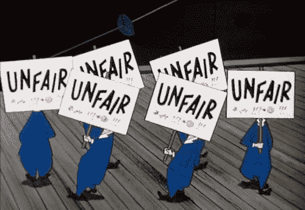

GIF from this [website](https://giphy.com/gifs/not-fair-picket-ymwKHQ44WnAoU)

我一直在思考[反向传播](https://brilliant.org/wiki/backpropagation/)，在传统的神经网络中，我们似乎总是线性地执行前馈操作和反向传播。(1:1 的比例)但是我对自己说，我们真的不需要这么做。所以我想做些实验。

*案例 a)反向传播(无数据增强)
案例 b)反向传播(数据增强)
案例 c)不公平的后支撑(从后面)(无数据增强)
案例 d)不公平的后支撑(从后面)(数据增强)
案例 e)不公平的后支撑(从前面)(无数据增强)
案例 f)不公平的后支撑(从前面)(数据增强)*

> **请注意，这个帖子是为了好玩，也是为了表达我的创意。因此不是面向性能的。**

**网络架构/数据集/典型反向传播**

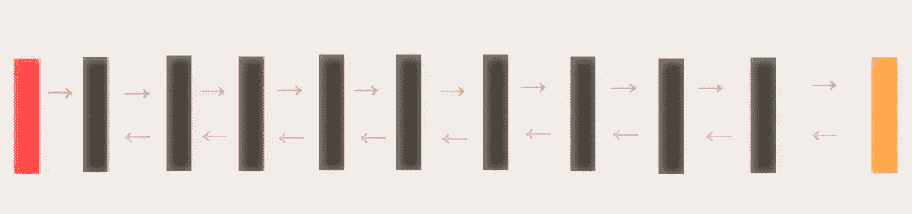

**红色方块** →输入图像批次
**黑色方块** →有/无均值合并的卷积层
**橙色方块** →用于分类的 Softmax 层
**橙色箭头** →前馈操作方向
**紫色箭头** →反向传播方向。

如上所述，我们将使用我的旧帖子“[全卷积网](/iclr-2015-striving-for-simplicity-the-all-convolutional-net-with-interactive-code-manual-b4976e206760)”中的基本网络，这是一个仅由卷积运算组成的 9 层网络。此外，我们将使用 [CIFAR 10 数据集](https://www.cs.toronto.edu/~kriz/cifar.html)。

**不公平反向传播**

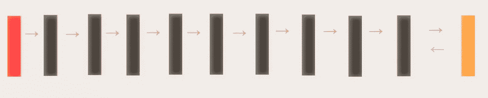

现在为了解释不公平反向传播的概念，让我们首先假设我们刚刚完成了前馈操作(如上所示)。通过查看粉色箭头，我们已经可以知道我们已经反向传播到第 9 层。

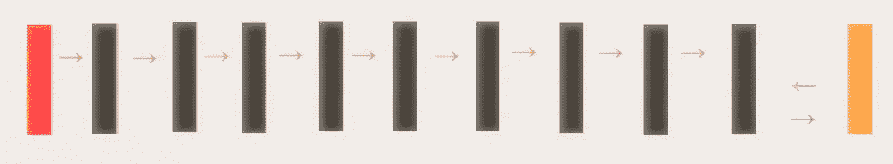

现在，我们可以再次执行前馈操作来获得另一轮分类，而不是继续反向传播到第八层等等。(但是这次第 9 层已经更新了一次它的权重。)

我们可以再次重复这个过程，但是这次我们也要更新第 8 层的权重。

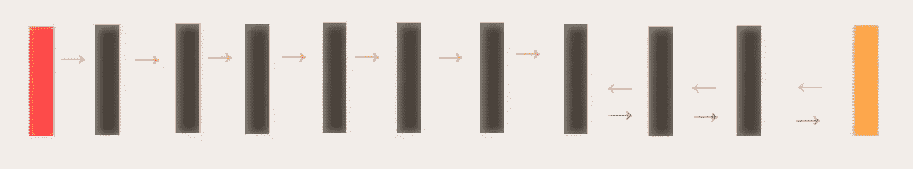

我们可以一次又一次地遵循这个概念。直到我们到达第一层，完成整个反向传播。总之，我们对网络的开始层不公平，因为后面的部分会更新更多。我们也可以在 GIF 格式中看到不同。

最后，我们可以把对网络开始部分不公平的概念反过来，对网络的后面部分不公平。(换句话说，我们网络的开始部分比后面部分更新得更多。)

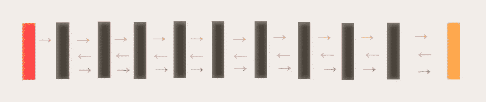

**结果:情况 a)反向传播(无数据增加)(50 个时期)**

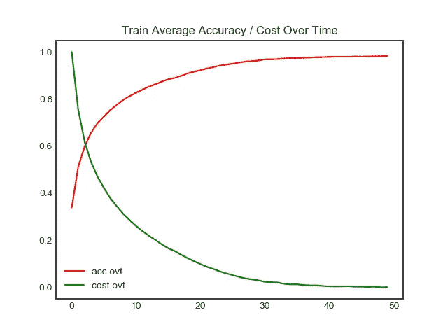

**左图** →一段时间内测试图像的精度/成本
右图 →一段时间内列车图像的精度/成本

如上所述，网络测试图像的准确率已经开始停滞在 83%左右。然而，这里要注意的是，网络需要 13 个历元才能使测试图像的准确率达到 80%以上。

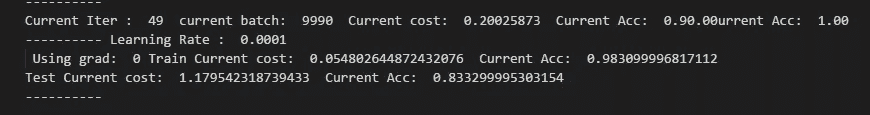

训练图像的最终准确率为 98 %,而测试图像的准确率为 83 %,这表明网络正遭受过拟合。

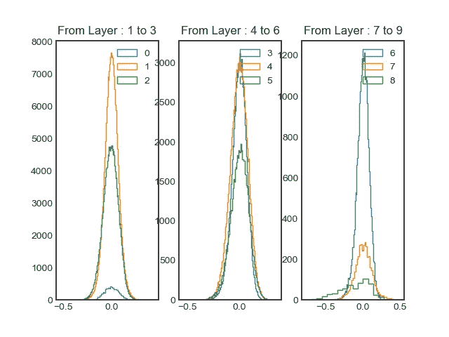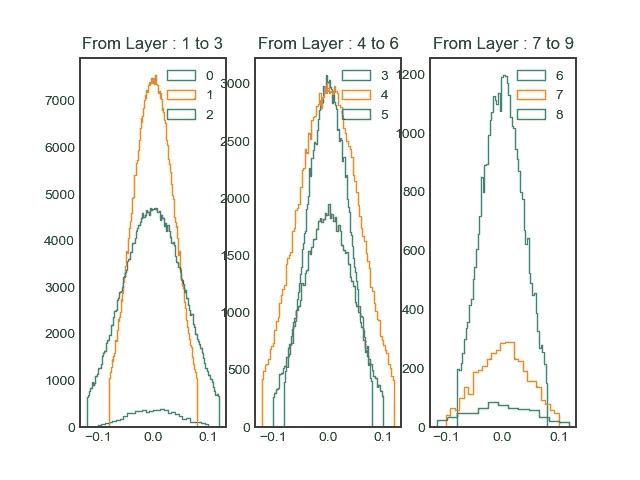

**左图** →训练后权重直方图
**右图** →训练前权重直方图

如上所示，所有的权重范围都从-0.1/0.1 增加到-0.5/0.5。

**结果:情况 b)反向传播(数据扩充)(10 个时期)**

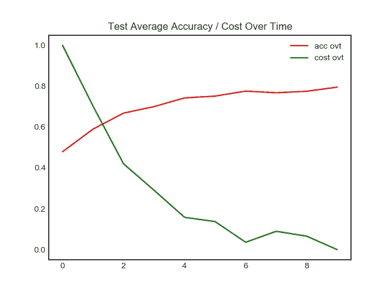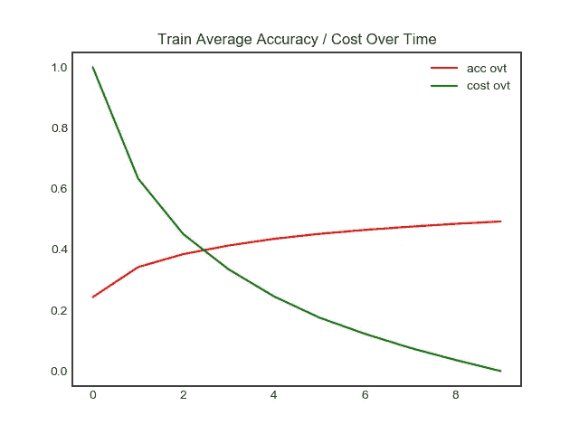

**左侧图像** →一段时间内测试图像的精度/成本
**右侧图像** →一段时间内训练图像的精度/成本

现在，由于我们执行了数据扩充，我们可以清楚地观察到训练图像的准确性下降(因为数据中有更多的差异。).

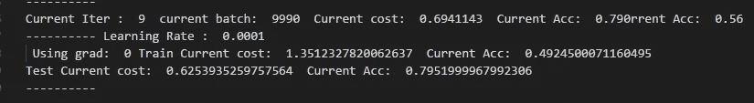

如上所示，在训练 10 个时期后，网络最终达到了 79%的准确率(在测试图像上)。值得庆幸的是，网络并没有过度拟合。

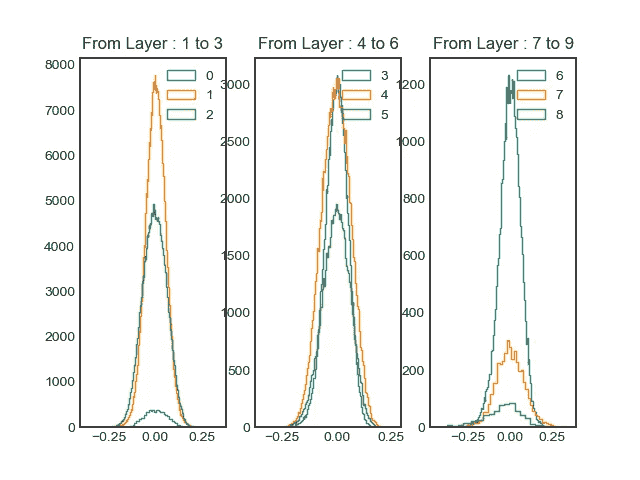

**左图** →训练后权重直方图
右图 →训练前权重直方图

就像我们没有执行数据扩充的情况一样，权重的范围也增加了。

**结果:案例 c)不公平的后道具(从后面) (无数据增强)(10 个历元)**

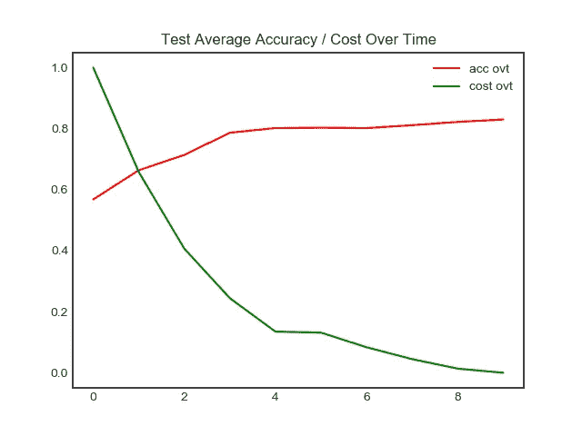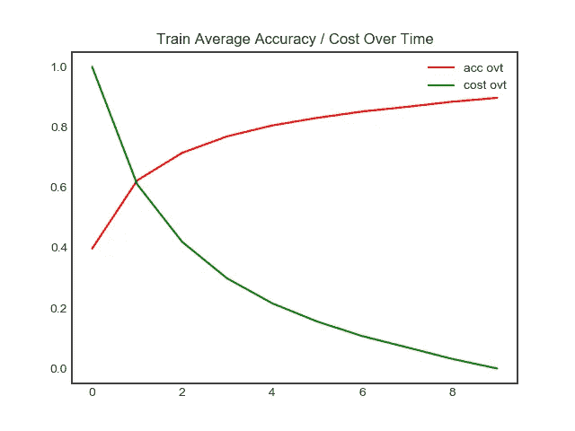

**左侧图像** →一段时间内测试图像的精度/成本
**右侧图像** →一段时间内列车图像的精度/成本

与用普通(典型)反向传播方法训练的网络相比，该网络表现得更好。在测试图像上完成训练的准确率约为 82 %,在训练图像上完成训练的准确率约为 89%。表明仍然存在过度拟合，但是与情况 a)相比没有那么多。

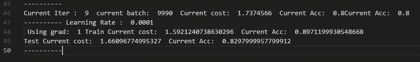

观察到不公平反向传播似乎具有某种正则化效应的事实是相当令人惊讶的。

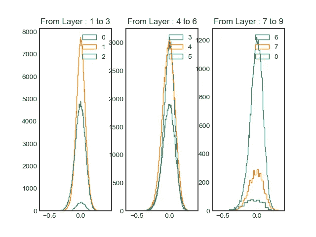

**左图** →训练后权重直方图
**右图** →训练前权重直方图

到目前为止，最有趣的观察是权重的直方图。如上所述，当我们将注意力集中到网络最终层生成的直方图时，我们可以观察到直方图偏向一侧。(-左侧范围为-0.5，而右侧没有 0.5。)表明分布的对称性有些受阻。中间层的直方图也是如此。

**结果:案例 d)不公平背道具(从后面) (数据增强)(10 Epoch)**

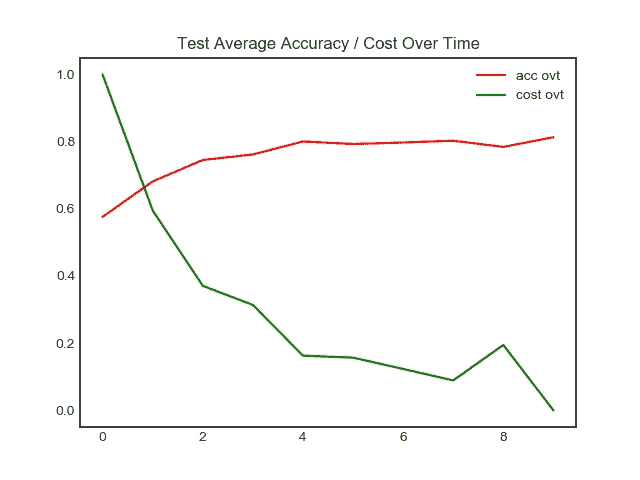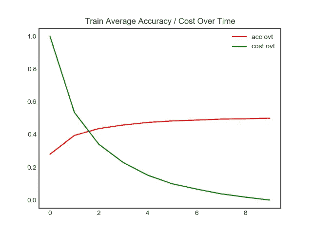

**左图** →一段时间内测试图像的精度/成本
右图 →一段时间内列车图像的精度/成本

同样，当我们执行数据扩充时，我们可以观察到训练图像的准确性下降。

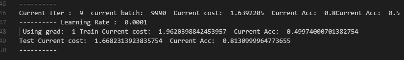

并且当比较来自情况 b)的结果(10 个历元的正常反向支持)时，我们可以观察到训练图像上的准确度彼此相似(49%)的事实。然而，不管是什么原因，由不公平反向支持训练的网络在测试图像上具有更高的准确性。

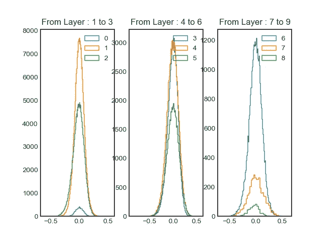

**左图** →训练后权重直方图
**右图** →训练前权重直方图

与情况 c)不同，我们可以观察到这种情况下权重分布的一些对称性。

**结果:情况 e)不公平的后道具(来自前方) (无数据增强)(10 个历元)**

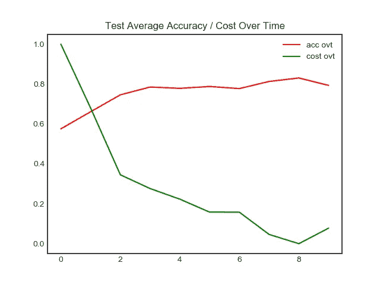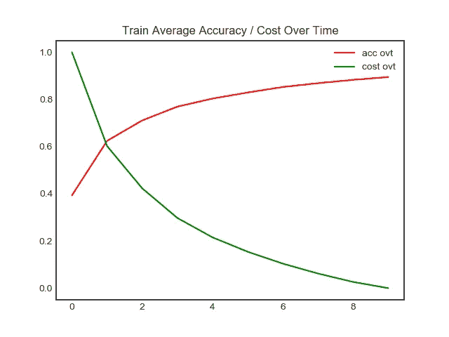

**左侧图像** →一段时间内测试图像的精度/成本
**右侧图像** →一段时间内训练图像的精度/成本

最后，我想看看，当我们对网络的后半部分不公平时，是否有区别。从表面上看，对我们网络的开始部分不公平比后面部分不公平要好。

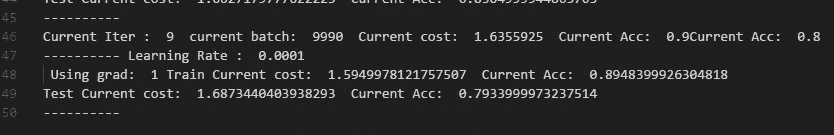

我这么说的一个原因是因为测试图像的最终准确性。我们可以观察到在训练图像上的准确性是相似的，但是该网络在测试图像上具有较低的准确性。

**左图** →训练后权重直方图
右图 →训练前权重直方图

有趣的是，不管我们对网络的开始部分还是后面部分不公平，权重的分布似乎是相似的。

**结果:案例 f)不公平的后道具(来自正面) (数据增强)(10 个历元)**

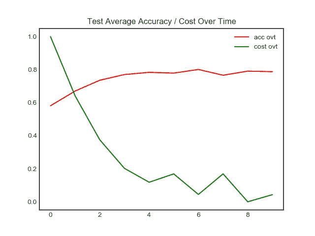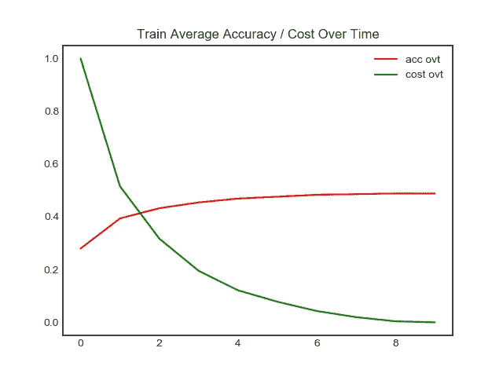

**左侧图像** →一段时间内测试图像的精度/成本
**右侧图像** →一段时间内列车图像的精度/成本

最后，我在训练来自案例 e 的相同网络时执行了数据扩充。

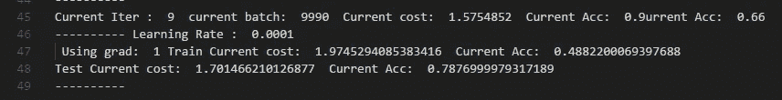

如上所述，这里也可以观察到精度没有提高。

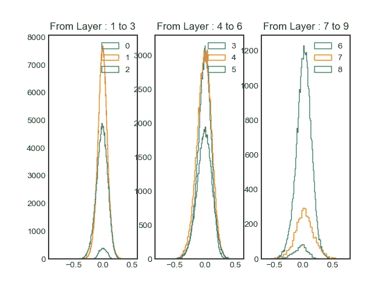

**左图** →训练后权重直方图
**右图** →训练前权重直方图

重量分布也有类似的结果。在普通的 CNN 中，我们知道后面的层捕捉更高级的特征。我怀疑网络更努力训练比较好？捕捉更高层次的特征。

**交互代码**

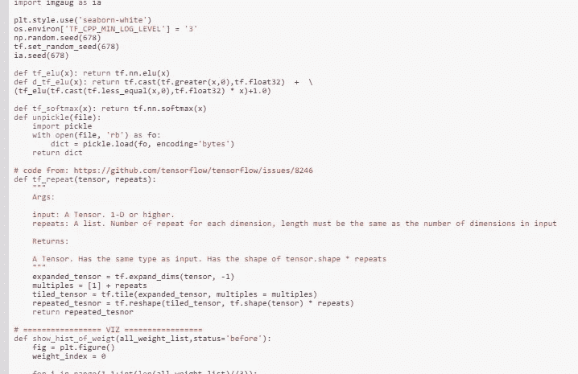

对于 Google Colab，你需要一个 Google 帐户来查看代码，而且你不能在 Google Colab 中运行只读脚本，所以在你的操场上复制一份。最后，我永远不会请求允许访问你在 Google Drive 上的文件，仅供参考。编码快乐！同样为了透明，我在 github 上上传了所有的训练日志。

要访问案例 [a 的代码，请点击此处](https://colab.research.google.com/drive/16F_6dXCNCmO-e5IfGIGq2mneE7amihb_)，要查看[日志，请点击此处。](https://github.com/JaeDukSeo/Daily-Neural-Network-Practice-2/blob/master/NeuralNetwork/Unfair/a_case(no%20data)/casea.txt)
访问案例 [b 的代码请点击此处，](https://colab.research.google.com/drive/1SVbAtyignjfUyTlCH9u8sdjIY8or-ShH)[日志的](https://github.com/JaeDukSeo/Daily-Neural-Network-Practice-2/blob/master/NeuralNetwork/Unfair/a_case(aug)/a_case(aug).txt)请点击此处。
要访问案例 [c 的代码，请点击此处](https://colab.research.google.com/drive/1Nrbal3TDr6NxUcyq7YJh_KZxpDhB1coU)，要查看[日志，请点击此处。](https://github.com/JaeDukSeo/Daily-Neural-Network-Practice-2/blob/master/NeuralNetwork/Unfair/d_case(no%20data)/cased.txt)
要访问案例 [d 的代码，请点击此处](https://colab.research.google.com/drive/1_9pVlKNUFmmBx-Y1g91TKRtaH4JTMIYw)，要查看[日志，请点击此处。](https://github.com/JaeDukSeo/Daily-Neural-Network-Practice-2/blob/master/NeuralNetwork/Unfair/d_case(aug)/d_case(aug).txt)
要访问案例 [e 的代码，请点击此处](https://colab.research.google.com/drive/1Glk8SerYf-qfBUMQHJMEDLcOqj-6UxLy)，要查看[日志，请点击此处。](https://github.com/JaeDukSeo/Daily-Neural-Network-Practice-2/blob/master/NeuralNetwork/Unfair/e_case(no%20data)/casee.txt)
要访问案例 [f 的代码，请点击此处](https://colab.research.google.com/drive/1QB51lGy22STowW_AeamzKnaXeW-E-xmG)，要查看[日志，请点击此处](https://github.com/JaeDukSeo/Daily-Neural-Network-Practice-2/blob/master/NeuralNetwork/Unfair/e_case(aug)/e_case(aug).txt)。

**最后的话**

关于我为什么发这篇博文，我其实有更深层次的原因，很快就会揭晓。这种不成比例的反向传播的想法真的让我很感兴趣。

如果发现任何错误，请发电子邮件到 jae.duk.seo@gmail.com 给我，如果你希望看到我所有写作的列表，请[在这里查看我的网站](https://jaedukseo.me/)。

同时，在我的 twitter 上关注我[这里](https://twitter.com/JaeDukSeo)，访问[我的网站](https://jaedukseo.me/)，或者我的 [Youtube 频道](https://www.youtube.com/c/JaeDukSeo)了解更多内容。我还实现了[广残网，请点击这里查看博文](https://medium.com/@SeoJaeDuk/wide-residual-networks-with-interactive-code-5e190f8f25ec) t。

**参考**

1.  tf.cond |张量流。(2018).张量流。检索于 2018 年 6 月 17 日，来自[https://www.tensorflow.org/api_docs/python/tf/cond](https://www.tensorflow.org/api_docs/python/tf/cond)
2.  TensorFlow？，H. (2018)。如何在 TensorFlow 中打印一个张量对象的值？。堆栈溢出。检索于 2018 年 6 月 17 日，来自[https://stack overflow . com/questions/33633370/how-to-print-the-value-of-a-tensor-object-in-tensor flow](https://stackoverflow.com/questions/33633370/how-to-print-the-value-of-a-tensor-object-in-tensorflow)
3.  数学|张量流。(2018).张量流。检索于 2018 年 6 月 17 日，来自[https://www.tensorflow.org/api_guides/python/math_ops](https://www.tensorflow.org/api_guides/python/math_ops)
4.  tf.floormod | TensorFlow。(2018).张量流。检索于 2018 年 6 月 17 日，来自[https://www.tensorflow.org/api_docs/python/tf/floormod](https://www.tensorflow.org/api_docs/python/tf/floormod)
5.  tf.cond |张量流。(2018).张量流。检索于 2018 年 6 月 17 日，来自[https://www.tensorflow.org/api_docs/python/tf/cond](https://www.tensorflow.org/api_docs/python/tf/cond)
6.  使用 tf。TensorFlow 中的 print()—走向数据科学。(2018).走向数据科学。检索于 2018 年 6 月 17 日，来自[https://towards data science . com/using-TF-print-in-tensor flow-aa 26 E1 cf F11 e](/using-tf-print-in-tensorflow-aa26e1cff11e)
7.  Tensorflow？，H. (2018)。如何在 Tensorflow 中给 tf.cond 内部的函数传递参数？。堆栈溢出。检索于 2018 年 6 月 17 日，来自[https://stack overflow . com/questions/38697045/how-to-pass-parameters-to-functions-inside-TF-cond-in-tensor flow](https://stackoverflow.com/questions/38697045/how-to-pass-parmeters-to-functions-inside-tf-cond-in-tensorflow)
8.  TensorFlow？，H. (2018)。如何在 TensorFlow 中打印一个张量对象的值？。堆栈溢出。检索于 2018 年 6 月 17 日，来自[https://stack overflow . com/questions/33633370/how-to-print-the-value-of-a-tensor-object-in-tensor flow](https://stackoverflow.com/questions/33633370/how-to-print-the-value-of-a-tensor-object-in-tensorflow)
9.  规范化的方向保持亚当，从亚当到 SGD 的转换，和内斯特罗夫动量亚当与…(2018).走向数据科学。检索于 2018 年 6 月 17 日，来自[https://towards data science . com/normalized-direction-preserving-Adam-switching-from-Adam-to-SGD-and-nesterov-momentum-Adam-with-460 be 5 ddf 686](/normalized-direction-preserving-adam-switching-from-adam-to-sgd-and-nesterov-momentum-adam-with-460be5ddf686)
10.  谷歌合作实验室。(2018).Colab.research.google.com。检索于 2018 年 6 月 17 日，来自[https://colab . research . Google . com/drive/1 okr 4 jfqbmoq 8 q 4 ctzdjmp 8 jqea 4 xdqbk](https://colab.research.google.com/drive/1Okr4jfqBMoQ8q4ctZdJMp8jqeA4XDQbK)
11.  反向传播|杰出的数学和科学维基。(2018).Brilliant.org。检索于 2018 年 6 月 17 日，来自[https://brilliant.org/wiki/backpropagation/](https://brilliant.org/wiki/backpropagation/)
12.  tf.while_loop，I. (2018)。tf.while_loop 中是否可以定义多个条件。堆栈溢出。检索于 2018 年 6 月 17 日，来自[https://stack overflow . com/questions/45595419/is-possible-have-multiple-conditions-defined-in-TF-while-loop](https://stackoverflow.com/questions/45595419/is-it-possible-to-have-multiple-conditions-defined-in-tf-while-loop)
13.  Python，E. (2018)。Python 中每 N 次迭代执行一次语句。堆栈溢出。检索于 2018 年 6 月 17 日，来自[https://stack overflow . com/questions/5628055/execute-statement-every-n-iterations-in-python](https://stackoverflow.com/questions/5628055/execute-statement-every-n-iterations-in-python)
14.  示例:基础— imgaug 0.2.5 文档。(2018).img aug . readthe docs . io . 2018 年 6 月 18 日检索，来自[http://img aug . readthe docs . io/en/latest/source/examples _ basics . html](http://imgaug.readthedocs.io/en/latest/source/examples_basics.html)
15.  CIFAR-10 和 CIFAR-100 数据集。(2018).Cs.toronto.edu。检索于 2018 年 6 月 19 日，来自[https://www.cs.toronto.edu/~kriz/cifar.html](https://www.cs.toronto.edu/~kriz/cifar.html)
16.  [ ICLR 2015 ]追求简单:具有交互码的全卷积网。(2018).走向数据科学。检索于 2018 年 6 月 19 日，来自[https://towards data science . com/iclr-2015-forwards-for-simplicity-the-all-convolutional-net-with-interactive-code-manual-b 4976 e 206760](/iclr-2015-striving-for-simplicity-the-all-convolutional-net-with-interactive-code-manual-b4976e206760)