# 从头开始展开朴素贝叶斯！

> 原文：<https://towardsdatascience.com/unfolding-na%C3%AFve-bayes-from-scratch-2e86dcae4b01?source=collection_archive---------3----------------------->

## 对于 ML 初学者


Photo by [Jukan Tateisi](https://unsplash.com/@tateisimikito?utm_source=unsplash&utm_medium=referral&utm_content=creditCopyText) on [Unsplash](https://unsplash.com/?utm_source=unsplash&utm_medium=referral&utm_content=creditCopyText)

# 从头开始展开朴素贝叶斯！Take-1🎬

W **无论你是机器学习的初学者，还是你一直在努力理解*超级自然的* *机器学习算法，但你仍然觉得点与点之间没有某种联系，*这篇文章绝对适合你！**

# **这篇博文的目的**

我试图让事情简单明了。唯一的目的是深入和清楚地理解一个众所周知的文本分类 ML 算法(朴素贝叶斯)的工作原理，而不是陷入在 ML 算法的解释中经常使用的莫名其妙的数学术语！

# **谁是目标受众？**

任何人从零开始寻找对 ML 算法的深入而易懂的解释

# **本教程的成果**

一个完整清晰的朴素贝叶斯 ML 算法的图片，所有神秘的数学都被揭开了神秘的面纱，在你的 ML 旅程中向前迈出了具体的一步！

# 定义路线图…..🚵

**里程碑# 1 :** [**简单介绍一下朴素贝叶斯算法**](#b3f7)

**里程碑# 2 :** [**朴素贝叶斯模型的训练阶段**](#f20f)

**重大里程碑# 3 :** [**测试阶段——预测开始发挥作用了！**](#6bd8)

**里程碑# 4 :** [**深入挖掘概率的数学**](#5700)

**里程碑# 5 :** [**避免下溢错误的常见陷阱！**](#08ef)

**里程碑# 6 :** [**结束语……**](#ff0b)

# 简单介绍一下朴素贝叶斯算法

朴素贝叶斯是最常见的 ML 算法之一，常用于文本分类。如果你刚刚步入 ML，它是最容易开始的分类算法之一。朴素贝叶斯是一种概率分类算法，因为它使用概率来进行分类预测。

> 因此，如果你期待着在机器学习的旅程中向前迈出一步，朴素贝叶斯分类器绝对是你的下一站！

> ***达到里程碑# 1👍***

# **朴素贝叶斯模型的训练阶段**

比方说，有一篇餐厅评论，“非常好的食物和服务！！!"，你想预测这个给定的评论是暗示积极的还是消极的情绪。要做到这一点，我们首先需要在相关的带标签的训练数据集上训练一个模型(这实质上意味着确定每个类别的字数)，然后这个模型本身将能够自动地将这样的评论分类到它被训练所针对的给定情感之一中。假设给你一个看起来像下面的训练数据集(一个评论及其相应的情绪):


Labelled Training Dataset

> **快速补充说明**:朴素贝叶斯分类器是一种监督机器学习算法

# 那么我们如何开始呢？

## 步骤# 1:数据预处理

作为预处理阶段的一部分(这篇文章中没有详细介绍)，训练语料库/训练数据集中的所有单词都被**转换成小写**和**，除了像标点符号这样的字母之外的一切都从训练示例中排除**。

> **一个小提示:******一个常见的缺陷是没有以与训练数据集预处理*** *相同的方式预处理测试数据，而是将测试示例直接输入到训练好的模型中。结果，* ***训练好的模型在给定的测试示例*** *上表现很差，而在该测试示例上它应该表现得很好！**

*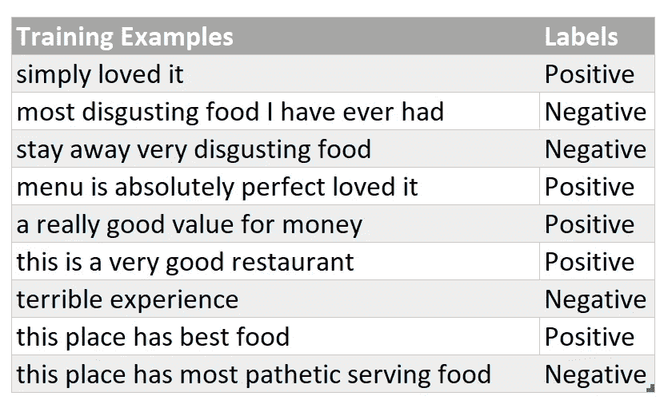*

*Preprocessed Training Dataset*

## *第二步:训练你的朴素贝叶斯模型*

*只需简单地制作两个单词包(BoW)，每个类别一个，每个包将简单地包含单词及其对应的计数。所有属于“正面”情感/标签的单词将被归入一个 BoW，所有属于“负面”情感的单词将有它们自己的 BoW。训练集中的每个句子都被拆分成单词(基于作为标记符/分隔符的空间),这是如何简单地构造单词计数对的，如下所示:*

*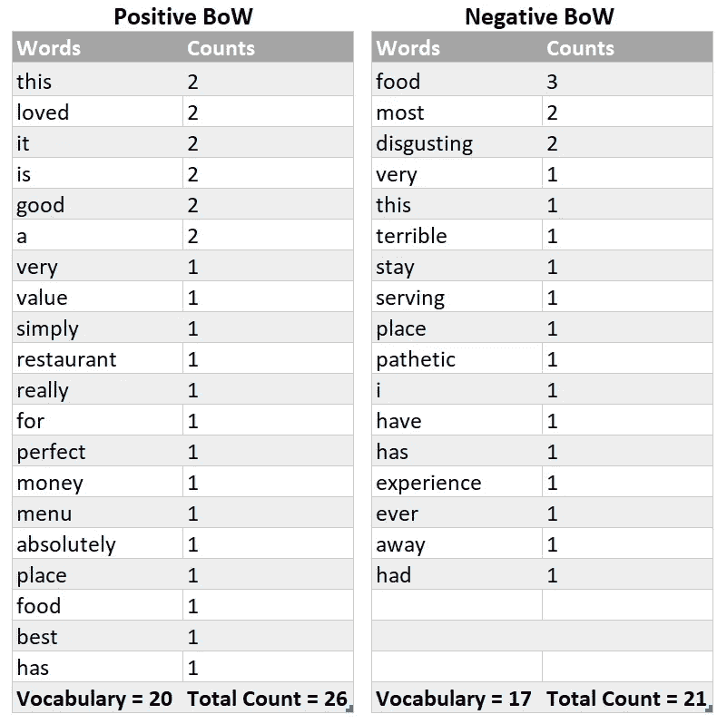*

*BoW for Both categories*

> *我们已经完成了朴素贝叶斯模型的训练！*

> ****达到里程碑# 2👍****

*在进入第三个里程碑之前，喝杯咖啡或者舒展一下肌肉*

**

*Photo by [Rumman Amin](https://unsplash.com/@londonwoodco?utm_source=unsplash&utm_medium=referral&utm_content=creditCopyText) on [Unsplash](https://unsplash.com/search/photos/cup-of-tea?utm_source=unsplash&utm_medium=referral&utm_content=creditCopyText)*

***注意:我们即将开始朴素贝叶斯模型最重要的部分，即使用上述训练好的模型来预测餐馆评论。我现在觉得这有点长，但完全值得，因为我们将讨论每一个细节，最终结果是零歧义！***

# ***测试阶段——预测开始发挥作用了！***

*考虑现在你的模型被给予一个餐馆评论， ***“非常好的食物和服务！！!"*** ，它需要归类到它所属的特定类别。正面评价还是负面评价？我们需要找到这个给定的评论属于每个类别的概率，然后我们会根据这个测试示例能够为哪个特定类别获得更多的概率，给它分配一个正面或负面的标签。*

# *找到给定测试示例的概率*

## *步骤# 1:测试示例的预处理*

*以与预处理训练示例相同的方式预处理测试示例，即，将示例更改为小写，并排除除字母/字母表之外的所有内容。*

*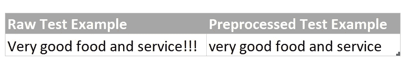*

*Preprocessed Test Example*

## *步骤 2:预处理测试示例的标记化*

*将测试示例标记化，即将其拆分为单个单词。*

*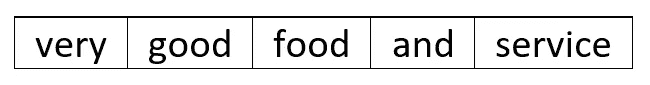*

*Tokenized Preprocessed Example*

> ***快速边注** *:你一定已经熟悉机器学习中的术语* ***特征*** *。在这里，在朴素贝叶斯中，******的每一类训练数据集的词汇中的每个词构成了一个分类特征*** *。这意味着******每一类的所有唯一单词(即词汇/vocab)基本上是该特定类的一组特征。为什么我们需要“计数”？因为我们需要分类词特征的数字表示，因为朴素贝叶斯模型/算法需要数字特征来找出概率分数！********

## **步骤 3:使用概率来预测标记化测试示例的标签**

> ***寻找概率的不那么吓人的数学形式***

***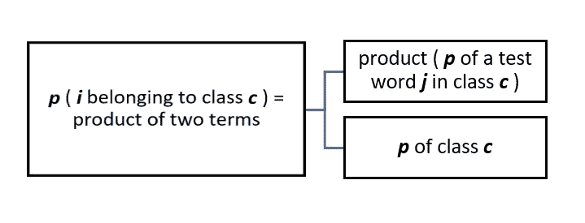***

***Probability of a Given **Test Example** **i** of belonging to class **c*****

*   ***让 ***我*** *=* 测试示例= ***“非常好的食物和服务！！!"******
*   ******中的总字数 i*** = 5，所以***j****(****表示特征号*** *)* **的值从 1 到 5** 不等。就这么简单！***

***让我们将上面的场景映射到给定的测试示例中，这样会更清楚！***

## ***让我们开始计算这些产品术语的值***

## ***第一步:求 c 类 p 项的值***

***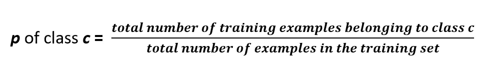***

***Simply the **Fraction of Each Category/Class in the Training Set*****

***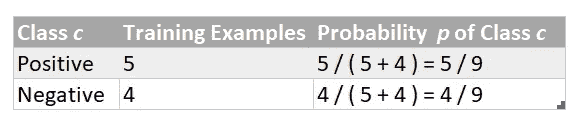***

******p*** *of class* ***c*** for **Positive** & **Negative** categories***

## ***步骤# 2:求项的值:乘积(c 类中测试词 j 的 p)***

***在我们开始推断特定类别中测试词***【j】******c***的概率之前，让我们快速熟悉一些简单的符号，这些符号在这篇博客文章的不太远的行中使用:***

***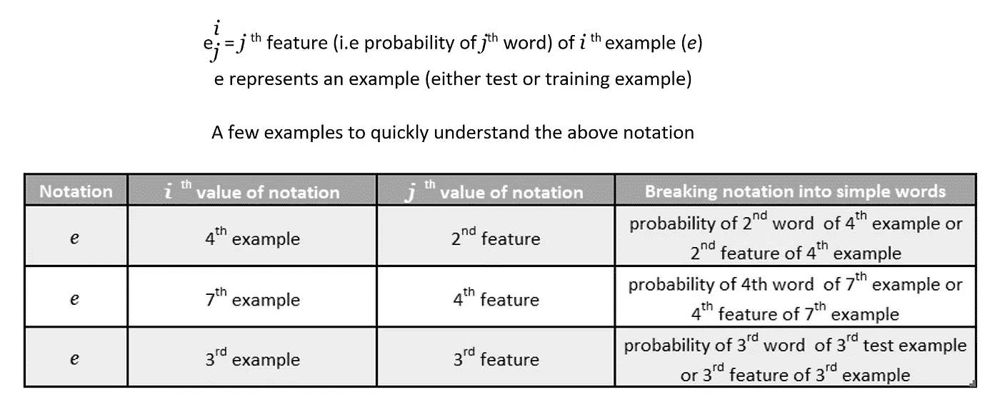***

***Understanding Notations — e, i & j***

***由于目前我们的测试集中只有一个例子(为了便于理解)，所以 ***i*** *=* 1。***

***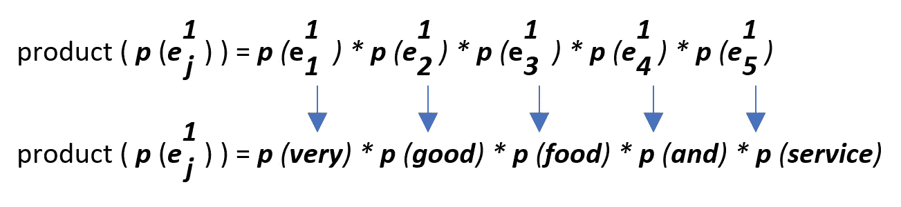***

> *****快速补充说明** *:在* ***测试时间/预测时间期间，我们将测试示例的每个单词映射到在训练阶段*** *发现的计数。因此，在这种情况下，我们在这个给定的测试示例中总共寻找 5 个单词计数。****

****

**Photo by [Jared Brashier](https://unsplash.com/@jaredbrashier?utm_source=unsplash&utm_medium=referral&utm_content=creditCopyText) on [Unsplash](https://unsplash.com/search/photos/drones?utm_source=unsplash&utm_medium=referral&utm_content=creditCopyText)**

> **只是一个让你无法入睡的随机事件！**

## **求 c 类中测试词“j”的概率**

**在我们开始计算**的乘积** ( ***p*** 中的一个测试字 ***j*** 中的类 ***c*** )之前，我们显然首先需要确定 ***p*** 中的一个测试字***j**c***有两种方法可以做到这一点，如下所述— *几分钟后，我们将发现哪一种方法应该被真正遵循，而不是被实际使用……***

**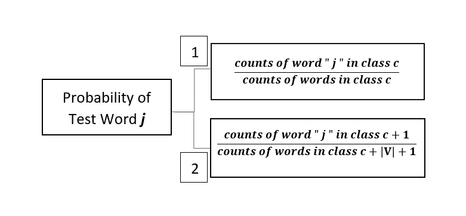**

## **让我们首先尝试使用方法 1 来寻找概率:**

**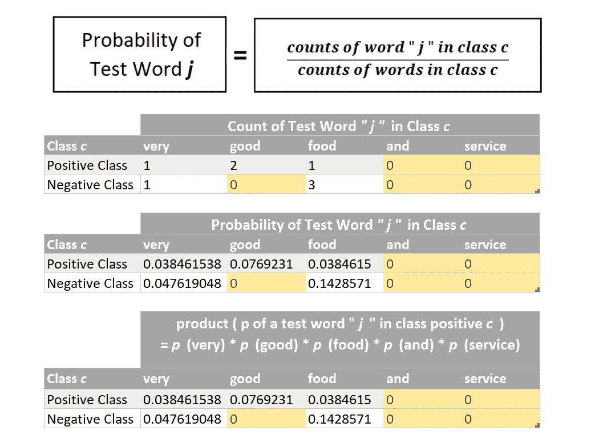**

**现在我们可以将单个单词的概率相乘(如上所述)以找到该项的数值:
**乘积**(测试单词***【j】******c***)**

**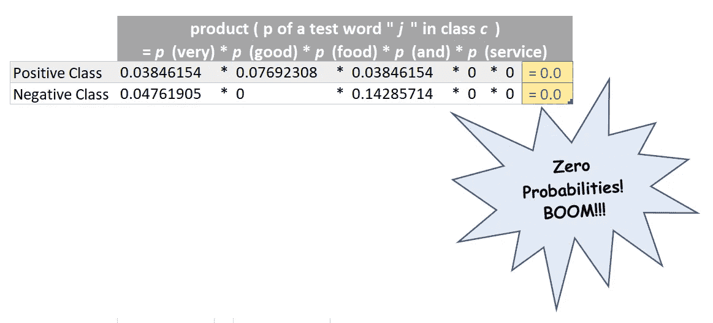**

****The Common Pitfall of Zero Probabilities!****

**到目前为止，我们已经有了两个术语的数值，即类 ***c*** 和 **产品**(测试字***【j】***和类 ***c* 中的 ***p*** 因此，我们可以将这两项相乘，以确定这两个类别的***p***(***I***属于类别 ***c*** )。下面演示了这一点:****

**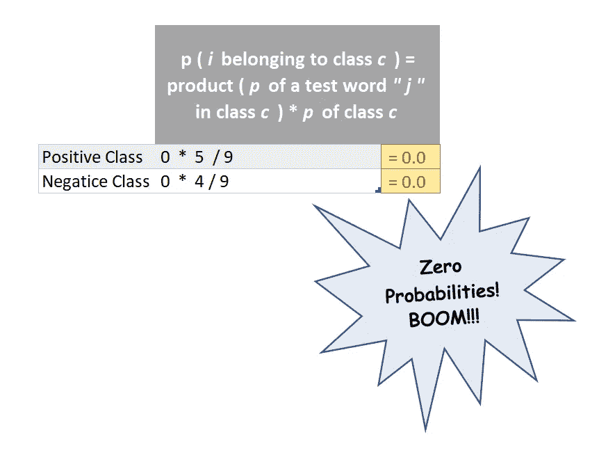**

****The Common Pitfall of Zero Probabilities!****

*****p***(***I***属于类 ***c*** )对于两个类别来说都是**零！！！**但显然测试示例**“非常好的食物和服务！！!"**属于正班！很明显，这是因为类***中测试词
***【j】***的**乘积** ( ***p* )对于两个类别**来说都是零，而这又是因为**中的几个词(以橙色突出显示)从未在我们的训练数据集中出现过，因此它们的概率为零！很明显是他们造成了所有的破坏！*******

***那么这是否意味着无论何时出现在测试示例中但从未出现在训练数据集中的单词总是会导致这种破坏？在这种情况下，我们训练过的模型将永远无法预测正确的情绪？它只会随机选择积极或消极的类别，因为两者都有相同的零概率和预测错误？答案是否定的！这就是第二种方法(编号 2)发挥作用的地方，事实上这是一个数学公式，它实际上用于推导*(***I***属于类 ***c*** )。但是在我们继续第二种方法之前，我们应该先熟悉一下它的数学原理！****

***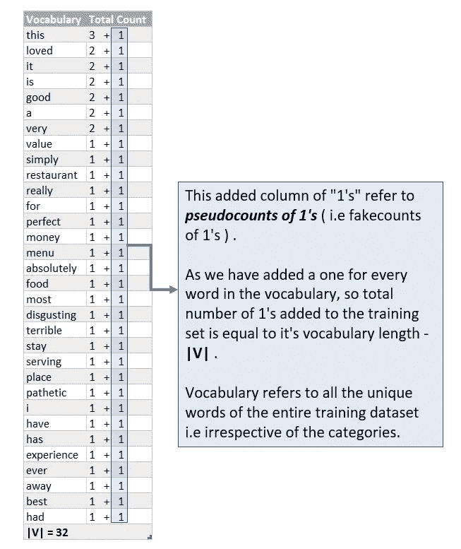***

***所以现在在添加了为 1 的**伪计数** **之后，从未出现在训练数据集中的测试字的概率 *p* 将永远不会为零**，因此**，** 项**乘积**(***p**【j】***在类***【c】***)**中的数值永远不会以零结束，这又意味着
***p* 所以一切都很好，不会再有零概率的破坏了！*******

*******所以方法 2 的分子项将增加 1，因为我们已经为词汇表中的每个单词增加了 1，所以它变成了** **:*******

*****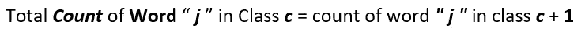*****

*******类似地，分母变成:*******

*****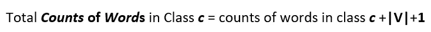*****

*******于是完整的公式:*******

***************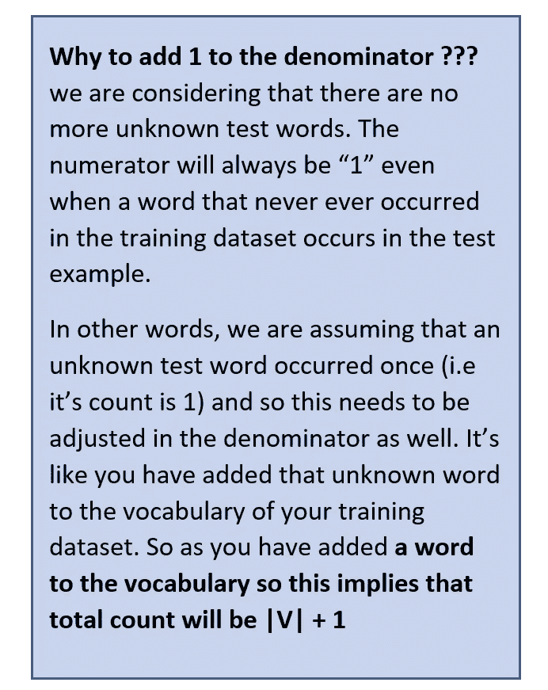**********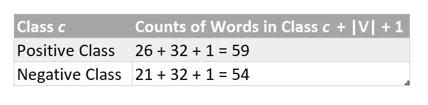*****

*****Probabilities of Positive & Negative Class*****

**********

*****Photo by [Greg Rakozy](https://unsplash.com/@grakozy?utm_source=unsplash&utm_medium=referral&utm_content=creditCopyText) on [Unsplash](https://unsplash.com/search/photos/ocean-water-eye-level?utm_source=unsplash&utm_medium=referral&utm_content=creditCopyText)*****

> ********你快到了！********

## *****现在用第二种方法计算概率:*****

*****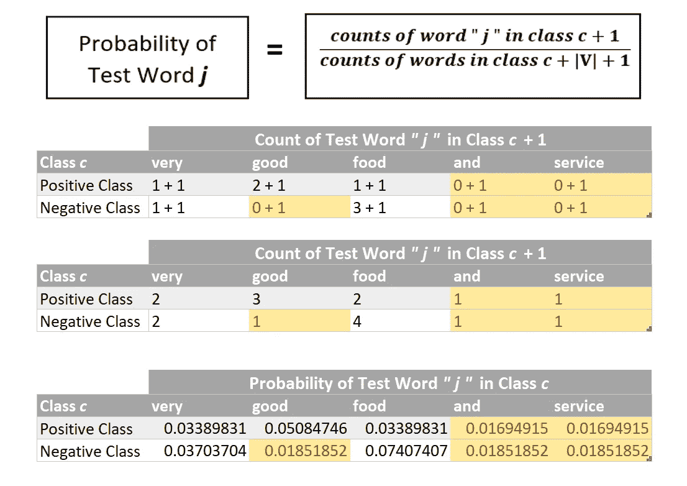*****

*******Handling of Zero Probabilities : These act like failsafe probabilities !*******

*****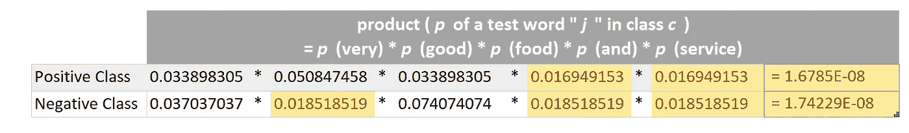**********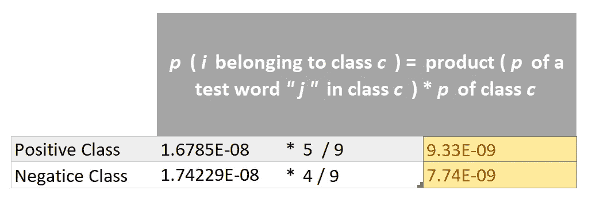*****

> *****现在作为测试例子的概率，“非常好的食物和服务！！!"与负面类别(即 7.74E-09)相比，正面类别(即 9.33E-09)更多，因此我们可以将其预测为正面情绪！这就是我们如何简单地预测一个测试/看不见的例子的标签*****

> ********里程碑# 3 达成！！👍 👍 👍********

> ********只剩最后几笔润色了！********

> *******快速补充说明:** *像所有其他机器学习算法一样，朴素贝叶斯也需要一个验证集来评估训练模型的有效性。但是，因为这篇文章旨在关注算法的见解，所以我故意避开它，直接跳到测试部分******

# *****深入挖掘概率数学*****

*****现在，您已经对训练朴素贝叶斯模型所需的概率计算建立了基本的理解，然后使用它来预测给定测试句子的概率，我现在将更深入地挖掘概率细节。
在计算上一节中给定测试句子的概率时，我们只执行了给定的概率公式来进行测试时的预测:*****

*****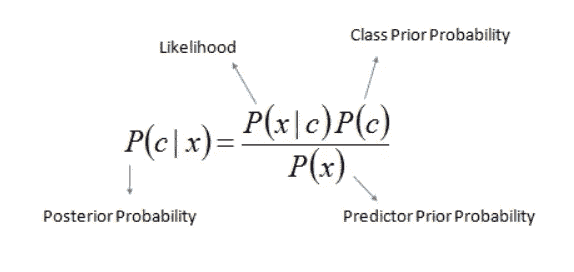*****

*******解码上面的数学方程式:*******

*****" **|** " =指已经给定的状态和/或一些过滤标准*****

*****=类/类别*****

*****" **x** " =测试示例/测试句子*****

********p(c | x)****=**给定测试示例 *x*** ，它属于类 *c* 的概率是多少。这也被称为后验概率。这是**为每个给定培训类的给定测试示例 *x* 找到的条件概率。********

********p(x|c)*** = **给定类 *c*** ，实例 *x* 属于类 *c* 的**概率是多少。**这也被称为可能性，因为它暗示了示例 ***x*** 属于类 ***c*** 的可能性有多大。这也是**条件概率**，因为我们正在从类*的全部实例中寻找*的概率，也就是说，在寻找 *x* 的概率时，我们已经将**的搜索空间限制/调节到类 *c* 。我们使用在训练阶段确定的字数来计算这个概率。*********

*****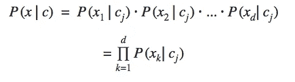*****

*****Here **“ *j* ”** ***represents a class*** *and* ***k******represents a feature********

*****由于我们有两个类，我们在上面的计算部分隐式地使用了这个公式两次。还记得在类******p***中找到一个测试字***j****c****的数值吗？*****

****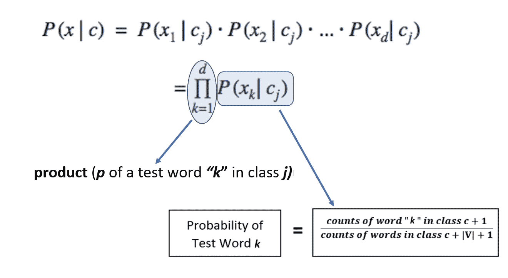****

*******p*** =这暗示了类 *c* 的**概率。**这也被称为先验概率/无条件概率。这是无条件概率。我们在前面的概率计算部分已经计算过了(在步骤# 1 中，寻找类 ***c*** 的 term : ***p*** 的值)****

*******【p(x)***=这也被称为 ***归一化常数以便概率*******p(c | x)确实落在范围【0，1】****内。所以如果去掉这个，概率****p(c | x)****不一定落在[0，1]的范围内。*直观地说，这意味着在任何情况下或不管其类别标签是正还是负，实例 ***x*** 的概率。
这也反映在全概率定理中，全概率定理用于*计算 p(x)******

******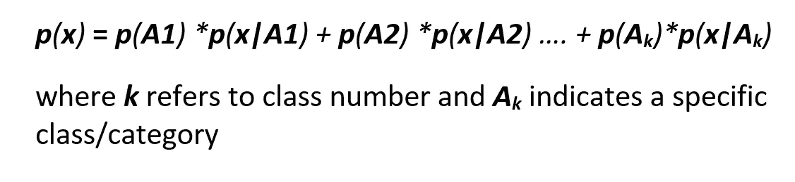******

******Total Probability Theorem******

******这意味着，如果我们有两个阶级，那么我们将有两个术语，所以在我们的积极和消极情绪的特殊情况下:******

******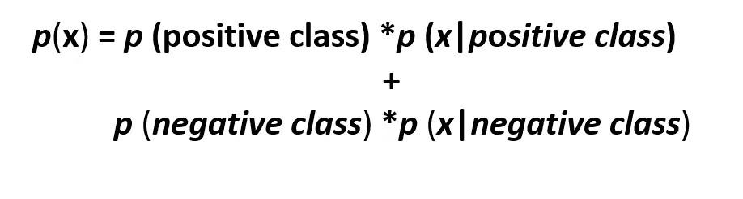******

******Total Probability Theorem for Two Classes******

******我们在上面的计算中使用它了吗？不，我们没有。为什么？？？因为我们正在比较正类和负类的概率，并且因为分母保持不变，所以在这种特殊情况下，省略相同的分母不会影响我们训练好的模型的预测。这两个类只是相互抵消。因此，虽然我们可以包括它，但没有这样做的逻辑理由。**但是同样由于我们已经消除了*归一化常数，概率 p(c|x)不一定落在【0，1】*T5 的范围内********

> ********达到里程碑# 4👍********

# *****避免下溢错误的常见陷阱！*****

*   *****如果你注意到的话，单词概率的数值(即类别***【c***中的一个测试单词***【j】***)非常小。因此，将所有这些微小的概率相乘以找到**乘积**(***p**【j】***类***【c】***)将产生甚至更小的数值，这经常导致下溢，这显然意味着对于给定的测试句子，训练的模型将无法预测其类别/情感。因此，为了避免这种下溢误差，我们采用如下数学对数的帮助:*****

*****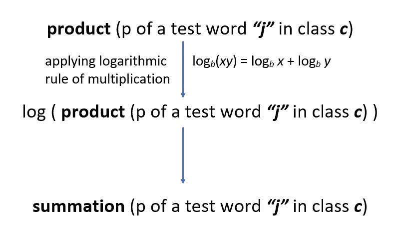*****

*****Avoiding the Underflow Error*****

*   *****所以现在，我们将简单地把它们相加，而不是把微小的单个单词的概率相乘。为什么只有日志？为什么不是其他功能？因为 log 单调增加或减少，这意味着它不会影响概率的顺序。较小的概率在应用对数后仍然会保持较小，反之亦然。因此，假设测试单词“是”比测试单词“快乐”具有更小的概率，因此在通过 log 之后，虽然增加了它们的大小，但是“是”仍然具有比“快乐”更小的概率。因此，在不影响我们的训练模型的预测的情况下，我们可以有效地避免下溢误差的常见陷阱。*****

> ********达到里程碑# 5👍********

# *****结束语……*****

*   *****尽管我们生活在一个 API 的时代，几乎很少从头开始编码。但是深入理解算法理论对于正确理解机器学习算法实际上是如何工作的极其重要。只有关键的理解才能区分真正的数据科学家和天真的数据科学家，以及在训练一个真正优秀的模型时真正重要的东西。因此，在转向 API 之前，我个人认为，一个真正的数据科学家应该从头开始编写代码，以真正看到数字背后以及某个特定算法优于其他算法的原因。*****
*   *****朴素贝叶斯模型最好的特点之一是，你可以通过简单地用新词汇更新它来提高它的准确性，而不是总是重新训练它。你只需要添加单词到词汇表中，并相应地更新单词数。就是这样！*****

**********

*****Photo by [Benjamin Davies](https://unsplash.com/@bendavisual?utm_source=unsplash&utm_medium=referral&utm_content=creditCopyText) on [Unsplash](https://unsplash.com/?utm_source=unsplash&utm_medium=referral&utm_content=creditCopyText)*****

> ********终于来了！终于！达到里程碑# 6😤 😤 😤********

*****这篇博文到此结束&你已经在你的 ML 之旅中向前迈进了一步！😄*****

*****即将发布的帖子将包括:*****

*   *****[从头开始展开朴素贝叶斯！Take-2🎬用 Python 从头开始实现朴素贝叶斯](/naïve-bayes-from-scratch-using-python-only-no-fancy-frameworks-a1904b37222d)*****
*   *****[从头开始展开朴素贝叶斯！Take-3🎬使用 scikit-learn 实现朴素贝叶斯( *Python 的* *机器学习的圣杯！* )](/the-final-act-just-like-a-naïve-bayes-pro-5c440b511b8d)*****

*****敬请期待！📻*****

*****如果您有任何想法、意见或问题，欢迎在下面评论或联系📞跟我上 [**LinkedIn**](https://www.linkedin.com/in/aisha-javed/)*****

# *****内容许可—一些注意事项…*****

## *****再用*****

*****图表和文本根据媒体的服务条款获得许可，即作者拥有其创作并在媒体上发布的内容的权利。"未经您的许可(或合理使用许可)，其他人不得复制、分发或执行您的作品."*****

*****这篇博文中包含的来自其他来源的图片不属于本许可证的范围，可以通过标题“图片作者…”中的注释来识别。所有此类图片均取自 [Unsplash](https://unsplash.com/) ，可免费使用，无需获得摄影师或 Unsplash 的许可或提供其信用。详细的许可条款可以参考[这里的](https://unsplash.com/license)。*****

*******引文** 出于署名目的，本作品被引为*****

```
*****Aisha Javed, “Unfolding Naïve Bayes from Scratch !”, Towards Data Science, 2018*****
```

*****BibTeX 引文*****

```
*****@ARTICLE {javed2018a,
    author  = "Javed, Aisha",
    title   = "Unfolding Naïve Bayes from Scratch !",
    journal = "Towards Data Science",
    year    = "2018",
    note    = "https://towardsdatascience.com/unfolding-na%C3%AFve-bayes-from-scratch-2e86dcae4b01"
    doi     =  "2e86dcae4b01"
}*****
```