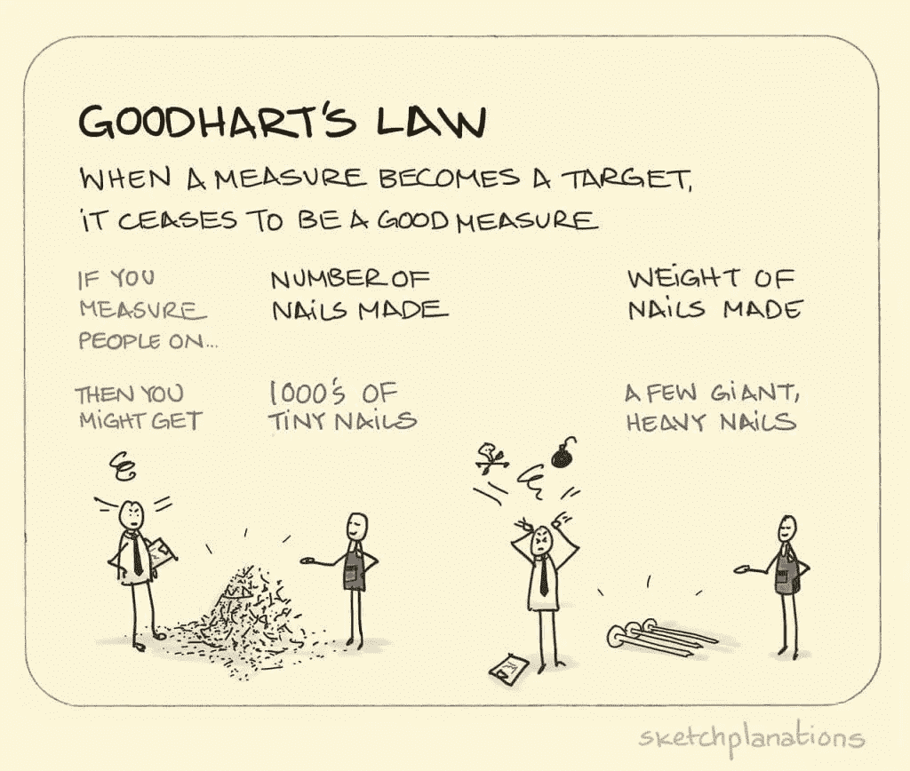

# 意外后果和古德哈特定律

> 原文：<https://towardsdatascience.com/unintended-consequences-and-goodharts-law-68d60a94705c?source=collection_archive---------3----------------------->

**使用正确指标的重要性**

为了增加收入，一个客户服务呼叫中心的经理制定了一项新政策:不再按小时计酬，而是根据每个员工打电话的次数来支付报酬。在第一周之后，这个实验似乎取得了巨大的成功:呼叫中心每天处理的电话数量增加了一倍！只要员工的业绩良好，这位经理就不会费心去听他们的谈话，他对此非常满意。然而，当老板来访时，她坚持要出去到楼层，当她这样做时，她和经理都被他们听到的震惊了:员工拿起电话，发出一系列一个词的回答，不等再见就砰地放下电话。难怪通话完成数翻倍了！无意中，通过只根据通话量来判断绩效，这位经理已经激励员工重视速度而不是礼貌。不知不觉中，他陷入了古德哈特定律。

[古德哈特定律](https://en.wikipedia.org/wiki/Goodhart%27s_law)简单表述为:“当一个度量成为目标时，它就不再是一个好的度量。”换句话说，当我们设定一个特定的目标时，人们会倾向于不顾后果地优化这个目标。当一种情况的其他同等重要的方面被忽视时，这就导致了问题。我们的呼叫中心经理认为增加处理的电话数量是一个很好的目标，他的员工尽职尽责地努力增加电话数量。然而，通过只选择一个标准来衡量成功，他鼓励员工以数量的名义牺牲礼貌。人们会对激励做出反应，我们的自然倾向是最大化评判我们的标准。

Goodhart’s Law Explained ([Source](http://www.sketchplanations.com/post/167369765942/goodharts-law-when-a-measure-becomes-a-target))

一旦我们意识到古德哈特定律，我们就可以在生活中的许多领域最小化它的影响。在学校，我们有一个目标:最大化我们的分数。这种对一个数字的关注可能不利于实际的学习。高中就像是一长串为考试而记忆的内容，然后很快就忘得一干二净，这样我就可以为下一次考试在脑子里塞满信息，而不用考虑我是否真的知道这些概念。考虑到学校衡量成功的方式，这种策略非常有效，但我怀疑这是否是获得良好教育的最佳方法。我们看到古德哈特定律有害影响的另一个领域是在学术界，这里强调出版，用短语[“出版或灭亡”来表示。](https://www.ncbi.nlm.nih.gov/pmc/articles/PMC3999612/)发表通常依赖于在研究中获得积极的结果，这导致了被称为[“p-hacking”](http://journals.plos.org/plosbiology/article?id=10.1371/journal.pbio.1002106)的技术，其中研究人员[操纵或子集化实验结果](https://projects.fivethirtyeight.com/p-hacking/)以实现统计显著性。当一个数字被用来衡量成功时，记忆而不是学习内容和 p-hacking 都是意想不到的后果。

从数据科学的角度来看，古德哈特定律的应用提醒我们需要适当的指标。当我们设计机器学习模型或对网站的界面进行更改时，我们需要一种方法来确定我们的解决方案是否有效。通常，我们会使用一个统计量，例如回归的均方误差或分类问题的 F1 分数。如果我们意识到只使用单一的衡量标准可能会有不利的后果，我们可能会再次思考如何对成功进行分类。就像呼叫中心经理根据处理的呼叫数量和客户满意度来判断员工绩效会更好一样，我们可以通过考虑几个因素来创建更好的模型。除了只通过准确性来评估机器学习方法，我们还可以考虑可解释性，以便创建可理解的模型。

虽然大多数人希望听到一个数字来总结一个分析，但在大多数情况下，我们最好报告多个度量(带有不确定性区间)。有时候，一个设计良好的指标可以鼓励我们想要的行为，例如[增加退休储蓄率](https://www.journals.uchicago.edu/doi/pdfplus/10.1086/380085)，但是，重要的是要记住，人们会试图最大化我们选择的任何衡量标准。如果我们最终以牺牲其他同等重要的因素为代价来实现一个目标，那么我们的解决方案可能对情况没有帮助。解决问题的第一步——数据科学或其他——是确定衡量成功的正确方法。当我们希望客观地找到最佳解决方案时，我们应该回忆一下古德哈特定律的概念，并认识到最佳评估通常是一组测量值，而不是使用单个数字。通过选择多个指标，我们可以设计出一个解决方案，而不会出现针对狭窄目标进行优化时出现的意外后果。

一如既往，我欢迎反馈和建设性的批评。可以通过推特 [@koehrsen_will](http://twitter.com/koehrsen_will) 联系到我。