# 通用风格转移

> 原文：<https://towardsdatascience.com/universal-style-transfer-b26ba6760040?source=collection_archive---------8----------------------->

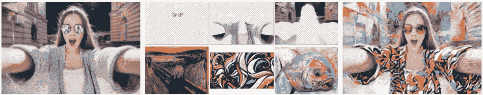

Fig. 0

NIPS 2017 上的一篇有趣的论文是这样的:[通过特征转换进行通用风格转换](http://arxiv.org/abs/1705.08086) [0]。有一堆基于神经网络的风格转换技术，特别是在[艺术风格的神经算法](http://arxiv.org/abs/1508.06576)【1】之后。所有现有技术都有以下主要问题之一:

1.  在推理过程中效率不高:上面提到的[1]就是一个例子。
2.  风格特定的网络。这方面的一个例子是论文[实时风格转换和超分辨率的感知损失](http://arxiv.org/abs/1603.08155)【2】。
3.  就输出质量而言，泛化能力差:这方面的一个例子是论文[使用实例规范化的实时任意样式传输](https://arxiv.org/pdf/1703.06868.pdf) [3]

正在讨论的文件声称要解决上述问题。这篇博客是对这篇论文的评论。假设对深度学习和线性代数有一些基本的了解。作者的代码库可以在[这里](https://github.com/Yijunmaverick/UniversalStyleTransfer)找到。

在一些地方(图 9、10 和 12 ),我用图像来表现数学。这主要是因为 medium 蹩脚的数学支持。我使用[https://latexbase.com/](https://latexbase.com/)在 latex 上生成数学，然后拍摄他们的快照。(我知道，很痛苦)

**问题**(万一从上面还没看清楚):给定一个有一定内容在里面的图像(称之为内容图像)和另一个嵌入了一定风格的图像(想想一幅名画的图像。让我们称这种样式为图像)。目标是构建一个新的图像，它具有内容图像的内容和样式图像的样式。如下图所示。

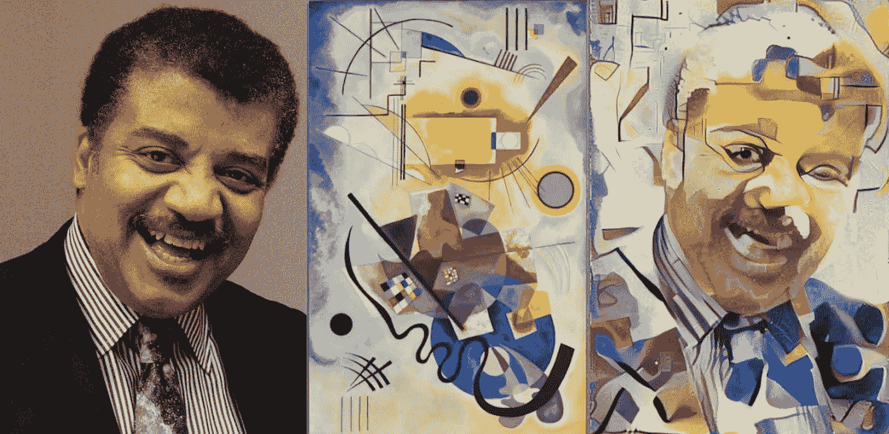

Fig. 1 Content Image + Style Image = Stylized Content Image [4]

这篇论文的卖点是“免学习”。现有的基于前馈的技术需要在预定义的风格上进行训练，然后针对新的风格进行微调。然而，本文提出了一种在训练阶段完全独立于风格的方法，使其成为一种“免学习”的方法。请注意,[3]本质上与本文更接近，但依赖于训练时的样式图像(但可以很好地推广到任意样式图像)。

在本文中，风格转换问题被表述为两个过程的组合，即使用白化和颜色变换的图像重建和特征变换(WCT)。

## 图像重建

经典的编码器-解码器机制是这样一种机制，其中图像被馈送到编码器网络，编码器网络对图像进行编码以形成表示，并被传递到解码器，解码器试图重建原始输入图像。该文件使用了一个轻微的修改，这为图像重建。

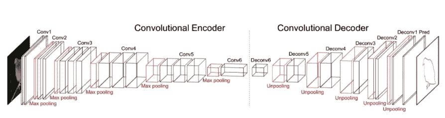

Fig. 2 A classic Encoder-Decoder Network(just a reference not used in paper) [5]

作为第一步，他们在 Imagenet 图像分类任务上训练 VGG-19(此后称为 VGG)。这被用作编码器。下一步，固定编码器，训练解码器来重建图像。看起来如下所示:

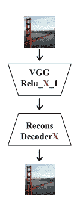

Fig. 3 Encoder-Decoder for reconstruction [0]

上图中看到的 Relu_X_1 和 DecoderX 有些清晰:它们训练不止一个解码器进行重建。事实上，他们训练 5 个解码器进行重建。我们很快就会看到原因。但是，这里的“X”是指 VGG 网络中的层数。X = 1，2，3，4，5 是本文中使用的值。VGG 编码器部分结束于层 Relu_X_1，并且解码器(DecoderX)被构造成与该编码器对称。他们使用像素重构损失和特征损失的组合，如下所示。

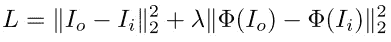

Fig.4 Loss function for Decoder Reconstruction

像素重构是重构输出(I_o)和输入图像(I_i)的简单 L2 范数。特征损失是重建的输出和输入图像的 Relu_X_1 特征的 L2 范数。这里φ代表提取 Relu_X_1 特征的 VGG-19 编码器。λ是损失的加权系数。编码器和解码器现在已被训练和固定。请注意，我们在整个培训过程中从未使用任何风格图像。

## 格式化

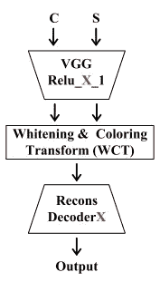

Fig. 5 Single level Stylization [0]

上面的图像代表单级风格化。这包括作为编码器(VGG Relu_X_1)的输入的内容图像(C)和样式图像(S)。请注意，这些输入是相互独立地传入的(每个输入都独立地通过 VGG)。编码器的输出被发送到白化和着色变换模块(我们将在下一节中看到更多细节)，然后其输出被传递到解码器(Recons DecoderX)以获得最终的风格化输出。下图显示了 X=1、2、3、4 和 5 时的风格化输出。较低层(1 等。)捕获像样式颜色这样的特征，而更高层(比如说，5 层)捕获样式结构。

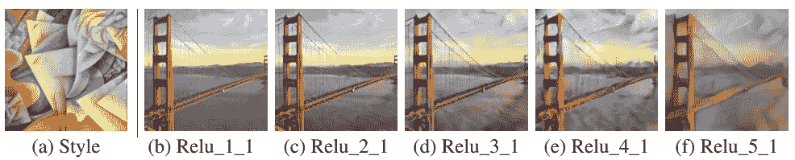

Fig.6 Stylized outputs for each of the layers/decoders [0]

作者继续使用所有层的特征，而不是只坚持一层。这导致了如下所示的体系结构。

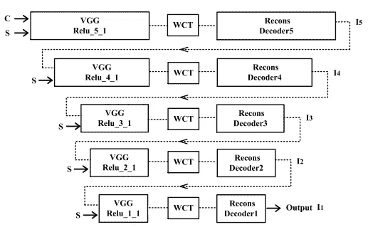

Fig. 7 Multi level stylization [0]

我们从内容和风格图像开始，将它们提供给 VGG，Relu_5_1 特征被提取并发送到 WCT，然后解码。解码器 5 的输出与样式图像一起被馈送到 VGG，并且 Relu_4_1 被提取，并且该过程继续，直到我们从解码器 1 获得输出。下图显示了这种多级推理的结果。I_5 实际上是第一级的输出(如上图)，I_1 是解码器 1 的输出(最终输出)。绝对比单级风格化好看。

Fig. 8 Multi level stylization outputs at various levels [0]

## 增白和颜色变换(WCT)

在上一节中，我们把 WCT 看作一个黑盒。让我们深入研究一下，了解它到底在做什么。请记住，在模型训练中，我们从未使用过任何样式图像。我们的编码器是经过 Imagenet 训练的 VGG，解码器经过训练，可以在编码器的不同特征级别进行重构(Relu_ **X** _1)。WCT 做了一些很酷的数学运算，在从风格图像中转移风格特征的同时仍然保留内容方面起到了核心作用。

让我们将 WCT 视为解除输入图像的当前样式的关联并将样式图像的样式与输入图像相关联的过程。第一步是美白。

我们知道 WCT 模块的输入是编码器模块的输出(Relu_X_1)。Relu_X_1 的形状为 *C x H x W* ，其中 *C* 为通道数， *H* 为高度， *W* 为特征图的宽度。这是假设单个输入图像。我们对这些特征图进行矢量化，从而得到长度为 *H x W* 的 *C* 个向量。设 *f_c* 为形状的矢量化特征图[ *C，(H_c x W_c)],* 其中 *H_c* 和 *W_c* 分别为内容图像在某一 Relu_X_1 处的特征图的高度和宽度。同样，设 *f_s* 为形状[ *C，(H_s x W_s)* 的矢量化特征图，其中 *H_s* 和 *W_s* 分别为特征图在某一 Relu_X_1 处因风格图像而产生的高度和宽度。

**白化变换:**

我们的目标是找到 *f_c，*我们称之为 *f_ct* 的变换，使得 *f_ct* 的协方差矩阵是一个单位矩阵，即*f _ CT x(f _ CT . transpose)= I .*这保证了特征图没有相关性。更正式地说，

*f_ct = W x f_c，*其中 W 是变换矩阵。一个很常见的选择 W 是 Y 的平方根倒数，其中 Y 是协方差矩阵 *f_c x (f_c.transpose)。*在更好的表述中:

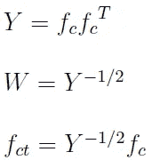

Fig. 9

小注意:根据协方差矩阵的定义，为了使*Y =**f _ c x(f _ c . transpose)*，我们需要从 *f_c* 中减去平均值 m_c(每通道平均值)。上面的 *f_c* 实际上代表的是减法后的值。

可以看到 *Y* 是实值对称矩阵。因此，我们可以对这个矩阵进行特征分解，最终的 *f_ct* 如下所示:

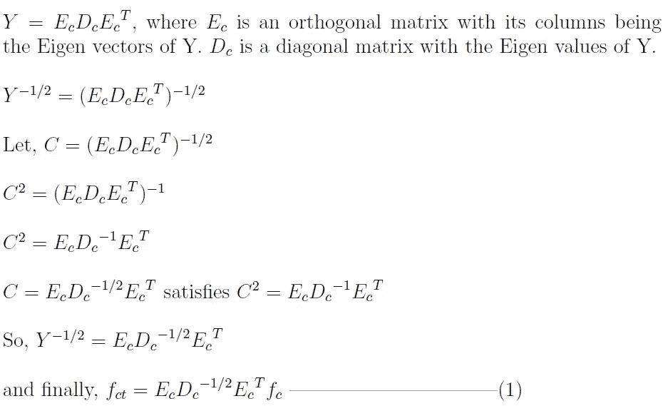

Fig. 10

很容易验证新 *f_ct* 的协方差矩阵是一个单位矩阵(不相关特征)。你可以把这当成一个练习:)

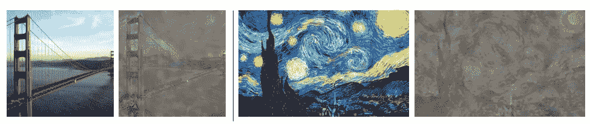

Fig. 11 Inverting whitened Relu_4_1 features [0]

以上是增白过程的实验验证。基本上，他们运行的模型只有美白块(没有着色块)。您可以看到，最终的构造保留了内容(金门)，但删除了任何与样式相关的信息。

**着色变换:**

这是白化变换的一种逆运算。记住，通过白化，我们有效地将特征从它们的风格中分离出来。现在，我们将通过变换白化结果(等式 1)来将这些与样式图像的样式相关联。

我们的目标是找到 *f_ct* 的一个变换，让我们称之为 *f_cst* ，使得 *f_cst* 的协方差矩阵等于 *f_s* 的协方差矩阵。记住 *f_s* 是由于风格图像的矢量化特征图。再小提一下，mean *m_s* 是从 *f_s* 中减去的(原因同上)。更正式地说:

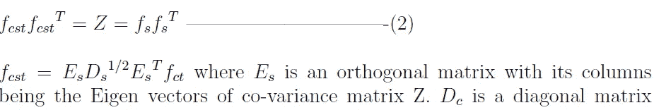

Fig. 12

用上面的 *f_cst* 的值很容易验证(2)

我试图简要地解释这篇论文的要点。如果你觉得有趣，那就去读报纸吧。该文件有更多的训练细节和其他功能，如用户控制和纹理合成。您也可以在这里试用代码:[6]

如果你喜欢这篇文章，那就来吧，伸出你的手，给我一些👏 :)

**参考文献**:

[0]: [通过特征变换进行通用风格转换](http://arxiv.org/abs/1705.08086)

[1]: [艺术风格的神经算法](http://arxiv.org/abs/1508.06576)

[2]: [实时风格转换和超分辨率的感知损失](http://arxiv.org/abs/1603.08155)

[3]: [通过实例标准化实时传输任意样式](https://arxiv.org/pdf/1703.06868.pdf)

[4]:[https://research . Google blog . com/2016/02/exploring-intersection-of-art-and . html](https://research.googleblog.com/2016/02/exploring-intersection-of-art-and.html)

[5]:[https://nsarafianos.github.io/icip16](https://nsarafianos.github.io/icip16)

[6]:[https://github.com/Yijunmaverick/UniversalStyleTransfer](https://github.com/Yijunmaverick/UniversalStyleTransfer)