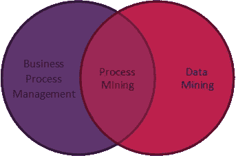
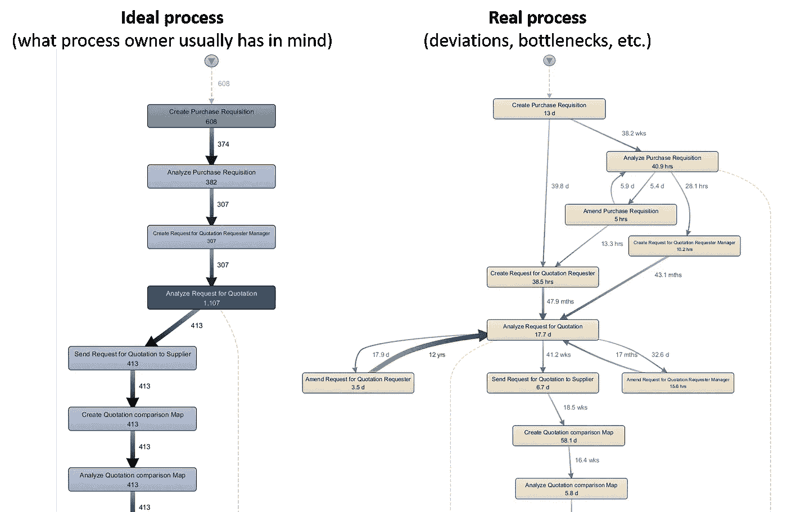
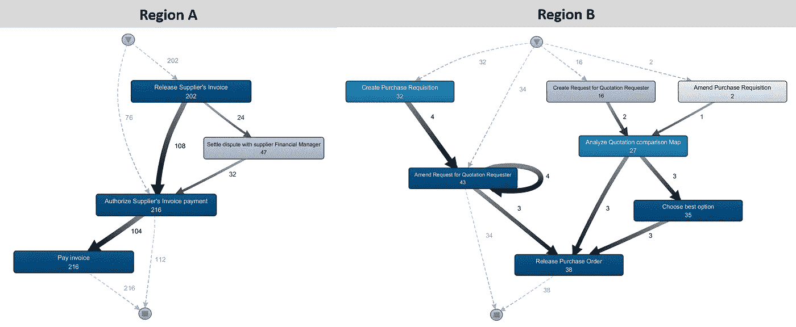
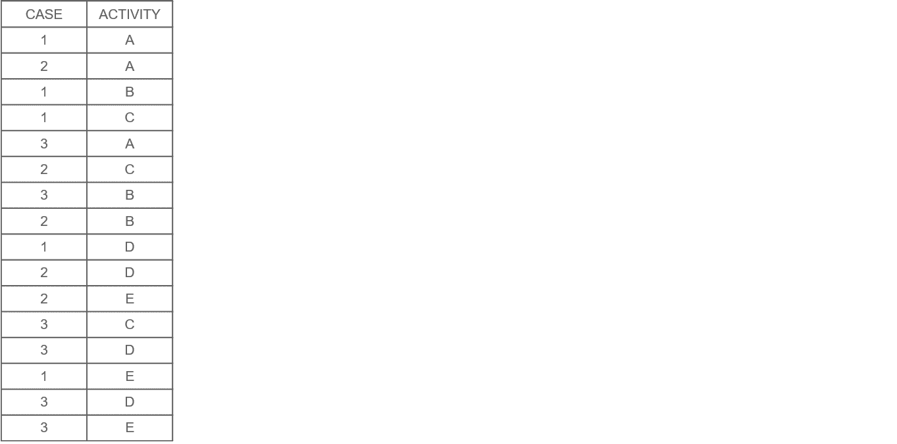
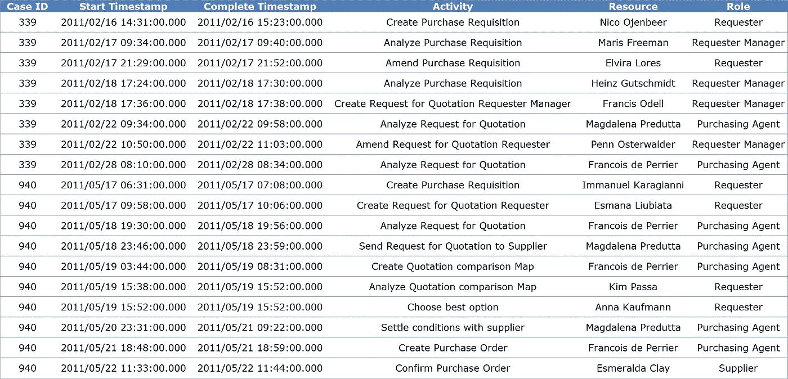

# 释放流程挖掘的价值

> 原文：<https://towardsdatascience.com/unleash-the-value-of-process-mining-4e3b5af4e9d8?source=collection_archive---------1----------------------->

Looking for an easy way to analyze complex processes?

## (公民)数据科学家的强大能力

## 关于；在…各处 ；大约

这篇文章的目的是向读者介绍**流程挖掘**，一种创新的分析方法**以客观和详尽的方式**了解任何流程。它当然涵盖了**的关键概念和定义**，以及**的好处**，技术**的要求**，以及**的成功标准**，希望能给你灵感将这些技术应用到你自己的职业现实中。

让我们一起来了解一下这个复杂过程探索的迷人创新解决方案吧！

## 内容

*   什么是流程挖掘？
*   利益
*   它是如何工作的？
*   流程挖掘如何大幅提升流程发现？
*   关于所需数据的一句话
*   成功标准
*   结论

## 什么是流程挖掘？

大多数组织创建**业务流程**，这些流程有时**难以控制和理解**。然而，在采取任何改进措施之前，理解这些流程是绝对必要的。

**流程挖掘是一门由强大的分析技术**支持的学科，这使得**容易**和**快速**获得**完整的**和**目标图**，从而**控制**和**持续改进**。这是通过分析 **IT 系统**中的大量可用数据实现的。主要是执行哪些活动、何时执行以及由谁执行。

从这个意义上说，流程挖掘位于业务流程管理和数据挖掘的交叉点。

**流程挖掘是一个非常有价值的洞察生成解决方案**:你有没有问过自己，在一个特定的流程中到底发生了什么，观察到了与最初设计流程的哪些偏差，瓶颈在哪里，如何优化流程？如果是这样，那么您应该明确地将流程挖掘作为您团队工具箱的一部分。

由于**流程挖掘工具使用起来非常直观，并且高度可视化**，我建议您在深入了解更多细节之前，先看一下下面的视频，以展示流程挖掘在银行流程中的强大功能。这个视频是由 [Fluxicon](https://fluxicon.com/) 创作的。

Process mining applied to the banking industry (ILLUSTRATIVE)

## 利益

使用流程挖掘为企业主和组织提供了几个**好处**。我们在下面列出了最重要的几个:

*   **了解流程实际上是如何执行的。**

大多数时候，**企业主从理论角度非常了解他们的流程**:应该发生什么，什么时候，谁应该做什么，在什么条件下。

然而，他们通常**没有办法调查在整个流程生命周期中到底发生了什么**。传统的报告、商业智能(BI)和统计工具很难揭示大的和非常详细的情况。这种从大画面到细节的来回导航实际上是理解真实生活情况的最有效的方式。流程挖掘解决方案，如 [Disco](https://fluxicon.com/disco/) 侧重于使其易于消化和利用。

There are often disconnects between ideal (well understood) and real (unknown) situations (ILLUSTRATIVE)

*   **通过了解流程中的实际流量、频率和延迟来改进流程**。

IT 系统日志跟踪大量有用的信息，使得计算从流程中的一个步骤切换到另一个步骤的路径和交付时间变得可行。人们可以利用这些有价值的信息来检测瓶颈、突出次效率、揭示最频繁的路径等。

*   **通过提高员工的生产力来节约成本**。

加快调查时间，让您的**分析师**腾出时间来改进流程，而不是分析现状。通过关注棘手问题来减少总体流程时间。

*   **协调不同地区的流程**通过了解人们如何以不同的方式工作，了解最佳实践并调整流程。

Reveal local specificities, slicing and dicing at your convenience in the process across any dimension of analysis — contributor, entity, product, etc. (ILLUSTRATIVE)

*   **提高审计质量和效率。**

以高效的方式进行审计，利用数据科学，避免基于观点的讨论(数据是不可知的！).

*   **通过对比旧流程和新流程，验证已实施的流程变更是否达到预期效果**。

想观察过程中任何变化的影响吗？进行**前/后分析**，量化您对新流程的影响和附加值！

## 它是如何工作的？

**流程挖掘**的一大优势是**以不可知的方式**分析任何流程。这要归功于数据，即在 IT 系统中执行的任何操作的足迹，并记录在其**日志**中。

为了理解这是如何工作的，让我们考虑一个由 5 个活动 A、B、C、D、E 组成的过程，并分析 3 个过去的项目如何通过这个过程来帮助了解它。

在下面的动画中，您可以观察到一些**案例经历了不同的活动**，或者经历了相同的活动但顺序不同**。其他一些**循环相同的活动**。**

****流程挖掘包括基于历史数据分析所有可能的模式，并为调查创建高度可视化的流程图**。**

****

**From IT System log to an exhaustive, fact-based understanding of your process (ILLUSTRATIVE)**

## **过程挖掘如何极大地提高过程发现练习？**

**过程挖掘的价值是双重的:产生有价值的洞察力以改进当前的过程，以及加速洞察力产生的时间，从而提高团队的生产力。让我们比较并强调这些优势:**

## **没有流程挖掘**

**传统的流程发现方式是通过研讨会和访谈手动进行**。****

**1.**耗时** : 对于做访谈和流程映射的人来说。如果他们能更快地完成工作，他们就能做更多的项目，从而为他们的组织交付更多的价值。**

**2.**绑定资源**:它将人们(受访者)从生产工作中绑定到讨论当前事情是如何完成的，只是为了理解“现状”流程。**

**3.**主观结果**:基于人们对流程的看法，而不一定基于流程的实际情况。**

**4.**政治僵局风险**:可能有不同意见无法解决(政治僵局)。在参与的人不能对“现状”过程和过程中的问题达成一致意见的情况下，项目失败的风险很高，并且根本没有进行过程改进。**

**5.不完整的图片:你得到的只是一个样本视图，而不是完整的图片。通过要求人们拼出过程，手动图片将永远不会完整。**

**6.**测量成本高**:人工跟踪测量成本高，有偏差，而且只能提供样本数据。这是关于使用秒表测量过程步骤以收集客观证据的实践:(1)做这种手工工作非常耗时，(2)被观察的人的行为与正常情况不同，以及(3)只能获得有限的样本(例如，在几周内追踪 30 个案例)。**

**7.**难以复制**:因为流程诊断和信息收集的成本太高，不容易重复。**

## **使用流程挖掘**

**任何过程改进项目的起点都是所谓的“现状”过程分析，在该过程分析中，绘制出过程的当前状态和所有缺陷，并确定改进机会。**流程挖掘通过限制人员访谈和从 IT 系统的现有数据中提取必要的信息，大大降低了理解当前流程的成本**。**

**有了流程挖掘，前面提到的棘手问题得以解决:**

**1.时间高效:分析师花在访谈和研讨会上的时间更少。相反,“原样”流程是根据组织中的 IT 数据自动重建的。**

**2.**释放资源**:研讨会可以更有成效，因为真正的“原样”流程已经可以作为一个起点。**

**3.**客观结果**:数据为诊断和改进决策提供事实依据。**

**4.**摆脱政治僵局**:就过程现实而言，没有发表意见的余地。**

**5.**完整画面**:所有异常都随正常流程带入画面。例如，可以分析过去一年的所有流程变化和实际延迟，以获得完整的画面。**

**6.**测量成本更低**:流程步骤之间的实际持续时间和延迟可以针对数千个事务进行测量。**

## **关于所需数据的一句话**

**对于所有的数据驱动技术，为了能够从过程挖掘中充分受益，数据准备起着重要的作用。**

**在这一节中，我将向读者简要介绍数据需求，包括创建一个可以输入到流程挖掘工具中的**事件日志**。**

****先决条件****

**任何过程分析都需要哪些关键要素？实际上只需要 3 条主要信息:**

*   ****活动**(流程步骤):组成流程的几个步骤。**
*   ****Case ID** :通过流程的任何物品的唯一标识符。**
*   ****时间戳**(用于性能评估):每个项目到达和离开任何活动的标志。**

****可选****

**对于更高级的分析，我强烈建议您用附加(可选)信息来补充这些先决条件，例如**资源**、**国家**、**部门**等。参与其中。**

**利用这些额外的数据将能够进行更高级、更详细的调查(地域特殊性、根据产品类别而区别对待的产品等。)**

****

**Process Mining tools can ingest information once prepared in this simple template (event log) (ILLUSTRATIVE)**

## **成功标准**

**有兴趣启动流程挖掘计划吗？在开始之前，提醒一下**流程挖掘是一门学科**(不仅仅是一种工具)，它需要人们需要学习的技能(例如，如何检测数据质量问题，如何解释结果，等等。)并且**过程挖掘只是与领域专家**讨论的起点(所以目的不是自动生成确定的答案并停止与人交谈，而是开始在不同的层面上与他们交谈)。**

**确保从一开始就确定成功的标准。**

1.  ****关注商业价值**:从有效性(客户体验和收入)、效率(成本)和风险(可靠性)三个方面定义商业价值。确定您想要深入了解流程的哪些方面。这种洞察力有助于哪种业务驱动力？更好的客户体验、降低成本、降低风险？**
2.  ****从小处着手，大处着眼**:将业务驱动因素与特定的业务领域联系起来。选择一个起点和终点都明确的过程。这一过程的每一个管理者都将从有助于降低成本或提高效率的见解中受益。当你考虑可能的使用案例和应用可能性时，也要确保传达流程挖掘不是什么。通过指出清晰的界限，你可以管理对它的期望。**
3.  ****工作假设驱动且周期短**:将主要业务驱动因素分成子假设，您可以通过流程挖掘分析来确认或否定这些子假设。例如:有一种直觉，认为某个特定的服务流程耗时太长。这个过程需要多长时间？它与预期偏离了多少？导致这一过程延迟的瓶颈在哪里？此外，您还可以指出流程中延迟的确切位置。让您的业务利益相关者从一个洞察到另一个洞察。刺激他们提问。探索，分析，创新。时间盒中间结果和项目。第一个项目的八周通常是一个很好的目标。**
4.  ****事实不会说谎**:流程挖掘允许你根据事实而不是主观意见来分析流程。公开透明地谈论你使用的数据和从分析中得出的事实。这可能是对抗性的，对一些人来说甚至是不受欢迎的。组建一个有能力处理阻力的变革管理团队。过程挖掘可以是这一真相发现的完美助手。总是使用来自业务流程领域和 IT 领域的专家来对数据和分析进行完整性检查。使用流程挖掘作为建设性的起点，提出正确的问题，避免过快的判断。**

## ****结论****

**几年前，我跟随流程采矿大师 Wil van der Aalst 的[在线课程](https://www.coursera.org/learn/process-mining)发现了流程采矿，这真的让我大开眼界。它的好处数不胜数，绝对应该成为任何数据科学家的工具箱的一部分！**

**我很高兴收到任何类型的反馈，所以请随时发表评论并分享您的观点(意见、用例等)。)在这个能力上。**

****

**Struggling with your processes? No need to get your hands dirty anymore! Take full benefit of process mining!**

## **来源**

*   **[流程挖掘:数据科学在行动](https://www.coursera.org/learn/process-mining) | Wil van der Aalst |埃因霍温理工大学| Coursera。**
*   **[实践中的流程挖掘](https://coda.fluxicon.com/book/) |由 active Fluxicon 的团队编写的综合性在线书籍。**
*   **[Fluxicon 网站](https://fluxicon.com/) |一家通过 Disco 实现流程挖掘“企业就绪”的创新公司。**
*   **[Fluxicon 博客](https://fluxicon.com/blog/)也充满了很棒的技术指导和用例。**
*   **[ProM 网站](http://www.promtools.org/doku.php) | ProM 是一个开源的可扩展框架，支持多种流程挖掘技术。**
*   **[Celonis 网站](http://www.celonis.com/en/) | Celonis 是一家技术公司，提供致力于流程挖掘的软件和咨询服务。**
*   **[R 中的业务流程分析](http://www.bupar.net/) | bupaR 是一个开源套件，用于处理和分析 R 中的业务流程数据，由比利时 Hasselt 大学的业务信息学研究小组开发。**

## **注意**

**这篇文章主要基于我作为一个数据科学家爱好者的观点和详细的高质量 Fluxicon 文档。一个伟大的有价值的资源，对于任何有兴趣在理解基础理论上更进一步的人来说！**