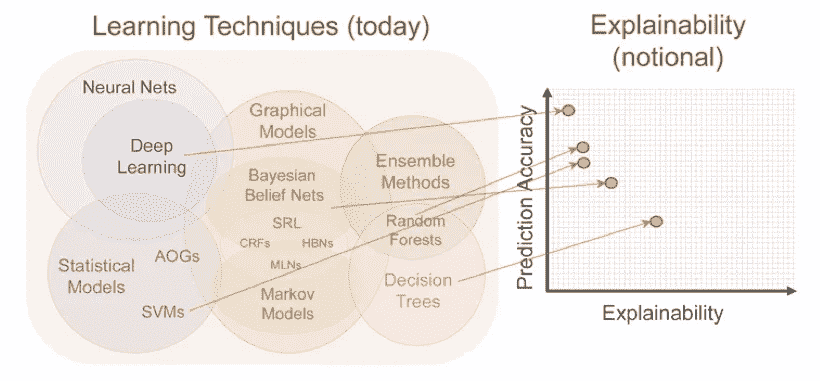

# 从机器学习中释放商业价值:模型可解释性

> 原文：<https://towardsdatascience.com/unlocking-business-value-from-machine-learning-model-interpretability-c08100b788c8?source=collection_archive---------6----------------------->

## 为什么越花哨越好

这是人工智能革命。如果你的公司没有挖掘数据，把它塞进神经网络，并推销其先进的人工智能能力，你已经落后了…对不对？不完全是。

就像明星球员会成为糟糕的教练一样，在高抽象层次上做出复杂决策的模型也是有代价的，他们不容易解释他们的推理。这是一个直接的(有时是昂贵的)权衡。

机器学习也有类似的范式。模型越强大，就越难解释其内部运作。当然，你可能会从神经网络中得到更准确的答案，但是**它如何**得出那个答案可能完全是个谜。当试图找出哪里出了问题或者如何改进时，这可能是一个问题。

现代营销巩固了“深度学习神经网络”作为科技领域最性感的四个词短语的竞争者。但是，数据科学家知道，越花哨并不总是意味着越好。

如果我告诉你 ***真正的商业价值*** 不一定与你的模型的“复杂程度”相关联呢？

## **模型可解释性**

可解释性用于寻求对输入和输出之间复杂本质的理解。

[Model Explainability vs. Power](https://iapp.org/news/a/the-privacy-pros-guide-to-explainability-in-machine-learning/). Credit: iapp

让我们举一个简单的例子:预测 ***年家庭支出*** 。利用一个神经网络，我可以得到这个国家每一个人手里的每一美元的完美预测。那太好了，但是如果我想知道**投入是如何促成那笔支出的呢？**

一般的狗贵多少？一般的孩子？收入增加？这些因素肯定会增加支出，但是在高层决策中，每个因素增加多少可能是一个谜。

由于神经网络如何将输入转化为输出的复杂、抽象的本质，试图理解它是没有希望的。

Deep Learning interpreting inputs

相反，一个简单的线性回归可能会得到这些答案。虽然不太准确，但肯定会更容易理解。

Linear Regression interpreting inputs

你是选择线性回归、神经网络，还是任何介于两者之间的方式，可能在很大程度上取决于你的目标——是*使用*还是*理解*机器。换句话说，你需要一个好球员还是一个好教练？

## 商业价值

归根结底，什么对你的企业更有价值:最大化[绩效指标](https://medium.com/greyatom/performance-metrics-for-classification-problems-in-machine-learning-part-i-b085d432082b)还是理解投入产出关系？

问问你自己:

*   我的客户需要了解机器的决定吗？

比如以“我不知道，机器刚这么说”为由拒绝贷款申请，就是*不够好*。改变生活的决定应该被清楚地传达，而且决定应该是公平的。

这是从可解释性中释放价值的基础**——*被告知的客户是信任你的客户。***

## **最后一件事**

**还有一点值得一提:**明确输入的重要性。****

****

**选择正确的输入对于建立一个可解释的模型至关重要。只有当你的输入一开始就有意义时，直观的输入-输出解释才是可能的。例如，考虑以下两个特征:**

****

**显然，第一个特征更容易理解:“每多生一个孩子，一个家庭平均每年将多支出 10，000 美元”，而“收入的平方根每增加 1，000 美元，平均每年支出就会增加 0.25 美元”。**

**尽管第二种方法可能有助于建立更准确的模型，但直觉上它毫无意义。输入是直观的，这一点至关重要——我们的客户和我们的决策可能会依赖于此。**

## **结论**

**今天深度学习的爆发是很牛逼的，但我们不应该忘记基本面。**

**大多数商学院统计学课程关注线性和逻辑回归是有原因的。清晰的理解导致良好的决策、有效的沟通和信任你的客户。**

****

**最后，我想这是一种“嘿，有时客户也需要知道发生了什么”的冗长说法**