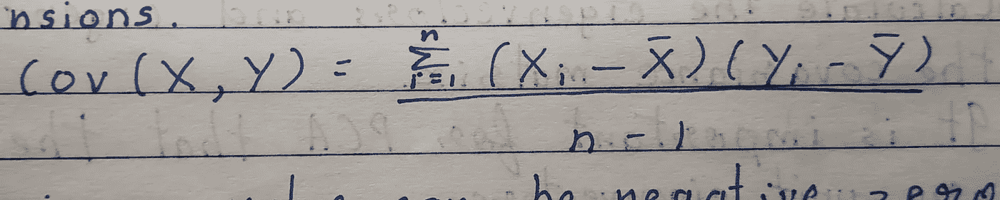
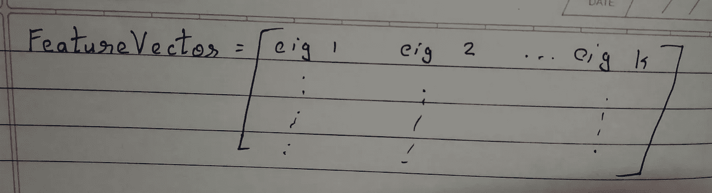

# 揭开 PCA 背后的数学面纱

> 原文：<https://towardsdatascience.com/unmasking-the-math-behind-pca-a1d003ba4adb?source=collection_archive---------8----------------------->

大量的特性可能是一件好事，也可能是一件坏事，这取决于具体的实例。这种情况经常发生，以至于相当多的可用特性是相关的，因此是多余的。更大维度的数据更难可视化。这就是降维技术派上用场的地方。PCA 可能是最常用的降维技术。它不会消除特征，而是从现有的低维特征中形成新的特征。为了真正理解这种算法，有必要掌握一些统计概念，这反过来又涉及到一些数学。但是，如果数学不是你的强项，也不要担心，因为我会尽量把它变得简单。因此，让我们更深入地探讨一下。

# 协方差

我们需要理解的第一项是协方差。协方差是两个变量之间的度量。它给出了一个维度的变化如何影响另一个维度的变化的度量。听起来真的很熟悉相关性，除了它不是。

标准差或方差是单变量分析的一种度量，其中这些度量的值给出了组成员对组均值的净偏差。这两个措施在一个维度上起作用。协方差在两个维度上起作用。

协方差是一种度量，用于找出维度相对于平均值的变化程度。总是在两个维度之间衡量。协方差的公式如下

协方差值可以是负数、零或正数。零协方差表示两个维度相互独立。正协方差表示两个维度一起增加和减少，而负协方差表示一个维度增加，另一个维度减少。

# 特征向量

特征向量是满足以下方程的任何向量:

Av = λv

其中 A 为(n×n)方阵，v 为特征向量，λ为特征值。

在这里你可以观察到，当特征向量 v 用矩阵 A 变换时，向量 v 只按因子λ缩放，也就是说，它改变了它的大小。它不会改变方向。

特征向量使理解线性变换变得容易。它们是线性变换简单地通过“拉伸/压缩”作用的方向。也就是说，v 和 Av 会在同一直线上，Av 只是将 v 拉伸或压缩一个因子λ，这个因子叫做特征值。

协方差矩阵的特征向量对应于最大特征值，如果它在数据中的方向(因为我没有更好的术语)具有最大方差。

# PCA 的步骤

1)用平均值减去数据的每个变量。
将此存储在变量 roadjustdata
假设数据有 m 个实例和 n 个变量，得到的矩阵将是一个(m，n)形矩阵。

2)计算可用数据的协方差矩阵。

3)计算协方差矩阵的特征向量和特征值。
对于 PCA 来说，重要的是特征向量是单位特征向量。
*特征向量帮助我们得到表征数据的线条。*

The red dots represent the data points while the dotted lines represent the eigenvectors.

4)具有最高特征值的特征向量是数据的主成分。
一般来说，一旦找到特征向量，就把特征值从最高到最低排序。相应的特征向量按照分量的重要性顺序给出分量。

5)获取转换后的数据。
创建一个名为 FeatureVector 的新矢量，如下所示:

If you’ve chosen the first k principal components, then those eigenvectors are placed in columns in this matrix

这个矩阵将是(n，k)
的形状，其中 k 是你选择包括的主成分的数量。
现在，转换后的数据将是
transformed data = RowAdjustData * feature vector
，并且这个结果矩阵的大小将是(m，k)。注意，实际数据的形状是(m，n)。其中，k(我们选择的组件数)将小于 n，这就是降维的执行方式。

具有特征向量单元将是有用的，因为值将在变换时被放大或缩小。

在上图的例子中，我们简单地选择对应于正斜率虚线的特征向量，从而消除了一个维度。