# 拆包(** PCA)

> 原文：<https://towardsdatascience.com/unpacking-pca-b5ea8bec6aa5?source=collection_archive---------11----------------------->

## 降维技术的一种实用实现

尽管互联网上有大量的 PCA(主成分分析)资源，但只有忍者才能在一定的合理时间内抓住整个想法，更不用说在你知道实际发生了什么的同时将想法具体化为代码。话虽如此，我们还是非常喜欢像专业人员一样应用 PCA 和解决真实案例的感觉。

在这篇文章中，我将尝试并清楚地说明人们可能会感到困惑的想法，我认为像我这样的新手会陷入其中并坚持几个小时。

事不宜迟，让我们直接进入正题。

首先，主成分分析是一种降维方法，更简单地说，是将多个特征(变量)归纳为较少特征的方法。假设，我们需要将新看到的动物分类为'**狗**或'**猫**，我们将测量动物的特征，如'**身高**和'**体重**。我们也可以根据更多的特征对这种看不见的动物进行分类(**颜色**’、**形状**’、**敏捷**’…等等。)

但是，问题是，我们不能将它们归类为超过三个特征(维度)，这对我们来说是视觉上无法解释的。另一个原因是，有些特征用起来不太重要，或者更糟的是，如果它们是随机数据或错误，有些可能是噪音，这两种情况都会干扰我们的预测。

简而言之，一个特征'**体重**'可能无法有效区分'**狗**'和'**猫**'，因此我们应该从数据中去掉'**体重**'。通过去掉大部分不重要的特征，我们可以节省计算成本。想象一下，我们的数据有 100 x 100 个特征，比如图像或遗传信息，尽可能地降低维度会好得多。

我们可以通过使用 PCA 来实现这些愿望。

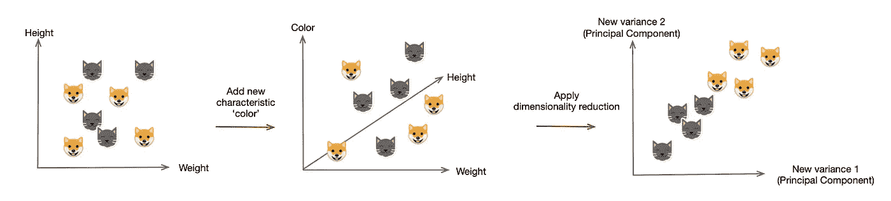

PCA describe multiple variable with fewer Principal Components

最好是实现一下，以获得一个整体的想法。让我们从制作 5 *10 矩阵开始，并采取步骤的过程。

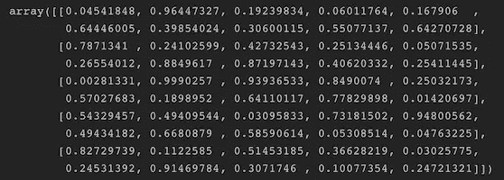

Matrix X

列是变量(特征)，行是样本(比如“猫”或“狗”)。

我们想对这个矩阵做的是得到特征值和特征向量，它们变成了描述样本的新变量(主成分)。设矩阵***【x】***为 ***n *p*** 大小，则 ***p *p*** 协方差矩阵*其中***【c=xᵀx/n.】****协方差矩阵是埃尔米特矩阵和半正定矩阵，利用 ***谱定理*** 让我们得到一个协方差矩阵和特征值。但在此之前，不要忘记从同一列中减去每列的平均值。**

**我们设置'***row var = False '***，这样关系就转置了:每一列代表一个变量，而行包含观测值。然后，我们得到 ***w*** 中的特征值和 ***v*** 中的特征向量。**

**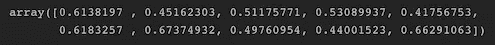**

**Means of each columns**

**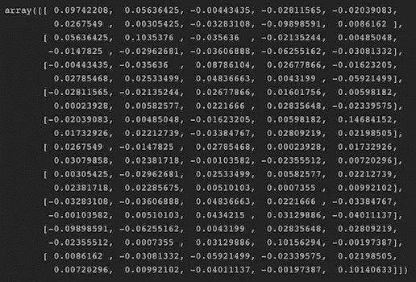**

**10 *10 Covariance Matrix**

**此时，特征向量是 10 *10 的矩阵。为了执行从 10 个变量到 2 个变量的降维，我们需要截断矩阵。**

**然后，我们要将(主轴上的投影 X)原始的 10 *10 样本变换到新的空间(二维空间)，我们使用等式**=****XV。******

**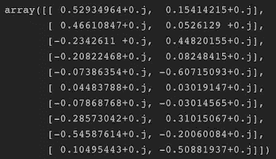**

**10 *2 Eigenvectors (Principal components)**

**我们得到了矩阵 5 *2 矩阵 ***T*** ，投影到 2 个主成分上。我们最后用两个变量来描述每个样本。**

**有趣的部分应该是可视化这些转换后的样本数据。让我们使用更大的数据。从定义 200 *2 矩阵 ***X*** 开始。**

**(在这种情况下，特征值是 2，因此我们实际上不需要将其截断为 2)**

**最后剧情。让我们不要忘记设置 ***轴‘相等’***，这样我们可以看到主分量的正交性。否则，我们将得到一个不垂直的特征向量。**

**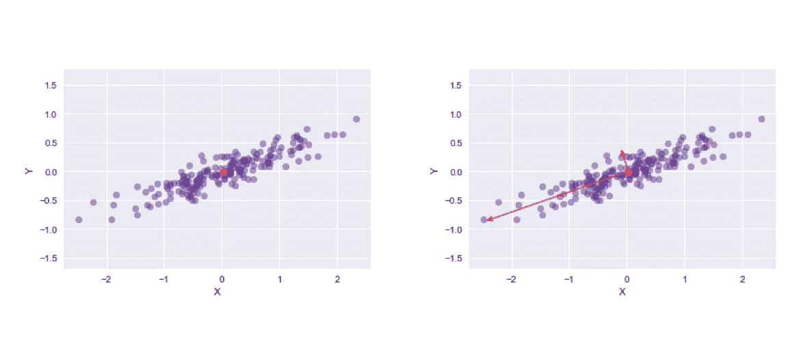**

**Original sample plot(Fig. left) and plot eigenvectors(Fig. right)**

**让我们也绘制转换后的样本。因为我们的样本已经是二维的，我没有必要截断它们，但是，让我们采取降维过程的步骤。**

**最后剧情。**

**正如我们所看到的，两个主分量是正交的，因为它们被 PCA 去相关，所以变量是相互独立的。**

**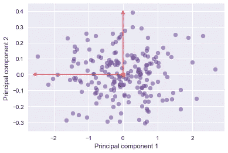**

**Fig. 1: Plot transformed sample data**

**样本数据也沿着两个主轴进行变换(不相关/旋转)。**

**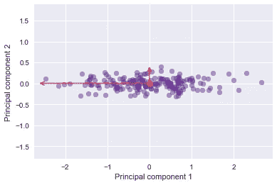**

**Fig.2: Uncorrelated sample data**

**为了更好地理解术语 ***【不相关/旋转】*** ，让我们看一下图 1，并与图 2 进行比较。分散的数据实际上是完全相同的数据，但是，我们对它们进行了去相关(旋转)，从而使两个变量(轴)相互独立(图 2)。**

**为什么我们要用特征分解(或者为了效率用奇异值分解)，用一些最大的特征值和对应的特征向量？这是因为 PCA 的目的是降低维数，但同时又尽可能用较少的变量描述样本。换句话说，我们想要在每个样本中变化的变量，而不想要在样本中相同的变量。我们可以通过使用更大的特征值或更大的方差来实现这个想法。根据信息论的观点，最大方差对应于具有最大熵的维度，因此，最大方差编码了最多的信息。然而，特征分解是昂贵的。假设，我们有图像样本，比如说 ***100 *100*** 像素，这意味着它有 10000 个变量。它的协方差矩阵 ***C*** 将是 10000 * 10000 维。因此，我们通常更喜欢 SVD(奇异值分解)来将维度大小降低到样本大小，而不是可变大小。让我们试一试，用奇异值分解绘制样本。**

**SVD 将协方差矩阵 ***C*** *，*where***c=xxᵀ/n***，分解成*其中 ***S*** 是一个含有奇异值的(矩形)对角矩阵***【sᵢ***， ***U*** 是一个酉矩阵，而就奇异值***【sᵢ】***而言，我们可以用***【λᵢ=【sᵢ**2)/n】***，其中 n 是样本量，***【λᵢ】***是特征值。***

**从这个结果中，我们通过 SVD 和本征分解看到完全相同的主分量。**

**让我们也确定特征向量是相互正交的。一个正交矩阵 ***Q*** 定义为 ***QᵀQ=QQᵀ=I*** ，其中 ***I*** 为一个单位矩阵。我们从奇异值分解得到了特征向量***【vᵀ】****现在如下图。***

***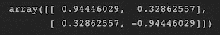***

***V***ᵀ*** (Eigenvectors)***

***`V.dot(V.T)`的结果是一个单位矩阵。***

***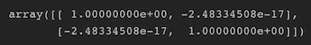***

***Identity matrix***

***在许多数学概念的理论中，例如偏最小二乘法，向量正交的概念经常出现。以这种方式检查它对于确保我们在正确的轨道上是有用的。***

***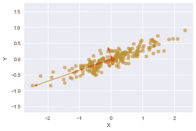***

***PCA with SVD***

***人们可能想观察每个点离中心有多远。其中一个方法是画一个等概率图，或者误差日蚀图。这对于查看两个组中间的样本特别有帮助，例如，我们可以将它用于 K-means 聚类。***

***我们从导入模块开始。然后，我们想用奇异值分解原始样本的协方差矩阵。***

***酉矩阵 *U_* 用于旋转样本数据，现在我们分别使用*U _【0】*和*U _【1】*，余弦，正弦，这样我们就可以得到正切来计算角度。***

**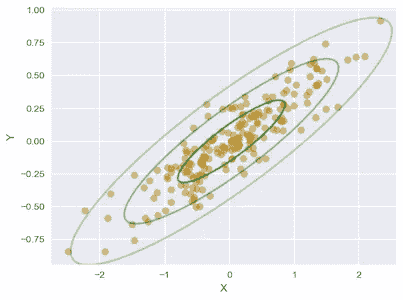**

**Equiprobability: ecliptic error circle**

**角度是从 ***x*** 轴。当坐标轴由标准差定义时，日食由方程定义，***(x/σ₁)【+(y/σ₂)= s***，其中 ***σ₁*** 为 x 轴的标准差， ***σ₂*** 为 y 轴的标准差， ***s*** 为样本的方差。**

**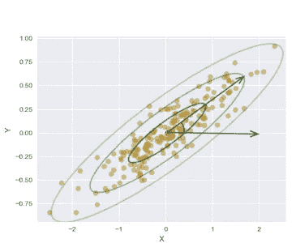**

**The angle between X and PC1**

*****x=2σ₁√s*** 表示一个标准差。我们在上面的代码中绘制了三次。第三个圆圈包含图像上的大部分样本数据，因为它应该是 99.7%的置信区间。**

**我们可以使用 Scikit-learn 进行 PCA。让我们再看一遍同一个样本。像往常一样从样本数据开始。**

**定义 ***200 *2*** 矩阵 ***X*** ，为了剧情的缘故，我们使用两个组件。**

**剩下的过程和以前一样。**

**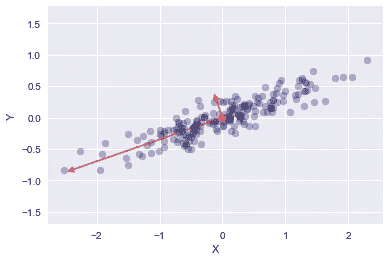**

**PCA with Scikit-learn version**

**结果是一样的。从代码中可以看出，我们可以通过 ***【分量 _*** 获取最大特征向量，通过 ***解释 _ 方差 _*** 获取特征值。**

**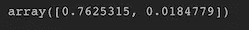**

***explained_variance_***

**让我们来看看 ***讲解 _ 方差 _*****

**主成分解释了样本数据的 97.6%[0.7625315/(0.7625315+0.0184779)]，第二主成分解释了剩余部分。这意味着我们几乎可以不用第二主成分来描述原始数据。Scikit-learn 已经计算了解释方差比率，因此我们可以使用 via***explained _ variance _ ratio _***。**

**为了更好地理解，让我们使用 1797 *64 矩阵数字数据，并将这些维度从 64 减少到 10。**

**现在，我们可以看到这 10 个新组件可以在多大程度上描述原始样本数据。**

**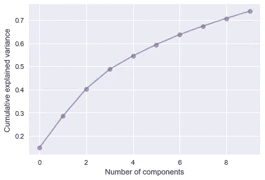**

**Accuracy vs. number of components**

**事实证明，它描述了 72~73%的样本，而不是使用确保 100%准确性的 64 个维度。请注意，在左图中，第一个成分是指数 0，这就是为什么该图从 14~15%的方差开始。**

**假设需要多少元件才能达到 90%的精度呢？我们可以先清空 PCA 函数并绘制图形。**

**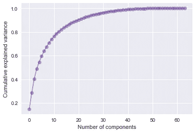**

**我们认为 20 个左右的成分对于 90%的方差来说就足够了。更简单的方法是将数字直接添加到函数中，例如，`pca = PCA(.9)`**

**为了进一步理解，让我们将转换后的样本数据转化为原始数据，并对它们应用热图。我们应该观察到，组件的数量越多，它创建的样本数据就越精确。**

**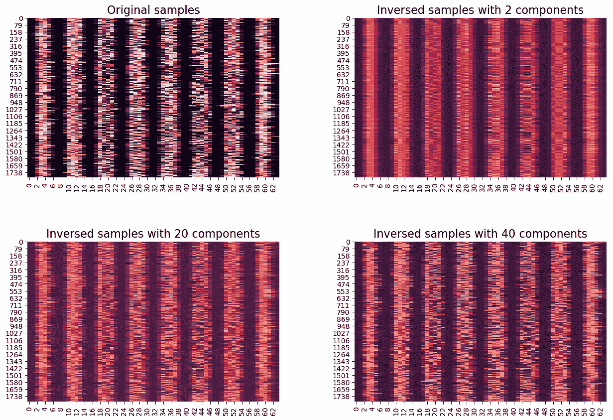**

**显然，原始数据比具有两个主成分的反演数据具有更多的特征。使用四十个主成分，我们可以更精确地反演转换后的数据。**

**我们实际上可以显示目前为止我们正在处理的数字数据。**

**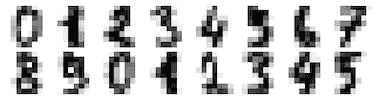**

**Digits from original sample**

**让我们使这些数字图像更粗糙，或者更准确地说，一旦执行降维并将数字图像反转到原始大小。**

**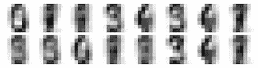**

**Reconstructed digits images**

**我们也可以将 PCA 应用于特征脸，因为它的特征只有亮度，就像上面的数字图像一样。在重建原始数据方面，我们采取了与数字重建略有不同的步骤。因为我们首先需要一张平均脸。在转换数据后，我们添加平均脸。假设我们想要一个反转的人脸图像 ***X*** ， ***X*** 描述为***x =μ+w****₁***** v****₁****+w****₂***** v*****

***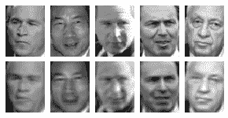***

***Full dimension(Fig. above) and 100 dimensions(Fig. below)***

***正如我们之前讨论的，当维数很大时，SVD 表现良好。例如，这些图像是 62 *47 = 2914 尺寸。如果我们使用本征分解，我们需要计算相关矩阵的 2914 *2914 维。相反，奇异值分解可以通过样本大小*样本大小来计算。***

***主成分由 ***XV=US*** 给出。我们把维度从 500 降低到 100，现在 ***我们的*** 就是一个 ***500 *100*** 的矩阵。***

**为了与原始人脸图像进行比较，我们要将 ***投影为*** ，并将其逆投影为 ***X*** 。我们应用方程***【x=usvᵀ】****，得到 500 * 2914 矩阵***×19***。***

**最后绘制图像。**

**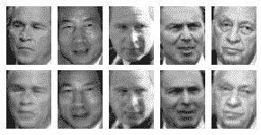**

**Reconstructed face images with SVD(Fig. below)**

**得到的图像不像先前的 scikit-learn 方法那样模糊。似乎是更好的方法，我们使用的数据越少，构建的图像越清晰。这是因为样品的噪音更少，机器使用的过滤器更少。这将导致它自己对新图像的预测较低，这是机器以前从未见过的。**

**组成这些脸的特征向量称为特征脸，每个特征脸都是唯一的。让我们来看看他们是什么样子的，以及这些人脸图像的平均脸是什么样子的。**

****

**The average face(Fig. left), and the first five(most biggest) Eigenfaces(Fig. right group)**

**平均人脸是人脸图像的基础。**

**最后，这里是奇异值分解处理特征脸的概述。**

**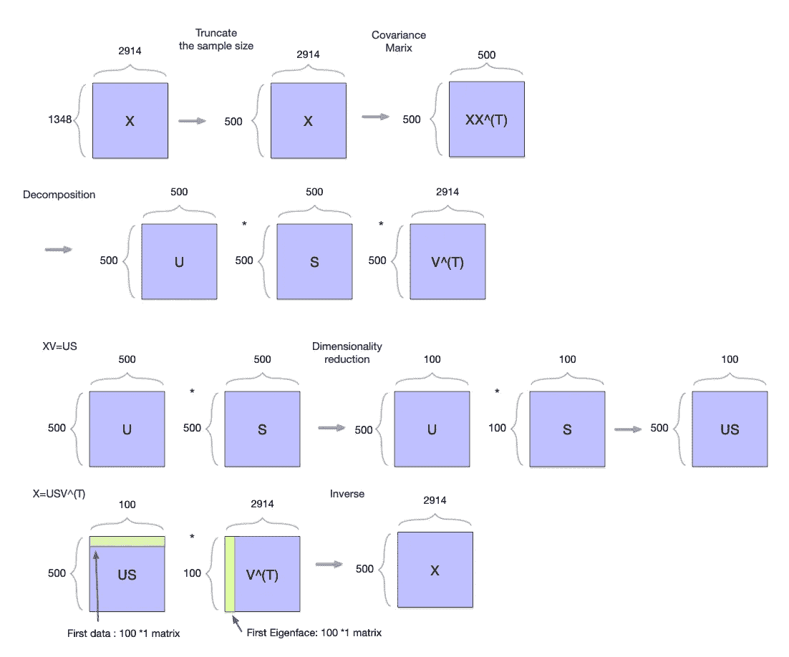**

**SVD overview**

**参考**

** [## 奇异值分解与主成分分析的关系。如何用 SVD 进行 PCA？

### 主成分分析(PCA)通常通过协方差矩阵的特征分解来解释。然而…

stats.stackexchange.com](https://stats.stackexchange.com/questions/134282/relationship-between-svd-and-pca-how-to-use-svd-to-perform-pca/)  [## 理解主成分分析、特征向量和特征值

### 在今天的模式识别课上，我的教授谈到了 PCA，特征向量&特征值。我得到了…

stats.stackexchange.com](https://stats.stackexchange.com/questions/2691/making-sense-of-principal-component-analysis-eigenvectors-eigenvalues)  [## 主成分分析的一站式商店

### 在我用于研究生统计理论课的教科书的开始，作者(乔治·卡塞拉和罗杰…

towardsdatascience.com](/a-one-stop-shop-for-principal-component-analysis-5582fb7e0a9c)  [## 如何画出代表协方差矩阵的误差椭圆？

### 在这篇文章中，我将展示如何为 2D 正态分布数据绘制一个误差椭圆，也称为置信椭圆…

www.visiondummy.com](http://www.visiondummy.com/2014/04/draw-error-ellipse-representing-covariance-matrix/)  [## 用于特征选择的主成分分析(PCA)及其一些缺陷

### 数据科学中的一个典型方法是我所说的宇宙特征化。我的意思是我们提取…

jotterbach.github.io](http://jotterbach.github.io/content/posts/pca/2016-03-24-Principal_Component_Analysis/)  [## eigen faces-scholar pedia

### 特征脸可以被认为是表征人脸图像之间的全局变化的一组特征。然后…

www.scholarpedia.org](http://www.scholarpedia.org/article/Eigenfaces#fig:PIE.jpg)  [## 基于主成分分析的特征提取——假人的计算机视觉

### 在这篇文章中，我们讨论如何主成分分析(PCA)的工作，以及它如何可以被用来作为一个维度…

www.visiondummy.com](http://www.visiondummy.com/2014/05/feature-extraction-using-pca/)**