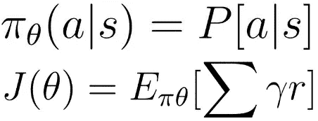
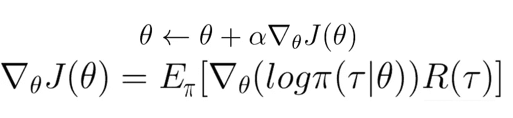
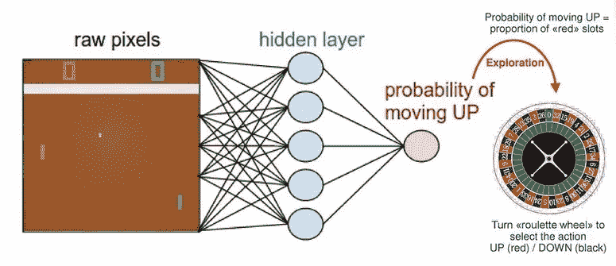

# 解开政策梯度并加强

> 原文：<https://towardsdatascience.com/unravel-policy-gradients-and-reinforce-5de9d0a8ab3?source=collection_archive---------10----------------------->

这一次，我们将让自己忙于另一个强化学习算法家族，称为基于策略的方法。如果你还记得，当谈到无模型强化学习时，有两组主要的技术。

我们分析了前两篇文章中的第一部分，其中我们谈到了 Q 学习和深度 Q 网络以及对基本模型的不同改进，如双深度 Q 网络和优先重放。看看这里的[和这里的](https://sergioskar.github.io/Deep_Q_Learning/)和。

让我们快速回放一下。请记住，我们将问题构建为马尔可夫决策过程，我们的目标是找到最佳策略，这是从状态到行动的映射。换句话说，我们想知道在给定的状态下，具有最大期望回报的行为是什么。在基于价值的方法中，我们通过寻找或近似价值函数来实现，然后提取策略。如果我们完全抛弃价值部分，直接找到策略会怎么样。这就是基于策略的方法的作用。

不要误解我。Q-learning 和 Deep Q 网络都很棒，它们在很多应用程序中使用，但是基于策略的方法提供了一些不同的优势:

*   它们更容易收敛到局部或全局最大值，并且不会出现振荡
*   它们在高维或**连续**空间中非常有效
*   他们可以学习**随机**策略(随机策略给出动作的**概率分布**，而不是确定性动作。他们在随机环境中使用，他们将随机环境建模为部分可观测的马尔可夫决策过程，在这种情况下，我们无法确定每个行动的结果)

等一下。我讲了收敛，局部最大值，连续空间，随机性。这里发生了什么事？

嗯，问题是基于策略的强化学习是一个优化问题。但是这是什么意思呢？

我们有一个带有一些参数θ的策略(π),它输出动作的概率分布。我们想找到产生最佳政策的最佳θ。但是我们如何评价一项政策的好坏呢？我们使用一个政策目标函数 J(θ)，它通常是期望的累积报酬。此外，无论我们有间断的还是连续的环境，目标函数都是不同的。

所以我们在这里，手里拿着一个优化问题。我们所要做的就是找到使 J(θ)最大化的参数θ，这样我们就有了最优策略。

第一种方法是使用强力技术并检查整个策略空间。嗯，不太好。

第二种方法是在策略空间或其子集中使用直接搜索。这里我们引入术语**策略搜索。**事实上，我们可以使用两种算法。让我们称他们为:

*   无梯度
*   基于梯度的

想一想你曾经用来解决优化任务的任何算法，它不使用导数。这是一个无梯度的方法，其中大部分可以用于我们的情况。一些例子包括:

*   [爬山](https://en.wikipedia.org/wiki/Hill_climbing)是一种随机迭代的局部搜索
*   [单纯形](https://en.wikipedia.org/wiki/Simplex_algorithm):一种流行的线性规划算法(如果你喜欢线性代数，就去看看他)
*   [模拟退火](https://en.wikipedia.org/wiki/Simulated_annealing)，根据某种概率在不同状态间移动。
*   [模拟物理进化过程的进化算法](https://en.wikipedia.org/wiki/Evolutionary_algorithm)。它们从一个以基因组表示的随机状态开始，通过交叉、突变和物理选择找到最强的一代(或最大值)。整个“适者生存”的概念包含在一个算法中。

第二类方法使用[梯度下降](https://en.wikipedia.org/wiki/Gradient_descent)或者更准确地说是梯度上升。

在(普通)梯度下降中，我们:

1.  初始化参数θ
2.  生成下一集
3.  获得长期奖励
4.  基于所有时间步长的奖励更新 theta
5.  重复

但是有一个小问题。我们能以解析形式计算梯度θ吗？因为如果我们做不到，整个过程都会被扔进垃圾桶。事实证明，我们可以用一点小技巧。我们必须假设策略在非零的时候是可微的，并使用对数。此外，我们将状态-动作轨迹(τ)定义为状态、动作和回报的序列:τ = (s0，a0，r0，s1，a1，r1…，st，at，rt)。

我想今天的数学到此为止。当然，结果是，我们有了解析形式的梯度，现在可以应用我们的算法了。

到目前为止所描述的算法(略有不同)被称为**加强**或**蒙特卡洛政策梯度**。与普通政策梯度的不同之处在于，我们去掉了对回报的预期，因为这不太实际。相反，我们使用随机梯度下降来更新θ。我们**从期望值中抽取**来计算该集的奖励，然后更新该集每一步的参数。这是一个非常简单的算法。

好了，让我们把那些事情都简化一下。你可以这样想政策梯度:

对于我们获得积极奖励的每一集，该算法将增加未来这些行为的概率。同样，对于负面奖励，算法会降低行动的概率。因此，随着时间的推移，导致负面结果的行为将慢慢被过滤掉，而那些有正面结果的行为将变得越来越有可能。就是这样。如果要从整篇文章中记住一件事，就是这件事。这就是政策梯度的本质。每次唯一改变的是我们如何计算奖励，我们选择什么策略(软最大，高斯等..)以及我们如何更新参数。

现在我们继续。

如前所述，增强是一种随机梯度下降算法。考虑到这一点，我想到了一个问题。为什么不使用神经网络来近似策略并更新 theta？

答对了。！

是时候将神经网络引入等式了:

当然，我们可以使用几乎任何机器学习模型来逼近策略函数(π)，但我们使用诸如卷积网络之类的神经网络，因为我们喜欢深度学习。一个著名的例子是一个代理，它学习使用策略梯度和神经网络来玩 [Pong](http://karpathy.github.io/2016/05/31/rl/) 游戏。在该示例中，网络接收来自游戏的输入帧，并输出上升或下降的概率。

[T3【http://karpathy.github.io/2016/05/31/rl/】T5](http://karpathy.github.io/2016/05/31/rl/)

我们将尝试使用 OpenAI 的健身房环境做类似的事情。

你可以看到这不是小事。我们定义神经网络模型、蒙特卡罗抽样、训练过程，然后让代理通过与环境交互来学习，并在每集结束时更新权重。

但是政策梯度有其自身的缺点。最重要的是，它们具有很高的方差，并且很难稳定模型参数。

你想知道我们如何解决这个问题吗？保持联系…

(提示:它的演员兼评论家模型)

> ***如果您有任何想法、评论、问题或者您只想了解我的最新内容，请随时在***[**Linkedin**](https://www.linkedin.com/in/sergios-karagiannakos/)**，**[**Twitter**](https://twitter.com/KarSergios)**，**[**insta gram**](https://www.instagram.com/sergios_krg/)**，**[**Github**](https://github.com/SergiosKar)**或在我的**

*要阅读完整的深度强化学习课程，学习所有你需要了解的人工智能知识，去* [*这里*](https://medium.com/@SergiosKar/deep-reinforcement-learning-course-baa50d3daa62) *。*

*原载于 2018 年 11 月 1 日*[*sergioskar . github . io*](https://sergioskar.github.io/Policy-Gradients/)*。*