# 用于数据插值的无监督深度学习

> 原文：<https://towardsdatascience.com/unsupervised-learning-for-data-interpolation-e259cf5dc957?source=collection_archive---------9----------------------->

## 使用前馈自动编码器的数据去噪

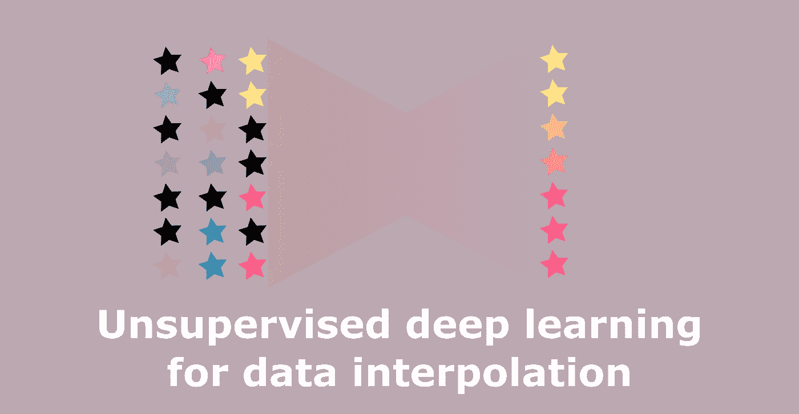

Image by Author

真实世界的数据是嘈杂的。噪声可能以不正确或缺失值的形式出现。本文描述了用自动编码器填充缺失值的方法。自动编码器在没有参考值可用于缺失条目的噪声数据上被训练。该程序是对图像重建的任务进行解释。该方法过去已成功应用于地震数据重建。Tensorflow 实现可用[这里的](https://github.com/mikhailiuk/image_reconstruction)****。****

# ****问题概述****

**想象一下这样一种情况:数据丰富，但是数据有噪声，并且无法访问参考。一个很好的例子是图像，如图 1 所示。这里，图片中的黑点是噪声——图像值设置为 0，我们假设没有它们可用的地面真实数据。数据类型不限于图像，可以是任何东西，例如，丢失部分数据的患者记录。**

******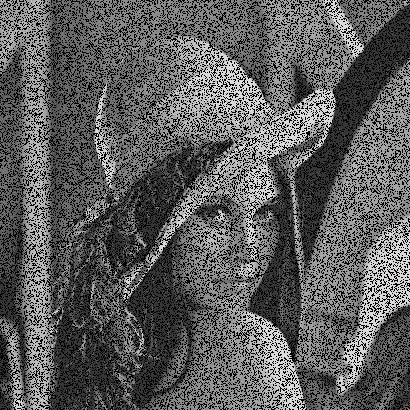**

**Figure 1: Example of corrupted data. In the given example images have 0’s in places where pixels are missing. Images are taken from the [Standard Test image dataset](http://www.imageprocessingplace.com/root_files_V3/image_databases.htm).**

**理想情况下，如果具有参考的训练数据可用，我们可以通过将重构与目标进行比较来训练网络重构缺失值。但是在没有目标数据的情况下，这是不可能的，因为将重构与 0(即缺失值)进行比较是没有意义的。在这里，我讨论了一种在没有参考资料的情况下训练自动编码器完成数据重建任务的方法。**

# **理论概述**

**这一节简要回顾了神经网络和自动编码器。**

## **神经网络**

**简单的前馈人工神经网络(ANN)有几层。第一层是输入层，输入数据。接下来是一些隐藏层。最后是输出层。层由基本单元组成— *神经元*。一层中的神经元与下一层中的神经元相连。在训练过程中优化了两种参数类型:*权重*，对应于每条连接神经元的边，以及一个*偏差*关联于每一个神经元。因此，神经元的输入是前一层神经元的加权输出和偏差的线性组合。通过*激活函数，例如 sigmoid* ，将神经元的输入映射到一个新的空间，从而获得神经元的输出。回归的任务可以与特征学习的任务相关。在人工神经网络中，一个特征是隐层中单个神经元的输入连接。**

**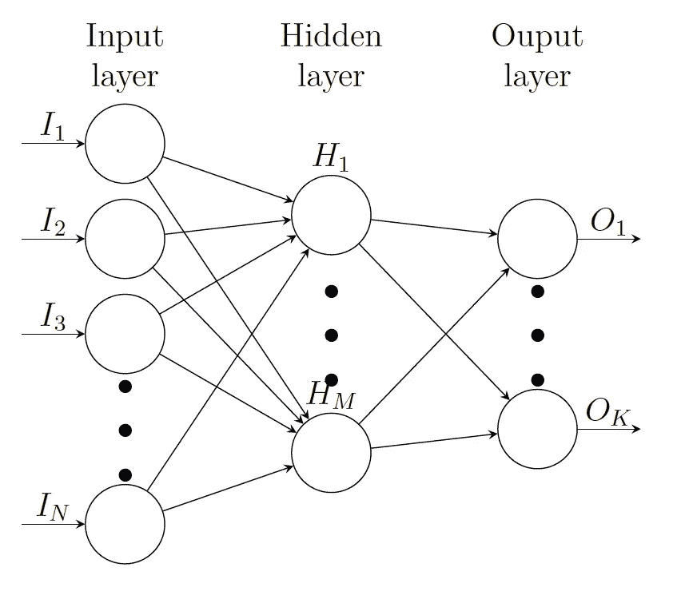**

**Figure 2: A simple feed forward neural network. Image by Author.**

**训练是一个迭代过程，分为两个阶段:前馈和反向传播。前馈是将数据输入到输入中，并通过人工神经网络向前传播，从而产生输出的过程。对于每一层，该过程可以描述为:**

****y**=**s(**Wx**+**b**)，****

**其中 **x** 是当前层的输入向量， **y** 是当前层的输出， **W** 是权重矩阵，其中**W***ki*=**W***ki*和 **w** *ki* 是 **x** *i***

**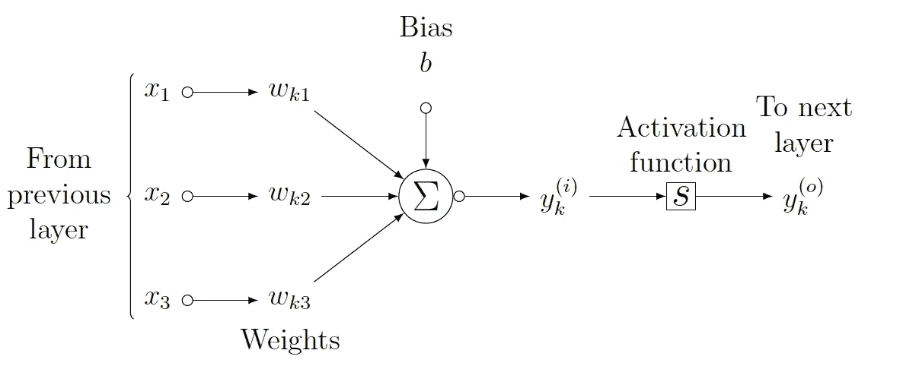**

**Figure 3: A single neurone. Image by Author.**

**在前馈通过之后，需要评估目标函数，并且需要估计使其最小化的参数。一种常用的优化方法是 [*随机梯度下降*](https://en.wikipedia.org/wiki/Stochastic_gradient_descent) (SGD)或 [*亚当*](https://www.tensorflow.org/api_docs/python/tf/train/AdamOptimizer) 优化器。**

## **自动编码器**

**这项工作考虑了基于自动编码器的人工神经网络。这种选择是合理的，因为它旨在消除任何关于数据的先验假设。简单的*自动编码器*只有一个隐藏层，其单元数少于输入数。深度自动编码器由具有非线性激活函数的多个隐藏层形成。这种结构允许在人工神经网络的更深层学习抽象特征和复杂关系。**

**一个自动编码器被拆分成一个*编码器-* ***f*** 和一个*解码器* ***g*** 。编码器的目的是将 D 维输入 **x** 映射到通常更低的 K 维特征空间，即***f***(**x**)=**h**。解码器旨在将特征空间映射回原始空间，从而重构输入，即***g***(**h**)=***g***(***f***(**x**)=***r***(**x**)~**x****

# **缺少值的培训**

**因为没有给出信号丢失部分的参考值，所以训练神经网络仅重建信号的未被破坏部分。被破坏的数据被输入到神经网络中，然而，仅用于未被破坏的数据点的重建的误差被评估并用于反向传播。该过程基于这样的假设，即面片具有不同的噪声分布。如果在当前迭代的反向传播中没有使用信号值，则输入到神经网络中的后续面片将丢失不同位置的值。因此，在当前迭代中未更新的权重在下一次迭代中被更新。**

**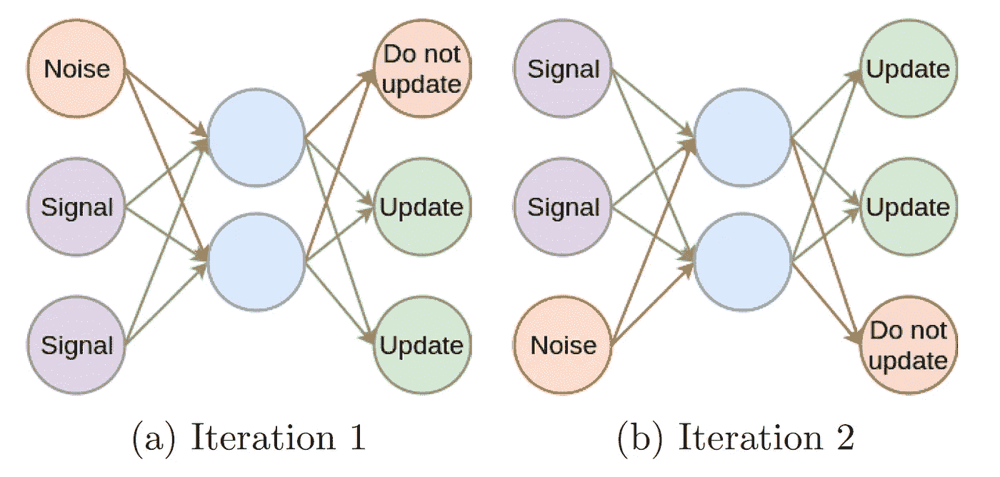**

**Figure 5: Training with missing data. Edges marked with red colour are not updated in the given iteration. Image by Author.**

**由于在基于给定值的训练期间监控重建的良好性是有偏差的，所以对数据应用附加的二进制验证掩码。验证掩码包含 2%的噪声，并被投影到数据上。我确保数据中缺失的值和验证掩码中值为 0 的值不会重叠。在训练期间使用被验证掩码破坏的点。在每个时期之后，使用参考值计算被验证掩码破坏的值的误差。每当验证误差达到局部最小值时，保存网络的当前配置，并继续训练。**

## **算法**

**该算法包括七个阶段(图 2)。首先，对数据进行预处理——在 0 和 1 之间进行缩放，并分割成小块。下一步，补丁通过人工神经网络。然后计算干净数据的误差，并更新参数。在下一阶段，使用验证掩码计算验证误差。如果 ANN 达到了局部最小值，则保存网络的当前状态。如果 ANN 不在其最小值，则跳过这一步。在下一步中，超参数被更新并且数据被混洗。如果满足停止条件，即达到最大历元，则获得缺失数据的重建，否则继续训练。**

**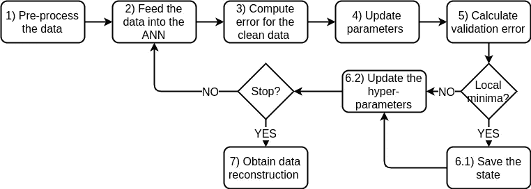**

**Figure 6: Algorithm stages. Image by Author.**

# **结果**

**具有低频分量的图像比具有高频分量的图像重建得更好，即更复杂的场景更难重建。当使用更大的片时，即网络具有更多信息时，重构更好。最差的重建是在碎片的边缘和角落，那里的像素有五个或三个邻居，而在碎片的中心，像素被八个邻居包围。一种可能的解决方案是使用更大尺寸的补片，并且仅使用中心部分进行重建。这项工作可以通过使用 CNN 处理图像来改进，并在 RGB 图像上进行测试和应用于其他数据类型。**

******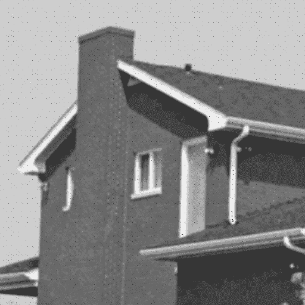******

**House: 30% missing(left) reconstructed (center) reference (right). 16x16 patches, 8 pix shift, averaged. Images are taken from the [Standard Test image dataset](http://www.imageprocessingplace.com/root_files_V3/image_databases.htm).**

**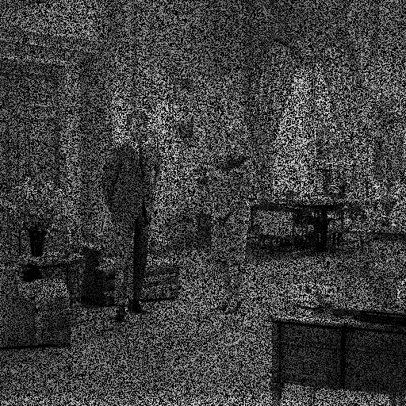****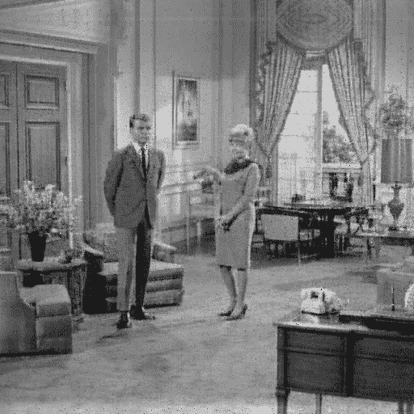******

**Room: 50% missing(left) reconstructed (center) reference (right). 32x32 patches, 16pix shift, averaged. Images are taken from the [Standard Test image dataset](http://www.imageprocessingplace.com/root_files_V3/image_databases.htm).**

**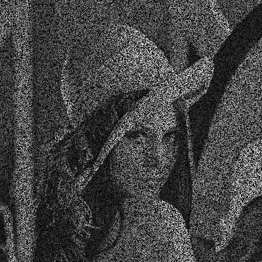**********

**Lena: 50% missing(left) reconstructed (center) reference (right). 32x32 patches, 4pix shift, averaged. Images are taken from the [Standard Test image dataset](http://www.imageprocessingplace.com/root_files_V3/image_databases.htm).**

**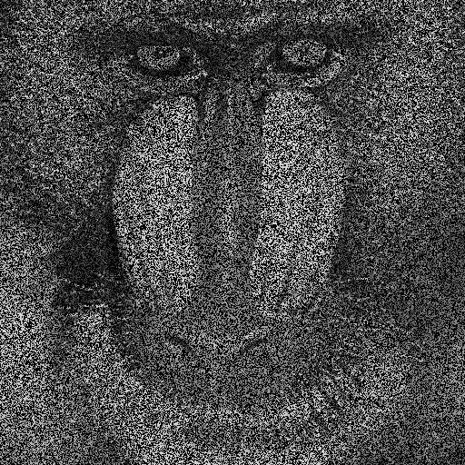**********

**Baboon: 50% missing(left) reconstructed (center) reference (right). 32x32 patches, 4pix shift, averaged. Images are taken from the [Standard Test image dataset](http://www.imageprocessingplace.com/root_files_V3/image_databases.htm).**

**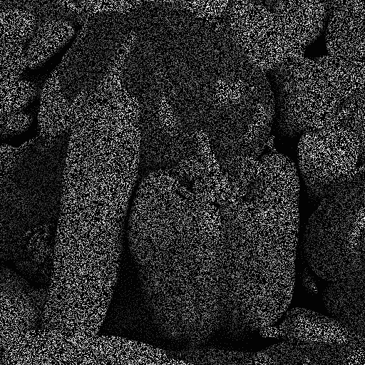**********

**Peppers: 70% missing(left) reconstructed (center) reference (right). 32x32 patches, 4pix shift, averaged. Images are taken from the [Standard Test image dataset](http://www.imageprocessingplace.com/root_files_V3/image_databases.htm).**

**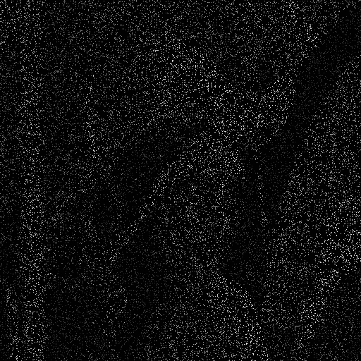**********

**Lena: 90% missing(left) reconstructed (center) reference (right). 32x32 patches, 2pix shift, averaged. Images are taken from the [Standard Test image dataset](http://www.imageprocessingplace.com/root_files_V3/image_databases.htm).**

**********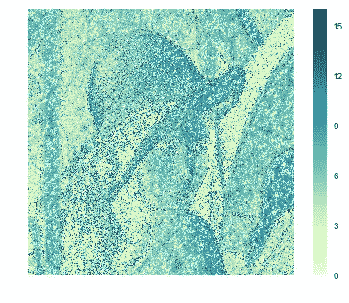**

**Lena 50% missing: reference (left) reconstructed (center) RMSE heatmap (right). 32x32 patches, 4pix shift, averaged. Images are taken from the [Standard Test image dataset](http://www.imageprocessingplace.com/root_files_V3/image_databases.htm). The error map is generated by the author**

## ****看不见的数据****

**有趣的是，网络是否能够泛化，即在一幅图像上训练并重建另一幅图像。正如所料，当重建的图像与用于训练的图像相同时，重建会更好。下面是两个例子:网络训练狒狒和重建辣椒和训练辣椒和重建狒狒。**

******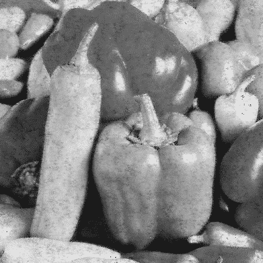******

**Peppers trained on baboon: 50% missing(left) reconstructed (center) reference (right). 32x32 patches, 4pix shift, averaged. Images are taken from the [Standard Test image dataset](http://www.imageprocessingplace.com/root_files_V3/image_databases.htm).**

******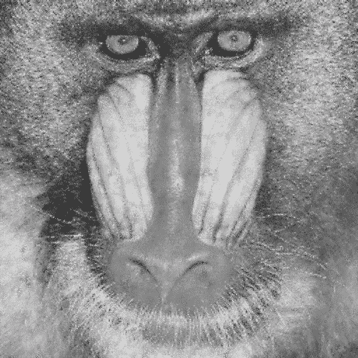****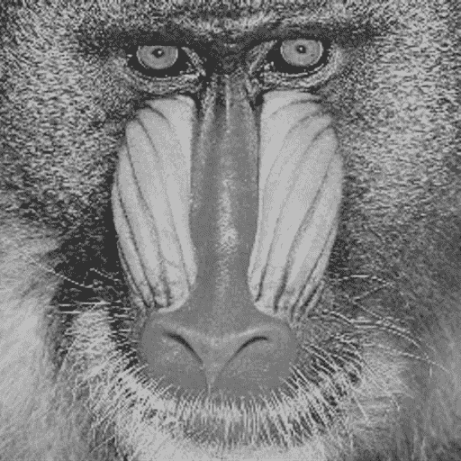**

**Baboon trained on peppers: 50% missing(left) reconstructed (center) reference (right). 32x32 patches, 4pix shift, averaged. Images are taken from the [Standard Test image dataset](http://www.imageprocessingplace.com/root_files_V3/image_databases.htm).**