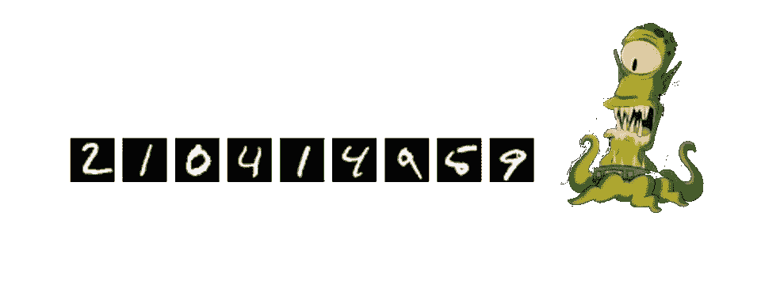
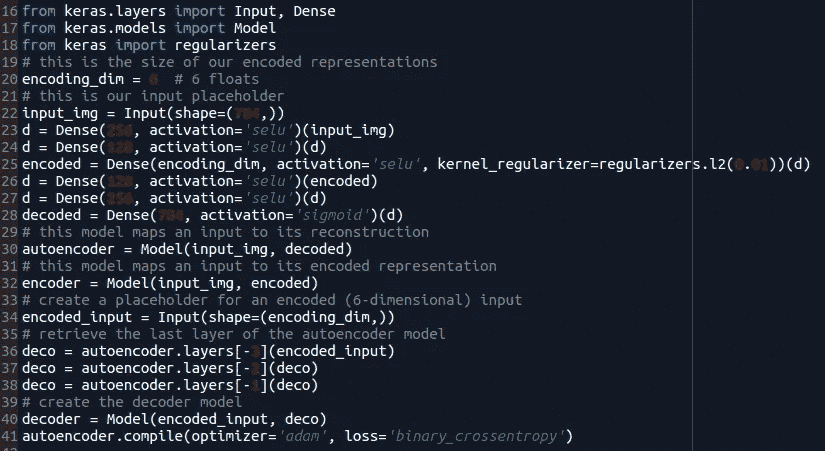
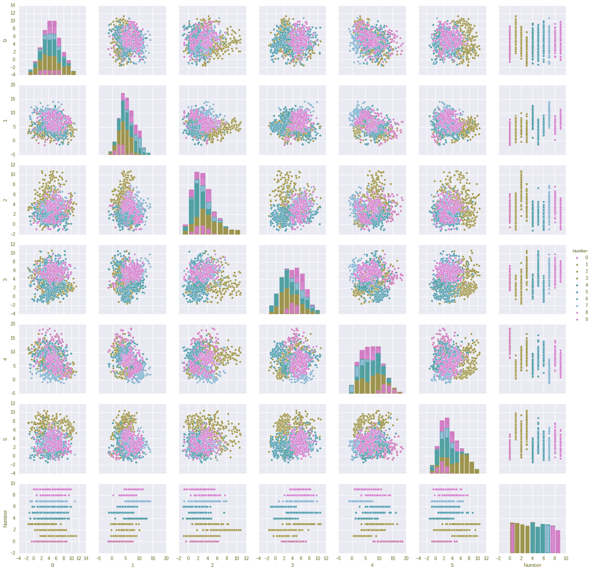
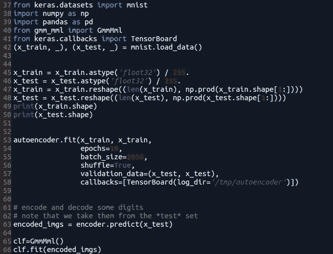
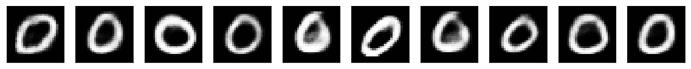
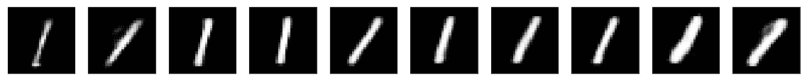
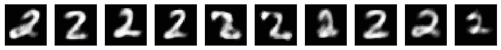
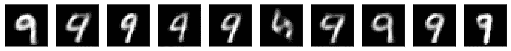
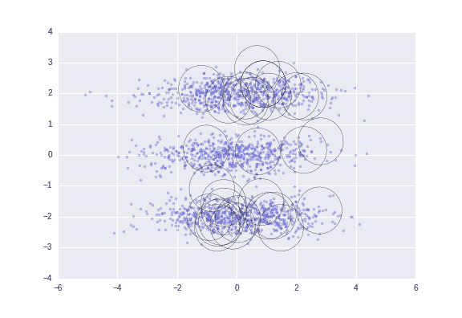

# SELU 自动编码器(不是另一个 MNIST)上高斯混合模型的无监督学习

> 原文：<https://towardsdatascience.com/unsupervised-learning-of-gaussian-mixture-models-on-a-selu-auto-encoder-not-another-mnist-11fceccc227e?source=collection_archive---------1----------------------->

MNIST 是一个经典的机器学习数据集。想象以下场景:

Figure 1 - Alien who cannot understand human handwritten digits images

你是一个不了解人类文化的外星人，出于某种原因，你设法从手写数字数据集中获取了所有图像(MNIST)。因为你是一个外星人，你不知道人类数字的概念是什么，或者他们相应的符号看起来像什么，仅仅通过分析图像数据，你必须猜测有多少不同的符号(数字)(如果可能的话，生成新的表示，而不是仅仅复制你已经有的表示)。在机器学习中，这个问题可以被看作是:“如何在有限混合模型中选择正确数量的组件”

有限混合模型是一种聚类算法，其目的是在除了观察值之外没有其他信息可用时确定数据的内部结构。

Figure 2 — Number 5

对 MNIST 进行聚类的第一个问题是，每个 28×28 像素的图像意味着每个数字有 784 个维度。

大多数聚类方法都受到维数灾难的困扰。这样，为了执行无监督学习，降维方法是必要的。此外，如标题所示，高斯混合模型将用于聚类的学习(这意味着压缩空间的高斯行为越多，拟合就越好..)

Figure 3 — SELU auto encoder with regularization to enforce space constraints (promote structure?)

SELU 是一种新的神经网络激活函数，具有自归一化的特性。如果我们制作一个经典的自动编码器并将激活函数切换到 SELUs，压缩空间收敛到一个明确定义的均值和方差。也许，代表压缩空间的一些分布将是高斯分布的，并且可以被高斯混合模型很好地捕获。在编码层上使用 L2 正则化来约束其权重空间。由于高斯拟合将在这一层上进行，这一约束连同仅使用 6 个神经元的事实将产生信息瓶颈，这将有利于数据的结构化表示。

首先，让我们通过绘制 pairplot(一个 6 维的 pair plot)来检查压缩空间的分布:

Figure 4 — Compressed Space Pairplot

该空间是通过将 MNIST 数据集从 784 维(28×28 像素)的图像压缩到 6 维空间而产生的。看起来终究还是有些高斯行为！请记住，autoencoder 无法访问标签，它们被包含在 pairplot 中的唯一原因是为了让我们对可能的集群有一个参考。

但是现在，一个问题出现了:如何为高斯混合模型选择正确的分量数？虽然有许多成本函数可以用来选择适当数量的组件，如贝叶斯信息标准(BIC)或阿凯克信息标准(AIC)，但有算法可以为我们做这种选择(而不必为每个组件数量执行不同的拟合)。其中之一是在本文中提出的[有限混合模型的无监督学习](http://www.lx.it.pt/~mtf/IEEE_TPAMI_2002.pdf)

为了适应高斯混合模型，通过自动选择组件，我将使用一个实现(仍然是 WIP ),它是我根据那篇论文的见解(我基本上将我教授的 Matlab 代码转换为 Python 代码)制作的。) [Github 包](https://github.com/abriosi/gmm-mml)

这段代码是使用 sklearn 范式构建的，并且可以与该库一起使用，因为它实现了 ModelTransformer。

Figure 5 — Training the autoencoder on the MNIST dataset and fitting the Gaussian Mixture Model

可以使用图 5 中的代码将高斯混合模型拟合到压缩空间，同时使用最小消息长度标准选择适当数量的组件。

模型拟合后，可以从高斯混合模型中采样新图像(在压缩空间中)，每个分量代表这些图像的不同概念(数字！).采样的压缩空间通过之前训练的 SELU 解码器，输出是从高斯混合模型采样的新生成的数字。

恭喜你，你已经成功地使用了你的外星人算法，现在可以复制和创造人类的手指了！

下面的每个图都是从不同的高斯分量中采样的，

您可以创建您的外星人 0:

Figure 6 — Alien generated 0’s by learning what human digit 0 is

你可以创建你的外星人 1:

Figure 7— Alien generated 1’s by learning what human digit 1 is

你可以创造你的外星人 2:

Figure 8— Alien generated 2’s by learning what human digit 2 is

…

你可以创造你的外星人 9:

Figure 9— Alien generated 9’s by learning what human digit 9 is

10 个集群是描述所有数字图像的最佳选择，这是有道理的。但是如果你仔细想想，就很容易理解为什么一个聚类算法会识别一些 9 和 4 之间的相似性，为这个事件创建一个特定的聚类。请记住，由于这是一个高斯混合，这个群集可以完全包含在 4 和 9 的群集内！

聚类算法居然找到了 21 个聚类！你可以在用于这种介质的 [jupyter 笔记本](https://github.com/abriosi/mnist_medium_selu_gmm_mml/blob/master/article.ipynb)中查看它们。

“聚类结构的验证是聚类分析中最困难和最令人沮丧的部分。如果不朝这个方向努力，聚类分析将仍然是一门黑色艺术，只有那些有经验和巨大勇气的真正信徒才能接触到。”贾恩和杜贝斯(贾恩和杜贝斯，1988 年)

顺便说一句，这是一个很酷的聚类算法在一个玩具示例中的可视化效果:

Figure 10 — Unsupervised Learning of Gaussian Mixture Models

用来生成这个介质的代码这里是[这里是](https://github.com/abriosi/mnist_medium_selu_gmm_mml)。