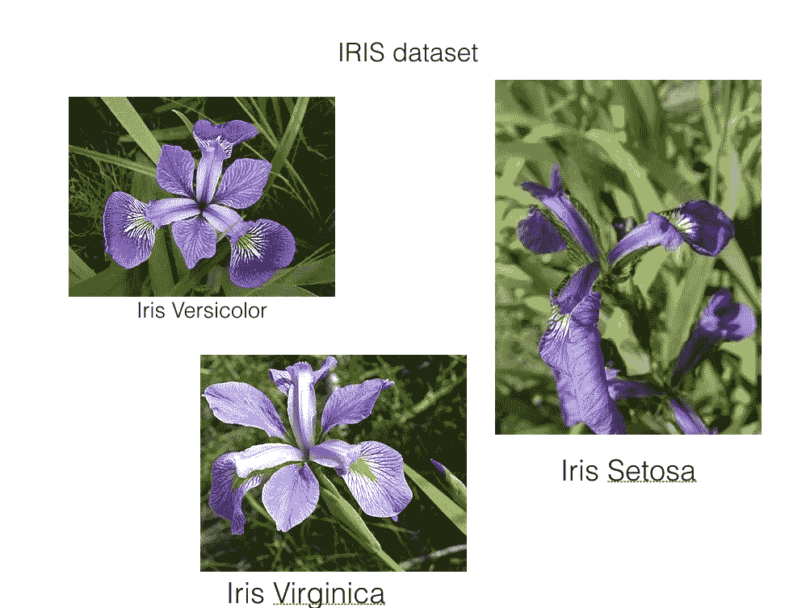
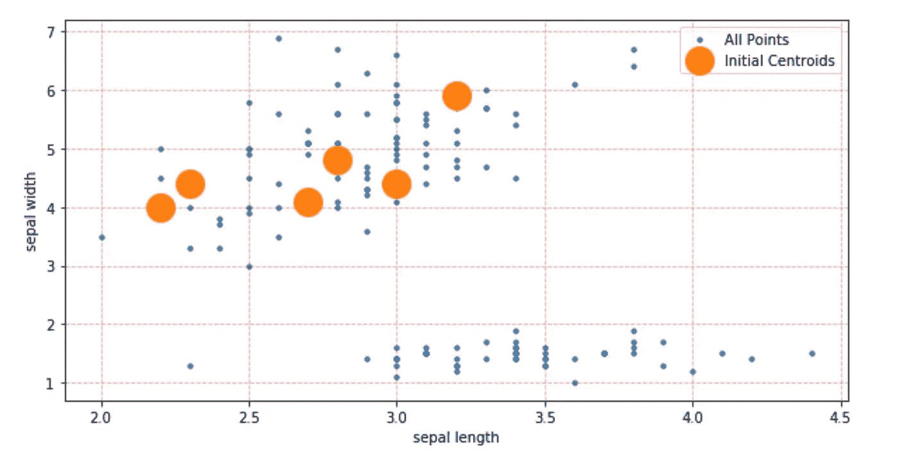
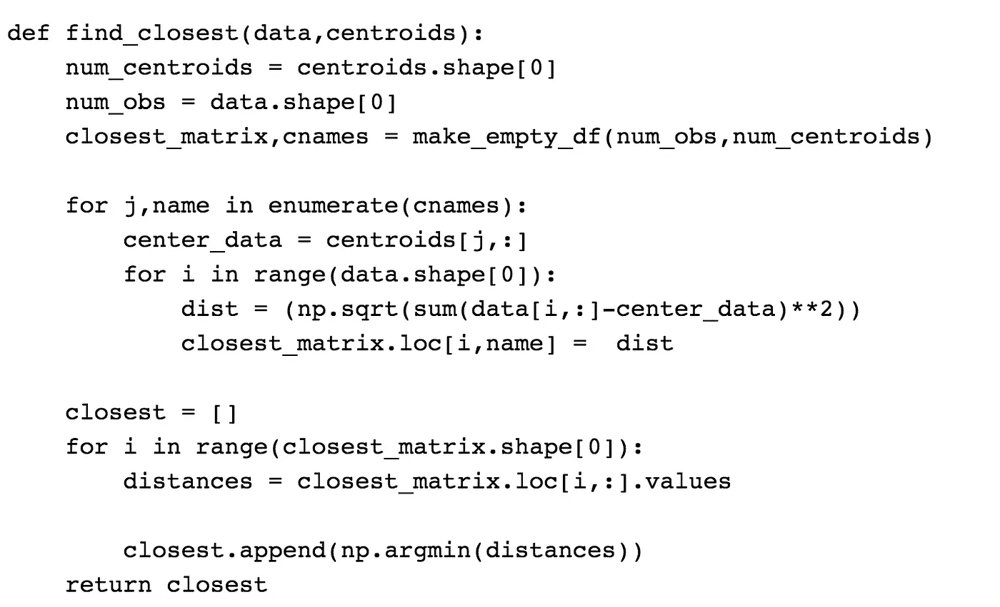
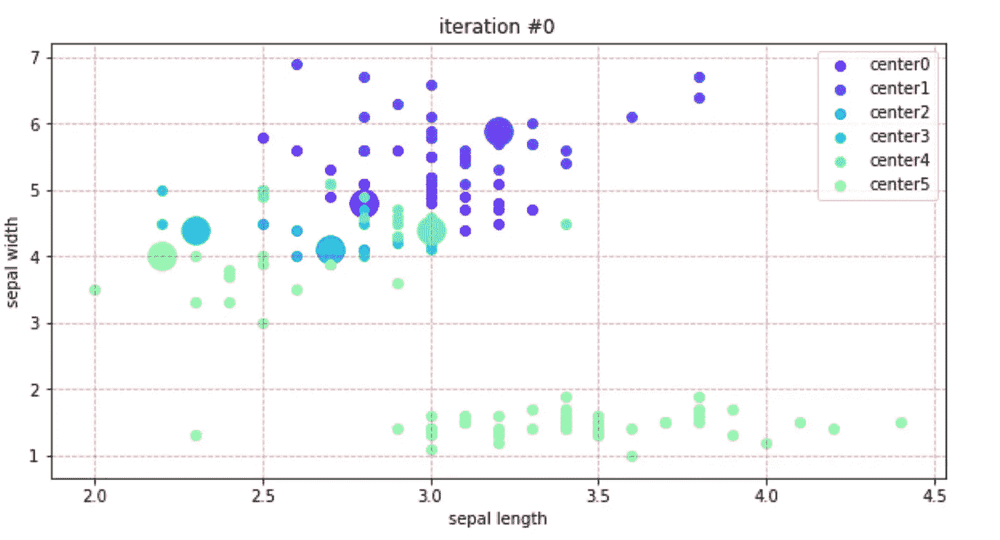
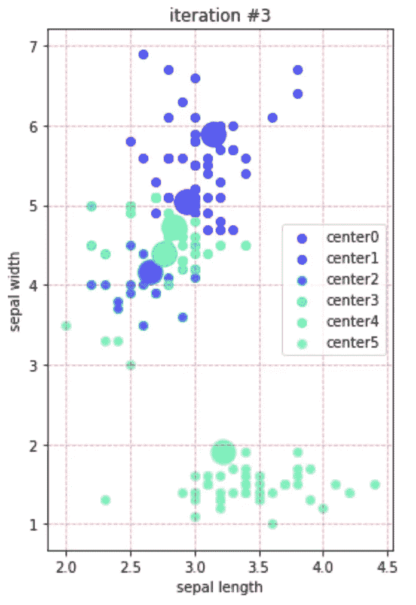
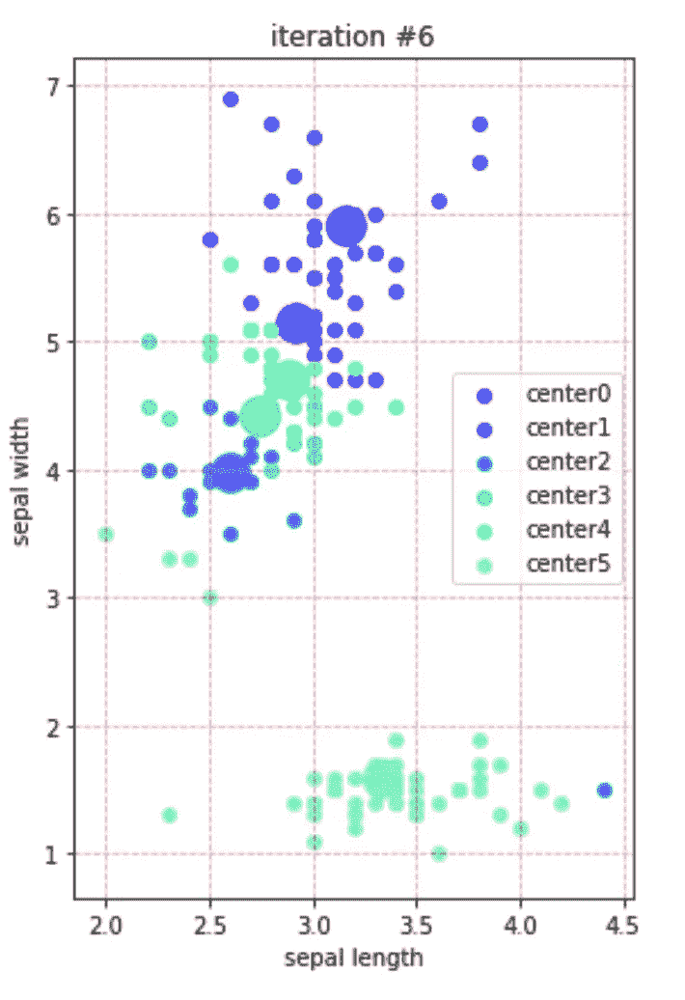
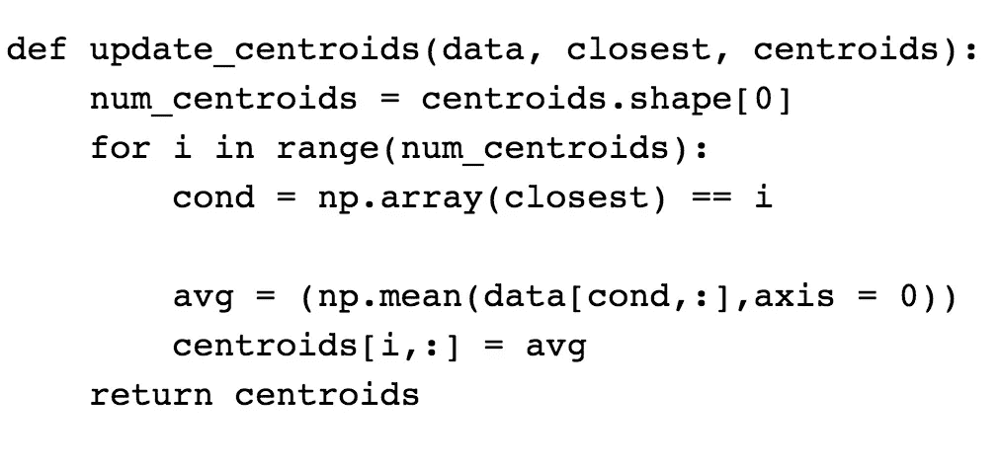
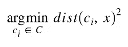

# 无监督机器学习

> 原文：<https://towardsdatascience.com/unsupervised-machine-learning-9329c97d6d9f?source=collection_archive---------8----------------------->

今天，我们就来看看一些无监督的机器学习吧！什么是无监督机器学习？

> **无监督学习**是[机器学习](https://en.wikipedia.org/wiki/Machine_learning)的一个分支，它从没有被标记、分类或归类的测试数据中学习。无监督学习不是对反馈做出反应，而是识别数据中的共性，并根据每个新数据中是否存在这种共性做出反应。备选方案包括[监督学习](https://en.wikipedia.org/wiki/Supervised_learning)和[强化学习](https://en.wikipedia.org/wiki/Reinforcement_learning)。

对我们来说，我们将举一个非常基本的例子，并试图理解这是如何工作的！我们将使用来自**sk learn**:[Iris 数据集的内置数据集！](https://archive.ics.uci.edu/ml/datasets/iris)

1.  萼片长度，单位为厘米
2.  萼片宽度，单位为厘米
3.  花瓣长度(厘米)
4.  花瓣宽度(厘米)
5.  类别:

*   刚毛鸢尾
*   彩虹鸢尾
*   海滨鸢尾

The Flowers in the Dataset

如果你还没有弄明白，这个数据集正在描述花！所以今天，我将用这个数据集直观地向你们展示无监督机器学习是如何工作的！

## **算法:**

我们将使用聚类算法:

> **聚类**是一种无监督学习的方法，是许多领域使用的统计数据分析的常用技术。在数据科学中，我们可以使用**聚类**分析，通过查看我们应用**聚类算法**时数据点属于哪些组，从我们的数据中获得一些有价值的见解。

特别是，我们将使用 K-Means

> Kmeans 是最流行的“聚类”算法之一。K-means 存储 k 个用于定义聚类的质心。如果一个点比任何其他质心更靠近特定聚类的质心，则该点被认为是在该聚类中。
> 
> K-Means 通过在(1)根据当前质心将数据点分配给聚类(2)根据当前数据点分配给聚类选择质心(作为聚类中心的点)之间交替来寻找最佳质心。

我将展示我们如何通过这个 K = 5 的算法。这是我们迭代 Kmeans 算法的第一步:

First iteration of Kmeans

现在我们有了这些集群，我们需要做几件事情:

1.  将最近的每个聚类分配给其最近的点
2.  通过平均所有聚类的位置来更新中心。

请注意我是如何绘制 2 个维度的，虽然有 4 个维度，但这给了我一个很好的视觉理解。

下面是更新每个中心的伪代码算法。

## 将初始聚类分配给它们最近的点

现在我们已经了解了我们的算法如何找到最近的点并将它们分配给聚类，让我们看看第一次迭代后的曲线图:

Assigning each cluster the closest points

在我们分配这些点之后，我们希望继续更新每个聚类，直到我们收敛于一个解决方案。我跳过了几次迭代，但是正如你所看到的，这些点收敛得非常快！

下面，我提供一些用于更新中心的伪代码！

Updated the centroids centers

**这是一个非常直观的算法示例，下面我为大家提供完整的算法**

## 完整的算法定义

*κ*均值聚类算法使用迭代优化来产生最终结果。算法输入是聚类数*κ*和数据集。数据集是每个数据点的特征集合。算法从对*κ*质心的初始估计开始，这些质心可以是随机生成的，也可以是从数据集中随机选择的。该算法然后在两个步骤之间迭代:

**1。数据分配步骤:**

每个质心定义一个聚类。在此步骤中，根据平方欧几里得距离，将每个数据点分配到其最近的质心。更正式地说，如果 *ci* 是集合 *C* 中质心的集合，那么每个数据点 *x* 被分配给一个基于

其中 *dist* ( )为标准( *L* 2)欧氏距离。设具有群集质心的每个*的数据点分配集为 *Si* 。*

**2。质心更新步骤:**

在这一步中，质心被重新计算。这是通过取分配给该质心簇的所有数据点的平均值来完成的。

该算法在步骤一和步骤二之间迭代，直到满足停止标准(即，没有数据点改变聚类，距离的总和最小化，或者达到某个最大迭代次数)。

这个算法保证收敛到一个结果。结果可能是局部最优(即，不一定是最好的可能结果)，这意味着用随机化的起始质心来评估算法的多次运行可能会给出更好的结果。

有问题吗？！请在评论中告诉我！一如既往，在 twitter 上关注更多精彩内容`@ElliottSaslow`