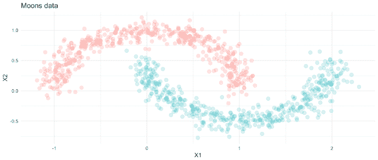
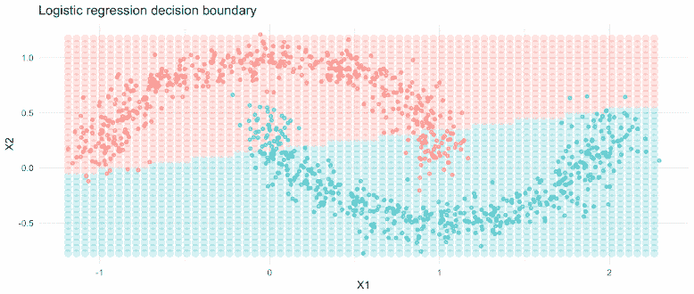
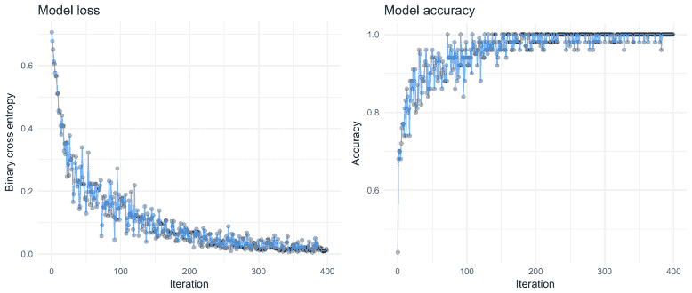
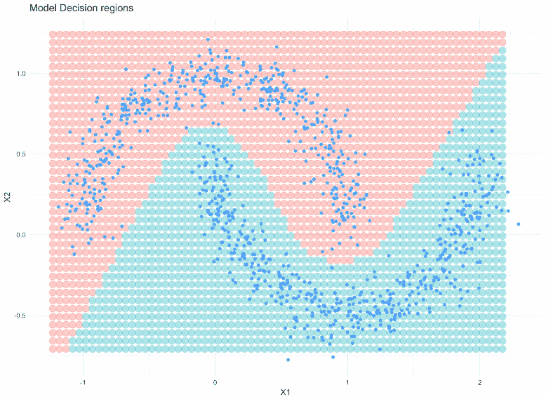

# PyTorch 启动和运行—迷你批处理、数据加载和模型构建

> 原文：<https://towardsdatascience.com/up-and-running-with-pytorch-minibatching-dataloading-and-model-building-7c3fdacaca40?source=collection_archive---------6----------------------->

我现在已经尝试了几个深度学习框架——tensor flow、Keras、MxNet——但是，PyTorch 最近成了我的首选工具。这并不是因为我认为它在客观上比其他框架更好，而是因为它感觉更简洁、直观，更适合我的学习和实验风格。

这篇文章介绍了 PyTorch，重点是构建一个简单的神经网络(前馈网络)来分离(即分类)一些玩具数据中的两个类。我的目标是介绍 PyTorch 的一些基本构建模块，同时强调深度学习如何用于学习非线性函数。这篇文章的所有代码都是这个 [github repo](https://github.com/conormm/pytorch_blogpost1) 。这是一个更实际的帖子，如果你正在寻找 PyTorch 内部工作的游览，我强烈推荐这个[帖子。](http://www.goldsborough.me/ml/ai/python/2018/02/04/20-17-20-a_promenade_of_pytorch/.)

为了跟进，确保您的机器上安装了 [PyTorch](https://pytorch.org/) 。请注意，我使用的是版本 0.3.1.post2，pytorch 的下一个版本(0.4)将引入一些突破性的变化(在这里[阅读它们](https://github.com/pytorch/pytorch/releases/tag/v0.4.0))。同样值得关注的是 [PyTorch 1.0 的发布，](https://pytorch.org/2018/05/02/road-to-1.0.html)它的目标是“生产就绪”——我对此非常兴奋！。

这篇文章的学习任务是二元分类问题——将点分类成半月形。对于深度学习模型来说，这是一个简单的任务，但它可以突出他们学习复杂的非线性函数的能力。

例如，如果我们使用逻辑回归对这些数据进行分类，看看会发生什么:

尽管对预测输出应用了 softmax 变换(将预测输出 logits 压缩到总和为 1)，但逻辑回归的参数是线性的，因此很难了解非线性关系。我们可以使用一个更高级的 ML 模型来完成这个任务，比如随机森林，但是这样我们就没有借口去玩神经网络了！

在构建模型之前，我们将首先创建一个定制的数据预处理器和加载器。在这个例子中，转换器将简单地把 X 和 y 从 numpy 数组转换成 torch 张量。然后，我们将使用 dataloader 类来处理数据如何通过模型传递。注意，我们必须为这个类定义 __len__ 和 __getitem__ 方法。

在这种情况下，我们将设置一个小批量例程。这意味着在每个时期，模型将对数据的小子集(批次)进行训练，也就是说，它将根据与每个小批次相关联的损失来更新其权重。这通常是比每个时期在完整数据集上训练更好的方法。使用较小的批次也是可取的——尽管这是一个超参数，所以要做实验！

# 定义模型

使用 PyTorch 定义深度学习模型的标准方法是将网络封装在一个类中。我非常喜欢这种方法，因为它确保所有的层、数据和方法都可以从单个对象访问。该类的目的是定义网络的体系结构，并管理通过网络的数据转发。为了定义模型，我们需要继承 nn.Module。

典型的方法是将层定义为变量。在这种情况下，我们定义一个单层网络。nn。线性函数需要输入和输出大小。在第一层中，输入大小是输入数据中特征的数量，在我们设计的例子中是两个，输出特征是隐藏层中神经元的数量。

输出层的输入是前一层中神经元的数量，输出是数据中目标的数量——在本例中是两个。

然后我们定义一个类方法`forward`来管理网络中的数据流。这里我们调用数据上的层，并在隐藏层上应用`relu`激活(来自 torch.nn.functional)。最后，我们对输出应用 sigmoid 变换，将预测值压缩为 1。

# 运行模型

接下来我们需要定义模型如何学习。首先我们从类中实例化一个模型对象，我们称之为`model`。接下来我们定义成本函数——在这种情况下是二进制交叉熵——更多信息请参见我之前关于[日志损失](https://conorsdatablog.wordpress.com/2018/03/03/log-loss-a-short-note/)的帖子。最后，我们定义我们的优化器，`Adam`。优化器将优化我们模型的参数，因此，`params`参数就是模型参数。

现在我们准备训练模型。我们将这样做 50 个时代。我已经对代码块进行了注释，以清楚地说明每个阶段发生了什么。我们设置了一个 for 循环来迭代数据(epoch ),每个 epoch 循环一次存储在`ds`中的小批 X 和 y，这是我们之前定义的。在每个循环中，我们制作输入和目标火炬`Variables`(注意，在 pytorch 的下一个版本中，这一步是不必要的，因为`torch.tensors`和`Variables`将被合并)，然后指定向前和向后传递。

正向传递使用模型参数来预测输出。在第一遍中，预测将接近随机，因为参数是用随机数初始化的。在这一步中，我们使用实例化的成本函数计算与模型相关的损失。

在正向传递中，我们使用模型来预测给定 X 的 y，计算损失(和准确度)。所以我们只是通过模型传递数据。在反向传递中，我们通过模型反向传播损失，并且`optimiser.step`根据学习率更新权重。

我们可以看到损失迅速减少(波动性可以用小批量来解释)，这意味着我们的模型正在工作——太棒了！您还可以看到模型学习的非线性决策区域。

此外，检查模型学习的决策区域:

很明显，神经网络可以学习数据的非线性特性！

# 摘要

这篇文章的目的是展示如何开始使用 pytorch 定义神经网络。这里定义的模型非常简单，但目的是突出构建模块。我也没有运行测试循环，所以我们不知道模型的测试性能。在我的下一篇文章中，我将定义一个更复杂的 pytorch 模型，敬请关注！

感谢阅读。

*原载于 2018 年 5 月 3 日*[*conorsdatablog.wordpress.com*](https://conorsdatablog.wordpress.com/2018/05/03/up-and-running-with-pytorch-minibatching-dataloading-and-model-building/)*。*