# 使用平衡数据升级您的图像分类器

> 原文：<https://towardsdatascience.com/upgrade-your-image-classifier-with-balanced-data-ddea93859c0f?source=collection_archive---------6----------------------->

## 预处理和分层如何对图像分类器的性能产生奇迹

FER

本文将带您了解数据管理技术，以完善图像分类器的机器学习模型，特别是面部情感识别。包含源代码的 R notebook 可以在 GitHub 链接[这里](https://github.com/nishnab/Machine-Learning-and-Data-Visualization-Projects)找到

在这个项目中，“面部情感识别”数据集，来自 Kaggle 竞赛 [**表征学习中的挑战:面部表情识别挑战**](https://www.kaggle.com/c/challenges-in-representation-learning-facial-expression-recognition-challenge/data) 被使用。该数据由 27000 幅训练图像(48×48 像素的面部几乎居中，使得所有面部在图像中的相等空间上延伸)和包含 9000 幅图像的测试集组成。这是一个分类任务，将每张图片分为七类(0 =愤怒，1 =厌恶，2 =恐惧，3 =快乐，4 =悲伤，5 =惊讶，6 =中性)。

我尝试了几种算法，包括最近邻、贝叶斯分类器、决策树和神经网络，为这项任务建立机器学习模型。但是，他们中没有一个人的回报率超过 30%。这让我想知道哪里出了问题，以及如何以不同的方式完成这项任务。最近我看到了一篇[文章](https://medium.com/neuralspace/kaggle-1-winning-approach-for-image-classification-challenge-9c1188157a86)，作者是[植物幼苗分类挑战赛](https://www.kaggle.com/c/plant-seedlings-classification)的一位顶级选手，文章建议读者在对图像进行分类之前，先处理不平衡的分类问题。

在这篇文章中，我将解释如何使用干净平衡的数据和可视化，用决策树算法构建一个更好的图像分类器。

**第一步:浏览数据**

在可视化数据集中每个类的分布时，我们知道数据集是严重不平衡的。

> 如果类不是近似相等的，则数据集被描述为不平衡的。[1]

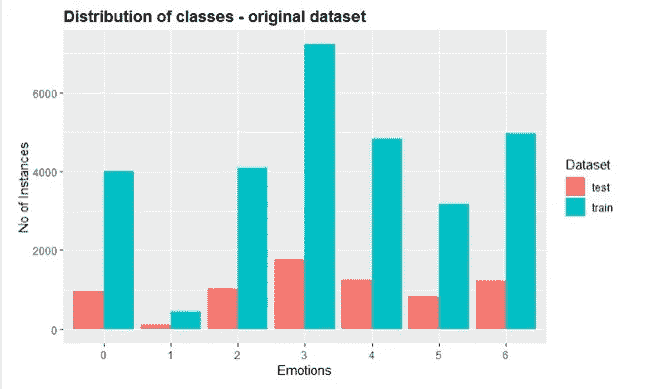

Distribution of classes

有超过 7000 张“快乐”的图片，而“厌恶”的图片不到 500 张。这将导致有偏差的分类器将大多数图像预测为多数类。

> 决策树和逻辑回归等流行算法偏向于数据集中的大多数类[2]

为了理解算法的复杂性，我应用了技术[t-分布式随机邻居嵌入](https://lvdmaaten.github.io/tsne/) (t-SNE)，这被认为是可视化高维数据的最佳方法。

> t-SNE 是一种用于相似性数据可视化的技术，能够保留数据的局部结构，同时也揭示一些重要的全局结构，例如多尺度的聚类[3]
> 
> t-SNE 通过在二维或三维地图中给出每个数据点的位置来可视化高维数据[3]

原始数据集的 tSNE 可视化向我们展示了数据的类结构。

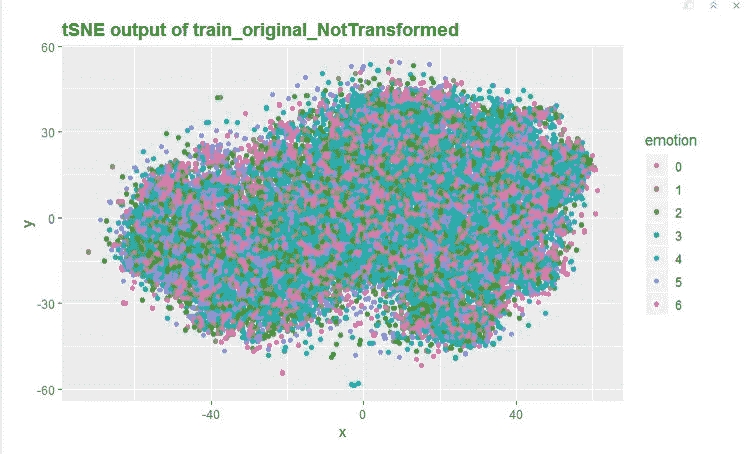

t-SNE Original Dataset

**第二步:分区**

下一步是将训练数据集划分为训练集和验证集。验证集将用于调整，最终模型将使用测试数据集进行评估

**第三步:创建基准分类器**

> 该基准为评估和比较从示例中学习的算法提供了基础。[4]

如果我们在这个阶段创建一个基准分类器，性能将低于 27 %。

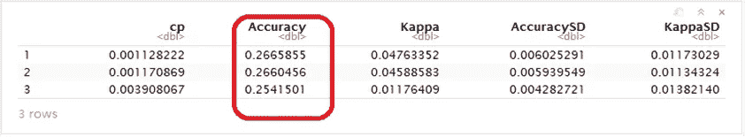

Benchmark Classifier Results

**第四步:数据预处理**

在可视化一个随机实例时，很明显图像是水平对齐的，并且还存在一些噪声作为背景。

> 预处理方法对从非受控环境中获取的图像进行归一化。[5]

因此，所有的图像首先旋转和裁剪，如下图所示。

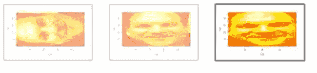

Fig: Sample Image (i) Original (ii) Rotated (iii) Cropped

然后将实例居中并缩放到范围{0.8，1.2}。变换前后每个像素中的值分布可以绘制为。

Distribution of values in each pixel

**步骤 5:特征提取**

这是一个拥有 2304 个特征的高维数据集。为了降低维数，我们可以使用最广泛使用的技术 PCA。

> 主成分分析(PCA)是一种统计过程，它使用正交变换将一组可能相关的变量(每个变量取不同数值的实体)的观察值转换为一组称为主成分的线性不相关变量的值。[6]

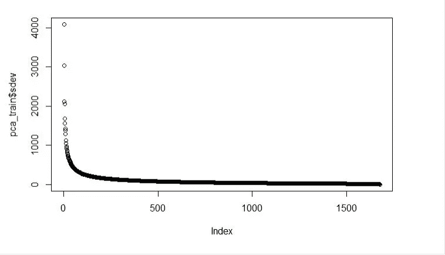

PCA Output

从主成分分析总结中可以清楚地看出，前 25 个主成分拥有超过 80%的数据。

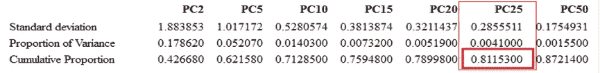

PCA Summary

主成分分析后的 tSNE 可视化明显更好，但大多数类别的映射有点接近，没有清晰地分类。

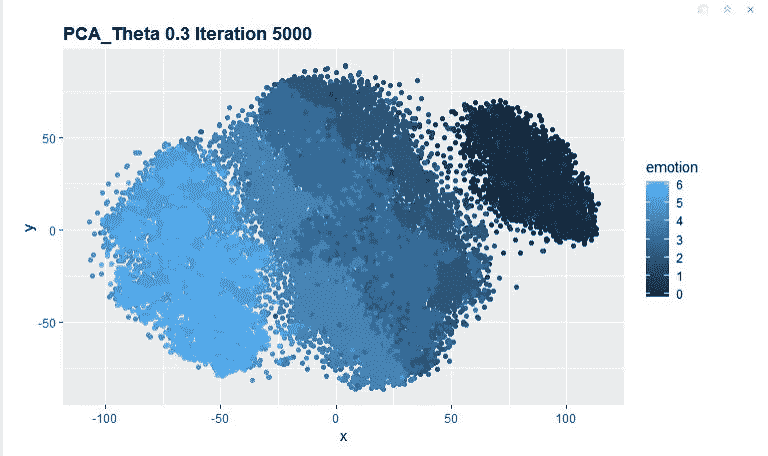

t-SNE PC 1–25

相同的预处理步骤和来自 PCA 的正交旋转被应用于验证数据和测试数据

**第五步:分层**

在这一步中，我们将处理训练数据中的不平衡类问题。

> SMOTE 是一种过采样方法，其中少数类通过创建“合成”样本进行过采样，而不是通过替换进行过采样[1]

少数类的合成过采样(SMOTE)和多数类的随机欠采样的组合将给出良好平衡的训练数据，该训练数据然后可用于构建执行得更好的分类器。从下面新列车数据的 tSNE 可视化中可以明显看出这一点

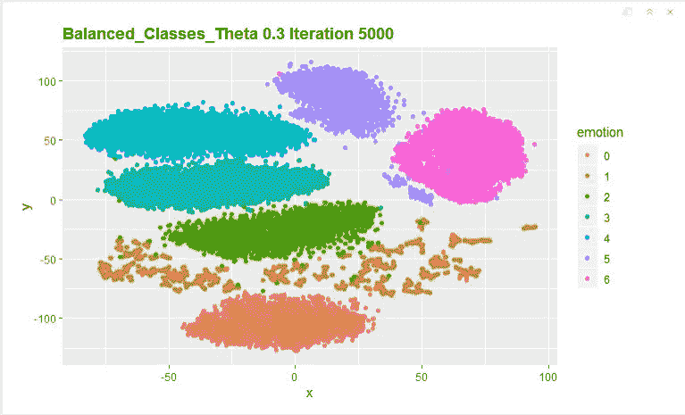

t-SNE Balanced Data

**第六步:分类**

我们使用准备好的训练数据建立分类器。从模型的混淆矩阵中，我们可以看到整体的准确率有所提高，接近 60 %。

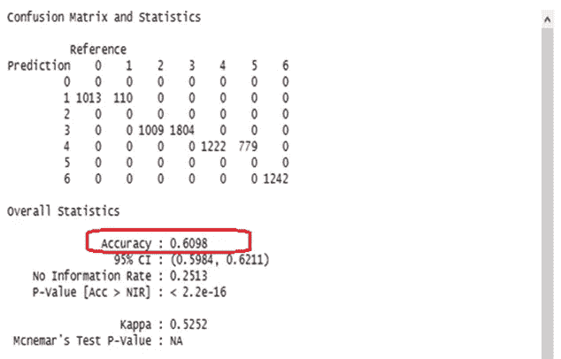

Confusion matrix — Classifier trained using the processed data

**第七步:超参数调整**

通过调整复杂性参数(cp ),我们可以减少相对误差，如下图所示

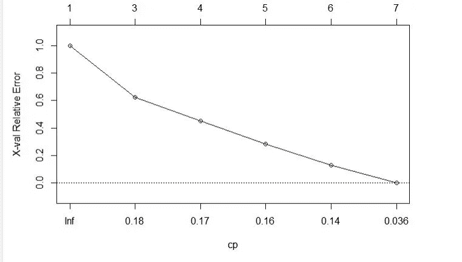

Variation in Relative error with complexity parameter

**第八步:建造最终模型**

最后一步是用调整后的参数(具有最小 Xval 相对误差的 cp 值)构建最终模型，并使用测试数据对其进行评估。

混淆矩阵统计表明，分类器的性能有了显著提高，总体准确率超过 90 %。灵敏度、特异性等其他性能指标也更好。

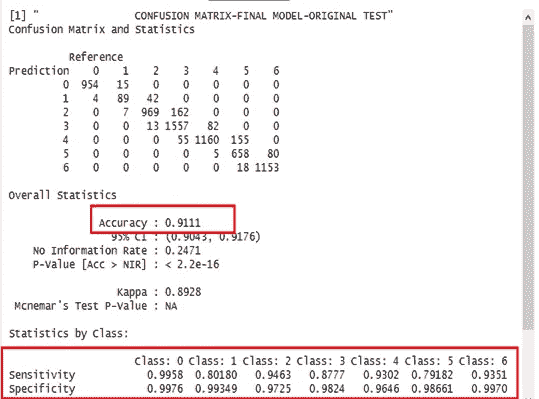

Confusion Matrix — Final model

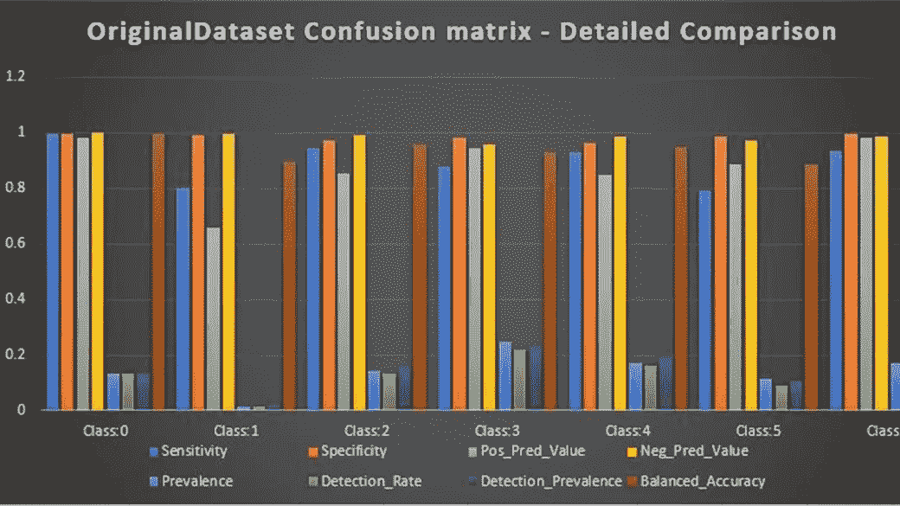

Other Performance metrics comparison for various classes

**结论**

预处理、降维和平衡数据集显著提高了决策树分类器的性能，从 27%提高到 91%。使用 tSNE 可视化高维数据可以让您更好地了解类的分布，这对于预处理可用于构建更好的分类器的数据非常有帮助。

**参考文献**

[1] N. Chawla，k .鲍耶，L. Hall 和 W. Kegelmeyer， [SMOTE:合成少数过采样技术](https://arxiv.org/pdf/1106.1813) (2002)，《人工智能研究杂志》，第 16 期，第 321–357 页。

[2]客博，[如何处理机器学习中的不平衡分类问题](https://www.analyticsvidhya.com/blog/2017/03/imbalanced-classification-problem) (2017)，【博客】Analytics Vidhya

[3] L. van der Maaten 和 G.Hinton，[使用 t-SNE 可视化数据](http://www.jmlr.org/papers/volume9/vandermaaten08a/vandermaaten08a.pdf) (2008)，《机器学习研究杂志》，第 9 期，第 2579-2605 页。

[4] Z. ZHENG，[分类器学习的基准](http://citeseerx.ist.psu.edu/viewdoc/download?doi=10.1.1.55.6219&rep=rep1&type=pdf) (1993)，澳大利亚人工智能联合会议。世界科学，第 281-286 页。

[5] M.G. Sumithra 和 P. Rajeswari，[A Survey:Pre Processing techniques for face Expression Recognition](http://www.aetsjournal.com/journal_issues/A_Survey:_Pre_Processing_techniques_for_Facial_Expression_Recognition.pdf)(2015)，《信息与通信工程应用国际期刊》第 1 卷:第 1 期:2015 年 1 月，第 47–51 页，第 1(1)卷，第 47–51 页。

[6]En.wikipedia.org，[主成分分析](https://en.wikipedia.org/wiki/Principal_component_analysis) (2018)，【在线】维基百科