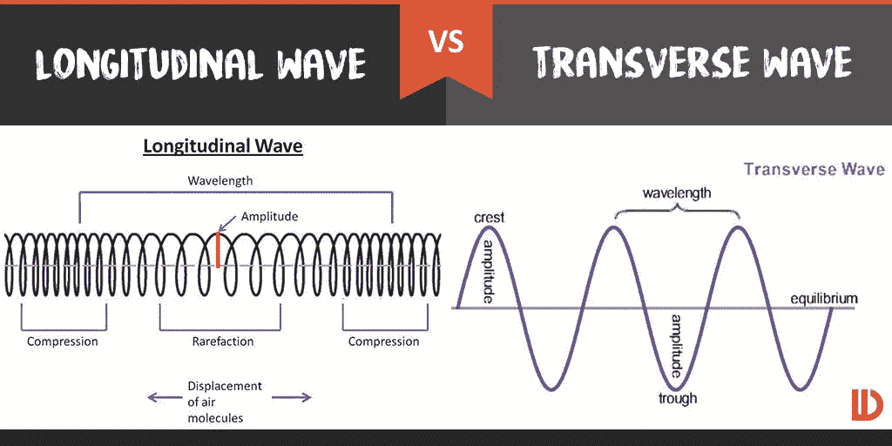
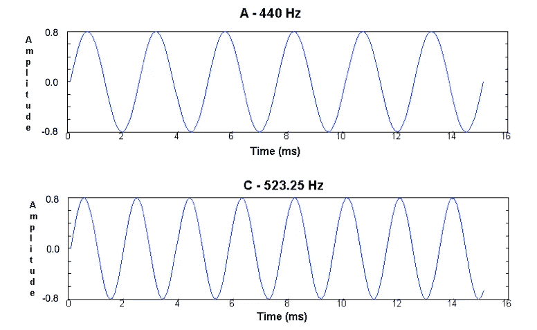
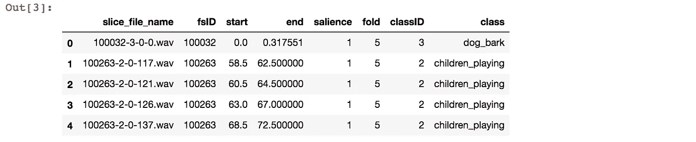
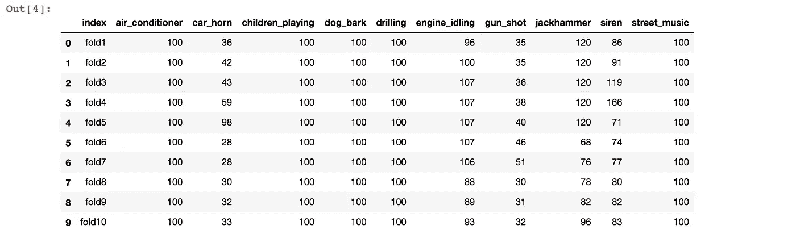
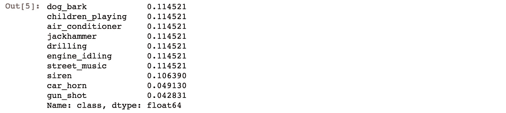
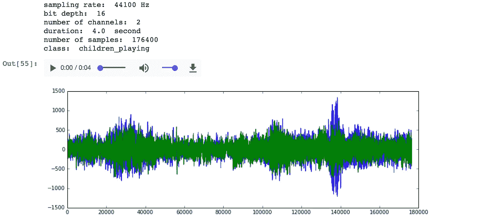
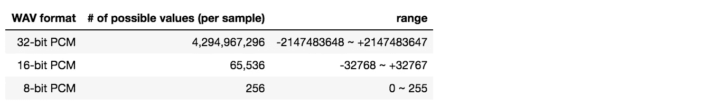

# 城市声音分类第 1 部分:声波、数字音频信号

> 原文：<https://towardsdatascience.com/urban-sound-classification-part-1-99137c6335f9?source=collection_archive---------3----------------------->


Photo by [Sora Sagano](https://unsplash.com/@sorasagano?utm_source=medium&utm_medium=referral) on [Unsplash](https://unsplash.com?utm_source=medium&utm_medium=referral)

距离我上次发帖已经有一段时间了。到目前为止，我主要写的是 NLP，但我应该承认，我的关注点非常狭窄。到目前为止，我已经写了 19 篇帖子，其中 13 篇是关于 NLP 的，更具体地说是情感分析。尽管它包含了许多次要任务来达到情感分类器的目标，但最终目标仍然是情感分析。当然，我离专家还差得很远，还有很多东西要学，但是为了让我的数据科学学习更加多样化，我转向了另一种类型的数据。

除了我将附上的简短代码块，你可以在这篇文章的末尾找到整个 Jupyter 笔记本的链接。

# 音频数据

在我尝试任何事情之前，我想做的第一件事是更好地了解这个新朋友。什么是声音？为了对我将要处理的数据有一个基本的了解，我必须先了解基础知识。

这种声音是耳朵可以听到的空气中的压缩和稀薄的声音。声音是空气的运动。通常以波形表示，显示空气粒子随着时间的推移来回移动的情况。垂直轴表示空气如何相对于零位置向前或向后运动。横轴表示时间。

以上解释摘自 [Youtube 视频](https://youtu.be/yWqrx08UeUs)。他很好地解释了声音、采样和奈奎斯特定理。但是等等，声音的波形看起来是上下移动，但是他说的是前后移动。我错过了什么？老实说，我在这里花了很长时间来理清头绪。可能是基础物理，但我在学校期间并没有太关注物理课。我从没想过这件事会回来困扰我。

从这里开始，这将是一个介绍性物理的回顾，所以如果你已经熟悉它，你可能会发现这篇文章的内容有点太基础了。

我们经常听到一个术语“声波”，是的，声音是一种波。那什么是“波”呢？波是振动，它将能量从一个地方转移到另一个地方，而没有物质被转移。根据波的不同特性，存在不同种类的波。这里我就说其中的两种:横波和纵波。



Image courtesy of [www.difference.wiki](https://www.difference.wiki/longitudinal-wave-vs-transverse-wave/)

横波是一种介质粒子在垂直于能量传输方向的方向上移动的波。你可以想象一根拉伸的绳子，通过一端上下移动来发送波。纵波是一种波，其中介质的粒子在平行于能量传输方向的方向上移动。从上图可以想象，slinky 就是一个例子。在拉伸 slinky(一端固定)的情况下，如果您握住 slinky 的另一端并来回移动 slinky，这将传递一个看起来类似于上图左侧的波浪。

横波的一个例子是水，纵波的一个例子是声音。然后我就迷茫了。好的，我现在知道声音是纵波，但是为什么我看到所有的声音曲线看起来都像横波？



你可能看过上面的图。在上图中，A、C 是音高，440HZ、535.25HZ 是它们的频率。经过大量的谷歌搜索，我终于找到了。顺便说一句，如果这对你来说太初级了，我很抱歉。但对我来说，这是一个灵光乍现的时刻。

> 对该图的不正确理解是，当空气分子从声音发出的地方到声音被听到的地方穿越空间时，它们会上下运动。这就好像一个特定的分子从声音的源头开始，最后到达听者的耳朵里。这不是声波图中所描绘的。从声源传到听者耳朵的是能量，而不是空气分子本身。

当我们听到声音时，我们不会像风一样让空气分子撞击我们的耳朵。我们只是听到声音，那是因为空气是传输能量(声音)的介质，而介质本身并没有被传输。因此，我们从声波图中看到的波不是绘制空气的上下运动，而是绘制空气粒子的压缩和稀薄。声波图中看起来像波峰的实际上是空气分子靠得很近的压缩，看起来像波谷的实际上是稀疏，空气分子更分散。按照同样的逻辑，看起来像平衡(y 轴上的 0)的是声音产生之前的环境压力。

# 数据集:UrbanSound8K

有了对声音和声波图的基本理解，我们可以看一看我们的数据集。数据集名为 Urbansound8K。

[https://serv . cusp . NYU . edu/projects/urban sound dataset/urban sound 8k . html](https://serv.cusp.nyu.edu/projects/urbansounddataset/urbansound8k.html)

您可以找到有关如何绘制类和收集数据的更多信息，但为了让您对数据有一个简短的概述，“此数据集包含来自 10 个类的 8732 个带标签的声音摘录(< =4s):空调、汽车喇叭、儿童玩耍、狗叫、钻孔、发动机空转、枪击、手提钻、警笛和街头音乐

根据原始论文，声音节选自 www.freesound.org，并且已经预先整理成十叠以供交叉验证。

让我们先来看看元数据。

```
import pandas as pd
import numpy as npdata = pd.read_csv("UrbanSound8K/metadata/UrbanSound8K.csv")
data.shape
```


```
data.head()
```



元数据包含 8 列。

*   切片文件名:音频文件的名称
*   fsID:从中提取摘录的录音的 FreesoundID
*   开始:切片的开始时间
*   结束:时段的结束时间
*   显著性:声音的显著性等级。1 =前景，2 =背景
*   文件夹:该文件被分配到的文件夹编号(1–10)
*   classID:
    0 =空调
    1 =汽车喇叭
    2 =儿童玩耍
    3 =狗叫
    4 =打钻
    5 =发动机空转
    6 =枪火
    7 =手提钻
    8 =汽笛
    9 =街头音乐
*   类别:类别名称

音频数据已经被切片和摘录，甚至分配到 10 个不同的文件夹。一些摘录来自相同的原始文件，但不同的切片。如果来自某个记录的一个切片在训练数据中，而来自同一记录的不同切片在测试数据中，这可能会错误地增加最终模型的准确性。由于最初的研究，这也已经通过将切片分配到折叠中来处理，使得来自相同自由声音记录的所有切片进入相同的折叠中。

现在让我们看看每个折叠的类分布，看看数据集有多平衡。

```
appended = []
for i in range(1,11):
    appended.append(data[data.fold == i]['class'].value_counts())

class_distribution = pd.DataFrame(appended)
class_distribution = class_distribution.reset_index()
class_distribution['index'] = ["fold"+str(x) for x in range(1,11)]
class_distribution
```



好的，看起来数据集不是完全平衡的。我们来看看总余额。

```
data['class'].value_counts(normalize=True)
```



与其他 8 个类别相比，有两个类别(汽车喇叭，枪支射击)的条目数量略少于一半。它看起来并不严重不平衡，所以目前，我已经决定不考虑这两个少数民族类的任何数据增加。

下面我定义了两个函数，首先获取 WAV 文件的完整路径名及其标签，然后用附加信息绘制波形，还可以用音频播放器播放声音文件。在我进入任何细节之前，让我们先绘制一个声音文件，看看它显示了什么。

```
fullpath, label = path_class('100263-2-0-117.wav')
wav_plotter(fullpath,label)
```



我已经简要地提到了声波的特征，但是我仍然没有看到数字音频信号的概念。没有对数字信号的理解，就很难理解所有这些信息的含义(采样率、比特深度等)。因此，请允许我绕道谈谈数字音频的基础知识。同样，如果这对你来说太初级，请随意跳过。

## 采样率、位深度

音频信号是连续的模拟信号，计算机不可能处理这种连续的模拟数据。它首先需要被转换成一系列的离散值，而“采样”就是这样做的。“采样率”和“位深度”是离散化音频信号时最重要的两个要素。在下图中，你可以看到它们与模数转换的关系。在图中，x 轴是时间，y 轴是振幅。“采样率”决定了采样的频率，“位深度”决定了采样的详细程度。


我们以 CD 为例。正常情况下，CD 的采样率为 44.1khz，深度为 16 位。首先，44.1khz 的采样率告诉我们每秒采样 44100 次。16 位告诉我们，任何样本都可以从与其幅度相对应的 65，536 个值中选取一个值。与 8 位相比，16 位的采样比 8 位的采样详细 256 倍。顺便说一下，如果你想知道为什么 CD 有 44.1khz 的采样率，我推荐我上面提到的同一个 Youtube 视频。它将让您对采样、混叠和奈奎斯特定理有一个直观的了解。



通道的数量告诉我们有多少个通道。当使用 2 个声道时，我们称之为立体声，当只使用一个声道时，我们称之为单声道。当然，单声道声音可以用多个扬声器播放，但它仍然是通过扬声器播放的信号的完全相同的副本。另一方面，立体声是用同一音频信号的两个不同输入通道录制的。我们通常看到的是左右立体声，这给了我们方向性、透视性和空间感。

现在我们有了一些重要的拼图来理解 WAVav 文件的元数据告诉我们什么。


采样率与 CD 质量相同，44.1khz，位深度也与 CD 质量相同。是立体声，从剧情上也能看出来。绿色表示一个通道，而蓝色表示另一个通道。这是一个 4 秒钟的剪辑。由于采样率为 44.1khz，持续时间为 4 秒，我们可以很容易地将 44100 乘以 4 计算出数据中的样本数，即 176400。

但坏消息是。再看一下 Urbansound8K 上的信息，有一条备注写着“WAV 格式的 8732 个城市声音的音频文件(见上面的描述)。采样率、位深度和声道数与上传到 Freesound 的原始文件相同(因此可能因文件而异)。”

啊哦。这意味着数据中可能有许多不同的采样率，这意味着即使持续时间相同，样本数量也会不同。这听起来不适合用来建立模型。此外，不同的位深度意味着它们可以取不同的取值范围。其中一些可能是立体声，而另一些是单声道。这听起来也不太好。

我花了大部分时间来复习声音信号的基本概念。在下一篇文章中，我将继续我的声音数据准备之旅，希望会涉及更多的编码。

感谢您的阅读。你可以从下面的链接中找到代码的 Jupyter 笔记本。

[https://github . com/tthustlea/urban _ sound _ class ification/blob/master/urban _ sound _ class ification _ part 1 . ipynb](https://github.com/tthustla/urban_sound_classification/blob/master/urban_sound_classification_part1.ipynb)