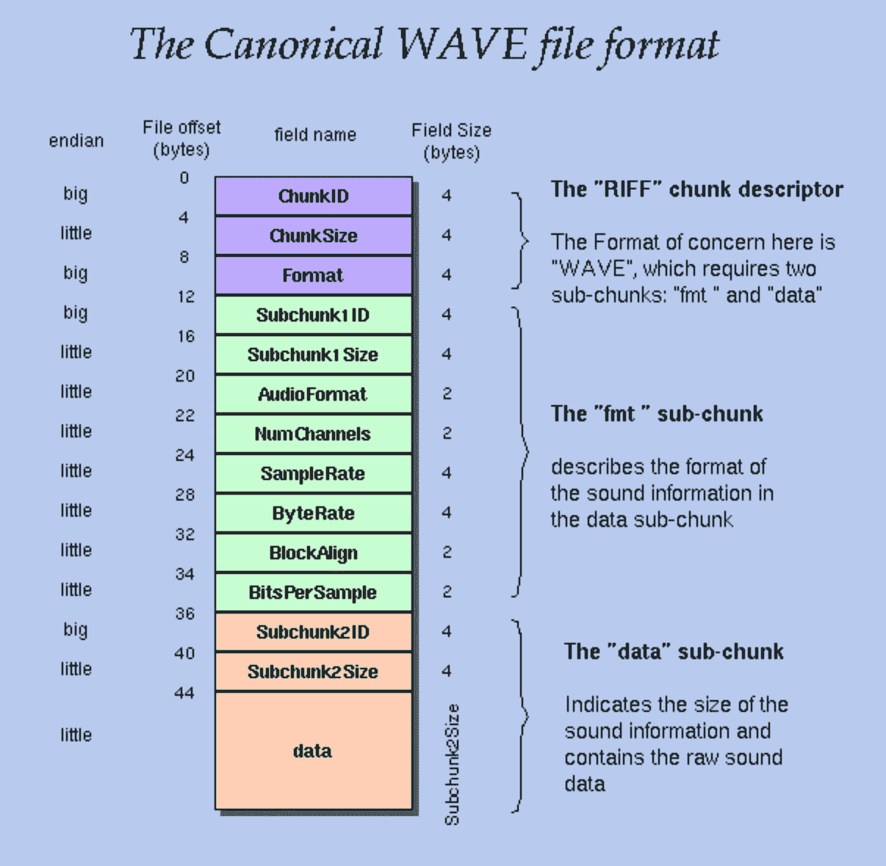
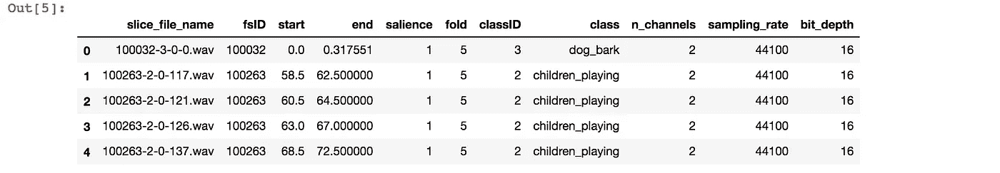
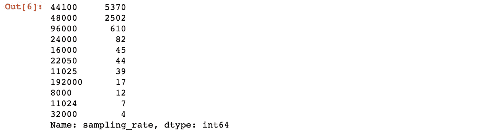
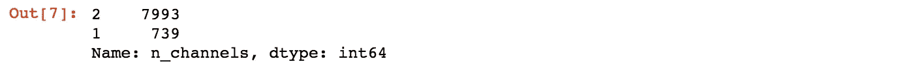
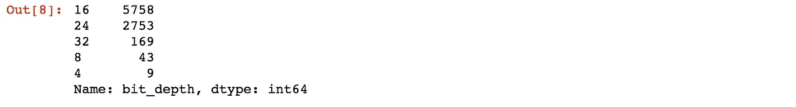
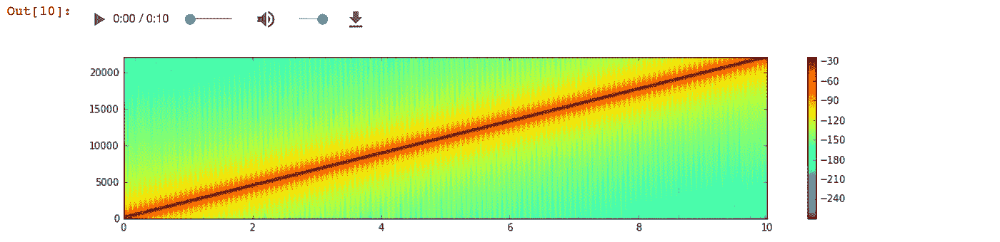
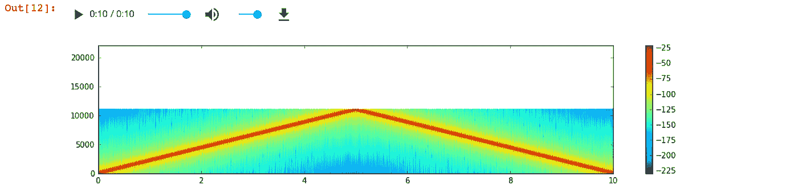
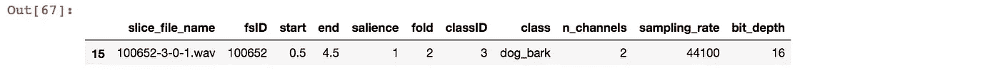
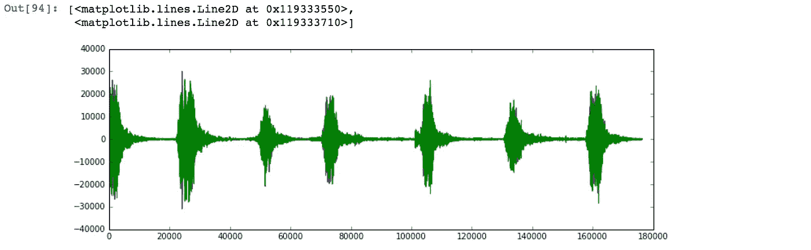
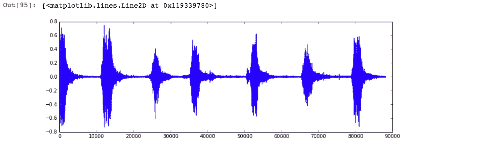

# 城市声音分类第 2 部分:采样率转换

> 原文：<https://towardsdatascience.com/urban-sound-classification-part-2-sample-rate-conversion-librosa-ba7bc88f209a?source=collection_archive---------3----------------------->


Photo by [Thomas Ribaud](https://unsplash.com/@tohopic?utm_source=medium&utm_medium=referral) on [Unsplash](https://unsplash.com?utm_source=medium&utm_medium=referral)

这是我正在进行的城市声音分类项目的第二部分。你可以从下面的链接找到以前的帖子。

*   [第一部分:声波、数字音频信号](/urban-sound-classification-part-1-99137c6335f9)

在上一篇文章的结尾，我刚刚意识到数据中的声音文件可能会有不同的采样率、位深度、不同文件的声道数。首先，让我从每个声音文件中提取这些信息，看看分布情况如何。

*除了简短的代码块之外，我还会在本文末尾附上整个 Jupyter 笔记本的链接。

## 声音数据格式调查

我在之前的帖子中没有解释清楚，但是在 WAVE 文件中，不仅有采样的声音数据，还有所有关于数据格式的信息。下图显示了 WAVE 文件中可用的信息类型。



Image courtesy of [http://soundfile.sapp.org/doc/WaveFormat/](http://soundfile.sapp.org/doc/WaveFormat/)

除了我在上一篇文章中定义的 path_class(从每个文件名构建完整的路径名)函数之外，我还将添加一个函数 wav_fmt_parser，以便从每个 WAVE 文件中提取我需要的三种信息，通道数、采样率、bit_depth。

现在，我们可以使用 wav_fmt_parser 函数向数据框添加额外的信息，以查看数据集中存在哪种不同的数据类型，以及它们是如何分布的。

```
wav_fmt_data = [wav_fmt_parser(i) for i in data.slice_file_name]
data[['n_channels','sampling_rate','bit_depth']] = pd.DataFrame(wav_fmt_data)
data.head()
```



```
data.sampling_rate.value_counts()
```



```
data.n_channels.value_counts()
```



```
data.bit_depth.value_counts()
```



从上面来看最令人担忧的是采样率。通道数可以通过仅从一个通道提取数据，或者取两个通道值的平均值来准备。比特深度是每个样本可以取的值的范围的问题，直觉上感觉可以通过考虑比特深度内它可以取的最大值和最小值来归一化这些值来准备。(警告:这只是我的直觉，我可能漏掉了一些陷阱。我越来越多地阅读和了解 DSP，我发现事情并不像我想象的那么简单)

## 采样率转换

我做采样率转换的原因是为了转换数据，使它们都具有相同的形状，并且易于用机器学习模型进行处理。但在现实生活中，采样率转换的用例要多得多。例如，典型的录音室录音音频为 192khz，要将此录音制作成 CD，应重新采样为 44.1khz 的 CD 采样率，不同的媒体可能有不同的采样率要求(DVD 的采样率为 48khz)。

我们看到大部分数据的采样速率为 44.1khz。假设我们想将数据重采样到 22.05khz，为什么呢？44.1khz 的音频质量更好，但对于声音分类来说，22.05khz 足以捕捉声音的差异。如果每个数据的大小变成其原始大小的一半，我们的模型将会更快。数据集中还存在其他采样速率，但首先让我们考虑最简单的情况，将音频从 44.1khz 重新采样至 22.05khz。

乍一看，这似乎并不复杂。22.05 正好是 44.1 的一半，由于采样率意味着从原始声音中获取样本的频率，感觉我们可以跳过每隔一个样本来获得原始采样率的一半。不要！我会告诉你当你这么做的时候会发生什么。

例如，让我们创建一个简单的正弦扫描。正弦扫描是一种信号，其频率随时间从起始频率变化到结束频率。如果我们创建一个起始频率为 20hz、结束频率为 22.05khz 的正弦扫描，持续 10 秒钟，我们可以听到音调随着时间的推移而增加的声音。

```
from scipy.signal import chirp
import soundfile as sffs = 44100
T = 10
t = np.linspace(0, T, T*fs, endpoint=False)w = chirp(t, f0=20, f1=22050, t1=T, method='linear')
sf.write('sine_sweep_44100.wav', w, fs)plt.figure(figsize=(15,3))
plt.specgram(w, Fs=44100)
plt.colorbar()
_=plt.axis((0,10,0,22050))
ipd.Audio('sine_sweep_44100.wav')
```



上面你看到的是正弦扫描的[频谱图](https://en.wikipedia.org/wiki/Spectrogram)，x 轴是时间，y 轴是频率。通过播放实际的音频文件，你可以很容易地猜出声谱图显示的是什么。
它显示了随时间变化的频谱。由于我们的正弦扫描从 20hz 开始，您可以看到开始时红线从低电平开始，然后它的音调上升，直到达到 22.05khz。

如果我们简单地跳过每隔一个样本，将采样速率减半，会怎么样？

```
down_sampled = w[::2]
sf.write('sine_sweep_downsampled.wav', down_sampled, 22050)plt.figure(figsize=(15,3))
plt.specgram(down_sampled, Fs=22050)
plt.colorbar()
_=plt.axis((0,10,0,22050))
ipd.Audio('sine_sweep_downsampled.wav')
```



刚刚发生了什么？？音调不再持续增加，而是先增加后减少。我唯一做的是跳过每隔一个样本，但我没有改变其他任何东西。

为了解释发生了什么，我们需要理解[奈奎斯特采样定理](https://en.wikipedia.org/wiki/Nyquist%E2%80%93Shannon_sampling_theorem)。根据奈奎斯特定理，采样速率的一半，即奈奎斯特极限，是可以精确表示的最高频率成分。因此，在采样速率为 22.05khz 的信号中，它可以代表的最高频率为 11.025khz，但我们的原始正弦扫描频率(音高)增加到 22.05khz，因此所有那些无法用 22.05khz 采样速率(频谱范围为 11.025khz 至 22.05khz)表示的额外能量都进入了负频率，并产生了递减的正弦扫描。

在这种情况下，信号首先需要通过低通滤波器进行转换，然后每隔一个样本进行选择。取决于两个采样率的比率，这将使事情变得更加复杂。此外，在上采样的情况下，我们可能需要插值来获得原始采样信号中不包含的样本。

我之所以举上述例子，是为了向您展示在处理数字信号数据时的一些注意事项。但是这篇文章的目的不是为采样率转换创建一个新的包。那我们该怎么办？幸运的是，我们已经有了一个名为 [Librosa](https://librosa.github.io/librosa/index.html) 的很棒的库，它会为我们完成所有的转换，万岁！(Librosa 中实际的采样率转换部分由[重采样](https://resampy.readthedocs.io/en/stable/)默认完成，或者由 [Scipy 的重采样](https://docs.scipy.org/doc/scipy/reference/generated/scipy.signal.resample.html)完成)

## 利布罗萨

现在让我们从数据集中选择一个文件，用 Librosa 和 Scipy 的 Wave 模块加载同一个文件，看看它有什么不同。

```
data[data.slice_file_name == '100652-3-0-1.wav']
```



默认情况下， [Librosa 的加载函数](https://librosa.github.io/librosa/generated/librosa.core.load.html)会将采样率转换为 22.05khz，同时将通道数减少到 1(单声道)，并对数据进行归一化，使值的范围从-1 到 1。

```
import librosa
fullpath,_ = path_class('100652-3-0-1.wav')
librosa_load, librosa_sampling_rate = librosa.load(fullpath)
scipy_sampling_rate, scipy_load = wav.read(fullpath)
print('original sample rate:',scipy_sampling_rate)
print('converted sample rate:',librosa_sampling_rate)
print('\n')
print('original wav file min~max range:',np.min(scipy_load),'~',np.max(scipy_load))
print('converted wav file min~max range:',np.min(librosa_load),'~',np.max(librosa_load))
```


```
plt.figure(figsize=(12, 4))
plt.plot(scipy_load)
```



```
plt.figure(figsize=(12, 4))
plt.plot(librosa_load)
```



通过绘制从同一个源声音文件加载的两个数据，我们可以看到 Librosa 加载的数据已经减少到单声道(图上只有一条彩色线)，而原始数据有两个声道(一个声道为绿色，另一个为蓝色)。

你猜怎么着。我对每种数据都有不同的采样速率、通道数量和不同的取值范围的所有担忧，都通过用 Librosa 加载声音数据完美地解决了！

我可以从一开始就使用 Librosa，甚至不用担心这些不同类型的 wave 文件格式，但通过研究 Librosa 在加载声音文件时实际上在做什么，现在我对不同的声音数据类型有了更好的理解，它们意味着什么。

我想我现在对我正在处理的数据有了很好的理解，接下来是有趣的部分，机器学习。在下一篇文章中，我将最终开始模型构建的第一阶段:特征提取。

感谢您的阅读。你可以从下面的链接中找到代码的 Jupyter 笔记本。

[https://github . com/tthustlea/urban _ sound _ class ification/blob/master/urban _ sound _ class ification _ part 2 . ipynb](https://github.com/tthustla/urban_sound_classification/blob/master/urban_sound_classification_part2.ipynb)