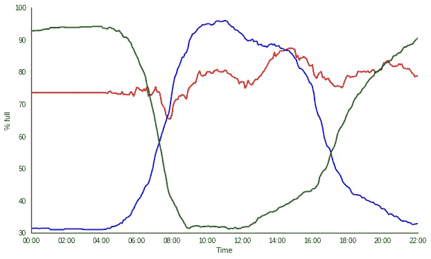

# 都柏林自行车站的使用模式

> 原文：<https://towardsdatascience.com/usage-patterns-of-dublin-bikes-stations-484bdd9c5b9e?source=collection_archive---------5----------------------->

Locations of all Dublin Bike stations colour coded by their weekday usage patterns. [Click here for the full interactive map](https://jameslawlor.github.io/dublin-bikes-timeseries-analysis/map.html).

自从我 5 年前来到这里，我已经是都柏林自行车的长期用户了，像许多其他用户一样，我有一个关于一天中不同时间哪个车站繁忙或安静的心理模型。我最近的车站是波多贝罗，我发现在上午 10 点左右很难找到自行车，但是步行到镇上，我找到自行车的机会就会大大增加。我想更详细地了解这一点，并找出是否有一些不同的行为类型，所有的车站都可以分类，以及这在城市中可能如何变化。自行车主要用于上下班，因此出现某种空间模式似乎是很自然的。正如你在上面的地图上看到的，我们可以把这些站分成三种不同的行为类型，我们得到了一些非常有趣的结果！

在这篇文章中，我将更多地解释我做了什么，这些模式是什么，以及一些技术背景。因为我这篇文章的目标读者是普通读者以及更多的技术人员，所以我将首先讨论这些发现，把技术方法留到后面。你也可以[点击这里获得上面显示的完整交互地图](https://jameslawlor.github.io/dublin-bikes-timeseries-analysis/map.html)和[点击这里获得 github repo](https://github.com/jameslawlor/dublin-bikes-timeseries-analysis) ，在这里我已经公开了我的代码和一些示例数据。

# 有哪些模式，它们是如何被发现的？

从 2017 年 1 月到 2017 年 8 月，我每隔 2 分钟从[公共 API](https://api.citybik.es/v2/) 收集数据，以建立一个规模相当大的历史数据集，从中我们可以计算出 108 个站点中每个站点的典型工作日使用情况。这将平均化雨天、冷天、特殊事件等的影响。由此，我们可以找到不同的行为模式，我们可以将每个站配置文件分类。为了做到这一点，我使用了一种叫做 k-means 聚类的方法，这种方法的工作原理是预先假设我们的数据可以分成“k”个不同的类别。然后，该算法试图找到描述数据分段的“k”个最佳平均模式。在我们的例子中，我选择了 k=3，因为它给出了美学上令人愉悦的结果，尽管像轮廓评分这样的方法更严格。我希望将我 2017 年 10 月在都柏林 PyData 发表的一篇演讲放到网上，这篇演讲用更多的技术细节解释了这一点。然后根据与三个简档最接近的匹配对每个电台进行分类。我们可以自由选择更高的值，但是由于可能类别的数量不断增加，结果变得更加复杂，但是我们希望行为特征更符合实际数据。

我用颜色标记了用这种方法发现的每一种不同的行为，并绘制在下图中。回想一下，这些是使用每个站的平均工作日使用量找到的，所以一天中的时间是沿着 x 轴的。我还使用了每个站点的百分比容量，而不是原始的自行车数量，来处理一些站点的容量高于其他站点的事实。

Average weekday usage for the three types of stations

显而易见，最接近绿线的车站通常用于早上进城到蓝色车站的通勤，因此我们自然会认为绿色车站位于住宅区，蓝色车站位于市中心。晚上，当人们下班回家时，情况正好相反。红色加油站一天有稳定的供应，不符合其他两种行为。

当我们在地图上绘制车站并按类别用颜色编码时，一幅非常有趣的画面出现了，如上面的图片所示(或者[点击此处打开互动地图的标签](https://jameslawlor.github.io/dublin-bikes-timeseries-analysis/map.html))。通过仅根据站点的使用模式来表征站点，我们可以看到这也导致了高度的空间聚类。虽然这是你期望看到的，但我对集群的清晰程度感到惊讶——蓝色站集中在都柏林 2 区周围，那里有许多商业办公室，与中间的红色站接壤，绿色站在市中心以外的更多住宅区。

# 方法学

为了收集数据，我写了一个简短的 Python 脚本，在我的 Raspberry Pi 上运行，每 2 分钟查询一次 Dublin Bikes API，并附加到一个每日 CSV 文件中，然后每晚将这个 CSV 文件转储到 S3 桶中。我从 2017 年 1 月开始运行这个，直到 8 月下旬，我终于再次想起了这个项目的想法。

如前所述，我然后计算了 108 个站点中每个站点的平均工作日概况，然后使用 k-means 聚类来确定三个原型行为类别，我将根据这些类别对每个站点进行分类。我使用欧几里德距离来确定不同时间序列的相似性，这有点简单，一般不推荐用于时间序列数据。我认为这个问题很简单，只有 3 种行为类型，尽管有这个假设，我对我的结果很满意。如果需要更鲁棒的方法，可以使用更高级的方法，如动态时间弯曲。

这个映射是使用 Python 库 leaf 完成的，它充当 JavaScript 库传单的包装器。它使用起来相当容易，而且似乎在其他 Python 映射库中脱颖而出，因为它可以输出到 HTML 中，然后可以嵌入到网站中或独立托管。

就未来的工作而言，可以利用这些数据做更多的事情，比如工作日之间的差异和天气的影响。在查询 bikes API 以构建用于本文的数据集时，我同时收集了都柏林的天气数据，因此观察它对使用模式的影响并为每个站点构建一些预测模型会很有趣。像 ARIMAX 这样的模型应该可以很好地解决这样的问题。

无论如何，这就是现在，希望这是有趣的都柏林自行车用户和技术人员一样。[点击这里查看 github 回购项目](https://github.com/jameslawlor/dublin-bikes-timeseries-analysis)或[在 Twitter 上点击我。](https://twitter.com/lawlorino)