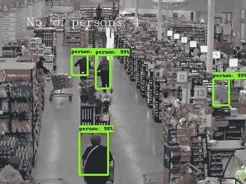
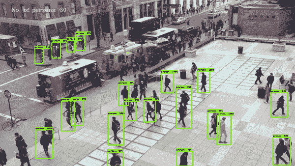
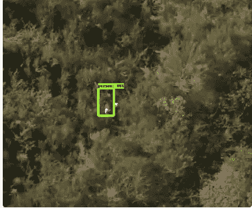

# 为你的企业使用人群计数人工智能模型

> 原文：<https://towardsdatascience.com/use-a-crowd-counting-ai-model-for-your-business-485da9c21db4?source=collection_archive---------7----------------------->

*用数据做酷事！*

## 背景

深度学习正在迅速将计算机视觉带入一个领域，企业可以开始在日常使用中集成强大的模型。过去，企业在采用人工智能方面面临的一些挑战——谁将建立和维护这些模型，我如何部署它们，它们是否足够准确——现在在 [Unleashlive](https://unleashlive.com/) 的一个新平台中得到了解决，该平台旨在将模型开发者与最终用户联系起来。

我正在这个人工智能平台上推出一个人群计数模型。这个平台将允许企业通过我的模型运行他们的剪辑或图像或直播视频，并立即获得结果，而没有任何与设置环境或 GPU 相关的麻烦。你现在可以在[释放云](http://cloud.unleashlive.com)免费试用这个模型 1 小时。首次用户请建立一个新帐户。

人检测/计数模型是非常通用的，在许多领域都有应用。这里是我能想到的一些，以及我的应用程序使用 you tube 的一些视频的性能的一个小演示。

## 人计数器的有趣应用

1.  **零售**

在零售业中，了解客流量对于组织过道中的商品、优化商店布局、了解高峰时段甚至潜在的防盗非常重要。你现在可以在商店里放一个摄像头，并将其连接到 [Unleashlive](https://cloud.unleashlive.com/auth) AI 平台，获得可以被摄取和分析的实时数据。请参见下面的实际模型

People Counter — Retail

2.基础设施规划

许多企业或政府机构可以使用人员计数器来了解各种情况，如在给定时间公共场所有多拥挤，或者每天有多少人使用特定的街道交叉口等。

Traffic Count

3.安全

另一个广泛的应用领域是安全。如果你正在寻找一个迷路的人，或者如果一个企业想在启动一台大型机器之前确保一个区域没有人。在下面的图片中，我的模型可以追踪一个在内陆徒步旅行的人。

Safety application of people counter

## **关于人工智能模型的更多信息**

这里使用的人群计数模型是一个更快的 RCNN 初始模型，在不同规模的自定义人群数据集上进行训练。与使用在 COCO 数据集上训练的模型相比，它的工作速度更快，精度更高。它适用于近距离和远距离拍摄的人群图像，以及不同背景和闪电条件下的图像。

## **我想在我的业务中使用这种模式**

如果你对这篇文章感兴趣，并想尝试人数统计模型，那么请登录并在[https://cloud.unleashlive.com/](https://cloud.unleashlive.com/)创建一个账户

您将能够激活该模型并对其进行测试！最棒的是,“释放”向所有新用户提供 1 小时免费试用:)

**我是一名开发人员，我想添加一个模型**

这也很简单。只需在“释放生活”上创建一个帐户，并在顶部的个人资料中启用开发者标志(“以开发者身份开始”)。这为您的测试建立了一个私有的沙箱。有 tensorflow 1.6 和对象检测经验者优先。

一旦您启用了您的帐户，“开发者”将出现在顶部的导航栏上。只需点击并选择“沙盒”,然后按照提供的指示。这是一个非常简单的过程。

**了解更多**

要了解更多关于 Unleashlive 平台和商业模式如何运作的信息，请查看以下常见问题:

[http://developer.unleashlive.com/#a-i-apps-ecosystem](http://developer.unleashlive.com/#a-i-apps-ecosystem)

如果您有任何问题或需要帮助，请随时拨打[getstarted@unleashlive.com](mailto:getstarted@unleashlive.com)联系我们。如果你对其他人工智能应用有想法，请在下面的评论中添加。

**参考文献:**

*   [Google Tensorflow 物体检测 Github](https://github.com/tensorflow/models/tree/master/research/object_detection)
*   [COCO 数据集](http://mscoco.org/home/)