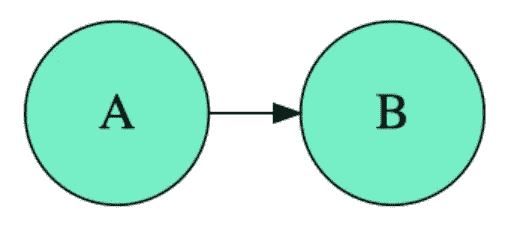
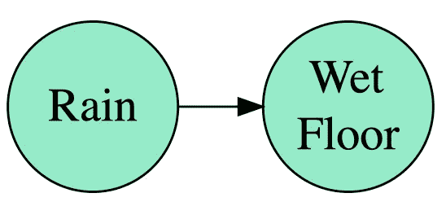
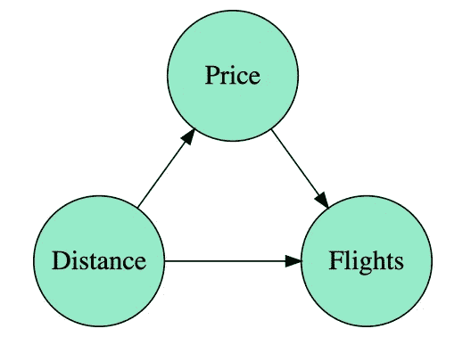
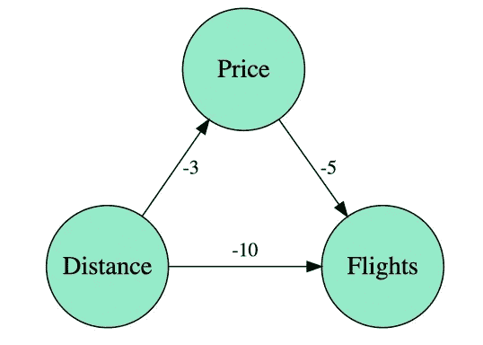
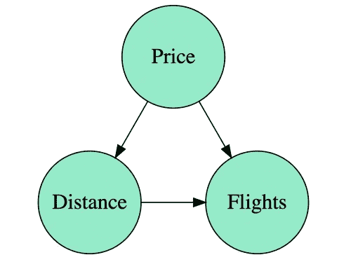

# 用因果图！

> 原文：<https://towardsdatascience.com/use-causal-graphs-4e3af630cf64?source=collection_archive---------7----------------------->

## [偶然的因果推断](https://towardsdatascience.com/tagged/casual-causal-inference)

这是关于数据科学因果关系系列的第二篇文章。你可以查一下第一个“[数据科学中我们为什么需要因果关系？](https://medium.com/@aleixrvr/why-do-we-need-causality-in-data-science-aec710da021e)和下一个“[观察不干预](/observing-is-not-intervening-9fbd22679f44)”。正如我们所说，目前有两个主要的框架来处理因果关系:潜在的结果和图表。在这里，我们将继续解释为什么因果推理是必要的，以及图形如何帮助它。

# 图形模型

图表是一个很棒的工具。通过图来模拟因果关系带来了一种合适的语言来描述因果关系的动态性。每当我们认为事件 A 是 B 的原因时，我们就在那个方向画一个箭头。

这意味着你的模型正在考虑从 A 到 B 的一个可能的因果关系。这从“A 是因果关系的主要来源”到“A 几乎不能解释关于 B 的任何事情”。具体来说，它包括 A 是 b 的原因*而不是*的情况。你可能会对现实建模过度，但模型不会是不正确的。**这就是为什么，关键的假设是在你不放箭的时候出现的**。在这种情况下，你声称变量之间是独立的，你应该能够论证和辩护为什么会这样。综上，假设越多，箭头越少。

# 谈论相关性是不够的

图表扩展了统计语言。最简单的例子就是相关性是对称的，而有向图则不是。我可以简单地写

下雨和地板潮湿之间的因果关系。反之， *correlation(雨，湿地板)= correlation(湿地板，雨)。相关性是方向性盲的。如果要说因果关系，我们需要一种可以处理因果行为的语言。*

就因果模型的公式而言，我们会写

*湿地板:= f(雨，随机性)*

这意味着潮湿的地板取决于雨水和其他一些随机变量(与雨水无关)。这里的关键是“:=”符号，这意味着雨影响潮湿的地板，而不是相反。这不是一个两边相等的数学方程，而是一个编程方程，其中湿地面的值是根据雨水计算的，但雨水的值不是根据湿地面设定的。

# 因果线性模型

线性模型是统计学的关键要素之一。通过因果透镜，他们很容易得出直接和间接影响的解释。首先，考虑下面的例子。一家飞机公司想将其业务扩展到一个新机场。他们选择一个机场，带上他们的飞机，设定价格，出售机票。在几个月的时间里，他们不断试验价格，直到达到一个有利可图的可持续价格。顾客在购买机票时，会考虑到从他们家到机场的距离以及航班的价格。由于他们是一家成长中的公司，他们在过去的 5 年里一直在这样做。这些事件可以通过下面的图表来描述，其中*距离*是与带来大部分客户的城市的距离，*价格*是月平均价格，*航班*是月平均航班数。

现在，他们想知道，对于他们想要合作的下一个机场，距离如何影响航班数量？通过观察数据，他们得出结论，在这种情况下，线性模型就足够了。然后他们执行线性回归，试图从*距离*和*价格表达*航班*。*

得到最终的线性模型

*航班= -10 距离+ -5 价格*

可以这样理解:固定一个特定的航班价格(比如 100 美元)，如果你增加距离，航班数量将减少 10 个单位。但是，这不是你想要的！当你增加距离的时候，也会影响价格(不能固定)！你感兴趣的是当你改变一个单位的*距离*，又叫***时*航班*改变了多少单位。***

**从图形模型的角度来看，我们可以在每条边上放置一个线性模型，并具有以下方程组:**

****

***价格:= -3 距离+ Random_1***

***航班:= -10 距离+ -5 价格+随机 _2***

**现在我们看到*距离*到*航班的两个影响:***

*   ****直接效应** ( *距离* - > *航班)*:客户对距离的负面感知。**
*   ****间接影响** ( *距离*->-*价格* - > *航班):*距离的增加，迫使公司降低价格，从而产生航班的增加。**

**利用上面的公式，通过变量*价格*与*距离*的关系的替换，可以获得总效果:**

***航班:= -10 距离+ -5 价格+误差 _2 = (-10 + (-5)(-3))距离+随机 _3 = 5 距离+随机 _3***

**这种情况下的总效果是 5 (= -10 + (-5)(-3))。但这只是一个玩具例子。我们如何从数据中直接计算出总体效果？在这种情况下，您可以汇总所有直接和间接的影响，仅从*距离*表示*航班*。所以答案是只从*距离*对*航班*进行线性回归。**

**观察结论与第一次和最后一次回归分析有何不同。第一个得出的结论是距离对航班数量有负效应-10，而最后一个得出的结论是正效应 5！如果价格管理补偿了顾客对距离的负面看法，你仍然可以在寻找不太容易到达的机场时对航班数量产生积极影响。**

**结论:**

1.  **如果您想计算总的影响，您应该从*距离*执行*航班*的回归(与第一次回归将所有变量放入计算中不同)。**
2.  **使用图表有助于理解、推理和讨论整个分析。**

# **数据本身不会说话**

**我们已经看到，为了计算距离对航班数量的影响，我们依赖于图表。现在想象一种不同的情况。航空公司，而不是上面描述的过程，他们已经进行如下:他们设置一个价格，在这个价格上他们想要设置他们的航班。之后，他们寻找一个他们认为能满足他们需求的机场。在这种情况下，我们将得到下图:**

****

**请注意，从*距离*到*价格*的箭头已经反转。在这种情况下，改变一个单位的距离根本不会改变价格！因此，如果我们想知道改变一个距离单位如何改变飞行中的一个单位，我们可以直接进行线性回归**

***航班= -10 距离+ -5 价格***

**答案是-10！这意味着数据生成的方式以及我们如何对这一过程建模非常重要。此外，这种知识不是来自数据，而是来自特定领域本身。我们最终可能会有两个相同的数据集，但是如果它们产生的方式不同，我们可能不得不以不同的方式来分析它们。**