# 使用嵌入来预测临床研究的治疗领域

> 原文：<https://towardsdatascience.com/use-embeddings-to-predict-therapeutic-area-of-clinical-studies-654af661b949?source=collection_archive---------15----------------------->

## 特定领域嵌入如何帮助分类


Image from Unsplash

临床研究是一个充满迷人概念的世界，其中存在大量可免费下载的数据集。我在[understand](https://www.comprehend.com)([招聘](https://boards.greenhouse.io/comprehend/jobs/1456548))的任务之一是做一个概念验证，在大约 40 个手动定义的治疗领域中自动分类临床研究，如下所示:

```
Cardiology/Vascular Diseases  
Dental and Oral Health  
Dermatology  
Genetic Disease  
Hematology  
Infections and Infectious Diseases  
Musculoskeletal  
Neurology  
Nutrition and Weight Loss  
Obstetrics/Gynecology  
Oncology  
Ophthalmology  `
Pharmacology/Toxicology  
Psychiatry/Psychology  
Pulmonary/Respiratory Diseases  
...etc...
```

可供参考的大约 289000 项研究可以在 ClinicalTrials.gov 的[网站上找到。正如我们将在下面看到的，由于](https://clinicaltrials.gov/) [CTTI](https://www.ctti-clinicaltrials.org/) ( *临床试验转化倡议)*提供了高质量的文档，人们可以下载完整的内容作为 CSV 文件或 Postgres 数据库供离线使用。特别是研究与一些医学术语相关联。

既然上述治疗领域是人工定义的，我们如何将它们与研究的医学术语联系起来？这就是 ***概念嵌入*** 的来源。下面介绍的所有代码都可以在 [Jupyter 笔记本](https://github.com/thierryherrmann/simple-machine-learning/blob/master/2018-11-10-studies-therapeutic-areas/studies-therapeutic-areas.ipynb)中找到

# 医学背景下的预训练嵌入

关于单词嵌入已经写了很多。这里有一个关于他们力量的很好的介绍。在本帖中，我们将使用预训练 *ed* ***临床概念*** 嵌入将治疗区域映射到研究中。

美国国家医学图书馆(NLM)创建了统一医学语言系统(UMLS)，这是一个令人难以置信的组织良好的医学概念和术语的来源，在其网站上有最好的描述:

> UMLS 整合并分发关键术语、分类和编码标准以及相关资源，以促进创建更有效和可互操作的生物医学信息系统和服务，包括电子健康记录

特别是，一个核心概念是一个医学概念，像*疟疾*、*放射疗法*、*肿瘤*或*白血病*一样多种多样。每个概念由一个*概念唯一标识符* (CUI)标识，并映射到各种医学术语的数据源，如我们将在下面使用的 [MeSH](https://www.nlm.nih.gov/mesh/) (医学主题标题)。

这里有一个 [*富发布格式* (RRF)浏览器](https://www.nlm.nih.gov/research/umls/new_users/online_learning/UMLST_009.html)的截图，这是 UMLS 提供的一个强大的工具，从 NLM 获得许可证后就可以下载。可以通过单词搜索概念，并且可以找到与其他概念的关系:

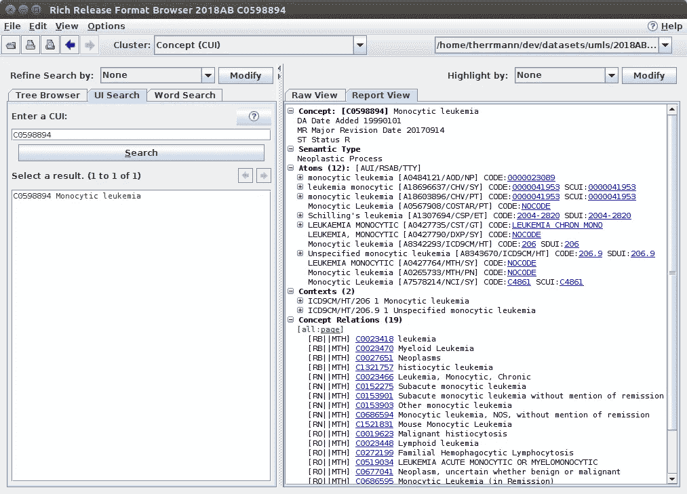

Rich Release Format Browser

由 [De Vine 等人从 348，566 份医学杂志摘要(由作者提供)中学习到的 UMLS CUIs 的预训练嵌入可以在此处](http://dl.acm.org/citation.cfm?id=2661974)下载[，这要感谢 D. Sontag 等人在那里所做的出色工作(参见](https://github.com/clinicalml/embeddings/blob/master/DeVine_etal_200.txt.gz)[学习医学概念的低维表示](http://people.csail.mit.edu/dsontag/papers/ChoiChiuSontag_AMIA_CRI16.pdf))。以下是如何加载它们的方法，这要感谢令人敬畏的 gensim 库:

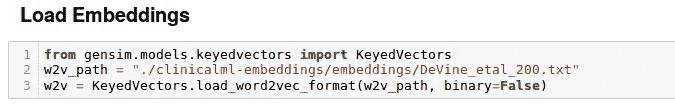

Load concept embeddings with gensim

正如所料，密切相关的概念的余弦相似性很高。例如，以下是与头痛或肝炎最接近的概念:

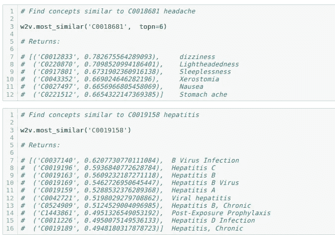

Most similar concepts

# 通过概念嵌入将研究与治疗领域联系起来

我们将通过以下途径将临床研究与概念嵌入的治疗领域联系起来:

1.  从 [AACT](https://aact.ctti-clinicaltrials.org/) 的 *browse_conditions.txt* 文件中获取研究 [MeSH](https://www.nlm.nih.gov/mesh/) 术语(医学主题词)
2.  使用来自*NLM 国家医学图书馆*的文件将网格术语转换为其唯一标识符(又名*代码*
3.  使用 UMLS 文件加载 UMLS 概念标识符(Cui)及其关联的网格代码。在这一点上，Cui 不再是抽象的。
4.  手动将治疗区域与 UMLS 概念标识符(CUIs)相关联
5.  使用预先训练的嵌入来找到 Cui(在 4 中找到)的区域。上图)与研究中的最相似(见 3。以上)

下图总结了一组数据源和转换:

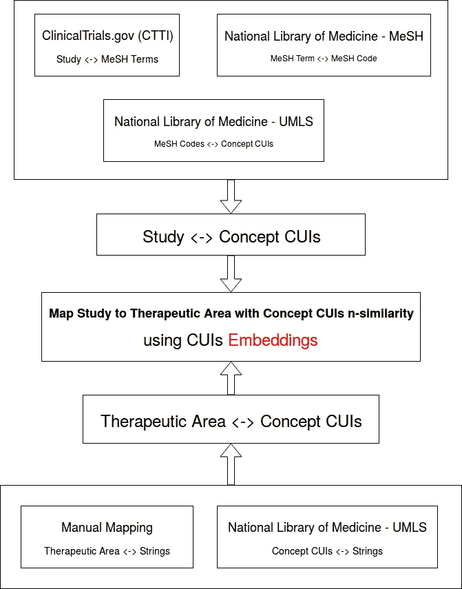

## 1.获取与研究相关的网格术语

来自 ClinicalTrials.gov 的的 [CTTI](https://www.ctti-clinicaltrials.org/) 提供了非常有条理和有记录的数据。可以从 [CTTI 下载网站](https://aact.ctti-clinicaltrials.org/download)下载研究和相关数据。下面是我们感兴趣的数据子集(CTTI 提供的模式图):

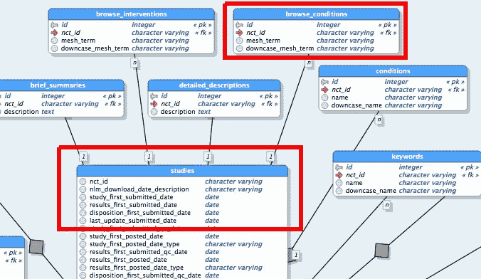

病历报告在文件`studies.txt`中，并链接到`browse_conditions.txt`中的网格术语。下面是研究`**NCT01007578**` 关于*动脉粥样硬化*的网状术语的例子:

```
grep **NCT01007578** ./clinical-trials-gov/browse_conditions.txt1508569|NCT01007578|Atherosclerosis|atherosclerosis
1508570|NCT01007578|Peripheral Arterial Disease|peripheral arterial disease
1508571|NCT01007578|Peripheral Vascular Diseases|peripheral vascular diseases
1508572|NCT01007578|Arterial Occlusive Diseases|arterial occlusive diseases
```

加载这些内容并从病历报告 ID 到其网格术语集构建一个字典很容易。`load_df()`是围绕熊猫的一个小包装器函数`read_csv().` 然后字典被构建:

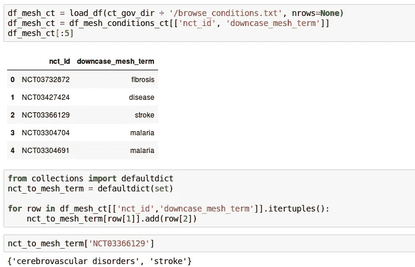

## 2.将网格术语转换为它们的唯一标识符

r 相关的网格文件可以从国家医学图书馆下载。解析细节在笔记本里。


Build MeSH terms to MeSH codes dictionary

## 3.加载 UMLS 概念

我们现在将加载概念和源文件(`MRCONSO.RRF`)，这些文件来自大量 *UMLS* 文件[这里](https://www.nlm.nih.gov/research/umls/knowledge_sources/metathesaurus/release/)。其格式在这里描述[。在将这个 CSV 文件作为 pandas 数据框加载之前，我们可以通过只保留我们需要的列来将其大小(7148656 行，897Mb)减半。](https://www.ncbi.nlm.nih.gov/books/NBK9685/table/ch03.T.concept_names_and_sources_file_mr/?report=objectonly)

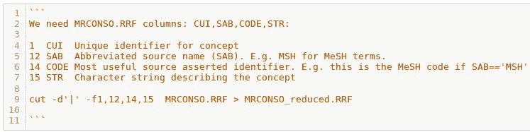

Reduce Concepts File Size

short `load_conso()`函数将缩减后的文件加载到数据帧中。查看相同的概念(相同的 CUI)如何映射到不同的源特定代码(不同的 SAB/代码):

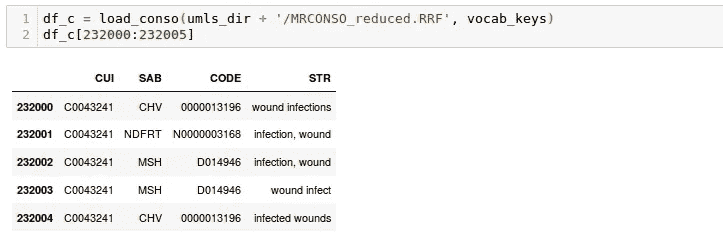

MRCONSO.RRF excerpt

## 3.1 将网格代码映射到 Cui

从上面的数据框创建一个从网格代码到 CUIs 的映射。这将在以后用于将研究与概念 Cui 关联(通过网格代码)

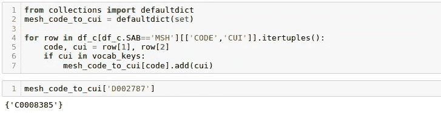

Mapping MeSH codes to CUIs

然后我们使用 1 的结果。, 2.和 3.1 来构建概念 Cui 的研究标识符的字典。对于第一遍，我们删除引用了不在 CTTI 文件中的网格术语的病历报告:

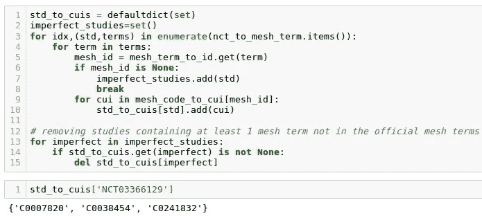

## 3.2 将概念 Cui 映射到字符串

从上面的数据框创建一个从 CUIs 到相应字符串集的映射。这将在以后用于将治疗区域映射到 Cui:

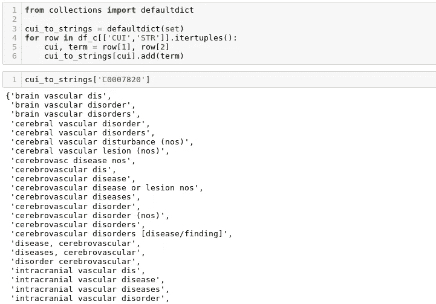

Mapping CUIs to Descriptions

为了以后的评估目的，使用该映射将病历报告与由相关 Cui 的字符串组成的描述字符串相关联是有用的:

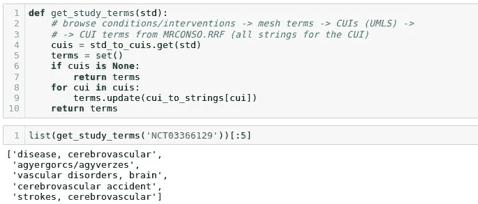

Study terms for Evaluation Purposes

## 4.手动将治疗区域与 UMLS 概念(Cui)相关联

治疗区域是手动定义的，以满足战略业务需求。因此，要把它们与研究联系起来，我们需要把它们与概念 CUIs 联系起来。这是这篇文章最棘手的部分。

主题专家了解每个领域，因此能够识别哪些字符串或描述与之相关。使用上面的`cui_to_strings` 字典，使用子字符串匹配很容易识别哪个 CUI 匹配哪个字符串。

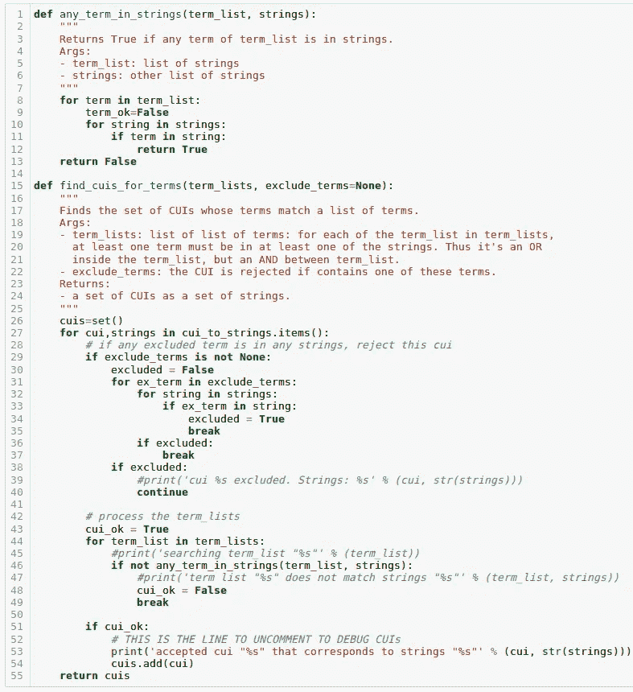

例如，对于*心脏病学*区域，让我们尝试保留其术语集至少包含`cardiodiolog`和`cardiovascul`子字符串的所有 Cui(结果被截断):

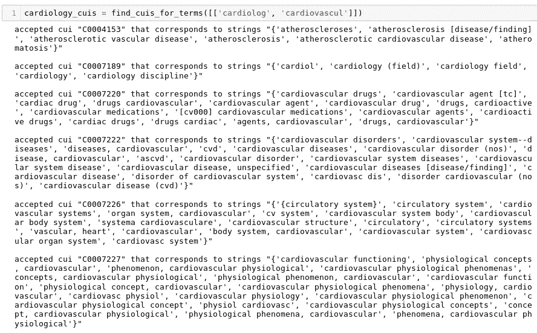

Finding Cardiology’s Concepts (output truncated)

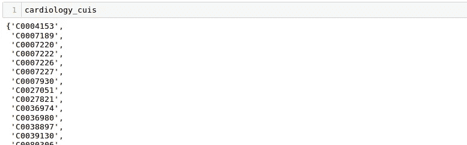

Cardiology Concepts (output truncated)

通过在两组嵌入向量上使用 [Gensim](https://radimrehurek.com/gensim/models/keyedvectors.html) 的`KeyedVector.n_similarity()`，希望这组 Cui 与关于*心脏病学*的研究之间的相似性会很高。

在某些情况下，有必要要求术语来自多个集合。例如，对于区域*感染和传染病*，第一个集合`[‘infectious’, ‘infected’, ‘infection’]`返回与感染相关的概念，但不一定是疾病。以下尝试给出了更好的结果:


Finding Infectious Diseases’ Concepts (output truncated)

在其他情况下，一些术语匹配来自非期望区域的 Cui。对于*牙齿和口腔健康*区域，使用`[‘tooth cavit’, ‘caries’, ‘cavities’]`会从许多不需要的区域产生 Cui。关于与牙齿区域无关的一组*腔*相关的串，参见`excluded_terms`参数。下面的最终结果似乎没有异常值:

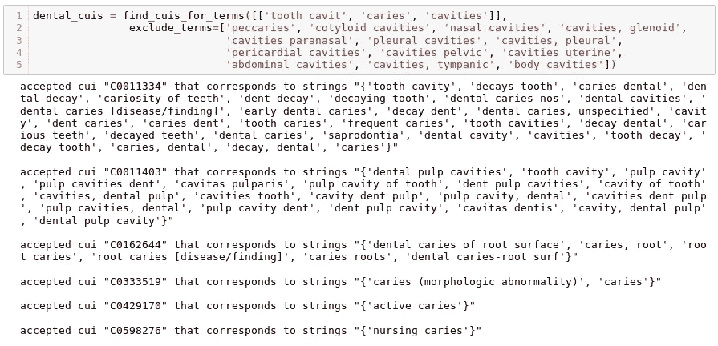

## 5.使用概念嵌入将研究与治疗领域相匹配

这是所有东西放在一起的地方。从目前构建的结构来看，不难使用蛮力来保留与使用 [Gensim](https://radimrehurek.com/gensim/models/keyedvectors.html) 的`KeyedVector.n_similarity()`的每项研究最相似的治疗区域:

*   这个概念来源于这项研究(字典`std_to_cuis`)
*   这个概念来源于各个治疗领域

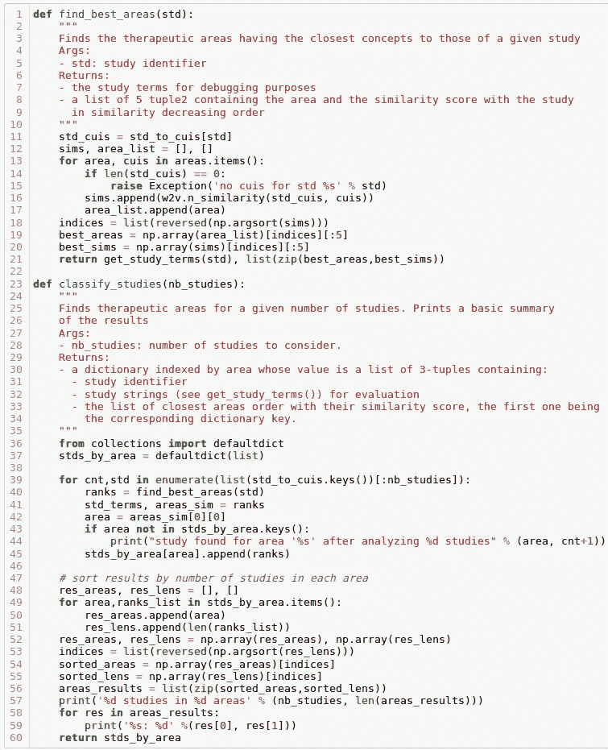

Matching studies with therapeutic areas

# 结果

结果可以用以下代码显示:

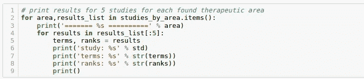

Studies matched to therapeutic areas

以下是不同治疗领域的典型结果摘录。由于空间限制，它被截断。如果它太小而无法在你的设备上阅读，那么[笔记本](https://github.com/thierryherrmann/simple-machine-learning/blob/master/2018-11-10-studies-therapeutic-areas/studies-therapeutic-areas.ipynb)包含了更多的结果，有助于在不执行代码的情况下查看它们(执行代码需要从 UMLS 获得下载文件的许可，这并不困难，我得到了 NLM 的热情支持)。

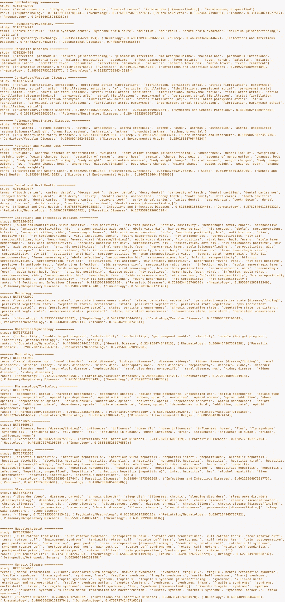

## 对结果的一些评论

尽管一些研究被错误分类，结果还是很有趣。通常关注误分类有助于理解哪个崔导致(或影响)了错误的选择。

当关注一个错误的分类时，总是关注第二个和第三个治疗区域，看看它们与第一个有多接近。例如，在下面的错误分类中，第二个(正确的)区域`Trauma, 0.49841`与第一个(不正确的)区域`Urology: 0.50133`非常相似。这告诉我们，结果并不总是那么糟糕，重点应该放在更糟糕的错误分类上。

```
study: NCT03677856terms: {'thoracic diseases', 'anesthetic drug', 'anesthesia agent', 'thoracic diseases [disease/finding]', 'anaesthetics', 'thoracic disorder', 'anaesthetic drugs', 'anaesthetic agent', 'anesthetics drugs', 'anesthetic agent', 'diseases, thoracic', 'anesthetic', 'agents, anesthetic', 'anesthetic agents', '[cn200] anesthetics', 'thoracic disease', 'disease thoracic', 'anesthetic drugs', 'disease, thoracic', 'thoracic dis', 'anesthetics', 'drugs, anesthetic', 'anesthestic drugs', 'drugs causing loss of sensation'}ranks: [('Urology', 0.50133), ('Trauma', 0.49841), ('Neurology', 0.49322), ('Dermatology', 0.48437), ('Obstetrics/Gynecology', 0.47121)]
```

在某些情况下，可能需要手动验证每个 CUI，并从特定治疗区域或研究中删除或添加一些 CUI，并找到导致不匹配的 CUI(借助 gensim 的相似性函数)。然后试着推断这个崔和其他人的互动来理解引起不一致的语义方面。[笔记本](https://github.com/thierryherrmann/simple-machine-learning/blob/master/2018-11-10-studies-therapeutic-areas/studies-therapeutic-areas.ipynb)收录了一些值得调查的误分类。

# 结论和可能的改进

*   获取每个治疗区域的 Cui 至关重要。这可能会变得棘手，如上面的例子所示(*牙科*或*传染病*)。
*   如果我们无法找到合适的折中方案，可以使用 NLM 的 RRF 浏览器(见上面的截图)浏览相关概念，并手动将每个 Cui 分配到一个有问题的治疗区域。有时一些概念重叠，相似性将无法给出好的结果。需要从负面案例开始进行更多的调整/调查。
*   进行集成:在这里使用另外两个可用的 CUI 嵌入(更小，但可能仍然是好的)希望它们可以弥补这里尝试的嵌入中缺少的概念。由于这些其他嵌入更小，预计不会有很大的改进。
*   如果不对病历报告进行分类比错误分类更好，请考虑对第一个区域和第二个区域之间的相似性差异使用阈值。只有当差异大于阈值时才预测治疗区域，因为第一和第二区域之间的间隔被认为足够宽。