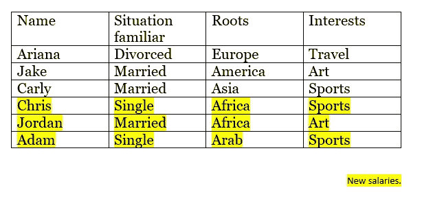
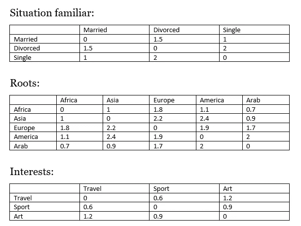
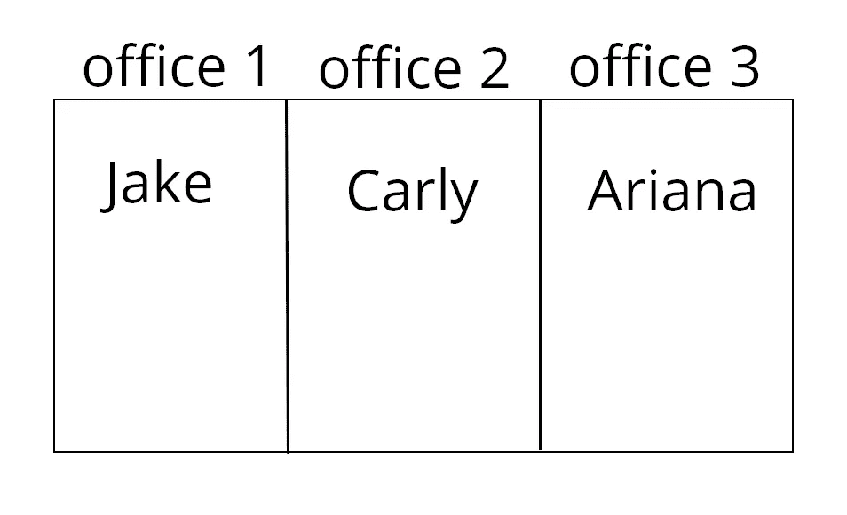
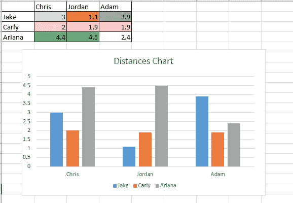
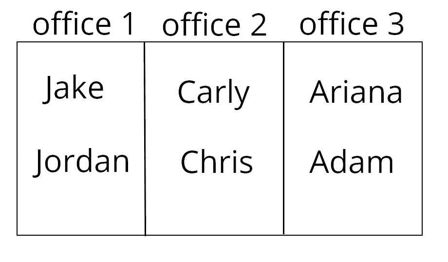

# 用 K 近邻(KNN)找更好的公司。

> 原文：<https://towardsdatascience.com/use-k-nearest-neighbor-knn-for-a-better-company-35b343ed2050?source=collection_archive---------16----------------------->

# 介绍

大多数公司的问题是薪水的辞职，辞职的主要原因之一是他们对他们工作的地方不满意，无论是他们工作的团队，还是他们在同一个部门的办公室的员工，一个想法出现在脑海中，为什么不使用 KNN 对人们进行分类，这样我们就可以得到最好的工作地点，怎么样？在本文中，我将阐明这种分类是如何工作的。

我们将看看如何使用 K 最近邻算法来帮助我们完成这项劳动密集型任务。

下面是我们将要做的事情的概述:

*   获取不同特征的人之间关系的数据集。
*   根据从培训数据集生成的距离表计算两个薪资之间的距离。
*   使用分类器将新的薪水分类到正确的部门。

# 数据

首先，我们需要一个数据集。为此，我建议从具有不同特征的人之间的关系中获取数据，这些数据可以从任何地方、社交媒体、法庭案件等中提取..—该数据集是一个数据集合，如兴趣、性别、家庭状况、宗教、根源、个人详细信息等..).

# 如何计算距离

我们将使用一个表，该表根据对工资两个特征之间的理解来确定距离，该表对角线上的值为 0，因为具有相同特征的两个雇员很接近，这些值可以随时改变，并且是从现实生活中提取的，例如，如果 A 国对 B 国的种族歧视很严重，A 国的工资与 B 国的工资之间的距离就会很长。

在 KNN 中，将使用距离之和而不是欧氏距离。

# 例如:

假设我们有一个有 3 份薪水和 3 个办公室的公司。我们想多招三个工资，前提是每个员工进一个办公室。最终，我们将在公司获得 6 份工资，按每个办公室两名员工的比率计算。我们将使用我之前解释过的方法，把适合他们的新工资放到办公室里。

薪资清单:

Figure 1 : List of Salaries (old and new ones )

距离表:

Figure 2 : Distances between characteristics .

注意:表格上的数字是随机数字，它们没有任何依据。

在本例中，我们采用 3 个属性来计算距离、熟悉情况、根源和兴趣。

注意:为了得到好的结果，你应该使用许多属性。

这是公司的状态 1:

Figure 3 : the state of the company before adding the new salaries.

我们将 3 个新的薪水分类，他们是:克里斯，乔丹和亚当。

我们需要将每个员工放在每个办公室，因此我们需要计算每个新工资和每个旧工资之间的距离。

计算距离:

## 对于克里斯:

D(克里斯，杰克)=D(单身，已婚)+D(非洲，美洲)+D(体育，艺术)

=1+1.1+0.9=3

D(克里斯，卡莉)=D(单身，已婚)+D(非洲，亚洲)+D(运动，体育)

=1+1+0=2

D(克里斯，阿丽亚娜)=D(单身，离异)+D(非洲，欧洲)+D(运动，旅行)

=2+1.8+0.6=4.4

## 代表约旦:

D(乔丹，杰克)=D(已婚，已婚)+D(非洲，美洲)+D(艺术，艺术)

=0+1.1+0=1.1

D(乔丹，卡莉)= D(已婚，已婚)+D(非洲，亚洲)+D(艺术，体育)

=0+1+0.9=1.9

D(约旦，阿丽亚娜)= D(已婚，离异)+D(非洲，欧洲)+D(艺术，旅行)

=1.5+1.8+1.2=4.5

## 对于亚当:

D(亚当，杰克)= D(单身，已婚)+D(阿拉伯，美国)+D(体育，艺术)

=1+2+0.9=3.9

D(亚当，卡莉)= D(单身，已婚)+D(阿拉伯，亚洲)+D(体育，运动)

=1+0.9+0=1.9

D(Adam，Ariana) = D(单身，离异)+D(阿拉伯，亚洲)+D(体育，运动)

=1.5+0.9+0=2.4

根据图 2 计算距离后，我们得到:

Figure 4 : The final result of calculation.

根据表格和图表，我们可以这样对 3 名新员工进行分类:

克里斯会和卡莉在 2 号办公室。

乔丹将和杰克在 1 号办公室。

亚当会和阿丽亚娜在 3 号办公室。

Figure 5 : the state of the company after adding the new salaries.

在这种情况下，K = 1，因为我们每个办公室只有 1 份工资，所以 K 比率可以根据公司的规模而变化。

# 结论:

我们能够避免公司中新工资的随机分类，现在当新工资进入公司时，我们有了一些依据，我们希望将它放在正确的生态系统中，以提高员工的生产力，减少公司中的冲突。