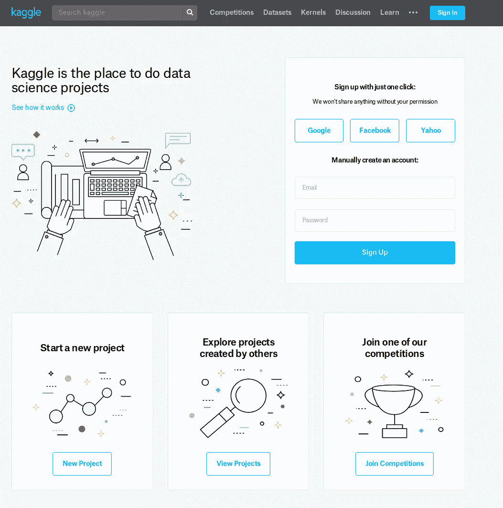
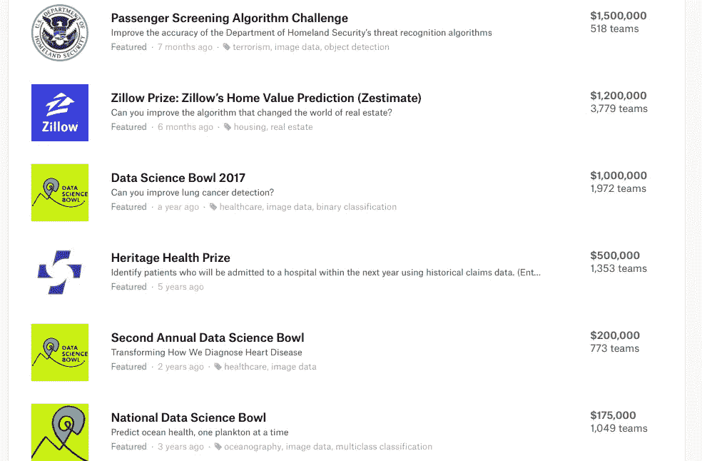
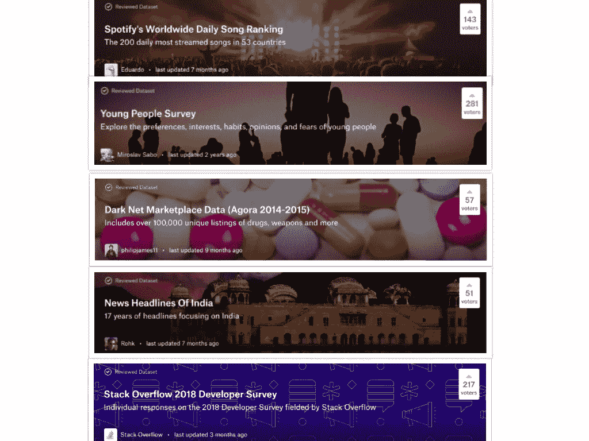
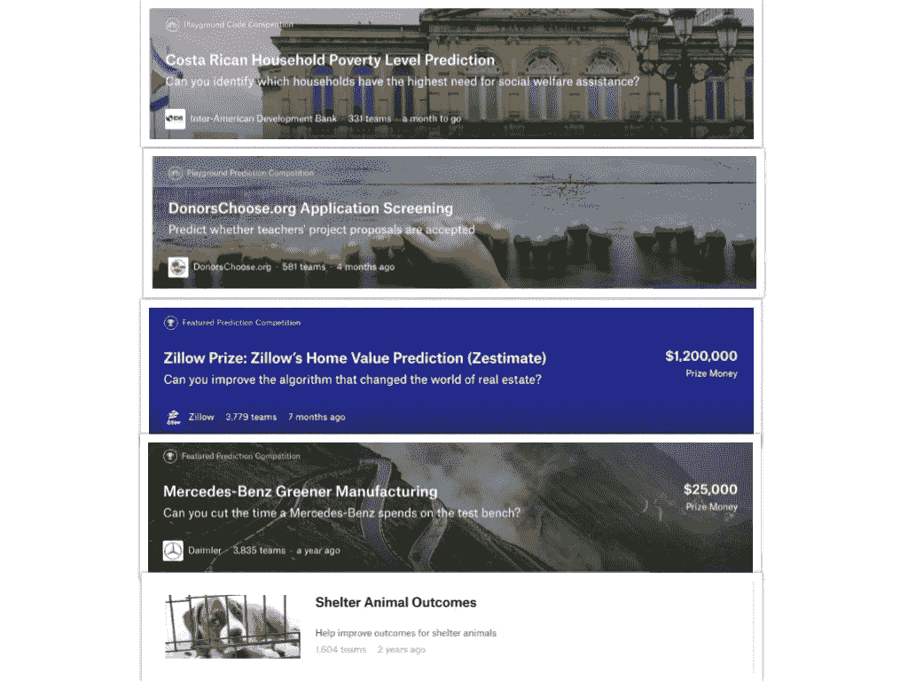
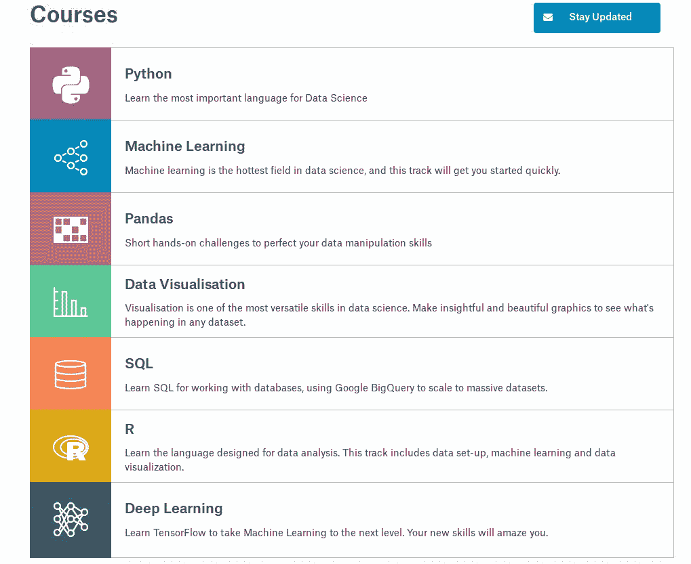
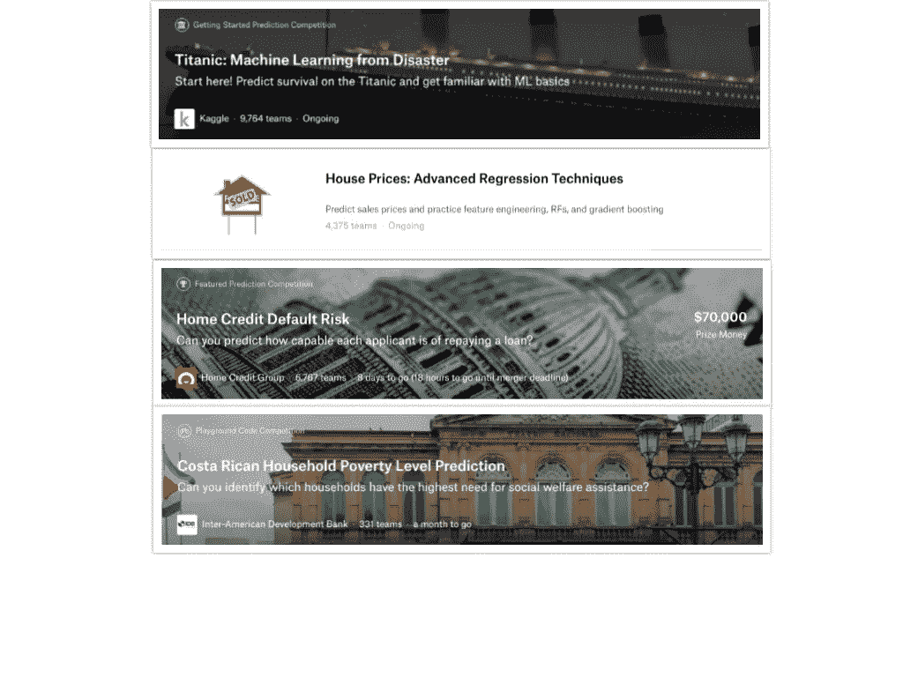
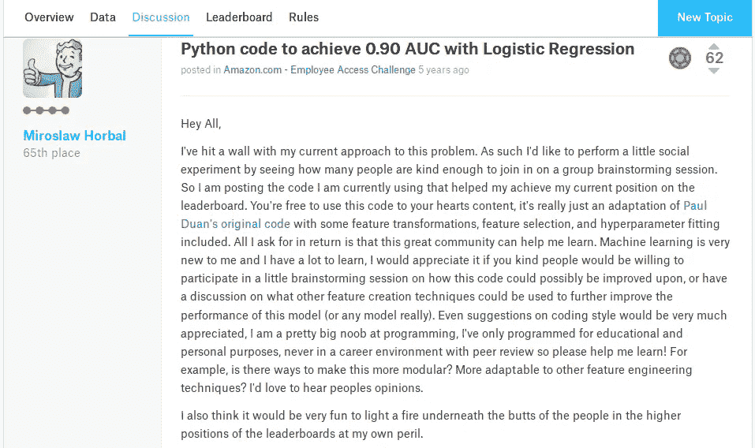
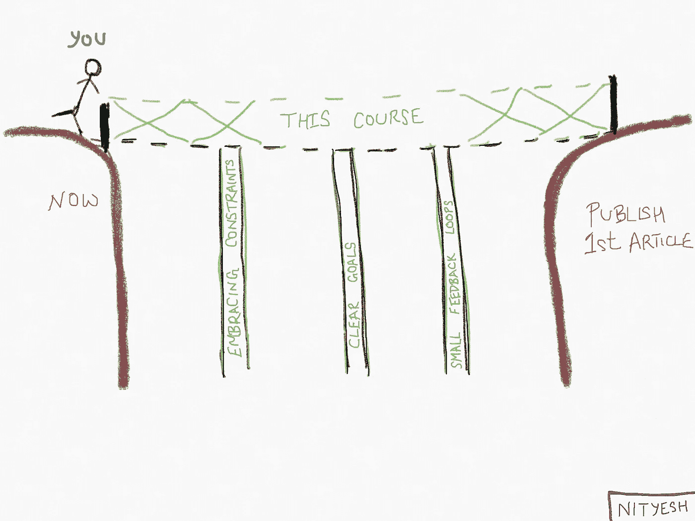

# 使用 Kaggle 开始(并指导)您的 ML/数据科学之旅——为什么和如何

> 原文：<https://towardsdatascience.com/use-kaggle-to-start-and-guide-your-ml-data-science-journey-f09154baba35?source=collection_archive---------2----------------------->

[https://www.kaggle.com/](https://www.kaggle.com/)

我经常被我的朋友和大学同学问到——“如何开始机器学习或数据科学”。

所以，这是我的答案..

之前，我并不确定。我会说类似这样的话:先学这门课，或者先读这篇教程，或者先学 Python(只是我做过的事情)。但是现在，随着我在这个领域越来越深入，我开始意识到我所采取的方法的缺点。

**所以，后知后觉的我认为，最好的*【进入】* ML 或者数据科学的途径可能是通过******。****

**在这篇文章中，我会告诉你为什么我会这样想，如果你被我的推理说服了，你该怎么做。**

**( ***谨慎*** *):我是学生。我的职业不是数据科学家或 ML 工程师。我绝对不是 Kaggle 的专家。所以，对我的建议/意见要有所保留。* :-))**

**但首先，让我介绍一下 Kaggle，并澄清一些对它的误解。**

**你可能听说过 Kaggle，它是一个为大联盟比赛提供令人难以置信的现金奖励的网站。**

****

**[Competitions hosted on Kaggle with the maximum prize money](https://www.kaggle.com/competitions?sortBy=prize&group=general&page=1&pageSize=20) (yes those are MILLION DOLLAR+ prizes!)**

**正是这种名声也导致了对平台的许多误解，并使新来者感到比他们应该开始的时候更加犹豫。**

**(哦，如果你以前从未听说过 Kaggle，请不要担心，因此，不要分享下面提到的任何误解。这篇文章仍然有完整的意义。就当下一节是我给你介绍 Kaggle 吧。)**

# **误解:**

1.  *****“ka ggle 是一个举办机器学习竞赛的网站”*****

**这是对 Kaggle 的一个不完整的描述！我相信竞赛(以及它们非常丰厚的现金奖励)甚至不是 Kaggle 的真正瑰宝。看看他们网站的标题——**

****

**Competitions are just **one** part of Kaggle**

**除了主持`Competitions`(它现在已经主持了大约 300 场)之外，Kaggle 还主持了三件非常重要的事情:**

*   **`[**Datasets**](https://www.kaggle.com/datasets)`，甚至是那些与任何比赛都不相关的:它拥有 9500 多个数据集，相比之下只有 300 个比赛(在撰写本文时)。所以你可以通过选择任何你感兴趣的数据集来提高你的技能。**

****

**Some of the datasets that I find most interesting**

*   **它们只是 Kaggle 版本的 [Jupyter 笔记本](https://www.analyticsvidhya.com/blog/2018/05/starters-guide-jupyter-notebook/)，反过来，它们只是一种[真正有效的](http://blog.kaggle.com/2015/12/07/three-things-i-love-about-jupyter-notebooks/)和酷的方式来分享代码以及大量的可视化、输出和解释。“Kernels”选项卡将带您到一个公共内核列表，人们使用这些内核来展示一些新工具或分享他们关于某些特定数据集(/s)的专业知识或见解。**
*   **`[**Learn**](https://www.kaggle.com/learn/overview)` **:** 此选项卡包含免费的实用实践课程，涵盖了快速入门所需的最低先决条件。他们最大的优点是什么？—一切都是使用 Kaggle 的内核完成的(如上所述)。这意味着你可以互动和学习..*不再被动阅读数小时的学习材料！***

****

**所有这些使得 Kaggle 不仅仅是一个举办比赛的网站。现在，它已经成为一个完整的基于项目的数据科学学习环境。我将在本节之后详细讨论 Kaggle 的这一方面。**

*****2。“只有专家(博士或有多年经验的 ML 从业者)才能参加并赢得 Kaggle 竞赛”*****

**如果你这样认为，我强烈建议你读读这个—**

** [## 这个高中生自学成为一名人工智能巫师

### 如果你深入人工智能世界，你肯定知道谷歌云拥有的平台 Kaggle

mashable.com](https://mashable.com/2017/07/28/16-year-old-ai-genius/) 

***TL；博士:*** 一个高中生成为了 [Kaggle 竞赛的大师](https://www.kaggle.com/anokas)简直就是*(或者不那么简单，也许？)*跟随自己的好奇心，一头扎进比赛中。用他自己的话说，

> “我不知道算法背后的所有数学，但就实际使用它而言，我认为对它的工作原理有一个逻辑理解要重要得多。”

***3。“我应该在参加 Kaggle 比赛之前多做几门课程，学习先进的机器学习理念，这样我赢的机会更大”——***

机器学习最重要的部分是探索性数据分析(或 EDA)和特征工程，而不是模型拟合。事实上，[许多 Kaggle 大师认为](https://machinelearningmastery.com/how-to-kick-ass-in-competitive-machine-learning/)新手太快转向复杂的模型，而事实是简单的模型可以让你走得很远。

正如阿尔伯特·爱因斯坦所说—

> *“任何聪明的傻瓜都能把事情变得更大更复杂。朝着相反的方向前进需要一点天赋和很大的勇气。”*

此外，许多挑战都涉及结构化数据，这意味着所有数据都存在于整齐的行和列中。没有复杂的文本或图像数据。因此，简单的算法(没有花哨的神经网络)通常是这类数据集的获胜算法。在这种情况下，EDA 可能是一个成功的解决方案与其他解决方案的不同之处。

*现在，让我们继续讨论为什么应该使用 Kaggle 开始学习 ML 或数据科学..*

# 为什么要入门 Kaggle？

## 原因 1——准确了解开始行动的必要条件

Kaggle Learn 上的[机器学习课程](https://www.kaggle.com/learn/machine-learning)不会教你 ML 算法背后的理论和数学。相反，它只专注于教授那些在分析和建模数据集时绝对必要的东西。同样，那边的 [Python 课程](https://www.kaggle.com/learn/python)不会让你成为 Python 专家，但它会确保你知道的足够多，可以进入下一个阶段。

这可以最大限度地减少你需要花费在被动学习上的时间，并确保你已经准备好尽快接受有趣的挑战。

## 原因 2——体现了培养学习能力的精神

我相信做项目是如此有效，以至于你的整个学习都应该围绕着完成一个项目。我想说的是，与其在你学到一些东西后寻找一个相关的项目，不如从一个项目开始，学习你所需要的一切来实现这个项目。

正如惠特尼·约翰逊在[音阶大师播客中所说，](https://mastersofscale.com/stacy-brown-philpot-keep-humans-in-the-equation/)

> “基本上，你，我，每个人，我们都想学习和跳跃，然后重复。”

我相信这样学习会更令人兴奋和有效。

*(几周前，我写了一篇关于上述方法论的文章。其名为—**[***如何(以及为什么)开始构建有用的、现实世界中没有经验的软件***](https://medium.com/free-code-camp/how-and-why-to-start-building-useful-real-world-software-with-no-experience-46f265eaf38)**。所以，如果你还没有* :-)，就去看看吧)**

**I believe that this is also true for courses and tutorials**

**但是，当你没有一个可以跳跃的项目时，这个想法就完全失败了。做一个有趣的项目是困难的，因为..**

****答..很难找到一个有趣的想法** 而找到数据科学项目的想法似乎更加困难，因为需要有合适的数据集。**

****b)..我不知道该如何处理我知识中的那些漏洞。有时候当我开始一个项目时，我觉得有太多的事情我还不知道。感觉连学习构建这个东西的前提条件都不知道。我是不是力不从心了？我如何着手学习我不知道的东西？那就是所有动力开始消失的时候。****

****c)..我经常被“卡住”,好像在建立过程中我不断碰到一个又一个的障碍。如果我能有一群人，知道他们会如何解决这个问题，那该多好。****

***以下是 Kaggle 如何为所有这些问题提供解决方案的方法—***

****Soln。a →** `[**Datasets**](https://www.kaggle.com/datasets)` **和** `[**Competitions**](https://www.kaggle.com/competitions)` **:** 大约有 300 个竞赛挑战，都附有它们的公共数据集，总共有 9500+个数据集(还有更多在不断添加)这个地方就像是数据科学/ ML 项目创意的宝库。**

****索伦。b →** `[**Kernels**](https://www.kaggle.com/kernels)` **和** `[**Learn**](https://www.kaggle.com/learn/overview)` **:** 让我告诉你内核是如何有帮助的..
所有数据集都有一个公共内核标签，人们可以在这里发布他们的分析，以造福整个社区。所以，任何时候当你觉得不知道下一步该做什么的时候，你可以通过查看这些内核来获得一些想法。此外，许多内核是专门为帮助初学者而编写的。**

****Soln。c →** `[**Kernels**](https://www.kaggle.com/kernels)` **和** `[**Discussion**](https://www.kaggle.com/discussion)` **:** 随着我上面刚刚描述的公共内核，每个比赛和每个数据集也有自己的讨论论坛。所以，你总有地方提问。**

**除此之外*,“在竞赛期间，许多参与者会写一些有趣的问题，强调数据集中的特性和怪癖，一些参与者甚至会在论坛上发布性能良好的基准测试代码。比赛结束后，获胜者通常会分享他们的获胜方案”(一篇名为《[向最优秀的人学习》的文章)](http://blog.kaggle.com/2014/08/01/learning-from-the-best/)***

## **原因#3 —解决实际问题的实际数据= >实际动机**

**Kaggle 上的挑战是由寻求解决他们遇到的真实问题的真实公司主办的。他们提供的数据集是真实的。所有的奖金都是真的。这意味着您可以学习数据科学/ ML，并通过解决现实世界的问题来实践您的技能。**

****

**如果你以前尝试过竞争性编程，当我说这些网站上的问题有时感觉太不现实时，你可能会有同感。我的意思是为什么我要写一个程序来找出一个数组中毕达哥拉斯三元组的个数？那有什么用呢！？**

**我并不是想断言这样的问题很容易；我发现它们非常难。我也不是想削弱存在此类问题的网站的重要性；它们是测试和提高你的数据结构和算法知识的好方法。**

**我想说的是这一切对我来说都太虚构了。当你试图解决的问题是真实的时候，你会一直想要改进你的解决方案。这将提供学习和成长的动力。这就是你参加 Kaggle 挑战赛的收获。**

*****争论的另一方:“机器学习不是 Kaggle 竞赛”*****

***我将不负责任地不提这场辩论的另一面，即认为* [*机器学习不是 Kaggle 竞赛*](https://jvns.ca/blog/2014/06/19/machine-learning-isnt-kaggle-competitions/) *，而 Kaggle 竞赛仅仅是* [*代表一种“旅游式 sh * t】*](https://www.quora.com/How-do-I-get-a-job-as-a-data-scientist-if-I-have-no-prior-experience-It-seems-like-Kaggle-is-either-meaningless-or-an-ineffective-route-to-becoming-a-data-scientist-I-was-also-told-there-is-no-point-in-putting-up-my-code-on-GitHub/answer/Brian-Farley-3)*的实际数据科学工作。***

**嗯，也许那是真的。也许真正的数据科学工作并不像 Kaggle 竞赛中采用的方法。我没有从事过专业工作，所以我知道的不多，无法做出评论。**

**但是我所做的，很多时候，是利用教程和课程来学习一些东西。每一次，我都觉得教程/课程和我的学习动机之间存在脱节。我会学习一些东西，只是因为它在教程/课程中，并希望它在某个遥远、神秘的未来派上用场。**

**另一方面，当我在做 Kaggle 挑战时，我有一种学习的实际需求。我有一个阶段，可以让我立即应用我所学到的东西，并看到它的效果。这就给了动力和粘合剂，让所有的知识都粘在一起。**

# **如何开始:**

**拥有所有这些雄心勃勃的、真实的问题有一个不利的方面，那就是对于初学者来说，这可能是一个令人生畏的地方。我理解这种感觉，因为我自己最近也开始使用 Kaggle。但是一旦我克服了最初的障碍，我完全被它的社区和它给我的学习机会所折服。**

**所以，在这里我试着告诉你如何开始:**

## **第一步。涵盖基本要素**

**选择一种语言: **Python 或者 R** 。**

**一旦你做到了这一点，前往 [Kaggle Learn](https://www.kaggle.com/learn/overview) 快速了解该语言、机器学习和数据可视化技术的基础知识。**

****

**Courses on [Kaggle Learn](https://www.kaggle.com/learn/overview)**

## **第二步。找到一个有趣的挑战/数据集**

**我建议你在出发时选择一个[游乐场](https://www.kaggle.com/competitions?sortBy=numberOfTeams&group=general&page=1&pageSize=20&category=playground)比赛或[更受欢迎的比赛](https://www.kaggle.com/competitions?sortBy=numberOfTeams&group=general&page=1&pageSize=20)。通过这种方式，你至少可以找到一些旨在帮助新来者的公共内核。**

**记住你的目标不是赢得比赛。就是学习和提高自己的数据科学/ ML 知识。**

****

**Select one of these if you are still unsure**

## **第三步。探索公共内核**

**他们将帮助你了解这个领域的一般工作流程，以及其他人在这个竞赛中采取的特殊方法。**

**通常，这些内核会告诉你一些你在 ML/ Data Science 中不知道的东西。当你遇到一个不熟悉的术语时，不要气馁。**

> **知道你需要知道的是走向知识的第一步。**

**它们只是你需要学习来帮助你成长的东西。但在此之前..**

## **第四步。开发自己的内核**

**去做你自己的分析吧。用你目前的知识尽可能多地构建。在您自己的内核中实现您从前面的步骤中学到的任何东西。**

## **第五步。了解您需要做的事情，然后回到第 4 步**

**现在，你来学习。有时，它只是一篇短文，而有时它可能是一个有内容的教程/课程。请记住，您需要返回到步骤 3，并在您的内核中使用您所学的内容。这样你就创造了所需的循环——*“学习、跳跃和重复”*！**

## **第六步。通过返回到步骤 3 来改进您的分析**

**一旦你建立了一个完整的预测模型，你就到了这一步。所以，祝贺你！🎉**

**现在你可能想改进你的分析。要做到这一点，你可以回到第 3 步，看看其他人做了什么。可以给你改进模型的想法。或者，如果你觉得你已经尝试了所有的方法但是都碰壁了，那么在论坛上寻求帮助可能会有帮助。**

****

**[An example](https://www.kaggle.com/c/amazon-employee-access-challenge/discussion/4838) of such a discussion**

**太好了！现在去做更多的挑战，分析更多的数据集，学习更新的东西！**** 

# ****其他资源的链接****

## ****学习 Python:****

****Python 变得超级流行。这意味着有大量优秀的指南和教程可以帮助你开始学习这门语言。这是我第一次学习 Python 时使用的两个资源—****

1.  ****[https://www.python-course.eu/python3_interactive.php](https://www.python-course.eu/python3_interactive.php)****
2.  ****[向奥莱利学习 Python](http://shop.oreilly.com/product/0636920028154.do)****

****显然，这些并不是学习 Python 的权威资源列表，但这些是我刚开始学习时最有用的。****

## ******机器学习文章:******

****在你深入研究一个领域之前，你可能想知道它是关于什么的。所以，这里有几篇文章对机器学习进行了有趣的介绍—****

1.  ****[**《如何学习机器学习，自我启动的方式**](https://elitedatascience.com/learn-machine-learning) **》作者 EliteDataScience** 一篇写得很好的文章，在介绍机器学习方面做得很好，甚至还设计了一个自学课程！****
2.  ********[**Vishal Maini**](https://medium.com/u/19a4c39d50a8?source=post_page-----f09154baba35--------------------------------)*本指南面向所有人。将讨论概率、统计、编程、线性代数和微积分中的基本概念，但要从本系列中获益，并不需要事先了解它们。*”********
3.  ******[**《最好的机器学习资源**](https://medium.com/machine-learning-for-humans/how-to-learn-machine-learning-24d53bb64aa1) **作者**[**Vishal Maini**](https://medium.com/u/19a4c39d50a8?source=post_page-----f09154baba35--------------------------------)本文是上面提到的系列的一部分。我单独提到它，是因为它有一套非常好的、全面的与 ML 相关的链接。******
4.  ********[**机器学习很好玩**](https://medium.com/@ageitgey/machine-learning-is-fun-80ea3ec3c471)**by**[**Adam geit gey**](https://medium.com/u/ba4c55e4aa3d?source=post_page-----f09154baba35--------------------------------)看完这个系列就知道 ML 有什么酷了。虽然它很有技术性，但它可以成为对该领域了解更多的动力来源。********

## ********数据科学博客:********

******这里有一些与数据科学相关的好博客，你可以去看看******

1.  ******[**方差解释**](http://varianceexplained.org/)******
2.  ******[**成为数据科学家**](https://www.becomingadatascientist.com/)******
3.  ******[**https://www.markmeloon.com/**](https://www.markmeloon.com/)******
4.  ******[**https://juliasilge.com/blog/**](https://juliasilge.com/blog/)******

*********编辑*:发表这篇文章帮助我与世界各地令人惊叹的专业人士建立了数百种联系。********

******你想像我一样写作吗？******

******我开设了一门写作课程，教你如何在网上开始写作之旅。这就叫——[**清晰写作，清晰思考**](https://www.nityesh.com/introducing-clear-writing-clear-thinking/) **而我是** [**免费赠送**](https://www.nityesh.com/introducing-clear-writing-clear-thinking/) **！********

************

******[Clear Writing, Clear Thinking](https://www.nityesh.com/introducing-clear-writing-clear-thinking/) — a free 5-week email course that’ll teach you how to write well******

******请在下面的评论区告诉我你的想法。******

******你可以[在 Twitter](https://twitter.com/nityeshaga) 上关注我，或者[在 LinkedIn](https://www.linkedin.com/in/nityeshaga/) 上联系我——我不会给你发垃圾信息。；-)******